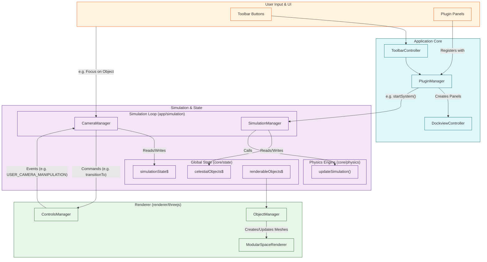

# Open Space 2 Engine: Comprehensive Architecture

This document provides a consolidated view of the Open Space 2 engine architecture, combining insights from all core packages, data definitions, simulation, and the modular Three.js rendering pipeline.

## I. High-Level Goals & Philosophy

The engine aims to simulate N-body physics in celestial systems with real orbital mechanics, rendered using Three.js. Key principles include:

- **Modularity**: Functionality is broken down into distinct packages (`core`, `data`, `systems`, `renderer`, `app`).
- **Unidirectional Data Flow**: Adhering to a clear flow driven by centralized state management.
- **Separation of Physics & Rendering**: Physics calculations are performed in real-world units, separate from scaled visualization.
- **Vanilla Tools**: Preference for Vanilla TypeScript, CSS, and standard web technologies.
- **Testability**: Emphasis on TDD, especially for physics and core logic.

## II. System Packages Organization

```mermaid
graph TD
    subgraph Foundation
        DT[data/types] --> CoreM[core/math]
        DT --> CoreP[core/physics]
        CoreM --> CoreP
        DT --> CoreS[core/state]
        CoreP --> CoreS
    end

    subgraph "Domain Systems"
        DT --> SC[systems/celestial]
    end

    subgraph "Renderer & Simulation"
        CoreS --> RT[renderer/threejs]
        SC --> RT

        CoreS --> Sim[app/simulation]
        CoreP --> Sim
    end

    subgraph "Application Shell & UI"
        direction LR
        UIPlugin[app/ui-plugin]
        Teskooano[apps/teskooano]
        Dockview[dockview-core]

        RT --> Teskooano
        Sim --> Teskooano
        UIPlugin --> Teskooano
        Dockview --> Teskooano
    end

    style Foundation fill:#e0f7fa,stroke:#006064
    style "Domain Systems" fill:#e8f5e9,stroke:#1b5e20
    style "Renderer & Simulation" fill:#f3e5f5,stroke:#4a148c
    style "Application Shell & UI" fill:#fff3e0,stroke:#e65100
```

## III. Core Packages (Foundation)

### A. `data/types`

**Purpose**: Defines all shared TypeScript interfaces and enums used across the engine, ensuring data consistency.

**Key Components**:

- **`celestial.ts`**: Defines `CelestialObject`, specific types (Star, Planet, etc.) and their properties.
  - **Enums**: `CelestialType`, `GasGiantClass`, `PlanetType`, `AtmosphereType`, `SurfaceType`, etc.
  - **Core Interfaces**: `CelestialObject`, `OrbitalParameters`, `StarProperties`, `PlanetProperties`, etc.
  - **Discriminated Unions**: Uses type discriminators for specialized object properties.
- **`physics.ts`**: Defines `PhysicsStateReal` with real-world units (meters, kilograms, seconds).
- **`scaling.ts`**: Contains crucial scaling functions and constants for converting between real physics units and visualization units.
- **`ui.ts`**: Defines UI component types, events, and styling interfaces for plugins.

**Dependencies**: `three` (for Vector3/Quaternion types).

### B. `core/math`

**Purpose**: Provides fundamental mathematical constructs and utilities.

**Key Components**:

- **`OSVector3.ts`**: Custom 3D vector implementation for physics calculations, with conversion to/from `THREE.Vector3`.
- **`constants.ts`**: Mathematical constants like `PI`, `TWO_PI`, `EPSILON`.
- **`utils/`**: General-purpose math utilities (`clamp`, `lerp`, etc.).

**Dependencies**: `three` (for vector conversion).

### C. `core/physics`

**Purpose**: Implements the core physics simulation logic with an emphasis on gravity and orbital mechanics.

**Key Components**:

- **`types.ts`**: Defines function signatures for `NetForceCalculator`, `PairForceCalculator`, and `Integrator`.
- **`forces/gravity.ts`**: Implements Newtonian gravitational force calculation.
- **`integrators/`**: Multiple numerical methods:
  - `euler.ts`: Standard Euler method.
  - `symplecticEuler.ts`: Better energy conservation for orbital mechanics.
  - `verlet.ts`: Position and velocity Verlet algorithms.
- **`spatial/octree.ts`**: Barnes-Hut optimization for gravitational calculations.
- **`simulation/simulation.ts`**: Core simulation update logic.
- **`orbital/`**: Specialized orbital mechanics calculations.

**Key Characteristics**:

- Uses real physical units throughout (meters, kilograms, seconds).
- Pluggable force calculators and integrators.
- Focuses on accuracy and performance for N-body gravity simulation.

**Dependencies**: `@teskooano/core-math`, `@teskooano/data-types`.

### D. `core/state`

**Purpose**: Manages the global application state using RxJS as the central source of truth.

**Key Components**:

- **`game/stores.ts`**: Core RxJS Subjects/BehaviorSubjects:
  - `celestialObjects$`: Holds all `CelestialObject` data, managed via `celestialFactory`.
  - `simulationState$`: Global simulation settings (time, pause state, selected/focused objects).
  - `renderableObjects$`: A derived store providing data tailored for the renderer.
- **`game/actions.ts`**: Functions to modify state (e.g., `addCelestial`, `setSimulationTime`).
- **`game/factory.ts`**: `celestialFactory` creates and manages `CelestialObject` instances, including calculating initial physics state from orbital parameters.
- **`adapters/`**: `physicsSystemAdapter` provides a clean interface between the global state and the physics engine.

**Key Principles**:

- Reactive state management with RxJS.
- Immutable state updates.
- Unidirectional data flow (actions -> stores -> subscribers).

**Dependencies**: `@teskooano/data-types`, `@teskooano/core-physics`.

## IV. Domain Systems

### A. `systems/celestial`

**Purpose**: Defines the data, generation logic, and rendering shaders for various celestial objects.

**Key Components**:

- **`renderers/`**: This directory is misnamed; it primarily contains **shader source code (`.glsl`)** and **material definitions** for different celestial types, not the full renderer logic.
  - `terrestrial/`: Shaders for rocky planets.
  - `stars/`: Shaders and materials for spectral types, corona effects.
  - `gas-giants/`: Shaders for class-based gas giants.
  - `rings/`: Shaders for planetary ring systems.
- **`generation/`**: _(Largely deprecated)_ Procedural generation logic is now mostly handled within the renderer's material shaders.
- **`textures/`**: Framework for managing pre-made textures (e.g., Earth clouds).
- **`shaders/`**: A collection of GLSL shader code for various visual effects.

**Key Characteristics**:

- Decouples the visual _definition_ (shaders, materials) of an object from its _rendering implementation_ (in `renderer/threejs`).
- Focuses on providing the building blocks for realistic celestial visuals.

**Dependencies**: `three`, `@teskooano/data-types`.

## V. Renderer & Simulation Packages

This section describes the core runtime packages that handle the visualization and physics simulation.

### A. `renderer/threejs` (Main Rendering Engine)

**Purpose**: A comprehensive package that provides the top-level `ModularSpaceRenderer`. It integrates all necessary Three.js components to create the visual simulation space.

**Key Components**:

- **`ModularSpaceRenderer`**: The main class and facade for the rendering engine. It is instantiated by a UI Panel (`CompositeEnginePanel`) and orchestrates all other managers.
- **`managers/`**:
  - **`SceneManager`**: Manages the core `THREE.Scene`, `THREE.WebGLRenderer`, and the main animation loop (`requestAnimationFrame`).
  - **`ObjectManager`**: The most critical component. It subscribes to the `renderableObjects$` state and is responsible for creating, updating, and removing `THREE.Object3D` representations from the scene. It uses a factory pattern to instantiate the correct renderer (e.g., `StarRenderer`, `TerrestrialPlanetRenderer`) for each celestial object.
  - **`OrbitManager`**: Visualizes orbital paths.
  - **`ControlsManager`**: A low-level driver that integrates and configures `THREE.OrbitControls`. It is responsible for executing smooth, programmatic camera transitions (e.g., `transitionTo`) and for capturing raw user input. It is stateless and reports user interactions via a `USER_CAMERA_MANIPULATION` event, and programmatic transition completions via a `CAMERA_TRANSITION_COMPLETE` event.
  - **`EffectManager`**: Handles post-processing effects like bloom and gravitational lensing.
  - **`LightManager`**: Manages light sources, typically representing stars.
- **`renderers/`**: Contains the actual renderer classes (e.g. `BaseStarRenderer`, `BaseTerrestrialRenderer`) that are instantiated by the `ObjectManager`. These classes build the `THREE.Mesh` and `THREE.Material` using shaders from `systems/celestial`.

**Key Characteristics**:

- **Facade Pattern**: `ModularSpaceRenderer` provides a simple API to the complex underlying system.
- **State-Driven**: `ObjectManager` reactively updates the scene based on changes in `renderableObjects$`.
- **Composition over Inheritance**: The main renderer is composed of many specialized managers.
- **Clear Separation**: Differentiates between low-level camera control (`ControlsManager`) and high-level camera intent (`CameraManager`).

**Dependencies**: `@teskooano/core-state`, `@teskooano/data-types`, `three`, `systems/celestial`.

### B. `app/simulation`

**Purpose**: Manages the core simulation lifecycle, physics loop, state, and high-level camera control.

**Key Components**:

- **`SimulationManager`**: A singleton that orchestrates the entire simulation.
  - **Physics Loop**: Contains the `requestAnimationFrame` loop. It's started and stopped reactively based on the presence of celestial objects.
  - **State Integration**: Reads from `@teskooano/core-state` via the `physicsSystemAdapter`, calls `updateSimulation` from `@teskooano/core-physics`, and writes the results back.
  - **Event Bus**: Uses RxJS `Subject`s (`onOrbitUpdate$`, `onDestructionOccurred$`) to broadcast simulation events.
- **`CameraManager`**: Manages the semantic state of the camera (e.g., "what object are we focused on?"). It listens for events from the `ControlsManager` to detect user input. It provides a public API (`followObject`, `setFov`) and emits its state via a `BehaviorSubject`. It directs the `ControlsManager` in the renderer to execute camera movements.
- **`systems/`**: Contains initializer functions (e.g., `initializeSolarSystem`) that use `actions` from `@teskooano/core-state` to populate the simulation with its initial set of celestial bodies.

**Dependencies**: `@teskooano/core-state`, `@teskooano/core-physics`, `@teskooano/data-types`.

## VI. Application Shell & UI Packages

### A. `@teskooano/ui-plugin`

**Purpose**: A configuration-driven architecture for creating a modular UI. It enables dynamic loading and registration of UI components, functions, and panels.

**Key Components**:

- **Vite Plugin (`teskooanoUiPlugin`)**: Reads `pluginRegistry.ts` files at build time to generate a `virtual:teskooano-loaders` module. This enables code-splitting and HMR for plugins.
- **`PluginManager` (Singleton)**: The runtime orchestrator. It loads, registers, and manages the lifecycle of all plugins. It handles dependency resolution between plugins and provides a central registry for all UI contributions (panels, functions, components).
- **`PluginLifecycleManager`**: Handles HMR by listening for WebSocket messages and triggering plugin reloads.

### B. `apps/teskooano`

**Purpose**: The main web application that brings all the packages together.

**Key Components**:

- **`main.ts`**: Entry point of the application. Initializes the `PluginManager` and `DockviewController`.
- **`plugins/`**: Contains the source code for all the individual UI plugins. Each plugin is a self-contained feature (e.g., `celestial-info`, `focus-control`, `engine-panel`).
  - **`engine-panel/`**: A crucial plugin that hosts the `CompositeEnginePanel`, which in turn creates and displays the `ModularSpaceRenderer` instance.
- **`core/controllers/`**:
  - **`DockviewController`**: Manages the entire `dockview-core` layout, including creating panels, groups, and handling floating windows. It works in tandem with the `PluginManager` to display registered panels.
  - **`ToolbarController`**: Dynamically builds toolbars by querying the `PluginManager` for registered toolbar items.

**Key Characteristics**:

- **Plugin-Driven**: The entire UI is assembled from plugins registered with the `PluginManager`.
- **Decoupled**: UI components (like the toolbar) are decoupled from the features they control. They query the `PluginManager` for available actions.
- **MVC Pattern**: Most complex UI plugins follow a Model-View-Controller pattern to separate logic from the component's view.
- **HMR Enabled**: Hot Module Replacement is fully supported for rapid development.

## VII. Data Flow Diagram



**Flow Description:**

1.  The Physics Loop retrieves celestial object data from `celestialObjectsStore`.
2.  It uses `core/physics` to calculate forces and updates positions/velocities using the chosen integrator.
3.  Updated physics state is written back to `celestialObjectsStore`.
4.  The `RendererStateAdapter` subscribes to `celestialObjectsStore` and relevant parts of `simulationState`, creating derived state (`$renderableObjects`, `$visualSettings`) optimized for rendering (e.g., converting coordinates).
5.  Renderer Managers (`ObjectManager`, `OrbitManager`) subscribe to the _adapter's_ derived state.
6.  `ObjectManager` updates meshes, LOD, and informs `LightManager` based on state changes.
7.  `OrbitManager` updates trail/prediction lines.
8.  The main `RenderLoop` calls the `ModularSpaceRenderer`'s update/render methods.
9.  The `ModularSpaceRenderer.mainUpdateCallback` fetches light data from `LightManager`, calls `objectManager.updateRenderers`, `orbitManager.updateAllVisualizations`, `css2DManager.render`, etc.
10. `EnginePanel` manages its own `PanelViewState` (grid/label visibility, camera focus) updated by UI controls.
11. `EnginePanel` subscribes to its `PanelViewState` and calls specific methods on the `ModularSpaceRenderer` instance (e.g., `setCelestialLabelsVisible`) when relevant view settings change.

## VIII. Key Design Patterns & Architectural Decisions

### A. Patterns

1.  **State-Driven Architecture**:

    - Central RxJS stores (`celestialObjects$`, `simulationState$`) for global state.
    - **Adapter Pattern**: `RendererStateAdapter` decouples core state from renderer-specific needs (coordinate systems, derived data).
    - **Panel-Specific State**: View settings managed within `EnginePanel`'s internal store.
    - Unidirectional data flow remains key.

2.  **Facade Pattern**:

    - `ModularSpaceRenderer` simplifies interaction with the complex renderer subsystem.
    - `celestialFactory` provides simplified creation of complex celestial objects.

3.  **Manager Pattern**:

    - Used extensively (e.g., `SceneManager`, `ObjectManager`, `LODManager`) to encapsulate related responsibilities.

4.  **Dependency Injection**:

    - Components are wired together during instantiation in parent classes (e.g., `ModularSpaceRenderer` creates and passes managers).

5.  **Dual Loop Architecture**:
    - Separate physics and rendering loops, communicating through shared state.

### B. Key Decisions

1.  **Real Units vs. Scaled Visualization**:

    - Physics uses real units; conversion happens in `RendererStateAdapter` / `coordinateUtils`.

2.  **Pluggable Physics**:

    - Multiple integrators, selectable via `simulationState.physicsEngine`.

3.  **Specialized Celestial Renderers**:

    - Distinct renderers, custom shaders, procedural generation.

4.  **Level of Detail (LOD)**:

    - Centralized `LODManager` using `distance-calculator` logic.
    - **Critical**: Segment counts must be reasonable to avoid performance cliffs.

5.  **State Management Scope**:

    - Global simulation state (`simulationState`) vs. Per-Panel view state (`PanelViewState`). Clear separation is crucial.

6.  **Optimized Rendering**:
    - Avoid per-frame geometry creation/disposal (e.g., for lines).
    - Efficient state synchronization (`ObjectManager`).
    - Correct CSS2D layer management.

### D. Areas for Improvement

1.  **Consistent Abstraction**:

    - Formal `CelestialRenderer` interface still needed.

2.  **Renderer Agnosticism**:

    - Some state components (`PanelViewState`) still use Three.js types.

3.  **Performance Optimization**:
    - Barnes-Hut integration.
    - Further LOD strategy refinement beyond segment counts.
    - Robust star type checking in `ObjectManager` removal logic.

## IX. Future Directions

1. **Enhanced physics accuracy**:

   - Relativistic effects for high-gravity scenarios.
   - Additional N-body optimization techniques.

2. **Expanded celestial types**:

   - More specialized renderers for exotic objects.
   - Enhanced atmospheric effects and surface details.

3. **Improved user experience**:

   - Interactive object selection and manipulation.
   - Expanded informational displays and educational features.

4. **Performance enhancements**:
   - WebGPU support for computation and rendering.
   - Optimized procedural generation and texture caching.

This comprehensive architecture provides a solid foundation for the Open Space 2 engine, focusing on accurate physics simulation, scalable rendering, and extensible design.
