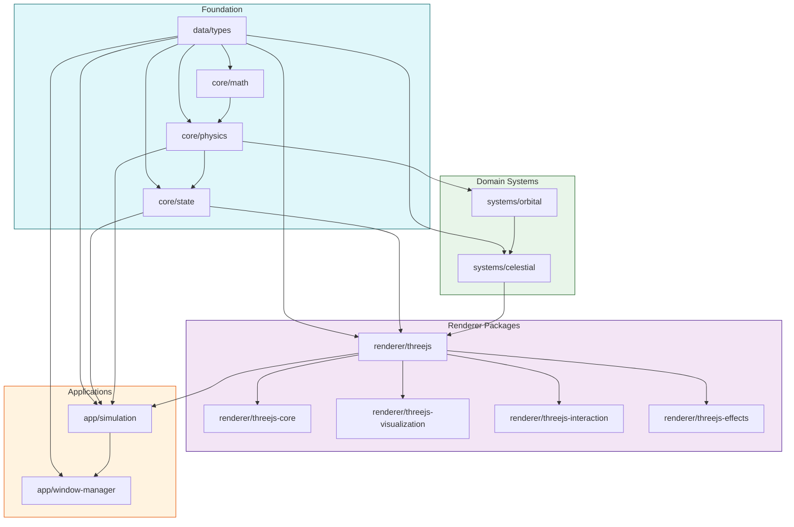
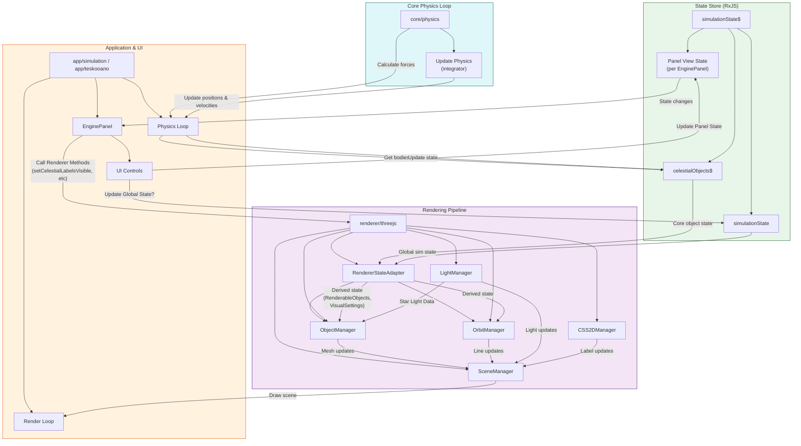

# Open Space 2 Engine: Comprehensive Architecture

This document provides a consolidated view of the Open Space 2 engine architecture, combining insights from all core packages, data definitions, simulation, and the modular Three.js rendering pipeline.

## I. High-Level Goals & Philosophy

The engine aims to simulate N-body physics in celestial systems with real orbital mechanics, rendered using Three.js. Key principles include:

- **Modularity**: Functionality is broken down into distinct packages (`core`, `data`, `systems`, `renderer`, `app`).
- **Unidirectional Data Flow**: Adhering to a clear flow driven by centralized state management.
- **Separation of Physics & Rendering**: Physics calculations are performed in real-world units, separate from scaled visualization.
- **Vanilla Tools**: Preference for Vanilla TypeScript, CSS, and standard web technologies.
- **Testability**: Emphasis on TDD, especially for physics and core logic.

## II. System Packages Organization

## III. Core Packages (Foundation)

### A. `data/types`

**Purpose**: Defines all shared TypeScript interfaces and enums used across the engine, ensuring data consistency.

**Key Components**:

- **`celestial.ts`**: Defines `CelestialObject`, specific types (Star, Planet, etc.) and their properties.
  - **Enums**: `CelestialType`, `GasGiantClass`, `PlanetType`, `AtmosphereType`, `SurfaceType`, etc.
  - **Core Interfaces**: `CelestialObject`, `OrbitalParameters`, `StarProperties`, `PlanetProperties`, etc.
  - **Discriminated Unions**: Uses type discriminators for specialized object properties.
- **`physics.ts`**: Defines `PhysicsStateReal` with real-world units (meters, kilograms, seconds).
- **`scaling.ts`**: Contains crucial scaling functions and constants for converting between real physics units and visualization units:
  - **Constants**: `GRAVITATIONAL_CONSTANT`, `AU_METERS`, `METERS_TO_SCENE_UNITS`.
  - **Functions**: `scaleDistance`, `scaleSize`, `scaleTime`, `scaleOrbitalParameters`.
- **`ui.ts`**: Defines UI component types, events, and styling interfaces.

**Dependencies**: `three` (for Vector3/Quaternion types), `@teskooano/core-math` (for `OSVector3`).

### B. `core/math`

**Purpose**: Provides fundamental mathematical constructs and utilities.

**Key Components**:

- **`OSVector3.ts`**: Custom 3D vector implementation for physics calculations, with conversion to/from `THREE.Vector3`.
- **`constants.ts`**: Mathematical constants like `PI`, `TWO_PI`, `EPSILON`.
- **`utils/`**: General-purpose math utilities (`clamp`, `lerp`, etc.) and functional programming helpers (`debounce`, `throttle`).

**Dependencies**: Minimal dependency on `three` for vector conversion.

### C. `core/physics`

**Purpose**: Implements the core physics simulation logic with an emphasis on gravity and orbital mechanics.

**Key Components**:

- **`types.ts`**: Defines function signatures for `NetForceCalculator`, `PairForceCalculator`, and `Integrator`.
- **`forces/gravity.ts`**: Implements Newtonian gravitational force calculation.
- **`integrators/`**: Multiple numerical methods:
  - `euler.ts`: Standard Euler method.
  - `symplecticEuler.ts`: Better energy conservation for orbital mechanics.
  - `verlet.ts`: Position and velocity Verlet algorithms.
- **`spatial/octree.ts`**: Barnes-Hut optimization for gravitational calculations.
- **`simulation/simulation.ts`**: Core simulation update logic.
- **`orbital/`**: Specialized orbital mechanics calculations.

**Key Characteristics**:

- Uses real physical units throughout (meters, kilograms, seconds).
- Pluggable force calculators and integrators.
- Focuses on accuracy and performance for N-body gravity simulation.

**Dependencies**: `@teskooano/core-math`, `@teskooano/data-types`.

### D. `core/state`

**Purpose**: Manages the global application state using RxJS as the central source of truth.

**Key Components**:

- **`game/stores.ts`**: Core RxJS Subjects/BehaviorSubjects:
  - `celestialObjects$`: Holds all `CelestialObject` data.
  - `simulationState$`: Global simulation settings (time, pause state, selected/focused objects).
- **`game/actions.ts`**: Functions to modify state (e.g., `addCelestialObject`, `updateSimulationTime`).
- **`game/factory.ts`**: Creates `CelestialObject` instances, including calculating initial physics state from orbital parameters.

**Key Principles**:

- Reactive state management with RxJS.
- Immutable state updates.
- Unidirectional data flow (actions -> stores -> subscribers).

**Dependencies**: `@teskooano/data-types`, `@teskooano/core-physics`.

## IV. Domain Systems

### A. `systems/celestial`

**Purpose**: Defines, generates, and renders various celestial objects within the engine.

**Key Components**:

- **`renderers/`**: Specialized renderers for different celestial types:
  - `terrestrial/`: Handles rocky planets with procedural textures.
  - `stars/`: Manages spectral types, corona effects, and gravitational lensing.
  - `gas-giants/`: Class-based system (Sudarsky) with distinct shaders.
  - `rings/`: Modular ring system with shadow calculations.
  - `particles/`: Asteroid fields and Oort clouds using point clouds.
  - `earth/`: Specialized Earth renderer with specific textures.
  - `common/`: Shared components like gravitational lensing.
- **`generation/`**: Procedural texture generation using 3D Simplex noise.
- **`textures/`**: Framework for managing texture generation and caching.
- **`shaders/`**: GLSL shader code for various visual effects.

**Key Characteristics**:

- Highly specialized renderers tailored to celestial object types.
- Procedural texture generation for variety and detail.
- Custom shader implementations for realistic visuals.

**Dependencies**: `three`, `@teskooano/data-types`, `@teskooano/renderer-threejs-effects`.

### B. `systems/orbital` (Assumed)

**Purpose**: Handles higher-level orbital calculations and parent-child relationships.

**Dependencies**: `@teskooano/core-physics`, `@teskooano/core-state`, `@teskooano/data-types`.

## V. Renderer Packages

### A. `renderer/threejs-core`

**Purpose**: Provides foundational Three.js setup: scene, camera, renderer, animation loop, and state bridging.

**Key Components**:

- **`SceneManager`**: Manages `THREE.Scene`, `THREE.PerspectiveCamera`, and `THREE.WebGLRenderer`.
- **`AnimationLoop`**: Manages the `requestAnimationFrame` loop and timing.
- **`StateManager`**: _(Deprecated/Removed?)_ - _Seems state bridging is now handled by `RendererStateAdapter` in `renderer/threejs`._

**Dependencies**: `three`, `@teskooano/core-state`, `@teskooano/data-types`.

### B. `renderer/threejs-effects`

**Purpose**: Manages visual effects and optimizations like lighting and Level of Detail (LOD).

**Key Components**:

- **`LightManager`**: Manages `THREE.Light` sources (stars).
- **`LODManager`**: Handles Level of Detail transitions for objects.
- **`lod-manager/`**: Helpers for LOD mesh creation and distance calculation (including `distance-calculator.ts` with segment/distance logic).

**Dependencies**: `three`, `@teskooano/data-types`, `@teskooano/renderer-threejs-interaction` _(Check if needed)_, `@teskooano/renderer-threejs` _(Check if needed)_, `@teskooano/systems-celestial` _(Check if needed)_.

### C. `renderer/threejs-interaction`

**Purpose**: Manages user interaction via camera controls and HTML overlays.

**Key Components**:

- **`ControlsManager`**: Integrates and configures `THREE.OrbitControls`.
- **`CSS2DManager`**: Manages HTML elements positioned in 3D space using `CSS2DRenderer`, handles layer visibility.

**Dependencies**: `three`, `@teskooano/core-state` _(Panel state interaction?)_, `@teskooano/data-types`, `@teskooano/renderer-threejs`.

### D. `renderer/threejs-visualization`

**Purpose**: Orchestrates the rendering of celestial objects, orbits, and backgrounds.

**Key Components**:

- **`ObjectManager`**: Creates, updates, removes `THREE.Object3D` representations (including `THREE.LOD`). Synchronizes with state adapter, manages `LightManager` updates, triggers lensing setup.
- **`OrbitManager`**: Visualizes orbital paths (Keplerian or Verlet), optimized line rendering.
- **`BackgroundManager`**: Creates the starfield background with parallax.
- **`object-manager/`**: Contains `MeshFactory`, `RendererUpdater`, and `GravitationalLensingHandler`.

**Dependencies**: `three`, `@teskooano/core-state`, `@teskooano/data-types`, other renderer packages (`core`, `effects`, `interaction`), `@teskooano/systems-celestial`.

### E. `renderer/threejs` (Main Integration)

**Purpose**: Main integration package providing the top-level `ModularSpaceRenderer` facade and state adaptation.

**Key Components**:

- **`ModularSpaceRenderer`**: Instantiates and coordinates all renderer managers (`SceneManager`, `ObjectManager`, `OrbitManager`, `LightManager`, etc.). Manages panel-specific view state interactions (label/grid visibility via `EnginePanel`).
- **`RendererStateAdapter`**: Subscribes to core state (`celestialObjectsStore`, relevant parts of `simulationState`) and creates derived, renderer-specific state (`$renderableObjects`, `$visualSettings`) including coordinate conversion and passing necessary properties like `realRadius_m`.
- **`utils/coordinateUtils.ts`**: Contains `physicsToThreeJSPosition` for coordinate conversion.

**Key Characteristics**:

- Facade pattern for simplified high-level API.
- Orchestrates the entire rendering pipeline.
- State-driven updates based on core state changes via the adapter.
- Manages interaction with panel-specific state for UI controls.

**Dependencies**: All other renderer packages, `@teskooano/core-state`, `@teskooano/data-types`, `three`.

## VI. Application Packages

### A. `app/simulation`

**Purpose**: Main application entry point for running the Open Space simulation.

**Key Components**:

- **`Simulation` class**: Instantiates `ModularSpaceRenderer` and provides the main rendering loop.
- **`loop.ts`**: Contains the physics simulation loop:
  1. Calculates forces and accelerations.
  2. Applies chosen integrator (euler, symplecticEuler, verlet).
  3. Updates state store with new positions, velocities, and rotations.
- **`toolbar.ts`**: Defines UI controls as Web Components.
- **`systems/`**: Predefined celestial system configurations.

**Key Characteristics**:

- Dual loop architecture (physics and rendering).
- Uses state store for communication between loops.
- Web Components for UI controls.

**Dependencies**: `@teskooano/renderer-threejs`, `@teskooano/core-state`, `@teskooano/core-physics`, `@teskooano/core-math`, `@teskooano/data-types`.

### B. `app/window-manager` (Assumed)

**Purpose**: Manages application windows, panels, and UI layout.

## VII. Data Flow Diagram

**Flow Description:**

1.  The Physics Loop retrieves celestial object data from `celestialObjectsStore`.
2.  It uses `core/physics` to calculate forces and updates positions/velocities using the chosen integrator.
3.  Updated physics state is written back to `celestialObjectsStore`.
4.  The `RendererStateAdapter` subscribes to `celestialObjectsStore` and relevant parts of `simulationState`, creating derived state (`$renderableObjects`, `$visualSettings`) optimized for rendering (e.g., converting coordinates).
5.  Renderer Managers (`ObjectManager`, `OrbitManager`) subscribe to the _adapter's_ derived state.
6.  `ObjectManager` updates meshes, LOD, and informs `LightManager` based on state changes.
7.  `OrbitManager` updates trail/prediction lines.
8.  The main `RenderLoop` calls the `ModularSpaceRenderer`'s update/render methods.
9.  The `ModularSpaceRenderer.mainUpdateCallback` fetches light data from `LightManager`, calls `objectManager.updateRenderers`, `orbitManager.updateAllVisualizations`, `css2DManager.render`, etc.
10. `EnginePanel` manages its own `PanelViewState` (grid/label visibility, camera focus) updated by UI controls.
11. `EnginePanel` subscribes to its `PanelViewState` and calls specific methods on the `ModularSpaceRenderer` instance (e.g., `setCelestialLabelsVisible`) when relevant view settings change.

## VIII. Key Design Patterns & Architectural Decisions

### A. Patterns

1.  **State-Driven Architecture**:

    - Central RxJS stores (`celestialObjects$`, `simulationState$`) for global state.
    - **Adapter Pattern**: `RendererStateAdapter` decouples core state from renderer-specific needs (coordinate systems, derived data).
    - **Panel-Specific State**: View settings managed within `EnginePanel`'s internal store.
    - Unidirectional data flow remains key.

2.  **Facade Pattern**:

    - `ModularSpaceRenderer` simplifies interaction with the complex renderer subsystem.
    - `celestialFactory` provides simplified creation of complex celestial objects.

3.  **Manager Pattern**:

    - Used extensively (e.g., `SceneManager`, `ObjectManager`, `LODManager`) to encapsulate related responsibilities.

4.  **Dependency Injection**:

    - Components are wired together during instantiation in parent classes (e.g., `ModularSpaceRenderer` creates and passes managers).

5.  **Dual Loop Architecture**:
    - Separate physics and rendering loops, communicating through shared state.

### B. Key Decisions

1.  **Real Units vs. Scaled Visualization**:

    - Physics uses real units; conversion happens in `RendererStateAdapter` / `coordinateUtils`.

2.  **Pluggable Physics**:

    - Multiple integrators, selectable via `simulationState.physicsEngine`.

3.  **Specialized Celestial Renderers**:

    - Distinct renderers, custom shaders, procedural generation.

4.  **Level of Detail (LOD)**:

    - Centralized `LODManager` using `distance-calculator` logic.
    - **Critical**: Segment counts must be reasonable to avoid performance cliffs.

5.  **State Management Scope**:

    - Global simulation state (`simulationState`) vs. Per-Panel view state (`PanelViewState`). Clear separation is crucial.

6.  **Optimized Rendering**:
    - Avoid per-frame geometry creation/disposal (e.g., for lines).
    - Efficient state synchronization (`ObjectManager`).
    - Correct CSS2D layer management.

### D. Areas for Improvement

1.  **Consistent Abstraction**:

    - Formal `CelestialRenderer` interface still needed.

2.  **Renderer Agnosticism**:

    - Some state components (`PanelViewState`) still use Three.js types.

3.  **Performance Optimization**:
    - Barnes-Hut integration.
    - Further LOD strategy refinement beyond segment counts.
    - Robust star type checking in `ObjectManager` removal logic.

## IX. Future Directions

1. **Enhanced physics accuracy**:

   - Relativistic effects for high-gravity scenarios.
   - Additional N-body optimization techniques.

2. **Expanded celestial types**:

   - More specialized renderers for exotic objects.
   - Enhanced atmospheric effects and surface details.

3. **Improved user experience**:

   - Interactive object selection and manipulation.
   - Expanded informational displays and educational features.

4. **Performance enhancements**:
   - WebGPU support for computation and rendering.
   - Optimized procedural generation and texture caching.

This comprehensive architecture provides a solid foundation for the Open Space 2 engine, focusing on accurate physics simulation, scalable rendering, and extensible design.
