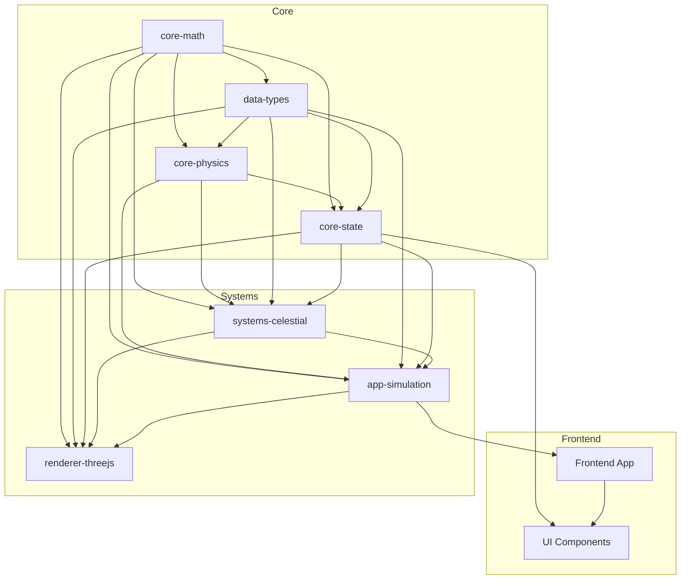
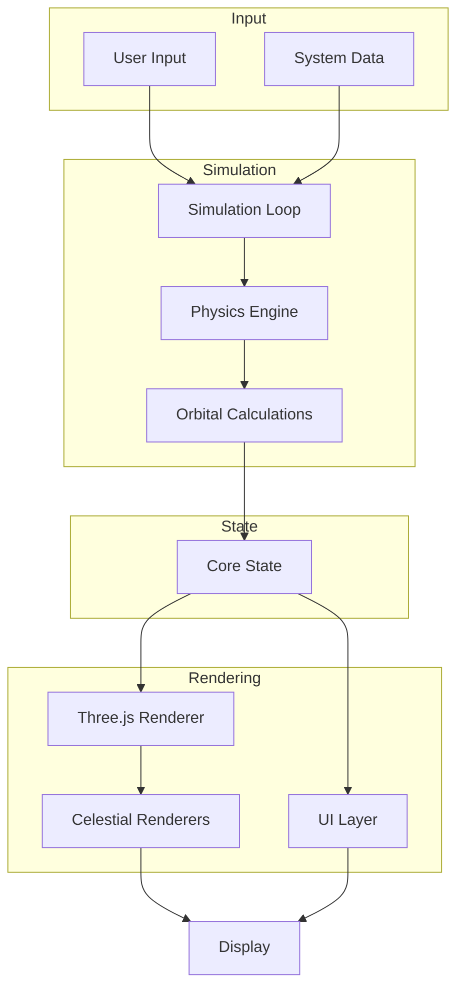

# Open Space

A realistic space simulation game inspired by EVE Online and Elite: Dangerous, featuring accurate orbital mechanics, gravitational physics, and celestial body visualization.

## Project Architecture

This is a monorepo containing a modular space simulation engine with clear separation of concerns:



### Package Structure

- **Core Libraries**
  - `packages/core/math`: Mathematical utilities for vectors, matrices, and quaternions
  - `packages/core/physics`: Newtonian physics and orbital mechanics
  - `packages/core/state`: Central state management using Nanostores
  - `packages/data/types`: TypeScript type definitions for all data structures

- **System Libraries**
  - `packages/systems/celestial`: Celestial object implementations
  - `packages/renderer/threejs`: 3D rendering engine using Three.js
  - `packages/app/simulation`: Simulation orchestration and game loop

- **Applications**
  - `apps/frontend`: Main game application with UI components

## Engine Flow

The Open Space engine follows a unidirectional data flow pattern with reactive state management:



### Data Flow Details

1. **Input Processing**
   - User inputs (camera controls, time controls) are processed
   - System data is loaded and parsed
   
2. **Simulation Loop**
   - Fixed time step physics updates
   - Hierarchical gravitational calculations
   - Orbital position updates
   
3. **State Management**
   - Centralized state stores updated with new positions and properties
   - Subscription system notifies dependent components
   
4. **Rendering Pipeline**
   - Three.js scene is updated based on state changes
   - Specialized renderers for different celestial types
   - UI components render based on current state

## Key Features

- **Accurate Orbital Mechanics**: Realistic Keplerian orbital elements 
- **Physically Based Rendering**: Realistic lighting and materials for celestial bodies
- **Composable Architecture**: Modular design allows for easy extension
- **Type-Safe**: Comprehensive TypeScript types throughout the codebase
- **Reactive State**: Efficient state updates with minimal re-renders
- **Scalable Simulation**: Handles complex star systems efficiently

## Getting Started

1. Install dependencies:
```bash
npm install
```

2. Start the development server:
```bash
npm run dev
```

The game will be available at http://localhost:3000

## Development Guidelines

- Frontend app runs on port 3000
- Uses Vite for development and building
- TypeScript for type safety
- Three.js for 3D rendering
- Nanostores for state management
- RxJS for reactive programming
- TDD approach with Vitest

## Areas of Concern and Improvement

### Current Limitations

1. **Performance Optimization**
   - N-body gravity calculations can become intensive with many objects
   - High GPU utilization with detailed celestial renderers
   - Complex orbital mechanics add computational overhead

2. **Architecture Considerations**
   - Some tight coupling between celestial system and rendering
   - Limited support for advanced orbital phenomena
   - Large interfaces in data types could benefit from further modularization

3. **Feature Gaps**
   - Limited UI state management for complex window system
   - No persistent storage for user preferences
   - Limited system loading/saving capabilities

### Planned Improvements

1. **UI Window Manager**
   - Creating a core UI state management system
   - Implementing configurable, draggable windows with persistence
   - Adding a unified UI toolbar with show/hide functionality
   - Storing user preferences in localStorage

2. **System Loader**
   - Implementing JSON-based star system configuration
   - Creating a validation system for loaded data
   - Building a manifest system for available star systems
   - Supporting import/export of system configurations

3. **Ship Movement**
   - Adding playable ships with physics-based movement
   - Implementing warp travel between gravitational fields
   - Creating a navigation system for interstellar travel
   - Enhancing physics for ship propulsion and maneuvering

4. **Performance Enhancements**
   - Spatial partitioning for gravity calculations
   - Level-of-detail rendering for distant objects
   - Optimized orbital calculations for far-away bodies
   - WebWorker-based physics processing

## Contributing

1. Fork the repository
2. Create your feature branch (`git checkout -b feature/amazing-feature`)
3. Commit your changes (following commitizen format)
4. Push to the branch (`git push origin feature/amazing-feature`)
5. Open a Pull Request

## License

MIT 