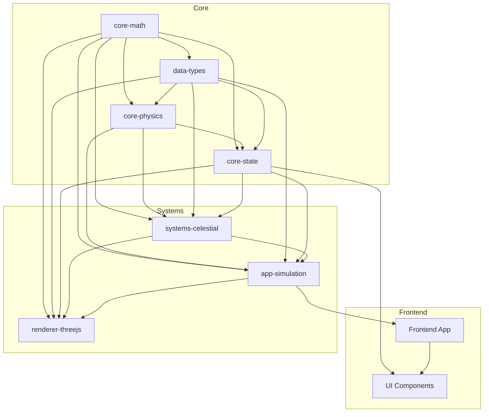
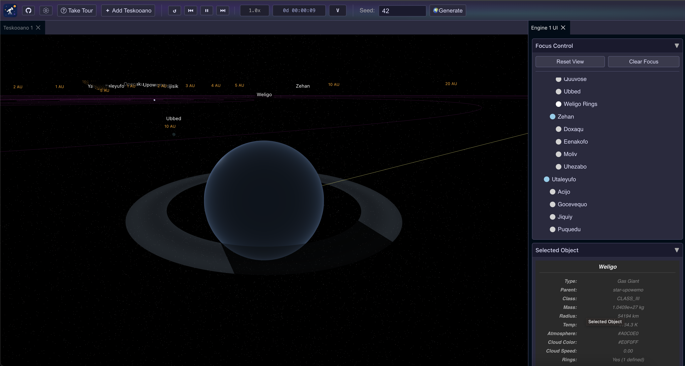
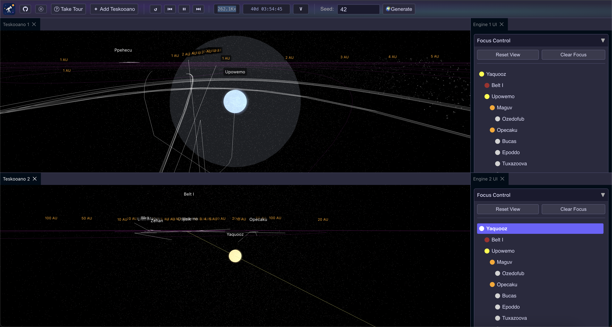
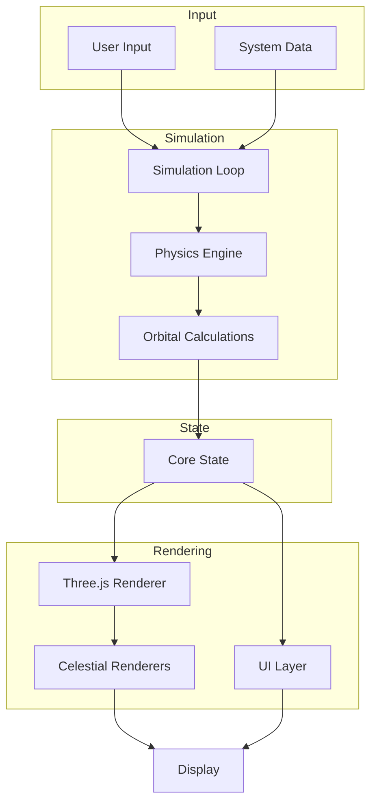

# 🔭 Teskooano

Teskooano is a 3D N-Body simulation engine that accurately simulates real physics and provides a multi-view experience in real time. It features collision detection, realistic orbital mechanics, and procedural generation to create unique star systems.

> The name **Teskooano** comes from Beelzebub's Tales to His Grandson by G.I. Gurdjieff. In the book, a "Teskooano" is a type of advanced telescope in Beelzebub's observatory on Mars - used to observe distant cosmic phenomena. It is designed to perceive both physical and non-physical aspects of the universe. The simulation engine is named after this device because it similarly acts as a tool for observing and exploring complex celestial systems in motion.


## Key Features

- **Realistic Physics**: Full N-Body gravitational simulation with accurate orbital mechanics
- **Multi-View Experience**: View the same simulation from multiple angles simultaneously
- **Procedural Generation**: Create unique star systems from random seeds
- **Interactive Focus Controls**: Select and focus on any celestial body in the system
- **Dynamic Time Controls**: Adjust simulation speed from real-time to 10 million times faster
- **Collision Detection**: Watch celestial bodies interact with realistic physics
- **Modular Architecture**: Easily extendable component-based design

## Getting Started

### proto and moon

This monorepo uses [moon](https://moonrepo.dev/) and [proto](https://moonrepo.dev/proto) for dependency management and it's recommended you install them before launch 🚀

```bash
# Clone the repository
git clone https://github.com/tanepiper/teskooano.git
cd teskooano

# Install dependencies and start the main app
moon run teskooano:dev
```

The application will be available at http://localhost:3000

## User Guide

When you first launch Teskooano, you'll be greeted with an interactive tour that will guide you through the main features of the application:

1. **Engine View**: The main 3D simulation area where you can see celestial bodies
2. **Control Panel**: Adjust simulation speed and other controls
3. **Seed Generator**: Create new star systems with procedurally generated content
4. **Focus Controls**: Select and focus on specific celestial objects
5. **Information Panels**: View detailed information about selected objects

### Using the Toolbar

- **Add View Button**: Create additional simulation views for different perspectives
- **Simulation Controls**: Play/pause and adjust simulation speed
- **Seed Generator**: Enter a seed value and click "Generate" to create a new system
- **GitHub Button**: Access the repository for reporting issues or contributing
- **Tour Button**: Restart the guided tour at any time

### Navigation

- **Orbit Controls**: Click and drag to orbit around the system
- **Zoom**: Use the mouse wheel to zoom in and out
- **Focus**: Select celestial bodies from the Focus Control panel to center the view

## Project Architecture

Teskooano is built as a modular system with clear separation of concerns:



### Package Structure

The application is stuctured to import TypeScript modules, which allow for a more modular approach in building the engine.

Here is a table of all the packages in the repository:

| Library Name                             | Library Path                           | Description                                                     | Status |
| ---------------------------------------- | -------------------------------------- | --------------------------------------------------------------- | ------ |
| @teskooano/core-math                     | packages/core/math                     | Mathematical utilities for the Teskooano engine                 | ⚠️     |
| @teskooano/core-physics                  | packages/core/physics                  | Newtonian physics and orbital mechanics implementation          | ⚠️     |
| @teskooano/core-state                    | packages/core/state                    | Central state management using Nanostores                       | ⚠️     |
| @teskooano/core-debug                    | packages/core/debug                    | Debug utilities for the Teskooano engine                        | ⚠️     |
| @teskooano/data-types                    | packages/data/types                    | TypeScript type definitions for all data structures             | ⚠️     |
| @teskooano/app-simulation                | packages/app/simulation                | Simulation orchestration and game loop                          | ⚠️     |
| @teskooano/systems-celestial             | packages/systems/celestial             | Handles the definition and rendering logic for celestial bodies | ⚠️     |
| @teskooano/systems-procedural-generation | packages/systems/procedural-generation | Procedural generation of star systems                           | ⚠️     |
| @teskooano/renderer-threejs              | packages/renderer/threejs              | Main Three.js rendering engine implementation                   | ⚠️     |
| @teskooano/renderer-threejs-core         | packages/renderer/threejs-core         | Core Three.js rendering foundation                              | ⚠️     |
| @teskooano/renderer-threejs-effects      | packages/renderer/threejs-effects      | Visual effects for the Three.js renderer                        | ⚠️     |
| @teskooano/renderer-threejs-interaction  | packages/renderer/threejs-interaction  | User interaction (controls, labels) components                  |
| @teskooano/renderer-threejs-objects      | packages/renderer/threejs-objects      | Object mesh rendering and management                            |
| @teskooano/renderer-threejs-orbits       | packages/renderer/threejs-orbits       | Orbit line rendering and management                             |
| @teskooano/renderer-threejs-background   | packages/renderer/threejs-background   | Starfield background rendering and management                   |
| @teskooano/design-system                 | packages/design-system                 | Global CSS variables, base styles, and potentially components   | ✅     |

- **Core Libraries**

  - `packages/core/math`: Mathematical utilities for vectors, matrices, and quaternions
  - `packages/core/physics`: Newtonian physics and orbital mechanics
  - `packages/core/state`: Central state management using Nanostores
  - `packages/data/types`: TypeScript type definitions for all data structures

- **System Libraries**

  - `packages/systems/celestial`: Celestial object implementations
  - `packages/systems/procedural-generation`: Procedural generation of star systems
  - `packages/renderer/threejs`: 3D rendering engine using Three.js
  - `packages/app/simulation`: Simulation orchestration and game loop

- **Applications**
  - `apps/teskooano`: Main simulation application with UI components
    components

<div class="screenshot-container">
  <div class="screenshot">
    
    <p>Close-up view of a planet with simulation controls and celestial body information panel.</p>
    
  </div>
  
  <div class="screenshot">
    
    <p>Multiple panels showing different views of the same solar system with orbital paths and information panels.</p>
  </div>
</div>

### Data Flow

The engine follows a unidirectional data flow pattern:



## Technology Stack

- **TypeScript**: Type-safe code throughout the codebase
- **Three.js**: 3D rendering and visualization
- **Nanostores**: Lightweight state management
- **Driver.js**: Interactive tour and onboarding
- **DockView**: Multi-panel UI layout system
- **Vite**: Fast, modern frontend tooling

### Contributing

1. Fork the repository
2. Create your feature branch: `git checkout -b feature/amazing-feature`
3. Commit your changes: `git commit -m 'Add some amazing feature'`
4. Push to the branch: `git push origin feature/amazing-feature`
5. Open a Pull Request

## Roadmap

- **Advanced Orbital Mechanics**: More complex orbital phenomena
- **Ship Controls**: Player-controlled ships with physics-based movement
- **Warp Travel**: Interstellar travel mechanics
- **Enhanced UI**: More detailed information panels and controls
- **Persistent Storage**: Save and load simulation states
- **Performance Optimizations**: Spatial partitioning and WebWorker-based physics

## Report Issues

If you encounter any bugs or have suggestions for improvements, please [create an issue](https://github.com/tanepiper/teskooano/issues) on GitHub.

## License

This project is licensed under the MIT License - see the [LICENSE](LICENSE) file for details.
