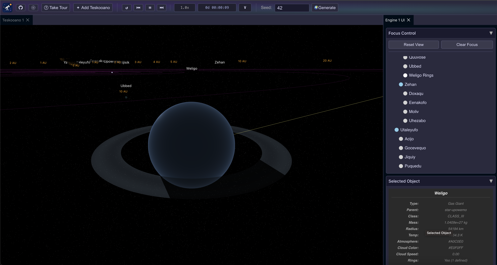
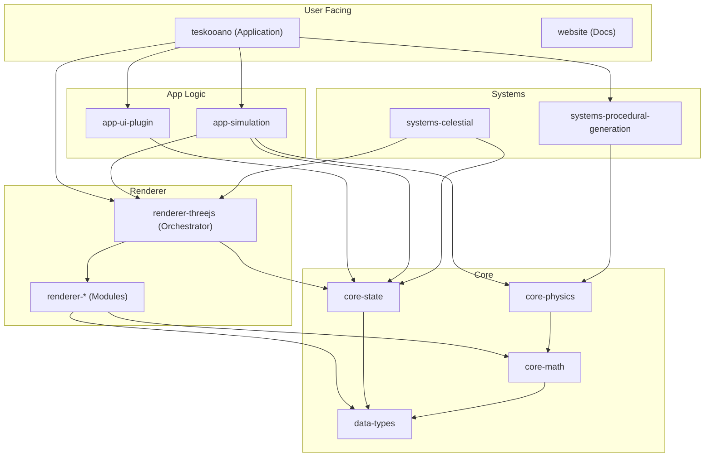
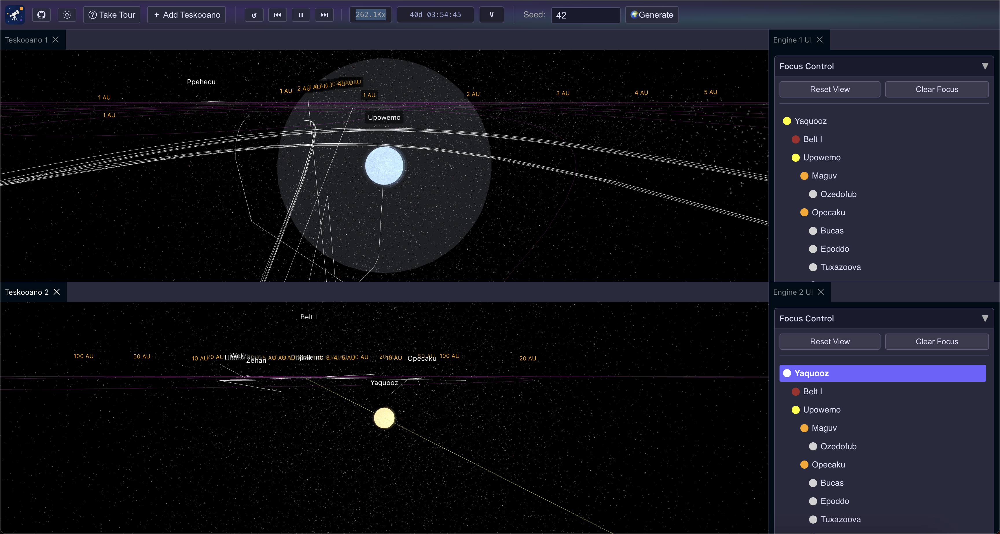
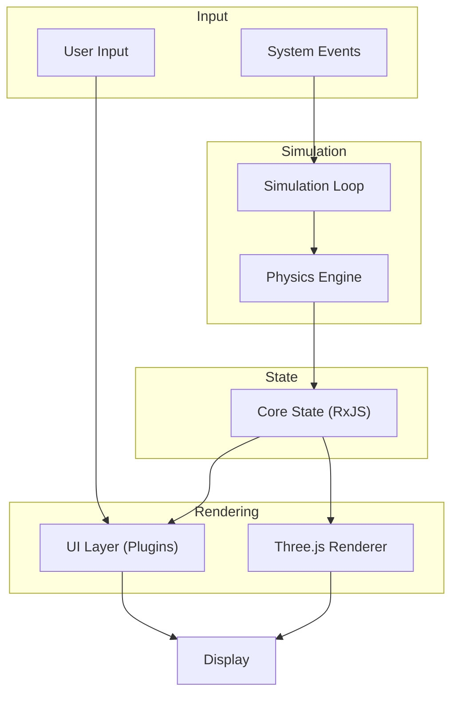

# 🔭 Teskooano

Teskooano is a 3D N-Body simulation engine that accurately simulates real physics and provides a multi-view experience in real time. It features collision detection, realistic orbital mechanics, and procedural generation to create unique star systems.

> The name **Teskooano** comes from Beelzebub's Tales to His Grandson by G.I. Gurdjieff. In the book, a "Teskooano" is a type of advanced telescope in Beelzebub's observatory on Mars - used to observe distant cosmic phenomena. It is designed to perceive both physical and non-physical aspects of the universe. The simulation engine is named after this device because it similarly acts as a tool for observing and exploring complex celestial systems in motion.



## Key Features

- **Realistic Physics**: Full N-Body gravitational simulation with accurate orbital mechanics using a Verlet integrator.
- **Modular & Extensible UI**: A fully dockable, component-based UI powered by a custom plugin system.
- **Procedural Generation**: Create unique star systems from a simple seed string.
- **High-Performance Rendering**: 3D rendering powered by Three.js, with LOD management and GLSL shaders.
- **Reactive State Management**: Centralized application state managed with RxJS for predictable data flow.
- **Interactive Controls**: Manipulate time, focus on objects, and manage multiple camera views in real-time.
- **Monorepo Architecture**: Managed with `moon` and `proto` for streamlined development and dependency management.

## Getting Started

### Prerequisites

This monorepo uses [moon](https://moonrepo.dev/) and [proto](https://moonrepo.dev/proto) for task running and dependency management. It's recommended you install them before you begin.

### Installation

```bash
# Clone the repository
git clone https://github.com/tanepiper/teskooano.git
cd teskooano

# Install dependencies and start the main app
proto use
moon run teskooano:dev
```

The application will be available at `http://localhost:3000`.

## User Guide

When you first launch Teskooano, you'll be greeted with an interactive tour that will guide you through the main features of the application. The UI is composed of several panels that can be moved, resized, and docked to create a custom layout.

- **Engine View**: The main 3D simulation area where you can see celestial bodies. You can create multiple engine views.
- **Toolbar**: Contains master controls for generating systems, managing views, and accessing settings.
- **Hierarchy Panel**: A tree view of all objects in the system, allowing for quick selection and focus.
- **Info Panel**: Displays detailed physical information about the currently focused celestial object.
- **Uniforms Panel**: Provides controls for tweaking the visual parameters of procedurally generated objects.

### Navigation

- **Orbit Controls**: Click and drag to orbit around the system.
- **Zoom**: Use the mouse wheel to zoom in and out.
- **Focus**: Select celestial bodies from the Hierarchy panel to center the view and follow the object.

## Project Architecture

Teskooano is built as a modular system with clear separation of concerns between its layers. The `core-*` packages provide foundational capabilities, which are composed by the `systems-*` and `renderer-*` packages to create the simulation, which is ultimately orchestrated and displayed by the main `teskooano` application.


```mermaid
graph TD
    subgraph "User Facing"
        App_Teskooano["teskooano (Application)"]
        App_Website["website (Docs)"]
    end

    subgraph "App Logic"
        App_Simulation["app-simulation"]
        App_UI_Plugin["app-ui-plugin"]
    end

    subgraph "Systems"
        Systems_Celestial["systems-celestial"]
        Systems_ProcGen["systems-procedural-generation"]
    end

    subgraph "Renderer"
        Renderer_Main["renderer-threejs (Orchestrator)"]
        Renderer_Modules["renderer-* (Modules)"]
    end

    subgraph "Core"
        Core_State["core-state"]
        Core_Physics["core-physics"]
        Core_Math["core-math"]
        Core_Types["data-types"]
    end

    %% High-level Dependencies
    App_Teskooano --> App_UI_Plugin
    App_Teskooano --> App_Simulation
    App_Teskooano --> Systems_ProcGen
    App_Teskooano --> Renderer_Main

    App_UI_Plugin --> Core_State

    App_Simulation --> Core_State
    App_Simulation --> Core_Physics
    App_Simulation --> Renderer_Main

    Systems_Celestial --> Core_State
    Systems_Celestial --> Renderer_Main

    Systems_ProcGen --> Core_Physics

    Renderer_Main --> Renderer_Modules
    Renderer_Main --> Core_State
    Renderer_Modules --> Core_Math
    Renderer_Modules --> Core_Types

    Core_State --> Core_Types
    Core_Physics --> Core_Math
    Core_Math --> Core_Types
```

### Package Structure

The application is structured as a monorepo, with clear separation between applications, shared libraries, and core systems.

Here is a table of all the packages in the repository:

| Library Name                               | Library Path                             | Description                                                      | Status |
| :----------------------------------------- | :--------------------------------------- | :--------------------------------------------------------------- | :----: |
| **Applications**                           |                                          |                                                                  |        |
| `@teskooano/teskooano`                     | `apps/teskooano`                         | Main simulation application and UI built with Vite and Three.js. |   ✅   |
| `@teskooano/website`                       | `apps/website`                           | Project marketing and documentation website built with Astro.    |   ✅   |
| **App Packages**                           |                                          |                                                                  |        |
| `@teskooano/app-simulation`                | `packages/app/simulation`                | Core simulation loop, camera control, and event management.      |   ✅   |
| `@teskooano/app-ui-plugin`                 | `packages/app/ui-plugin`                 | The core plugin manager and type definitions for the UI.         |   ✅   |
| `@teskooano/design-system`                 | `packages/app/design-system`             | Global CSS variables, base styles, and component themes.         |   ✅   |
| `@teskooano/app-notifications`             | `packages/app/notifications`             | A toast notification system for the main application.            |   ✅   |
| `@teskooano/app-web-apis`                  | `packages/app/web-apis`                  | Wrappers and utilities for browser Web APIs.                     |   ✅   |
| **Core Packages**                          |                                          |                                                                  |        |
| `@teskooano/core-debug`                    | `packages/core/debug`                    | Debug utilities for the Teskooano engine.                        |   ✅   |
| `@teskooano/core-math`                     | `packages/core/math`                     | Mathematical utilities for the Teskooano engine.                 |   ✅   |
| `@teskooano/core-physics`                  | `packages/core/physics`                  | N-Body simulation and orbital mechanics.                         |   ✅   |
| `@teskooano/core-state`                    | `packages/core/state`                    | Central state management using RxJS.                             |   ✅   |
| `@teskooano/data-types`                    | `packages/data/types`                    | TypeScript type definitions for all data structures.             |   ✅   |
| **Renderer Packages**                      |                                          |                                                                  |        |
| `@teskooano/renderer-threejs`              | `packages/renderer/threejs`              | Main Three.js rendering engine implementation.                   |   ⚠️   |
| `@teskooano/renderer-threejs-background`   | `packages/renderer/threejs-background`   | Starfield background rendering and management.                   |   ✅   |
| `@teskooano/renderer-threejs-controls`     | `packages/renderer/threejs-controls`     | User interaction and camera controls for the renderer.           |   ✅   |
| `@teskooano/renderer-threejs-core`         | `packages/renderer/threejs-core`         | Core Three.js rendering foundation and scene management.         |   ⚠️   |
| `@teskooano/renderer-threejs-labels`       | `packages/renderer/threejs-labels`       | 2D HTML label rendering for celestial objects.                   |   ✅   |
| `@teskooano/renderer-threejs-lighting`     | `packages/renderer/threejs-lighting`     | Handles lighting for the Three.js renderer.                      |   ✅   |
| `@teskooano/renderer-threejs-lod`          | `packages/renderer/threejs-lod`          | Handles Level of Detail (LOD) for the Three.js renderer.         |   ✅   |
| `@teskooano/renderer-threejs-objects`      | `packages/renderer/threejs-objects`      | Object mesh rendering and management.                            |   ⚠️   |
| `@teskooano/renderer-threejs-orbits`       | `packages/renderer/threejs-orbits`       | Orbit line rendering and management.                             |   ✅   |
| **System Packages**                        |                                          |                                                                  |        |
| `@teskooano/systems-celestial`             | `packages/systems/celestial`             | Defines celestial object classes and their rendering logic.      |   ⚠️   |
| `@teskooano/systems-procedural-generation` | `packages/systems/procedural-generation` | Procedural generation of star systems from a seed.               |   ✅   |

<div class="screenshot-container">
  <div class="screenshot">
    
    <p>Close-up view of a planet with simulation controls and celestial body information panel.</p>
  </div>
  <div class="screenshot">
    
    <p>Multiple panels showing different views of the same solar system with orbital paths and information panels.</p>
  </div>
</div>

### Data Flow

The engine follows a unidirectional data flow pattern, orchestrated by the central RxJS-based state store.


```mermaid
flowchart TD
    subgraph "Input"
        UserInput["User Input"]
        SystemEvents["System Events"]
    end

    subgraph "Simulation"
        SimLoop["Simulation Loop"]
        Physics["Physics Engine"]
    end

    subgraph "State"
        CoreState["Core State (RxJS)"]
    end

    subgraph "Rendering"
        Renderer["Three.js Renderer"]
        UILayer["UI Layer (Plugins)"]
    end

    UserInput --> UILayer
    SystemEvents --> SimLoop

    SimLoop --> Physics
    Physics --> CoreState

    CoreState --> Renderer
    CoreState --> UILayer

    Renderer --> Display
    UILayer --> Display
```

## Technology Stack

- **TypeScript**: For robust, type-safe code across the entire monorepo.
- **Vite**: For fast frontend development, bundling, and HMR.
- **Three.js**: For high-performance 3D rendering and graphics.
- **RxJS**: For reactive state management and data streams.
- **DockView**: For the modular, dockable panel UI system.
- **Astro**: For the documentation and marketing website.
- **Vitest**: For unit and integration testing.
- **Playwright**: For end-to-end testing.

### Contributing

1.  Fork the repository
2.  Create your feature branch: `git checkout -b feature/amazing-feature`
3.  Commit your changes: `git commit -m 'Add some amazing feature'`
4.  Push to the branch: `git push origin feature/amazing-feature`
5.  Open a Pull Request

## Roadmap

- **Advanced Orbital Mechanics**: More complex orbital phenomena
- **Ship Controls**: Player-controlled ships with physics-based movement
- **Warp Travel**: Interstellar travel mechanics
- **Enhanced UI**: More detailed information panels and controls
- **Persistent Storage**: Save and load simulation states
- **Performance Optimizations**: Spatial partitioning and WebWorker-based physics

## Report Issues

If you encounter any bugs or have suggestions for improvements, please [create an issue](https://github.com/tanepiper/teskooano/issues) on GitHub.

## License

This project is licensed under the MIT License - see the [LICENSE](LICENSE) file for details.
