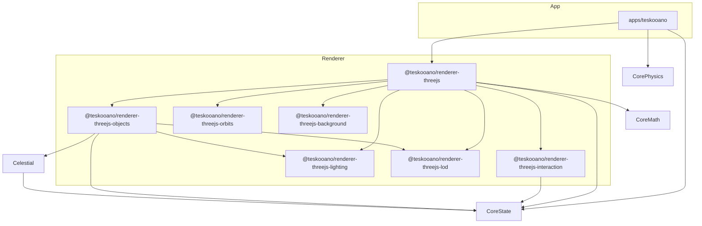

# Open Space 2: Development Roadmap

This document outlines the next major development priorities for the Open Space 2 engine, organized as actionable tasks with tracking mechanisms.

## 1. Physics Engine Optimization & Barnes-Hut Integration

The current physics simulation uses direct N-body calculation which becomes inefficient with large numbers of objects. Full integration of the existing Barnes-Hut algorithm will significantly improve performance for complex simulations.

### User Stories

- As a **player**, I want the **simulation to maintain consistent frame rates with 100+ celestial objects** so that I can explore complex star systems without performance degradation.
- As a **developer**, I want the **physics engine to use appropriate optimization strategies automatically** based on object count and distance thresholds.
- As a **player with modest hardware**, I want **physics calculations to scale efficiently** so that I can still experience complex simulations.

### Tasks

- [ ] Complete the integration of the Octree-based Barnes-Hut algorithm in the primary simulation loop
  - [ ] Update `app/simulation/loop.ts` to use `Octree.calculateForceOn()` instead of direct N-body calculation
  - [ ] Add adaptive theta parameter based on desired accuracy/performance tradeoff
  - [ ] Implement dynamic switching between direct N-body (small systems) and Barnes-Hut (large systems)
- [ ] Optimize memory usage in physics calculations
  - [ ] Implement object pooling for vectors to reduce garbage collection
  - [ ] Add temporal coherence optimization (reuse tree structure between steps when objects haven't moved significantly)
- [ ] Create performance benchmarking suite
  - [ ] Develop standardized test scenarios (10, 100, 1000 bodies)
  - [ ] Add performance metrics tracking and visualization
  - [ ] Implement automatic regression testing for physics performance
- [ ] Add configuration options in UI
  - [ ] Expose physics accuracy/performance slider in settings
  - [ ] Add debug visualization of Octree structure (optional toggle)

### Progress Tracking

| Task                   | Status      | Assigned To | Notes |
| ---------------------- | ----------- | ----------- | ----- |
| Barnes-Hut Integration | Not Started |             |       |
| Memory Optimization    | Not Started |             |       |
| Benchmarking Suite     | Not Started |             |       |
| UI Configuration       | Not Started |             |       |

## 2. Unified Celestial Renderer Architecture & Quality

The current celestial renderers have inconsistencies in their implementations. A unified architecture will improve maintainability, extensibility, and potentially performance. Recent work focused on fixing critical bugs and performance issues related to LOD, state sync, and visualization components.

### User Stories

- As a **developer**, I want **a consistent API for all celestial renderers** so that I can easily create new celestial types without duplicating code.
- As a **player**, I want **visually consistent celestial objects** with smooth transitions between different levels of detail. [Partially Met - LOD working, transitions TBD]
- As a **contributor**, I want **clear renderer documentation and patterns** so I can create new astronomical phenomena without deep system knowledge.
- As a **player**, I want **reliable rendering without visual glitches or excessive resource usage** [Met - Major issues resolved]

### Tasks

- [✓] Create formal `CelestialRenderer` interface
  - [✓] Define standard methods (`createMesh`, `update`, `dispose`)
  - [✓] Extract common utility functions to shared helpers
  - [✓] Document the interface comprehensively with expected behaviors
- [ ] Refactor existing renderers to implement the new interface
  - [ ] Update `StarRenderer` to use external GLSL files like other renderers
  - [ ] Standardize material management patterns
- [✓] Stabilize and Optimize Core Rendering
  - [✓] Fix state synchronization bugs (`ObjectManager`, `RendererStateAdapter`)
  - [✓] Optimize LOD segment counts & fix LOD switching
  - [✓] Optimize line rendering (trails/predictions)
  - [✓] Fix lighting integration (`LightManager`)
  - [✓] Fix CSS2D label rendering and visibility controls
  - [✓] Fix camera reset issues on UI toggle
- [ ] Improve texture generation system
  - [ ] Unify CPU and GPU-based texture generation approaches
  - [ ] Implement proper texture caching across all renderer types
  - [ ] Add progressive texture loading for better UX during generation
- [ ] Enhance rendering quality
  - [ ] Fix atmospheric rendering transparency issues
  - [ ] Improve normal map generation for terrestrial planets
  - [ ] Implement better star flare and corona effects
  - [ ] Refine `LightManager` to use actual star color/intensity
  - [ ] Improve star type checking in `ObjectManager` removal logic

### Progress Tracking

| Task                         | Status      | Assigned To | Notes                                                               |
| ---------------------------- | ----------- | ----------- | ------------------------------------------------------------------- |
| Formal Interface             | Completed   |             | Created CelestialRenderer interface and BaseCelestialRenderer class |
| Renderer Refactoring         | In Progress |             | Starting with StarRenderer refactoring                              |
| Core Rendering Stabilization | Completed   |             | Addressed major bugs and performance issues                         |
| Texture System               | Not Started |             |                                                                     |
| Rendering Quality            | Not Started |             |                                                                     |

## 3. Interactive UI and Simulation Controls

A comprehensive and intuitive UI will greatly enhance user experience, providing ways to control the simulation, inspect objects, and understand astronomical concepts.

### User Stories

- As a **player**, I want to **click on celestial objects to select them** so I can learn more about their properties.
- As a **player**, I want **intuitive controls for time speed, camera movement, and focus tracking** so I can easily navigate the simulation.
- As a **teacher**, I want to **highlight orbital paths and relationship between objects** to explain astronomical concepts.
- As a **player**, I want to **modify object properties interactively** to experiment with gravitational effects and orbital mechanics.

### Tasks

- [ ] Implement comprehensive selection system
  - [ ] Add raycasting for object selection
  - [ ] Create highlight effect for selected objects
  - [ ] Implement camera transitions when selecting distant objects
- [ ] Develop informational panels
  - [ ] Create dockable info panel showing object properties
  - [ ] Add visual indicators for orbital parameters
  - [ ] Display physical stats (mass, radius, temperature)
- [ ] Enhance camera control system
  - [ ] Add smooth transitions between focus objects
  - [ ] Implement multiple camera modes (free, orbit, follow)
  - [ ] Add bookmarks for interesting viewpoints
- [ ] Create interactive simulation controls
  - [ ] Improve time control UI with presets and custom speeds
  - [ ] Add ability to pause/resume at specific events
  - [ ] Implement object modification interface (what-if scenarios)

### Progress Tracking

| Task                | Status      | Assigned To | Notes |
| ------------------- | ----------- | ----------- | ----- |
| Selection System    | Not Started |             |       |
| Info Panels         | Not Started |             |       |
| Camera Controls     | Not Started |             |       |
| Simulation Controls | Not Started |             |       |

## Implementation Notes

- All new code should follow the TDD approach outlined in the architecture document
- Create appropriate unit tests for physics optimizations
- Follow the existing module structure and dependencies
- Update documentation as features are implemented
- Remember to commit frequently with descriptive messages following the commitizen format

## Regular Review Points

- Weekly: Update task status in this document
- Bi-weekly: Review performance metrics for physics optimizations
- Monthly: Full architecture review to ensure new components align with design principles

Remember that these priorities may shift based on feedback, discoveries during implementation, or changing project needs. This is a living document that should be updated as the project evolves.

## Outcome after refactoring

