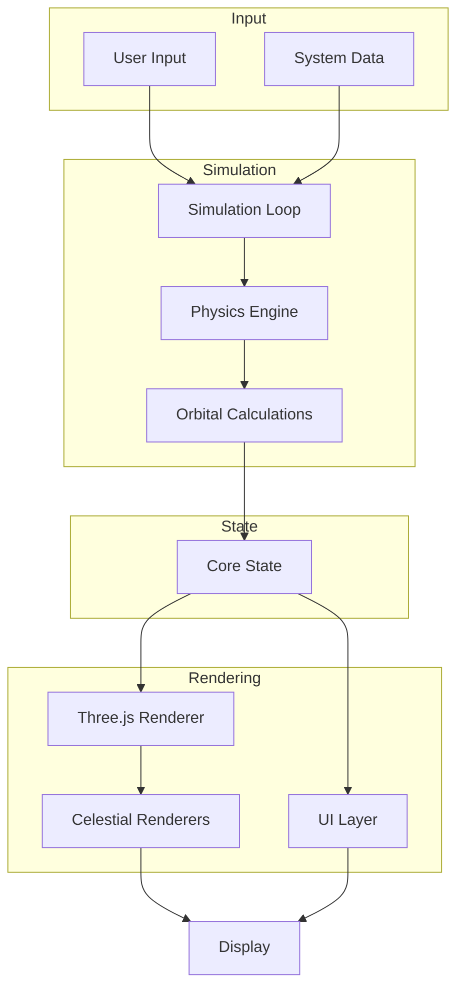
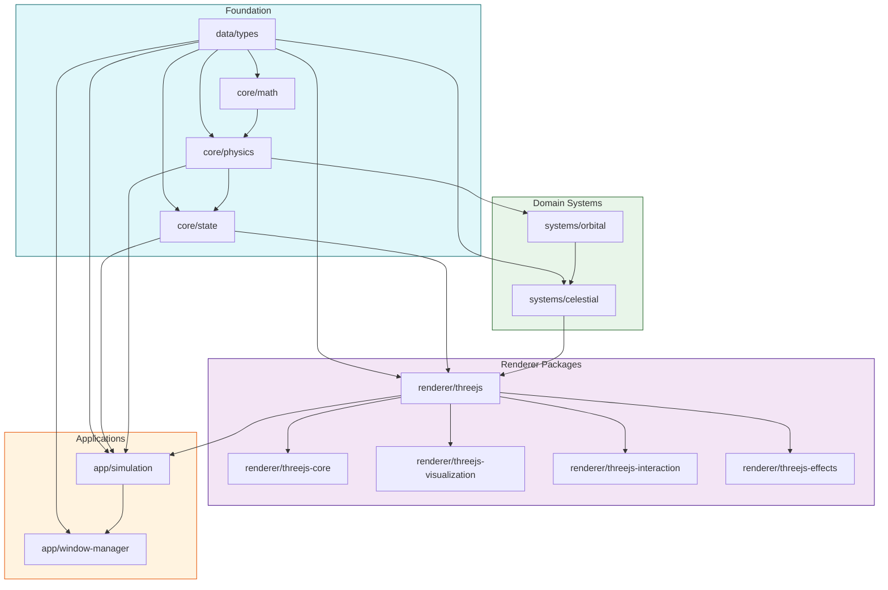
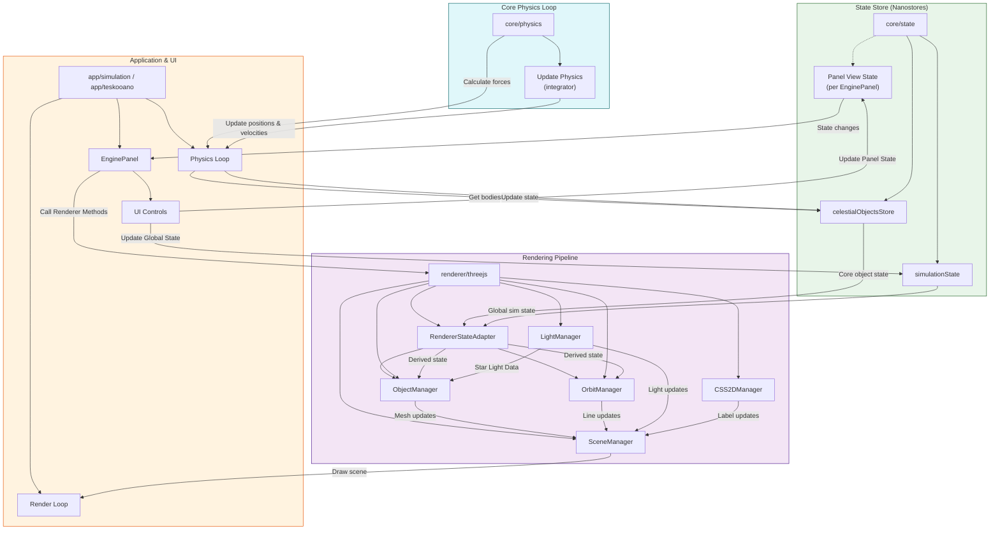

# Teskooano Architecture

This document provides an overview of Teskooano's architecture, designed to help developers understand how the engine works and how to contribute effectively.

## High-Level Architecture

Teskooano follows a modular design with clear separation of concerns. The architecture is built around the following core principles:

- **Modularity**: Functionality is broken down into distinct packages
- **Unidirectional Data Flow**: Clear flow driven by centralized state management
- **Separation of Physics & Rendering**: Physics calculations are performed in real-world units, separate from scaled visualization
- **Testability**: Emphasis on TDD, especially for physics and core logic

## Package Structure

The application is structured as a monorepo with TypeScript modules organized into logical packages:

### Core Packages

- **`data/types`**: Shared TypeScript interfaces and enums used across the engine
- **`core/math`**: Mathematical constructs and utilities (vectors, matrices, quaternions)
- **`core/physics`**: Core physics simulation logic for gravity and orbital mechanics
- **`core/state`**: Global application state management using Nanostores
- **`core/debug`**: Debug utilities and tools

### System Packages

- **`systems/celestial`**: Defines, generates, and renders celestial objects
- **`systems/procedural-generation`**: Procedural generation of star systems
- **`systems/orbital`**: Handles orbital calculations and parent-child relationships

### Renderer Packages

- **`renderer/threejs`**: Main integration package providing the `ModularSpaceRenderer` facade
- **`renderer/threejs-core`**: Foundational Three.js setup (scene, camera, renderer)
- **`renderer/threejs-effects`**: Visual effects and optimizations (lighting, LOD)
- **`renderer/threejs-interaction`**: User interaction (camera controls, HTML overlays)
- **`renderer/threejs-visualization`**: Rendering of celestial objects, orbits, and backgrounds

### Application Packages

- **`app/simulation`**: Main simulation orchestration and game loop
- **`app/window-manager`**: Manages application windows, panels, and UI layout

## Data Flow

The engine follows a unidirectional data flow pattern:

1. The Physics Loop retrieves celestial object data from `celestialObjectsStore`
2. It uses `core/physics` to calculate forces and updates positions/velocities
3. Updated physics state is written back to `celestialObjectsStore`
4. The `RendererStateAdapter` subscribes to state changes and creates derived state
5. Renderer Managers subscribe to the adapter's derived state and update visuals
6. The main Render Loop calls the `ModularSpaceRenderer`'s update/render methods

## Key Components

### Physics Engine

- **Real Units**: Uses real physical units (meters, kilograms, seconds)
- **Pluggable Components**: Includes various force calculators and integrators
- **Integration Methods**: Supports Euler, Symplectic Euler, and Verlet algorithms
- **Optimization**: Includes Barnes-Hut optimization for gravitational calculations

### State Management

- **Nanostores**: Uses lightweight, efficient state management
- **Core Stores**:
  - `celestialObjectsStore`: All celestial object data
  - `simulationState`: Global simulation settings
  - `celestialHierarchyStore`: Parent-child relationships

### Rendering Pipeline

- **ModularSpaceRenderer**: Main façade for the rendering system
- **Specialized Renderers**: Dedicated renderers for different celestial types
- **Level of Detail (LOD)**: Dynamic mesh detail based on distance
- **CSS2D Overlay**: HTML elements positioned in 3D space

### User Interface

- **DockView**: Multi-panel layout system
- **Web Components**: Custom UI controls
- **Driver.js**: Interactive tour system

## Scale and Coordinate Systems

Teskooano manages three coordinate systems:

1. **Real Physics Coordinates**: Actual distances in meters
2. **Visualization Coordinates**: Scaled for rendering (1 unit ≈ 1 AU)
3. **Screen Coordinates**: 2D coordinates for UI elements

Conversion between these systems happens at specific points:

- Physics calculations use real coordinates
- The `RendererStateAdapter` converts to visualization coordinates
- The Three.js renderer handles the final conversion to screen coordinates

## Design Patterns

- **State-Driven Architecture**: Central state with unidirectional data flow
- **Adapter Pattern**: `RendererStateAdapter` decouples core state from renderer needs
- **Facade Pattern**: `ModularSpaceRenderer` simplifies interaction with the renderer
- **Manager Pattern**: Encapsulates related responsibilities (e.g., `SceneManager`, `ObjectManager`)
- **Dependency Injection**: Components wired together during instantiation

## Performance Considerations

- **Dual Loop Architecture**: Separate physics and rendering loops
- **Spatial Partitioning**: Barnes-Hut algorithm for physics optimization
- **Level of Detail**: Dynamic mesh complexity based on distance
- **Efficient State Synchronization**: Only updates what's changed

## Contributing

When contributing to Teskooano, keep these architectural principles in mind:

1. **Modular Design**: New features should fit into the existing package structure
2. **State-Driven Updates**: Changes should follow the unidirectional data flow
3. **Real vs. Visualization Units**: Maintain clear separation between physics and rendering
4. **Performance First**: Consider the performance impact of any changes
5. **Test-Driven Development**: Write tests, especially for physics and core logic

For more detailed guidance, see the [Contributing Guide](/docs/contributing).
