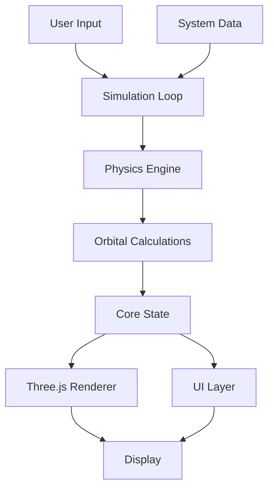

---
# https://vitepress.dev/reference/default-theme-home-page
layout: home

hero:
  name: "🔭 Teskooano"
  text: "A fun mutli-camera 3D N-Body Simulation Engine"
  tagline: |
    Explore procedurally generated solar systems with realistic physics, time-lapse control and other simulation features - all 3D with multiple viewports!
  image:
    src: /panel-icon.png
    alt: Teskooano Observatory Panel
    class: "hero-image"
  actions:
    - theme: brand
      text: 🔭 Play with Teskooano
      link: https://teskooano.space/teskooano
    - theme: alt
      text: View on GitHub
      link: https://github.com/tanepiper/teskooano
    - theme: brand
      text: Read the latest .plan file
      link: ./plan

features:
  - icon: 🪐
    title: Realistic Physics
    details: Experience true N-Body gravitational simulation with accurate orbital mechanics and collision detection based on real-world physics.

  - icon: 🔍
    title: Multi-View Experience
    details: Observe simulations from multiple angles simultaneously, with each view maintaining its own focus and camera controls.

  - icon: 🌌
    title: Procedural Generation
    details: Create unique star systems with procedurally generated planets, moons, and other celestial bodies using custom seeds.

  - icon: 🎮
    title: Interactive Controls
    details: Select and focus on any celestial body with intuitive camera controls, orbit tracking, and detailed information panels.

  - icon: ⏱️
    title: Dynamic Time Control
    details: Adjust simulation speed from real-time to 10 million times faster to observe both immediate interactions and long-term celestial evolution.

  - icon: 🧩
    title: Modular Architecture
    details: Built with TypeScript and modern frontend tools, Teskooano features a component-based design that's easily extendable.

  - title: Multi-View Capabilities
    details: Analyze simulations from different perspectives simultaneously.
---

## Latest .plan Update

::: info From the Plan Log
See all entries in the [Plan Section](./plan/).
:::

## Teskooano in Action

<ScreenshotCarousel />

## Observe The Cosmos Like Never Before

Teskooano (pronounced tes-koo-ah-no) is an advanced 3D simulation engine that recreates the physics of celestial bodies with reasonable accuracy.

## Key Capabilities

### Accurate Celestial Physics

Teskooano implements full N-Body gravitational simulation, meaning every object in the system exerts gravitational force on every other object. Watch as planets orbit stars, moons orbit planets, and complex gravitational interactions create realistic celestial motion.

### Real-time Visualization

Built on Three.js, Teskooano renders complex celestial systems in real-time with physically accurate lighting, materials, and effects. The visualization engine can handle hundreds of objects while maintaining smooth performance.

### Interactive Learning Platform

Perfect for educational settings, Teskooano makes complex orbital mechanics intuitive and accessible. Experiment with different planetary configurations, observe gravitational interactions, and learn about celestial mechanics through direct observation.

### Seamless User Experience

When you first launch Teskooano, an interactive guided tour introduces you to all key features. The intuitive DockView-based UI allows for customizable layouts to suit your specific needs.

## Built With Modern Tech

Teskooano leverages cutting-edge web technologies including:

- **Three.js** for 3D rendering and visualization
- **TypeScript** for type-safe development
- **Nanostores** for lightweight, efficient state management
- **Driver.js** for interactive tours
- **DockView** for flexible multi-panel layouts

## Open Source & Community Driven

Teskooano is completely open source under the MIT license. We welcome contributions, bug reports, and feature requests from the community.

- [GitHub](https://github.com/tanepiper/teskooano)

