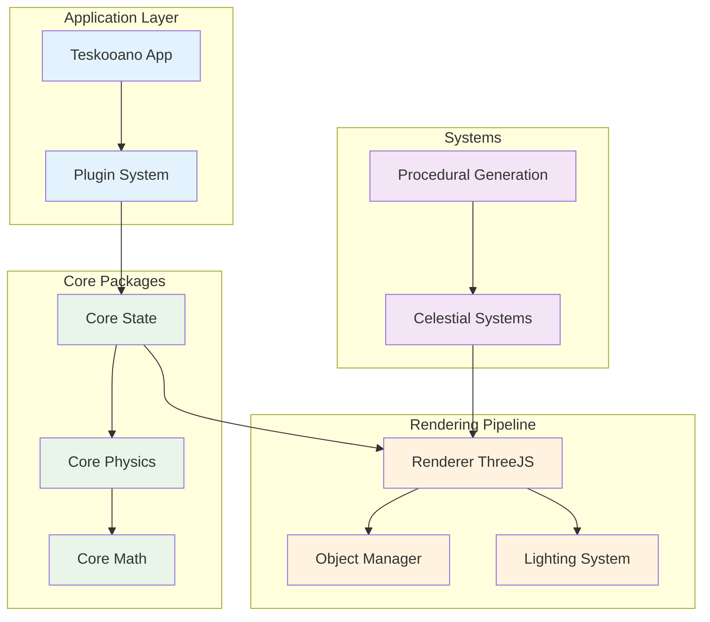

# Teskooano Application Architecture

This document outlines the architectural decisions, patterns, and structure of the Teskooano application.

## Overview

Teskooano is a modular N-Body simulation built with modern web technologies. The application follows a plugin-based architecture with reactive state management and a sophisticated 3D rendering pipeline.

## 📚 Architecture Documentation Suite

This document is part of a comprehensive architecture documentation suite:

- **[DATA_FLOW_ARCHITECTURE.md](./DATA_FLOW_ARCHITECTURE.md)** - Detailed data flow diagrams and reactive architecture patterns
- **[CODE_QUALITY_ANALYSIS.md](./CODE_QUALITY_ANALYSIS.md)** - Code duplication analysis, complexity hotspots, and refactoring recommendations
- **[IMPLEMENTATION_EXAMPLES.md](./IMPLEMENTATION_EXAMPLES.md)** - Concrete examples showing how to apply architectural improvements
- **ARCHITECTURE.md** (this file) - High-level architectural overview and decisions

## Quick Architecture Summary



## Current Architecture Analysis

### Application Structure (`apps/teskooano`)

**Purpose**: This is the main frontend application for the Teskooano N-Body Simulation. It orchestrates the user interface, manages different views of the simulation using `dockview-core`, integrates core engine packages, and provides user controls.

### Core Components

#### 1. Application Initialization (`main.ts`)

The application entry point that coordinates the startup sequence:

- **Plugin System Bootstrap**: Loads and registers all plugins with dependency resolution
- **UI Framework Setup**: Initializes Dockview for panel management
- **Manager Initialization**: Sets up toolbar, modal, and tour controllers
- **Event System**: Establishes global event listeners for plugin communication
- **Error Handling**: Provides graceful failure modes and user feedback

```typescript
// Simplified initialization flow
async function initializeApp() {
  validateEnvironment();
  await initializePluginSystem();
  const { dockviewController } = await initializeDockview();
  await initializeManagers(dockviewController);
  setupEventListeners();
}
```

#### 2. Plugin System Architecture

A sophisticated plugin-based architecture enabling modular functionality:

**Plugin Manager** (`packages/app/ui-plugin/`):

- **Loading**: Dynamic imports with build-time code splitting
- **Registration**: Type-safe plugin capability registration
- **Execution**: Context-aware function execution system
- **Dependencies**: Topological sorting for plugin dependencies
- **Hot Module Replacement**: Development-time plugin reloading

**Plugin Types**:

- **Panels**: Dockview-compatible UI panels (celestial-info, celestial-hierarchy)
- **Functions**: Reusable business logic (system generation, focus control)
- **Components**: Custom web components (buttons, controls, displays)
- **Toolbar Items**: Toolbar buttons and widgets
- **Managers**: Singleton service classes (modal manager, tour controller)

#### 3. State Management Architecture

Reactive state management using RxJS observables:

**Core State** (`@teskooano/core-state`):

- `celestialObjects$` - Current celestial body data
- `simulationState$` - Physics simulation settings and status
- `accelerationVectors$` - Real-time physics vectors for visualization
- `celestialHierarchy$` - Object parent-child relationships

**Derived State**:

- `renderableObjects$` - Transformed data for 3D rendering
- `visualSettings$` - Renderer-specific configuration

**State Flow Pattern**:

```
Raw Physics Data → Core State → Renderable Store → UI Components
                               ↓
                         Simulation Loop
```

#### 4. Rendering Pipeline

Modular 3D rendering system built on Three.js:

**ModularSpaceRenderer** (`packages/renderer/threejs/`):

- **Scene Management**: Three.js scene, camera, and renderer lifecycle
- **Object Management**: Celestial body 3D representations
- **Lighting System**: Dynamic lighting based on star positions
- **Controls**: User interaction (orbit controls, focus, follow)
- **Effects**: Visual effects (trails, predictions, backgrounds)

**Manager Decomposition**:

- `ObjectManager` - 3D object lifecycle and LOD
- `OrbitsManager` - Trajectory visualization
- `LightingManager` - Scene lighting calculations
- `ControlsManager` - Camera and user interactions
- `BackgroundManager` - Skybox and environment

#### 5. Plugin Communication Patterns

**Direct Execution**:

```typescript
pluginManager.execute("focus:focus_on_body", { objectId: "earth" });
```

**Shared State Subscriptions**:

```typescript
celestialObjects$.subscribe((objects) => {
  // React to state changes
});
```

**DOM Events**:

```typescript
document.dispatchEvent(
  new CustomEvent("engine-focus-request", {
    detail: { targetPanelId: "panel-1", objectId: "mars" },
  }),
);
```

### Key Architectural Patterns

#### 1. Model-View-Controller (MVC)

All UI plugins follow a strict MVC pattern:

- **View**: Custom element responsible only for DOM management
- **Controller**: Business logic, state management, and side effects
- **Model**: Reactive state accessed through observables

#### 2. Dependency Injection

Plugin execution context provides access to shared services:

```typescript
interface PluginExecutionContext {
  pluginManager: PluginManager;
  dockviewApi: DockviewApi;
  dockviewController: DockviewController;
  getManager<T>(id: string): T;
  executeFunction<T>(id: string, args?: any): T;
}
```

#### 3. Observer Pattern

Extensive use of RxJS for reactive programming:

- State changes propagate automatically through observable streams
- UI components subscribe to relevant data streams
- Side effects are managed through operators and subscriptions

#### 4. Factory Pattern

Dynamic object creation with caching:

- Plugin loading uses factory functions for module instantiation
- Celestial renderers use factories for type-specific creation
- UI components use factory patterns for panel generation

### Performance Optimizations

#### 1. Code Splitting

- Plugins are loaded dynamically using Vite's dynamic imports
- Only required functionality is loaded at runtime
- Build-time generation of plugin loaders

#### 2. Level of Detail (LOD)

- 3D objects adapt complexity based on camera distance
- Shader complexity reduces for distant objects
- Particle systems scale object count dynamically

#### 3. Subscription Management

- Automatic cleanup of RxJS subscriptions in components
- Shared state streams prevent redundant calculations
- Throttling and debouncing for high-frequency updates

### Current Challenges & Technical Debt

#### 1. Complexity Hotspots

- **main.ts**: 278 lines handling multiple initialization concerns
- **PluginManager**: 367 lines with multiple responsibilities
- **ModularSpaceRenderer**: Large coordinator class managing many subsystems

#### 2. Code Duplication

- RxJS subscription patterns repeated across 15+ files
- Plugin configuration boilerplate in 12+ plugin definitions
- State access patterns inconsistent throughout codebase

#### 3. Architectural Misalignment

- UI logic mixed with business logic in some packages
- Circular dependencies between renderer and state packages
- Camera management split between multiple layers

### Dependencies

**Core Framework Dependencies**:

- `dockview-core` - Panel layout management
- `three` - 3D graphics rendering
- `rxjs` - Reactive programming

**Internal Package Dependencies**:

- `@teskooano/core-state` - Centralized state management
- `@teskooano/core-physics` - Physics simulation engine
- `@teskooano/renderer-threejs` - 3D rendering pipeline
- `@teskooano/app-simulation` - Simulation orchestration
- `@teskooano/ui-plugin` - Plugin system infrastructure

### Development Workflow

#### 1. Plugin Development

```typescript
// Create plugin
export const plugin: TeskooanoPlugin = {
  id: "my-plugin",
  panels: [
    /* panel configs */
  ],
  functions: [
    /* function configs */
  ],
  components: [
    /* component configs */
  ],
};

// Register in pluginRegistry.ts
export const pluginConfig = {
  "my-plugin": () => import("./plugins/my-plugin"),
};
```

#### 2. Hot Module Replacement

- Plugins support HMR during development
- State preservation during plugin reloads
- Real-time feedback on plugin changes

#### 3. Testing Strategy

- Unit tests for individual plugins and components
- Integration tests for plugin communication
- Performance tests for rendering pipeline

---

_This architecture enables a highly modular, extensible N-Body simulation with sophisticated 3D visualization capabilities while maintaining clean separation of concerns and developer productivity._
