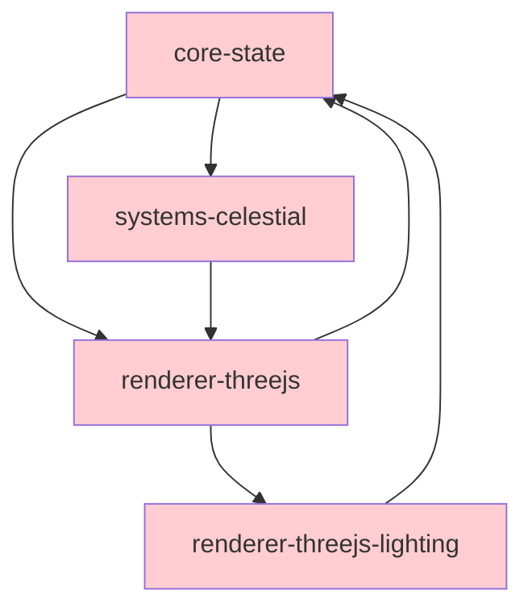

# Teskooano Code Quality Analysis

## Overview

This document provides a detailed analysis of code quality issues in the Teskooano application, focusing on duplication, cognitive complexity, and architectural misplacement. Each issue includes specific file locations, severity assessment, and actionable recommendations.

## 🔄 Code Duplication Analysis

## 🏗️ Architectural Misplacement Analysis

### Critical Misplacement Issues

#### 1. UI Logic in Core Packages

**Severity**: 🔴 High  
**Issue**: UI-specific code mixed with business logic

**Examples**:

```typescript
// ❌ BAD: UI logic in simulation package
// File: packages/app/simulation/src/camera/CameraManager.ts
export class CameraManager {
  // This should be in UI layer, not simulation core
  private focusedObjectId: string | null = null;

  public followObject(objectName: string): void {
    // Mixed UI intent with physics logic
  }
}

// ❌ BAD: Renderer concerns in state package
// File: packages/core/state/src/game/renderableStore.ts
export class RenderableStore {
  // This is renderer-specific, not core state
  private readonly _renderableObjectsStore = new BehaviorSubject<
    Record<string, RenderableCelestialObject>
  >({});
}
```

**Recommended Architecture**:

```typescript
// ✅ GOOD: Separate concerns

// Core business logic (packages/core/physics/)
export class PhysicsBasedCameraController {
  public calculateOptimalViewingDistance(object: CelestialObject): number {
    // Pure physics calculation
  }
}

// UI layer (apps/teskooano/src/camera/)
export class UICameraManager {
  constructor(
    private physicsController: PhysicsBasedCameraController,
    private renderer: ModularSpaceRenderer,
  ) {}

  public followObject(objectName: string): void {
    // UI orchestration using business logic
    const distance =
      this.physicsController.calculateOptimalViewingDistance(object);
    this.renderer.controlsManager.transitionTo(object.position, distance);
  }
}
```

#### 2. Cross-Package State Dependencies

**Severity**: 🟡 Medium  
**Issue**: Circular dependencies and unclear boundaries

**Problems**:

```typescript
// packages/renderer/threejs/src/RendererStateAdapter.ts
import { calculateLightSourceMaps } from "@teskooano/renderer-threejs-lighting";
import { celestialObjects$, simulationState$ } from "@teskooano/core-state";

// packages/systems/celestial/src/renderers/common/BaseCelestialRenderer.ts
import { renderableStore } from "@teskooano/core-state";

// packages/app/simulation/src/SimulationManager.ts
import { celestialFactory } from "@teskooano/core-state";
```

**Dependency Graph Issues**:



**Recommended Solution**: Introduce dependency injection interfaces:

```typescript
// packages/core/interfaces/src/renderer.ts
export interface RendererStateProvider {
  getRenderableObjects(): Observable<Record<string, RenderableCelestialObject>>;
  getVisualSettings(): Observable<VisualSettings>;
}

// packages/core/interfaces/src/lighting.ts
export interface LightingProvider {
  calculateLightSourceMaps(objects: CelestialObject[]): LightSourcesMap;
}

// Implementations inject dependencies instead of direct imports
export class RendererStateAdapter implements RendererStateProvider {
  constructor(private lightingProvider: LightingProvider) {}
}
```

#### 3. Plugin System Responsibilities

**Severity**: 🟡 Medium  
**Issue**: Plugin manager handling too many concerns

**Current Problems**:

```typescript
class PluginManager {
  // ❌ Should be separate services
  #dockviewApi: DockviewApi | null = null;           // UI framework coupling
  #dockviewController: any | null = null;             // UI framework coupling

  public setAppDependencies(deps: {                   // Dependency injection mixed with plugin logic
    dockviewApi: DockviewApi;
    dockviewController: any;
  }): void {}

  public getPendingToolbarRegistrations(): [...] {}   // Toolbar-specific logic

  public getToolbarItemsForTarget(target: ToolbarTarget): [...] {} // Toolbar-specific logic
}
```

**Recommended Separation**:

```typescript
// Focused plugin manager
export class PluginManager {
  private registrationManager: RegistrationManager;
  private executionEngine: PluginExecutionEngine;

  // Only plugin-related methods
  public registerPlugin(plugin: TeskooanoPlugin): void {}
  public execute<T>(functionId: string, args?: any): Promise<T> {}
}

// Separate UI integration service
export class PluginUIIntegration {
  constructor(
    private pluginManager: PluginManager,
    private dockviewController: DockviewController,
    private toolbarController: ToolbarController,
  ) {}

  public integratePluginWithUI(pluginId: string): void {
    // Handle UI-specific plugin integration
  }
}

// Separate dependency injection container
export class PluginDependencyContainer {
  private dependencies = new Map<string, any>();

  public register<T>(key: string, instance: T): void {}
  public resolve<T>(key: string): T {}
}
```

## 📋 Action Plan & Prioritization

### Phase 1: Quick Wins (1-2 weeks)

1. **Create StateSubscriptionMixin** - Eliminate RxJS subscription duplication
2. **Extract Plugin Factory Functions** - Reduce boilerplate in plugin definitions
3. **Standardize State Access Patterns** - Create consistent StateAccessor utility

### Phase 2: Complexity Reduction (3-4 weeks)

1. **Refactor main.ts initialization** - Break into focused functions
2. **Decompose PluginManager** - Extract loader, executor, HMR manager
3. **Simplify RendererStateAdapter** - Use RxJS operators for transformation

### Phase 3: Architectural Improvements (6-8 weeks)

1. **Introduce Dependency Injection** - Remove circular dependencies
2. **Separate UI from Business Logic** - Move UI concerns to app layer
3. **Create Plugin System V2** - More declarative plugin definitions

### Success Metrics

- **Code Duplication**: Reduce by 60% (measured by clone detection tools)
- **Cognitive Complexity**: No functions > 15 complexity score
- **Dependency Cycles**: Zero circular dependencies between packages
- **Test Coverage**: Maintain >80% coverage during refactoring

---

_This analysis should be revisited monthly during active development to catch new complexity hotspots early._
