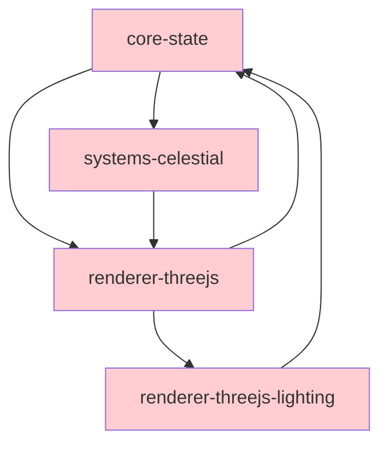

# Teskooano Code Quality Analysis

## Overview

This document provides a detailed analysis of code quality issues in the Teskooano application, focusing on duplication, cognitive complexity, and architectural misplacement. Each issue includes specific file locations, severity assessment, and actionable recommendations.

## 🔄 Code Duplication Analysis

### Critical Duplication Issues

#### 1. RxJS Subscription Management Pattern
**Severity**: 🔴 High  
**Impact**: Memory leaks, maintenance burden  
**Locations**: 15+ files

**Duplicated Pattern**:
```typescript
// Found in multiple files:
// - apps/teskooano/src/plugins/celestial-info/view/CelestialInfo.view.ts
// - apps/teskooano/src/plugins/celestial-hierarchy/view/CelestialHierarchy.view.ts  
// - apps/teskooano/src/plugins/engine-panel/main-toolbar/system-controls/view/system-controls.component.ts
// - apps/teskooano/src/plugins/celestial-uniforms/view/CelestialUniforms.view.ts

private subscriptions = new Subscription();

public init(): void {
  this.subscriptions.add(
    celestialObjects$.subscribe(objects => {
      // Component-specific logic
    })
  );
  
  this.subscriptions.add(
    simulationState$.subscribe(state => {
      // Component-specific logic
    })
  );
}

public dispose(): void {
  this.subscriptions.unsubscribe();
}
```

**Recommended Solution**:
```typescript
// Create: apps/teskooano/src/core/components/mixins/StateSubscriptionMixin.ts
export class StateSubscriptionMixin {
  protected subscriptions = new Subscription();
  
  protected subscribeToState<T>(
    observable: Observable<T>, 
    handler: (value: T) => void
  ): void {
    this.subscriptions.add(observable.subscribe(handler));
  }
  
  public dispose(): void {
    this.subscriptions.unsubscribe();
  }
}

// Usage in plugins:
export class CelestialInfo extends StateSubscriptionMixin {
  public init(): void {
    this.subscribeToState(celestialObjects$, objects => {
      // Component logic
    });
  }
}
```

#### 2. Plugin Configuration Boilerplate
**Severity**: 🟡 Medium  
**Impact**: Development velocity, consistency  
**Locations**: 12+ plugin index.ts files

**Duplicated Pattern**:
```typescript
// Pattern repeated across:
// - apps/teskooano/src/plugins/celestial-info/index.ts
// - apps/teskooano/src/plugins/celestial-hierarchy/index.ts
// - apps/teskooano/src/plugins/celestial-uniforms/index.ts
// - apps/teskooano/src/plugins/engine-settings/index.ts

const panelConfig: PanelConfig = {
  componentName: "component-name",
  panelClass: ComponentClass,
  defaultTitle: "Panel Title",
};

const toolbarRegistration: ToolbarRegistration = {
  target: "engine-toolbar",
  items: [{
    id: "button-id",
    type: "panel", 
    title: "Button Title",
    iconSvg: IconSvg,
    componentName: "component-name",
    behaviour: "toggle",
    order: 10,
  }],
};

export const plugin: TeskooanoPlugin = {
  id: "plugin-id",
  name: "Plugin Name",
  description: "Plugin description",
  panels: [panelConfig],
  toolbarRegistrations: [toolbarRegistration],
  components: [...],
  functions: [...],
};
```

**Recommended Solution**:
```typescript
// Create: apps/teskooano/src/core/utils/plugin-factory.ts
export function createPanelPlugin(config: {
  id: string;
  name: string;
  description: string;
  componentName: string;
  panelClass: any;
  defaultTitle: string;
  iconSvg: string;
  buttonTitle?: string;
  order?: number;
  target?: ToolbarTarget;
  additionalComponents?: ComponentConfig[];
}): TeskooanoPlugin {
  const panelConfig: PanelConfig = {
    componentName: config.componentName,
    panelClass: config.panelClass,
    defaultTitle: config.defaultTitle,
  };

  const toolbarRegistration: ToolbarRegistration = {
    target: config.target || "engine-toolbar",
    items: [{
      id: `${config.id}-button`,
      type: "panel",
      title: config.buttonTitle || config.defaultTitle,
      iconSvg: config.iconSvg,
      componentName: config.componentName,
      behaviour: "toggle",
      order: config.order || 10,
    }],
  };

  return {
    id: config.id,
    name: config.name,
    description: config.description,
    panels: [panelConfig],
    toolbarRegistrations: [toolbarRegistration],
    components: config.additionalComponents || [],
    functions: [],
    managerClasses: [],
  };
}

// Usage:
export const plugin = createPanelPlugin({
  id: "teskooano-celestial-info",
  name: "Celestial Info Display", 
  description: "Shows detailed celestial object information",
  componentName: "celestial-info",
  panelClass: CelestialInfo,
  defaultTitle: "Celestial Info",
  iconSvg: InfoIcon,
  order: 30,
  additionalComponents: components,
});
```

#### 3. State Access Patterns
**Severity**: 🟡 Medium  
**Impact**: Inconsistent data access  
**Locations**: 8+ files

**Duplicated Pattern**:
```typescript
// Found in multiple controllers and components:
import { 
  celestialObjects$, 
  getCelestialObjects,
  simulationState$,
  getSimulationState 
} from "@teskooano/core-state";

// Inconsistent patterns of reactive vs imperative access
const objects = getCelestialObjects(); // Imperative
celestialObjects$.subscribe(objects => {}); // Reactive

const state = getSimulationState(); // Imperative  
simulationState$.subscribe(state => {}); // Reactive
```

**Recommended Solution**:
```typescript
// Create: apps/teskooano/src/core/state/StateAccessor.ts
export class StateAccessor {
  // Standardized reactive access with initial value
  static getCelestialObjectsStream(): Observable<Record<string, CelestialObject>> {
    return celestialObjects$.pipe(
      startWith(getCelestialObjects())
    );
  }
  
  static getSimulationStateStream(): Observable<SimulationState> {
    return simulationState$.pipe(
      startWith(getSimulationState())
    );
  }
  
  // Standardized imperative access
  static getCurrentCelestialObjects(): Record<string, CelestialObject> {
    return getCelestialObjects();
  }
  
  static getCurrentSimulationState(): SimulationState {
    return getSimulationState();
  }
}
```

## 🧠 Cognitive Complexity Analysis

### Critical Complexity Issues

#### 1. Application Initialization (`main.ts`)
**Severity**: 🔴 High  
**Complexity Score**: ~25 (Threshold: 10)  
**File**: `apps/teskooano/src/main.ts`  
**Function**: `initializeApp()` (lines 27-277)

**Complexity Factors**:
- 8 sequential async operations
- 4 different error handling patterns
- 5 manager initialization steps
- 3 event listener setups
- Plugin dependency resolution

**Cyclomatic Complexity Breakdown**:
```typescript
async function initializeApp() {
  // 1. HTML element validation (2 branches)
  if (!appElement || !toolbarElement) {
    throw new Error("Required HTML elements not found.");
  }

  // 2. Plugin loading (1 branch + error handling)
  await pluginManager.loadAndRegisterPlugins(pluginIds);

  // 3. Dockview initialization (3 branches + error handling)
  try {
    const result: any = await pluginManager.execute("dockview:initialize", {
      appElement,
    });
    
    if (result && typeof result === "object" && "controller" in result) {
      // Success path
    } else {
      // Error path
    }
  } catch (error) {
    // Exception path
  }

  // 4. Manager initialization loop (4 iterations)
  await pluginManager.execute("engine-view:initialize", {});
  await pluginManager.execute("toolbar:initialize", {});
  await pluginManager.execute("tour:initialize", {});
  await pluginManager.execute("system-controls:initialize", {});

  // 5. Panel registration loop (dynamic branches)
  plugins.forEach((plugin: TeskooanoPlugin) => {
    plugin.panels?.forEach((panelConfig: PanelConfig) => {
      // Multiple nested conditions
    });
  });
}
```

**Recommended Refactoring**:
```typescript
// Break down into focused functions:

async function initializeApp() {
  validateEnvironment();
  await initializePluginSystem();
  const { dockviewController, dockviewApi } = await initializeDockview();
  await initializeManagers(dockviewController);
  await registerPanelComponents(dockviewController);
  await createInitialPanels(dockviewController);
  setupEventListeners();
}

function validateEnvironment(): void {
  const appElement = document.getElementById("app");
  const toolbarElement = document.getElementById("toolbar");
  
  if (!appElement || !toolbarElement) {
    throw new EnvironmentValidationError("Required HTML elements not found");
  }
}

async function initializePluginSystem(): Promise<void> {
  const pluginIds = [
    ...Object.keys(corePluginConfig),
    ...Object.keys(pluginConfig),
  ];
  await pluginManager.loadAndRegisterPlugins(pluginIds);
}

// etc...
```

#### 2. Plugin Manager Class 
**Severity**: 🔴 High  
**Complexity Score**: ~20  
**File**: `packages/app/ui-plugin/src/pluginManager.ts`  
**Class**: `PluginManager` (367 lines)

**Complexity Factors**:
- Multiple responsibility areas (loading, registration, execution, HMR)
- Complex dependency resolution algorithm
- Registry management across 6 different types
- Error handling for various plugin lifecycle events

**Recommended Decomposition**:
```typescript
// Split into focused classes:

export class PluginManager {
  private loader: PluginLoader;
  private executor: PluginExecutor;
  private registrationManager: RegistrationManager;
  private hmrManager: HMRManager;
  
  constructor() {
    this.loader = new PluginLoader();
    this.executor = new PluginExecutor(this.registrationManager);
    this.registrationManager = new RegistrationManager();
    this.hmrManager = new HMRManager(this.loader, this.registrationManager);
  }
  
  async loadAndRegisterPlugins(pluginIds: string[]): Promise<void> {
    const plugins = await this.loader.loadPlugins(pluginIds);
    this.registrationManager.registerPlugins(plugins);
  }
  
  execute<T>(functionId: string, args?: any): Promise<T> | T | undefined {
    return this.executor.execute(functionId, args);
  }
}

class PluginLoader {
  async loadPlugins(pluginIds: string[]): Promise<TeskooanoPlugin[]> {
    // Focused on loading logic
  }
}

class PluginExecutor {
  execute<T>(functionId: string, args?: any): Promise<T> | T | undefined {
    // Focused on execution logic
  }
}
```

#### 3. Renderer State Adapter
**Severity**: 🟡 Medium  
**Complexity Score**: ~15  
**File**: `packages/renderer/threejs/src/RendererStateAdapter.ts`  
**Class**: `RendererStateAdapter`

**Complexity Factors**:
- Multiple subscription management
- Complex data transformation pipeline
- Mixed reactive and imperative patterns

**Current Issues**:
```typescript
// Complex subscription in constructor
this.unsubscribeSimState = simulationState$.subscribe(
  (simState: SimulationState) => {
    this.currentSimulationTime = simState.time ?? 0;

    const currentVisSettings = this.$visualSettings.getValue();
    const newMultiplier = simState.visualSettings.trailLengthMultiplier ?? 150;
    const newEngine = simState.physicsEngine === "verlet" ? "verlet" : "keplerian";
    const newTimeScale = simState.timeScale;
    const newPredictionSteps = simState.visualSettings.predictionSteps;
    const newPredictionDuration = simState.visualSettings.predictionDuration;

    // Complex comparison logic
    if (
      newMultiplier !== currentVisSettings.trailLengthMultiplier ||
      newEngine !== currentVisSettings.physicsEngine ||
      newTimeScale !== currentVisSettings.timeScale ||
      newPredictionSteps !== currentVisSettings.predictionSteps ||
      newPredictionDuration !== currentVisSettings.predictionDuration
    ) {
      this.$visualSettings.next({
        trailLengthMultiplier: newMultiplier,
        physicsEngine: newEngine,
        timeScale: newTimeScale,
        predictionSteps: newPredictionSteps,
        predictionDuration: newPredictionDuration,
      });
    }
  },
);
```

**Recommended Refactoring**:
```typescript
class RendererStateAdapter {
  constructor() {
    this.setupCelestialObjectsSubscription();
    this.setupSimulationStateSubscription();
    this.setupVisualSettingsSubscription();
  }

  private setupSimulationStateSubscription(): void {
    this.unsubscribeSimState = simulationState$
      .pipe(
        map(this.extractVisualSettings),
        distinctUntilChanged(this.compareVisualSettings)
      )
      .subscribe(visualSettings => {
        this.$visualSettings.next(visualSettings);
      });
  }

  private extractVisualSettings(simState: SimulationState): RendererVisualSettings {
    return {
      trailLengthMultiplier: simState.visualSettings.trailLengthMultiplier ?? 150,
      physicsEngine: simState.physicsEngine === "verlet" ? "verlet" : "keplerian",
      timeScale: simState.timeScale,
      predictionSteps: simState.visualSettings.predictionSteps,
      predictionDuration: simState.visualSettings.predictionDuration,
    };
  }

  private compareVisualSettings(a: RendererVisualSettings, b: RendererVisualSettings): boolean {
    return Object.keys(a).every(key => a[key] === b[key]);
  }
}
```

## 🏗️ Architectural Misplacement Analysis

### Critical Misplacement Issues

#### 1. UI Logic in Core Packages
**Severity**: 🔴 High  
**Issue**: UI-specific code mixed with business logic

**Examples**:
```typescript
// ❌ BAD: UI logic in simulation package
// File: packages/app/simulation/src/camera/CameraManager.ts
export class CameraManager {
  // This should be in UI layer, not simulation core
  private focusedObjectId: string | null = null;
  
  public followObject(objectName: string): void {
    // Mixed UI intent with physics logic
  }
}

// ❌ BAD: Renderer concerns in state package  
// File: packages/core/state/src/game/renderableStore.ts
export class RenderableStore {
  // This is renderer-specific, not core state
  private readonly _renderableObjectsStore = new BehaviorSubject<
    Record<string, RenderableCelestialObject>
  >({});
}
```

**Recommended Architecture**:
```typescript
// ✅ GOOD: Separate concerns

// Core business logic (packages/core/physics/)
export class PhysicsBasedCameraController {
  public calculateOptimalViewingDistance(object: CelestialObject): number {
    // Pure physics calculation
  }
}

// UI layer (apps/teskooano/src/camera/)
export class UICameraManager {
  constructor(
    private physicsController: PhysicsBasedCameraController,
    private renderer: ModularSpaceRenderer
  ) {}
  
  public followObject(objectName: string): void {
    // UI orchestration using business logic
    const distance = this.physicsController.calculateOptimalViewingDistance(object);
    this.renderer.controlsManager.transitionTo(object.position, distance);
  }
}
```

#### 2. Cross-Package State Dependencies
**Severity**: 🟡 Medium  
**Issue**: Circular dependencies and unclear boundaries

**Problems**:
```typescript
// packages/renderer/threejs/src/RendererStateAdapter.ts
import { calculateLightSourceMaps } from "@teskooano/renderer-threejs-lighting";
import { celestialObjects$, simulationState$ } from "@teskooano/core-state";

// packages/systems/celestial/src/renderers/common/BaseCelestialRenderer.ts  
import { renderableStore } from "@teskooano/core-state";

// packages/app/simulation/src/SimulationManager.ts
import { celestialFactory } from "@teskooano/core-state";
```

**Dependency Graph Issues**:


**Recommended Solution**: Introduce dependency injection interfaces:
```typescript
// packages/core/interfaces/src/renderer.ts
export interface RendererStateProvider {
  getRenderableObjects(): Observable<Record<string, RenderableCelestialObject>>;
  getVisualSettings(): Observable<VisualSettings>;
}

// packages/core/interfaces/src/lighting.ts  
export interface LightingProvider {
  calculateLightSourceMaps(objects: CelestialObject[]): LightSourcesMap;
}

// Implementations inject dependencies instead of direct imports
export class RendererStateAdapter implements RendererStateProvider {
  constructor(
    private lightingProvider: LightingProvider
  ) {}
}
```

#### 3. Plugin System Responsibilities  
**Severity**: 🟡 Medium  
**Issue**: Plugin manager handling too many concerns

**Current Problems**:
```typescript
class PluginManager {
  // ❌ Should be separate services
  #dockviewApi: DockviewApi | null = null;           // UI framework coupling
  #dockviewController: any | null = null;             // UI framework coupling
  
  public setAppDependencies(deps: {                   // Dependency injection mixed with plugin logic
    dockviewApi: DockviewApi;
    dockviewController: any;
  }): void {}
  
  public getPendingToolbarRegistrations(): [...] {}   // Toolbar-specific logic
  
  public getToolbarItemsForTarget(target: ToolbarTarget): [...] {} // Toolbar-specific logic
}
```

**Recommended Separation**:
```typescript
// Focused plugin manager
export class PluginManager {
  private registrationManager: RegistrationManager;
  private executionEngine: PluginExecutionEngine;
  
  // Only plugin-related methods
  public registerPlugin(plugin: TeskooanoPlugin): void {}
  public execute<T>(functionId: string, args?: any): Promise<T> {}
}

// Separate UI integration service
export class PluginUIIntegration {
  constructor(
    private pluginManager: PluginManager,
    private dockviewController: DockviewController,
    private toolbarController: ToolbarController
  ) {}
  
  public integratePluginWithUI(pluginId: string): void {
    // Handle UI-specific plugin integration
  }
}

// Separate dependency injection container
export class PluginDependencyContainer {
  private dependencies = new Map<string, any>();
  
  public register<T>(key: string, instance: T): void {}
  public resolve<T>(key: string): T {}
}
```

## 📋 Action Plan & Prioritization

### Phase 1: Quick Wins (1-2 weeks)
1. **Create StateSubscriptionMixin** - Eliminate RxJS subscription duplication
2. **Extract Plugin Factory Functions** - Reduce boilerplate in plugin definitions  
3. **Standardize State Access Patterns** - Create consistent StateAccessor utility

### Phase 2: Complexity Reduction (3-4 weeks)
1. **Refactor main.ts initialization** - Break into focused functions
2. **Decompose PluginManager** - Extract loader, executor, HMR manager  
3. **Simplify RendererStateAdapter** - Use RxJS operators for transformation

### Phase 3: Architectural Improvements (6-8 weeks)
1. **Introduce Dependency Injection** - Remove circular dependencies
2. **Separate UI from Business Logic** - Move UI concerns to app layer
3. **Create Plugin System V2** - More declarative plugin definitions

### Success Metrics
- **Code Duplication**: Reduce by 60% (measured by clone detection tools)
- **Cognitive Complexity**: No functions > 15 complexity score  
- **Dependency Cycles**: Zero circular dependencies between packages
- **Test Coverage**: Maintain >80% coverage during refactoring

---

*This analysis should be revisited monthly during active development to catch new complexity hotspots early.*