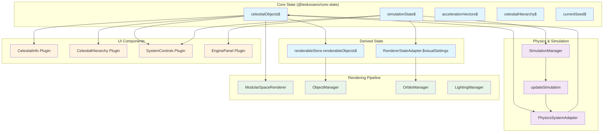
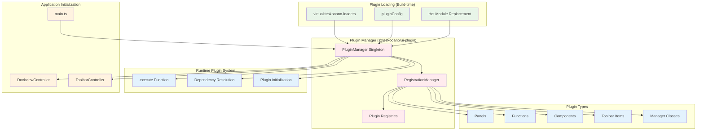
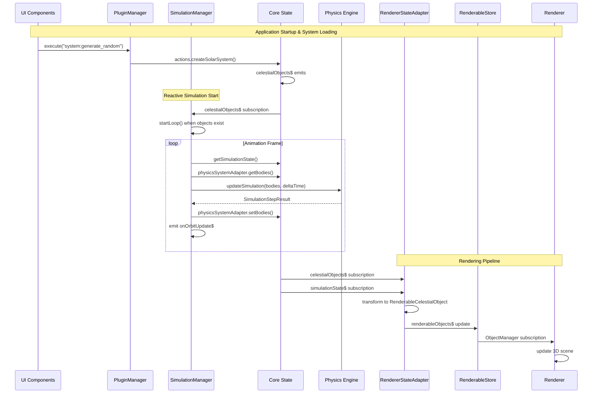
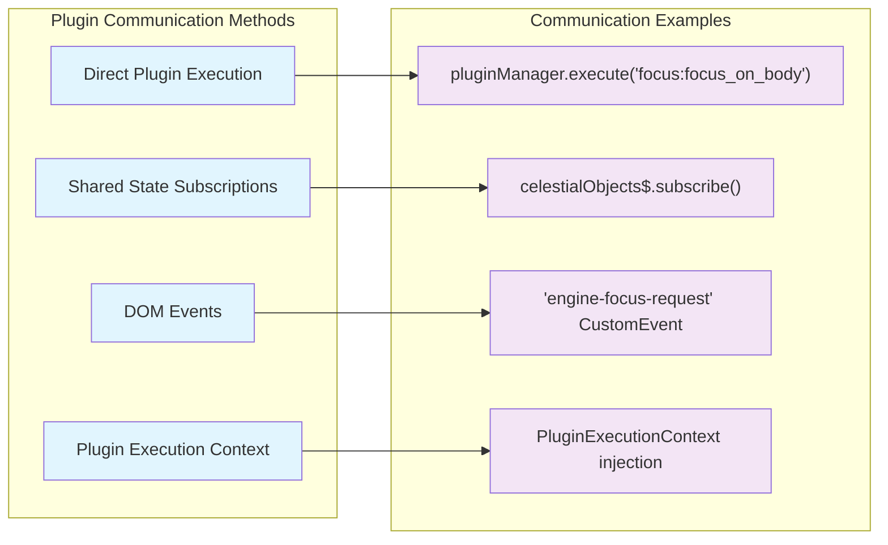
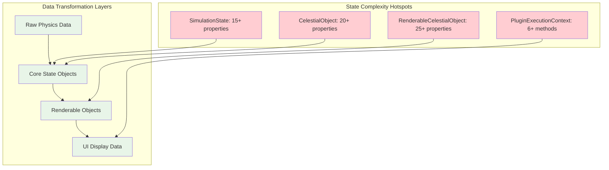

# Teskooano Data Flow Architecture

## Executive Summary

The Teskooano application follows a **reactive, plugin-based architecture** with centralized state management. The system orchestrates complex interactions between physics simulation, 3D rendering, and modular UI components through a sophisticated plugin system.

## Core Architecture Patterns

### 1. Reactive State Management (RxJS-based)
The application uses a **centralized reactive state** pattern with multiple interconnected stores:



### 2. Plugin System Architecture
The application uses a **hierarchical plugin system** with dependency resolution:



## Detailed Data Flow Analysis

### 3. Simulation Loop Data Flow



### 4. Plugin Communication Patterns



## Identified Issues & Recommendations

### 🚨 Code Duplication Areas

#### 1. State Subscription Patterns
**Issue**: Multiple plugins implement similar RxJS subscription patterns.

**Location**: Found in:
- `apps/teskooano/src/plugins/celestial-info/`
- `apps/teskooano/src/plugins/celestial-hierarchy/`
- `apps/teskooano/src/plugins/engine-panel/main-toolbar/system-controls/`

**Pattern**:
```typescript
// Repeated in multiple plugins
private subscriptions = new Subscription();

ngOnInit() {
  this.subscriptions.add(
    celestialObjects$.subscribe(objects => {
      // Plugin-specific logic
    })
  );
  
  this.subscriptions.add(
    simulationState$.subscribe(state => {
      // Plugin-specific logic  
    })
  );
}

ngOnDestroy() {
  this.subscriptions.unsubscribe();
}
```

**Recommendation**: Create a `BaseSubscribableComponent` or `StateSubscriptionMixin`.

#### 2. Plugin Registration Boilerplate
**Issue**: Similar plugin definition structures across plugins.

**Pattern**:
```typescript
// Repeated pattern in plugin index.ts files
const panelConfig: PanelConfig = { /* ... */ };
const toolbarRegistration: ToolbarRegistration = { /* ... */ };
const components: ComponentConfig[] = [ /* ... */ ];

export const plugin: TeskooanoPlugin = {
  id: "plugin-id",
  panels: [panelConfig],
  toolbarRegistrations: [toolbarRegistration],
  components: components,
  // ...
};
```

**Recommendation**: Create plugin factory functions or decorators.

### 🧠 Cognitive Complexity Issues

#### 1. Main Application Bootstrap (`main.ts`)
**Issue**: The `initializeApp()` function is 278 lines and handles multiple concerns.

**Complexity Factors**:
- Plugin loading and dependency resolution
- Error handling for multiple initialization steps  
- Event listener setup
- Dockview integration
- Manager initialization

**Recommendation**: Break down into smaller, focused initialization functions:
- `initializePluginSystem()`
- `initializeDockview()`
- `initializeManagers()`
- `setupEventListeners()`

#### 2. Plugin Manager (`packages/app/ui-plugin/src/pluginManager.ts`)
**Issue**: Single class handling multiple responsibilities (367 lines).

**Complexity Factors**:
- Plugin loading and registration
- Dependency resolution
- Hot Module Replacement
- Registry management
- Function execution

**Current Delegation**:
```typescript
class PluginManager {
  #registrationManager: RegistrationManager; // ✅ Good
  // But still handles too much logic directly
}
```

**Recommendation**: Further decompose into:
- `PluginLoader`
- `DependencyResolver`  
- `ExecutionContext`
- `HMRManager`

#### 3. ModularSpaceRenderer (`packages/renderer/threejs/src/ModularSpaceRenderer.ts`)
**Issue**: Large coordinator class (434 lines) managing many subsystems.

**Current Structure**: ✅ Generally well-decomposed into managers, but could benefit from:
- Extract setup logic into `RendererSetup` class
- Move event listener logic to `RendererEventManager`
- Create `RendererAPI` interface for public methods

### 🏗️ Architectural Misplacement Issues

#### 1. State Management Split
**Issue**: Application state is split between `@teskooano/core-state` and local component state.

**Examples**:
- Camera state in `packages/app/simulation/src/camera/CameraManager.ts`
- UI state in individual plugin components
- Visual settings in both `SimulationState` and `RendererStateAdapter`

**Recommendation**: Consolidate related state into dedicated state slices.

#### 2. Cross-Package Dependencies
**Issue**: Some packages have unclear dependency boundaries.

**Examples**:
```typescript
// In renderer package, importing from systems
import { calculateLightSourceMaps } from "@teskooano/renderer-threejs-lighting";

// UI logic mixed with business logic
// In plugin components importing simulation logic directly
```

**Recommendation**: Enforce cleaner package boundaries with dependency injection.

### 📊 State Flow Complexity Analysis



## Performance Considerations

### 1. Observable Subscription Management
**Current Pattern**: Each plugin manages its own subscriptions.
**Risk**: Memory leaks if not properly cleaned up.
**Solution**: Centralized subscription management or auto-cleanup utilities.

### 2. State Update Frequency
**Current**: Multiple state streams update independently.
**Risk**: Excessive re-renders and calculations.
**Solution**: Batch state updates where possible.

### 3. Plugin Hot Reloading
**Current**: Full plugin disposal and re-registration.
**Risk**: Losing component state during development.
**Solution**: State preservation during HMR.

## Recommendations Summary

### Immediate Actions (High Impact, Low Effort)
1. **Create Base Classes**: Extract common subscription patterns
2. **Plugin Factories**: Reduce boilerplate in plugin definitions
3. **State Type Cleanup**: Consolidate similar interfaces

### Medium-term Refactoring (High Impact, Medium Effort)  
1. **Main.ts Decomposition**: Break down initialization logic
2. **Manager Boundaries**: Clearer separation of concerns
3. **State Consolidation**: Reduce state management complexity

### Long-term Architecture (High Impact, High Effort)
1. **Plugin System V2**: More declarative plugin definitions
2. **State Machine**: Replace ad-hoc state with formal state machines
3. **Micro-frontend**: Consider splitting large plugins into smaller packages

## Testing Strategy

### Current Gaps
- Limited integration tests for plugin interactions
- No tests for complex state flow scenarios
- Manual testing required for plugin loading/unloading

### Recommended Tests
1. **Plugin Integration Tests**: Test cross-plugin communication
2. **State Flow Tests**: Test complete data transformation pipelines  
3. **Performance Tests**: Measure subscription and rendering performance

---

*This document should be updated as the architecture evolves. Consider running architectural reviews quarterly to identify new complexity hotspots.*