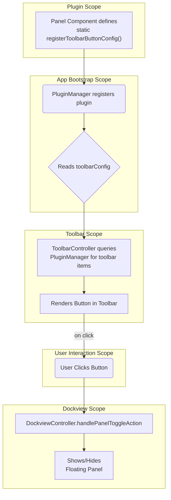

# Teskooano Core Controllers

This directory contains the core controller classes that manage the application's UI layout, state, and user interactions. They are designed to be modular and extensible, integrating deeply with the `@teskooano/ui-plugin` system.

## Architecture: A Plugin-Driven UI

The controllers follow a decoupled, plugin-driven architecture. The central `PluginManager` acts as a service locator and registry, while the controllers consume registered configurations and provide core application functionality.

The key interaction between the `DockviewController` and `ToolbarController` illustrates this pattern, creating a "self-registering panel" that is highly encapsulated:

This pattern makes panel components easy to add or remove without modifying the core controllers.

## Controllers

### `DockviewController`

The `DockviewController` is the central orchestrator for the application's panel-based UI. It wraps the `dockview-core` library and provides a simplified, powerful API for managing the layout.

- **Responsibilities**:
  - Manages the lifecycle of the Dockview instance.
  - Registers panel components that can be rendered.
  - Provides APIs to add, remove, and find panels and groups (`addPanelToNamedGroup`, `getGroupByName`, etc.).
  - Manages floating panels and modal overlays.
- **Internal Structure**: Its logic is broken down into smaller, specialized modules for API interaction (`DockviewController.api.ts`), event handling (`.events.ts`), and panel toggling (`.toggle.ts`), making the main class a lean composer of this functionality.

### `ToolbarController`

This controller builds and manages the main application toolbar. It is entirely dynamic.

- **Responsibilities**:
  - On initialization, queries the `PluginManager` for all registered toolbar items and widgets targeting `"main-toolbar"`.
  - Creates `teskooano-button` elements and other custom elements based on the retrieved configurations.
  - Wires up button click events to execute plugin functions or to call `DockviewController` methods for panel-related actions.
  - Handles responsive layout for mobile devices using RxJS to monitor screen size.

### `TourController`

Manages interactive application tours using `driver.js`.

- **Responsibilities**:
  - Provides functions for starting, restarting, and skipping tours.
  - Registers its own "Restart Tour" button into the toolbar system via its plugin configuration, demonstrating the extensibility of the toolbar.
