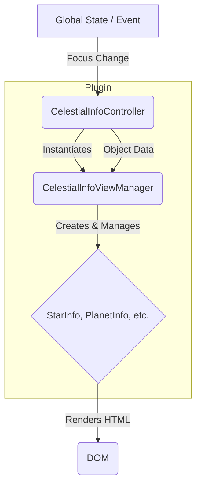

# Architecture: Celestial Info Plugin

## 1. Overview

The `@/celestial-info` plugin provides a UI panel that displays detailed, context-sensitive information about the currently focused celestial object. It is a key part of the user interface for exploring the simulation.

## 2. Previous Architecture (Pre-Refactor)

The initial implementation was centered around a single, monolithic custom element, `CelestialInfo`, which acted as a "god object," handling multiple responsibilities.

- **State Management**: It directly subscribed to global state.
- **Event Handling**: It managed global event listeners.
- **View Routing**: It contained all logic for deciding which sub-component to show.
- **Component Lifecycle**: It instantiated all possible sub-components in its constructor, managing their visibility manually.

### Shortcomings of the Previous Architecture

1.  **Poor Separation of Concerns**: The main component violated the Single Responsibility Principle.
2.  **Difficult to Test**: The business logic was tightly coupled to the DOM.
3.  **Low Maintainability**: The monolithic class was difficult to understand and modify.
4.  **Inefficient Instantiation**: All `bodies` components were instantiated at once, regardless of use.

## 3. Current MVC Architecture

To address these issues, the plugin has been refactored to follow the established MVC pattern. This separates the component into a lean View, a dedicated Controller for logic, and a `ViewManager` to handle the complexity of routing to the various sub-components.

### `view/CelestialInfo.view.ts` (View)

- A lightweight, "dumb" custom element (`<celestial-info>`).
- Its only responsibilities are:
  1.  Creating the shadow DOM and providing a container element.
  2.  Instantiating the `CelestialInfoController`.
  3.  Passing the necessary elements to the controller.
  4.  Delegating all lifecycle callbacks to the controller.

### `controller/CelestialInfo.controller.ts` (Controller)

- This class contains the core business logic.
- Its responsibilities are:
  1.  Handling all subscriptions to global state (e.g., `celestialObjects$`).
  2.  Registering and handling all global event listeners (`renderer-focus-changed`).
  3.  Instantiating and owning the `CelestialInfoViewManager`.
  4.  When a selection change occurs, it passes the new object data to the `ViewManager`.

### `controller/CelestialInfoViewManager.ts` (View Manager)

- A class that abstracts away the "routing" logic.
- Its responsibilities are:
  1.  Maintaining a mapping from `CelestialType` to the appropriate info component class.
  2.  Lazily instantiating the info components on demand and caching them.
  3.  Handling the DOM operations: showing the correct component and hiding the previous one.
  4.  Passing the updated `CelestialObject` data to the active component.

### `bodies/*` (Sub-Views) & DRY Refactoring

The individual components for each celestial type (`StarInfoComponent`, `PlanetInfoComponent`, etc.) have been refactored to be highly reusable and maintainable.

- **`BaseCelestialInfoComponent.ts`**: An abstract base class handles all common boilerplate, such as shadow DOM creation, styling, and providing a standardized `updateData` method. All specific info components extend this class.
- **`render-helpers.ts`**: A set of pure functions that generate HTML strings for common data sections (e.g., orbital parameters, physical properties). This centralizes the HTML generation logic and ensures consistency.

This approach makes the individual components much leaner, cleaner, and easier to maintain.

## 4. Data Flow Diagram

The data flow is now much clearer and more unidirectional:

