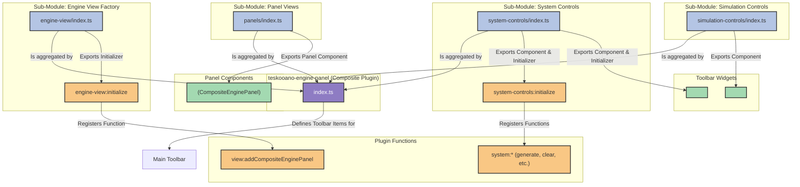

# Engine Panel Plugin (`@teskooano/engine-panel`)

This is a composite plugin that bundles all functionality related to the main 3D engine view. It acts as an aggregator for several more granular plugins, each with its own specific responsibility and architectural pattern.

## Architecture Overview

The `engine-panel` plugin follows a modular, "plugin-of-plugins" pattern. It doesn't contain much logic itself; instead, its `index.ts` file imports and re-exports the capabilities of other, more focused modules. This makes the system easier to maintain and extend.

The diagram below illustrates how the main `teskooano-engine-panel` plugin is composed from its sub-modules, and what each module contributes to the application (UI components, functions, etc.).

---

### Core Modules & Their Architectural Patterns

- **Panel (`./panels`)**: Provides the main `<teskooano-engine-view>` custom element, which is the `CompositeEnginePanel`.

  - **Pattern**: **Orchestrator Panel**. The panel component itself is a lean orchestrator that delegates all complex logic (lifecycle, camera, events) to dedicated manager classes. See the `panels/README.md` for a detailed architectural breakdown.

- **View Factory (`./main-toolbar/engine-view`)**: Provides the `engine-view:initialize` function.

  - **Pattern**: **Manager + Initializer Factory**. This module's job is to create an `EngineViewManager` which dynamically registers the `view:addCompositeEnginePanel` function. Other parts of the UI can then call this function to create new engine view panels on demand. See `main-toolbar/engine-view/ARCHITECTURE.md`.

- **System Controls (`./main-toolbar/system-controls`)**: Provides the `<teskooano-system-controls>` toolbar widget.

  - **Pattern**: **Reactive MVC with a Service Layer**. This component follows a strict separation of concerns between the View (dumb component), the Controller (handles UI logic and user input streams), and Services (handle core business logic like generating/exporting systems). It exposes its backend logic via the `system-controls:initialize` function. See `main-toolbar/system-controls/ARCHITECTURE.md`.

- **Simulation Controls (`./main-toolbar/simulation-controls`)**: Provides the `<teskooano-simulation-controls>` toolbar widget.

  - **Pattern**: **Classic MVC**. A self-contained component with a View (the custom element) and a Controller (holds all logic). It interacts directly with the global `@teskooano/core-state` to control simulation playback. See `main-toolbar/simulation-controls/ARCHITECTURE.md`.

- **Toolbar Definitions (`./main-toolbar/toolbar-definitions.ts`)**: This is not a plugin, but a configuration file. It defines `ToolbarWidgetConfig` and `ToolbarRegistration` objects that the main `engine-panel` plugin uses to place the above components and functions into the main application toolbar at the correct positions.

## Usage

The entire suite of engine panel functionality is loaded by including the single `teskooano-engine-panel` plugin in the main application's plugin registry. The `PluginManager` handles the registration of all the aggregated panels, functions, and widgets automatically.

## Dependencies

- `@teskooano/ui-plugin`: For plugin registration.
- `@teskooano/core-state`: Relied upon by panels/functions within.
- `@teskooano/renderer-threejs`: Used by `CompositeEnginePanel`.
- Other plugins providing components like `teskooano-simulation-controls` and `teskooano-system-controls`.
