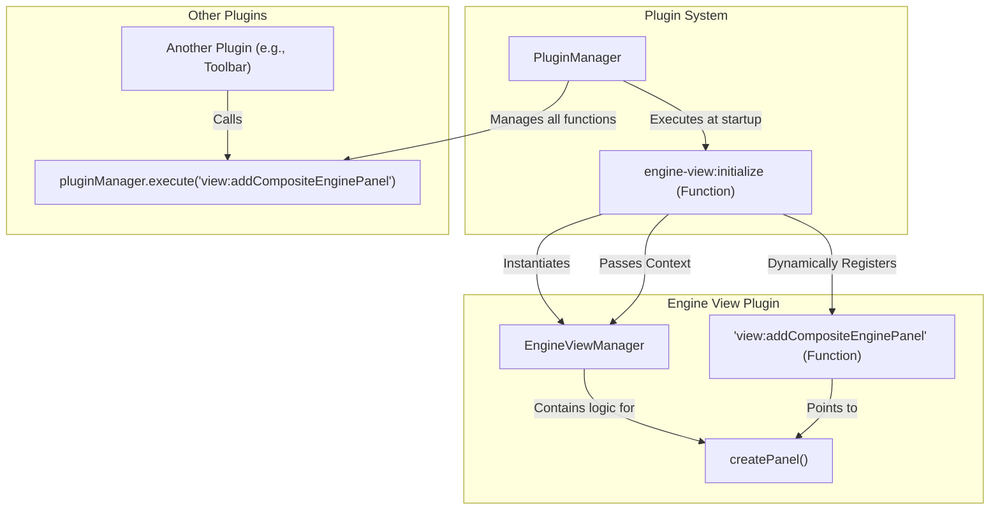

## Engine View Architecture (`plugins/.../engine-view`)

**Purpose**: This document describes the architecture of the `engine-view` plugin, which is responsible for creating and managing the main 3D engine view panels within Dockview.

**Core Pattern**: This plugin uses a **Manager + Initializer** pattern. A central `EngineViewManager` class contains the core logic, but it is not a global singleton. Instead, it's instantiated by an initializer function (`engine-view:initialize`) that runs at startup. This pattern allows for clean dependency injection and controlled instantiation.

---

### Key Components & Flow

1.  **`EngineViewManager.ts`**:

    - **`EngineViewManager` Class**: This class holds the state (like `_enginePanelCounter`) and logic for creating engine panels. Crucially, its constructor accepts the `PluginExecutionContext`, giving it access to `dockviewApi`, `pluginManager`, and other core services without relying on global imports.
    - **`engineViewInitializer` (`engine-view:initialize`)**: This is the main entry point for the plugin's logic, registered in the `plugin` export.
      - When the application starts, the `PluginManager` calls the `execute` method of this function.
      - Inside `execute`, a new `EngineViewManager` instance is created, passing in the `context`.
      - It then defines a new `FunctionConfig` for `view:addCompositeEnginePanel`. The `execute` method of this new function simply calls the `createPanel` method on the `engineViewManager` instance.
      - Finally, it calls `context.pluginManager.registerPlugin()` to add a new, in-memory plugin that exposes the `view:addCompositeEnginePanel` function to the rest of the application.

2.  **`<teskooano-engine-view>` Component**:
    - This is the custom element that gets rendered inside the Dockview panel. It is registered by a different plugin.
    - It receives parameters like `engineToolbarManager` when the panel is created in `EngineViewManager.createPanel`, allowing it to have its own dedicated toolbar instance.

### Data Flow Example (Creating a New Panel)

1.  A user clicks a button (e.g., "New View") in a different plugin, like the main application toolbar.
2.  The toolbar's controller calls `pluginManager.execute('view:addCompositeEnginePanel')`.
3.  The `PluginManager` finds the `view:addCompositeEnginePanel` function (which was dynamically registered by the initializer) and calls its `execute` method.
4.  This `execute` method calls `engineViewManager.createPanel()`.
5.  `createPanel` in the `EngineViewManager` instance performs its logic:
    - It gets the `dockviewApi` from its stored `context`.
    - It calls `pluginManager.execute('engine-toolbar:initialize')` to get a toolbar manager for the new panel.
    - It constructs the `AddPanelOptions` and calls `dockviewApi.addPanel()`.
6.  A new panel containing the `<teskooano-engine-view>` component appears in the UI.

This architecture ensures that `EngineViewManager` is not a static singleton, promotes testability, and uses the plugin system's dependency injection and dynamic registration capabilities correctly.
