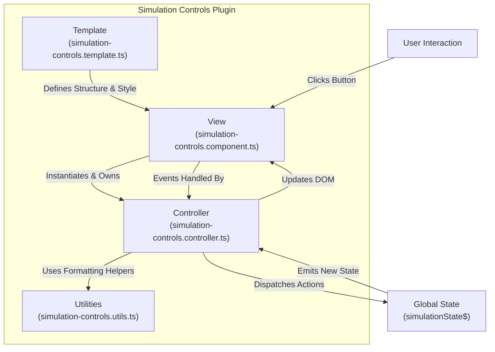

## Simulation Controls Architecture (`@/simulation-controls`)

**Purpose**: This document outlines the architecture of the `simulation-controls` plugin. This plugin provides the user interface for controlling the simulation's playback, including play/pause, speed adjustments, and time display.

**Core Pattern**: The plugin follows a strict **Model-View-Controller (MVC)** pattern to ensure a clear separation of concerns, making the component easier to maintain, debug, and test.

---

### Key Components

1.  **View (`view/simulation-controls.component.ts`)**

    - **Class**: `SimulationControls`
    - **Responsibilities**:
      - Acts as the custom element (`<teskooano-simulation-controls>`).
      - Purely responsible for the view layer. It renders the Shadow DOM from the template, queries for its interactive child elements, and passes them to the controller.
      - It instantiates its own `SimulationControlsController` upon connection to the DOM and calls the controller's `dispose` method upon disconnection. It contains no business logic.

2.  **Controller (`controller/simulation-controls.controller.ts`)**

    - **Class**: `SimulationControlsController`
    - **Responsibilities**:
      - This is the "brains" of the component; it contains all business logic.
      - It subscribes to the global `simulationState$` to receive state updates.
      - It attaches event listeners to the UI elements provided by the View.
      - When a user interacts with the UI (e.g., clicks the "play" button), the corresponding event handler in the controller is executed, which dispatches an action to the global state (e.g., `actions.togglePause()`).
      - When it receives a new state from `simulationState$`, it calls private `_update...` methods to directly manipulate the View's DOM elements (e.g., changing text content, toggling attributes).

3.  **Template (`view/simulation-controls.template.ts`)**

    - **Exports**: A `<template>` element.
    - **Responsibilities**:
      - Defines the complete, static HTML structure and CSS styles for the component's Shadow DOM.
      - Exports raw SVG icon imports for the controller to use when updating button icons.

4.  **Utilities (`controller/simulation-controls.utils.ts`)**
    - **Exports**: Pure functions.
    - **Responsibilities**:
      - Contains simple, stateless helper functions for formatting data for display (e.g., `formatTime`, `formatScale`). These are used by the Controller before updating the View.

### Data Flow Example (Play Button Click)

1.  The `User` clicks the play/pause button in the `View`.
2.  The `click` event is caught by the `playPauseHandler` method in the `Controller`.
3.  The `playPauseHandler` calls `actions.togglePause()`, which updates the `CoreState`.
4.  The `simulationState$` observable in the `CoreState` emits the new state.
5.  The `Controller`'s subscription to `simulationState$` receives the new state, triggering its `handleStateUpdate` method.
6.  `handleStateUpdate` calls the private `_updatePlayPauseButton` method.
7.  `_updatePlayPauseButton` directly changes the icon and `active` attribute of the button element in the `View`'s Shadow DOM.
