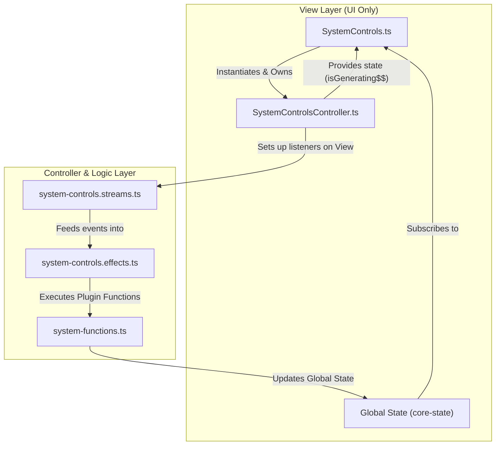

# System Controls Architecture

This document outlines the architecture of the `SystemControls` component (`@/system-controls`), a key UI element for managing the simulation's state.

### High-Level Architecture Overview

The `SystemControls` component follows a modern, reactive, **Model-View-Controller (MVC)** inspired architecture.

1.  **View (`SystemControls.ts`)**: The core is a "dumb" custom element that is only responsible for rendering the UI. It owns the DOM, displays data, and captures raw user input, but contains no business logic.
2.  **Controller (`SystemControlsController.ts`)**: A dedicated controller class that encapsulates all the business logic. It listens for events from the View, executes side effects (like calling plugins), manages component-level state (e.g., `isGenerating$$`), and orchestrates the overall flow.
3.  **Unidirectional Data Flow (UDF)**: The architecture strongly adheres to a UDF pattern for state management.
    - **State -> View**: Global state (from `@teskooano/core-state`) flows down into the View for rendering.
    - **View -> Controller -> State**: User interactions are passed to the Controller, which triggers effects that update the global state. The cycle then repeats as the new state flows back to the View.
4.  **Separation of Concerns (SoC)**: Logic is sharply divided into single-responsibility files (`.streams.ts`, `.effects.ts`), making the system modular, testable, and easier to reason about.

### Data Flow Diagram

This diagram illustrates the flow for generating a new system with the new architecture:

### Breakdown of File Responsibilities

- **`SystemControls.ts` (The View)**:

  - Defines the `teskooano-system-controls` custom element.
  - Owns the Shadow DOM and holds references to its elements.
  - Instantiates and holds a reference to its `SystemControlsController`.
  - Subscribes to global state and the controller's internal state (`isGenerating$$`) to trigger its own internal UI update methods.
  - Contains zero business logic.

- **`SystemControlsController.ts` (The Controller)**:

  - The new orchestrator for all component logic.
  - Initializes all RxJS streams by listening to events on the View.
  - Manages the effect pipelines (`generateSystemEffect$`, `clearSystemEffect$`, etc.).
  - Manages the component's internal state (`isGenerating$$`).
  - Handles all RxJS subscriptions.

- **`SystemControls.template.ts` (The Static View Definition)**:

  - Provides the static HTML and CSS for the component.
  - Defines the different visual states: `state--empty`, `state--loaded`, and the `loading-overlay`.

- **`system-controls.streams.ts` (The Intent Catcher)**:

  - Its sole responsibility is to capture user interactions (like clicks) and convert them into RxJS `Observable` streams. This isolates event listener setup.

- **`system-controls.effects.ts` (The Side Effect Handler)**:

  - This is the heart of the component's logic, managed by the Controller. It subscribes to the "intent" streams from `system-controls.streams.ts`.
  - For each stream, it defines a pipeline that performs actions, such as setting the "loading" state and calling the appropriate function via `pluginManager.execute()`.
  - It handles the results of these calls, including success and error feedback.

- **`system-functions.ts` (The Business Logic)**:

  - Defines the concrete implementations for system-level actions (`system:clear`, `system:export`, etc.).
  - These are configured as `FunctionConfig` objects, making them discoverable and executable by the `pluginManager`.
  - They interact directly with the core state and simulation managers.

- **`system-generator.ts` (The Generation Engine)**:

  - Contains the complex logic for procedurally generating a system from a seed. It uses an RxJS pipeline to process the generated objects and update the state.

- **`index.ts` (The Plugin Entry Point)**:
  - Bundles the `SystemControls` component and all the system functions into a single `TeskooanoPlugin` for registration with the application.
