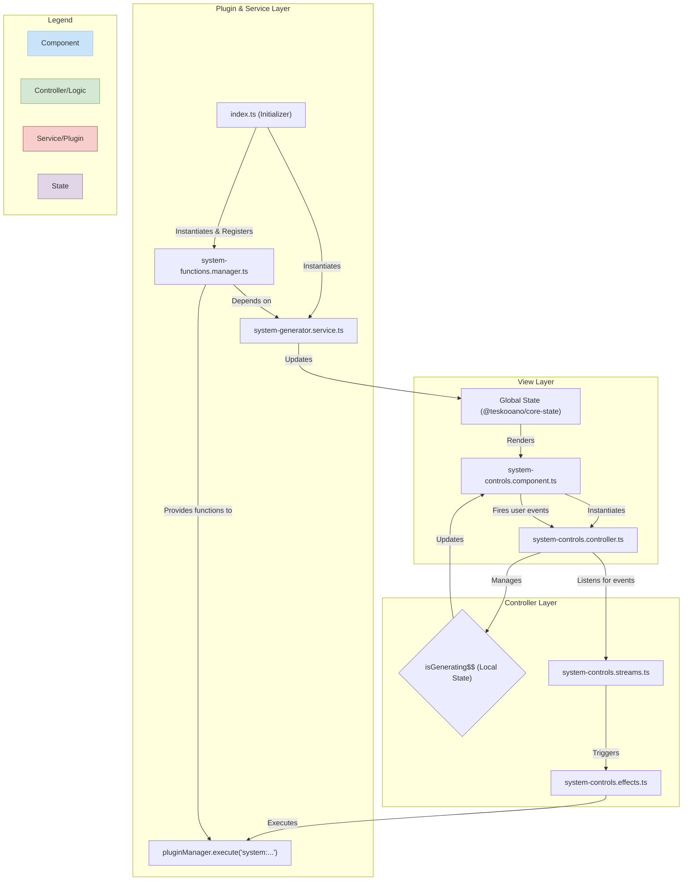

# System Controls Architecture

This document outlines the architecture of the `system-controls` plugin, a key UI feature for managing the simulation's state.

### High-Level Architecture Overview

The `system-controls` plugin follows a modern, reactive, **Model-View-Controller (MVC)** inspired architecture, with a clear separation of concerns into distinct layers and services.

1.  **View (`./view/`)**: A "dumb" custom element (`<teskooano-system-controls>`) that is only responsible for rendering the UI. It owns the DOM, displays data, and captures raw user input, but contains no business logic.
2.  **Controller (`./controller/`)**: A dedicated controller layer that encapsulates all the business logic directly related to the view. It listens for events from the View, executes side effects, manages component-level state (e.g., `isGenerating$$`), and orchestrates the overall flow.
3.  **Services (`./services/`)**: A set of standalone, injectable classes that handle the core, reusable business logic. For example, `SystemFunctionsManager` contains the logic for exporting a system, while `SystemGenerator` handles the complex process of procedural generation. These services are unaware of the View.
4.  **Plugin Entry Point (`index.ts`)**: This file defines the `TeskooanoPlugin`. It registers the custom element and exposes a single `system-controls:initialize` function. This initializer acts as a factory, instantiating the necessary services and dynamically registering their methods with the `PluginManager`.
5.  **Unidirectional Data Flow**: The architecture strongly adheres to a UDF pattern for state management.
    - **State -> View**: Global state (from `@teskooano/core-state`) flows down into the View for rendering.
    - **View -> Controller -> Service -> State**: User interactions are passed from the View to the Controller, which calls a Service. The Service executes the core logic, which may update the global state. The cycle then repeats as the new state flows back to the View.

### Data Flow & File Structure Diagram

This diagram illustrates the flow for generating a new system within the new architecture:

### Breakdown of Directory & File Responsibilities

- **`/` (Root)**

  - `index.ts`: The main plugin entry point. It bundles the component and the initializer function into a single `TeskooanoPlugin` for registration with the application.
  - `SystemControls.spec.ts`: Vitest tests for the component.
  - `ARCHITECTURE.md`: This file.

- **`/view/`**

  - `system-controls.component.ts`: Defines the `teskooano-system-controls` custom element. It owns the Shadow DOM, holds element references, and instantiates its controller. It subscribes to state (both global and from its controller) to trigger internal UI update methods. Contains zero business logic.
  - `system-controls.template.ts`: Provides the static HTML and CSS for the component, defining its visual states.

- **`/controller/`**

  - `system-controls.controller.ts`: The orchestrator for the view. It initializes all RxJS streams, manages the effect pipelines, handles component-level state (`isGenerating$$`), and manages all subscriptions.
  - `system-controls.streams.ts`: Its sole responsibility is to capture user interactions (like clicks) from the view and convert them into RxJS `Observable` streams. This isolates event listener setup.
  - `system-controls.effects.ts`: This is the heart of the UI's reactive logic. It subscribes to the "intent" streams and defines pipelines that perform actions, such as setting the loading state and calling the appropriate plugin function.

- **`/services/`**
  - `system-functions.manager.ts`: A class that defines the concrete implementations for system-level actions (`system:clear`, `system:export`, etc.). These are exposed as `FunctionConfig` objects, making them discoverable and executable by the `pluginManager`.
  - `system-generator.service.ts`: A class that contains the complex logic for procedurally generating a system from a seed. It uses an RxJS pipeline to process the generated objects and update the state.
