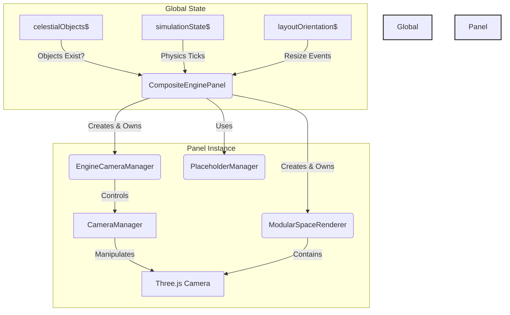

# Engine Panel (`@teskooano/engine-panel/panels`)

This directory contains the core UI component for rendering the 3D space simulation: the `CompositeEnginePanel`.

## Architecture

The `CompositeEnginePanel` is a self-contained, stateful component responsible for a single "view" into the shared simulation. It's designed to be instantiated multiple times within the Dockview layout, allowing users to have multiple independent camera angles, display settings, and interactions with the same underlying celestial data.

### Core Components

- **`CompositeEnginePanel.ts`**: The main `HTMLElement` custom element.

  - **State Management**: Each instance creates and manages its own private RxJS `BehaviorSubject` for its view state (`CompositeEngineState`). This includes camera position, focused object, and visibility toggles (e.g., `showGrid`, `showCelestialLabels`). This ensures that changes in one panel do not affect others.
  - **Renderer Lifecycle**: It is responsible for the complete lifecycle of its own `ModularSpaceRenderer` instance. It creates the renderer when a system is loaded (i.e., when `celestialObjects$` emits a non-empty map) and destroys it when the system is cleared.
  - **Subscription Management**: All RxJS subscriptions and global event listeners are managed within a single `_subscriptions` object, ensuring robust setup and teardown as the component is added to or removed from the DOM.
  - **Placeholder**: It uses the `PlaceholderManager` to display a helpful message or a loading indicator when no system is loaded or is in the process of generating.

- **`EngineCameraManager.ts`**: A dedicated wrapper that provides a clean, panel-specific API for all camera operations. It holds an instance of the main `CameraManager` and acts as a proxy, simplifying camera control from the panel's perspective.

- **`PlaceholderManager.ts`**: A simple UI utility that controls the visibility and content of the placeholder element shown before the 3D renderer is active.

- **`layoutStore.ts`**: A simple RxJS-based store that emits the current screen orientation (`portrait` or `landscape`), allowing panels to react to layout changes.

- **`CompositeEnginePanel.utils.ts`**: Contains helper functions, most notably `createDefaultViewState()` which acts as a factory to ensure each new panel starts with a clean, consistent state.

### Data Flow & Component Interaction

The following diagram illustrates the relationship between the `CompositeEnginePanel` and its key dependencies.

