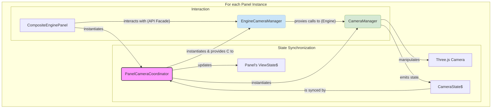

# Panel Camera Management Architecture

This document outlines the architecture for camera management within the Teskooano application, specifically how it applies to each `CompositeEnginePanel`. The architecture is designed to be instance-based, ensuring each panel has its own independent camera, which is crucial for a multi-view user experience.

## Core Principles

- **No Singletons**: There is no global, singleton `CameraManager`. Relying on a singleton is an anti-pattern here because camera state (position, focus, FOV) is specific to each panel, not the application as a whole.
- **Delegation & Orchestration**: A `CompositeEnginePanel` does not manage the camera directly. It delegates this responsibility to a coordinator, which in turn uses a generic, powerful camera engine.
- **Facade for Simplicity**: The panel interacts with a simple, clean API (a facade), which hides the more complex underlying implementation of the camera engine.

## Key Components & Their Roles

The architecture consists of three main classes working in concert for each panel instance:

1.  **`PanelCameraCoordinator` (The Orchestrator)**

    - **Location**: `../composite-panel/managers/`
    - **Responsibility**: This class is the "glue". It is instantiated by a `CompositeEnginePanel` and is responsible for creating and wiring together the other two components.
    - **Mechanism**:
      - It creates a new instance of `CameraManager`.
      - It creates a new instance of `EngineCameraManager`, providing it with the `CameraManager` instance.
      - It subscribes to the `CameraManager`'s state changes and synchronizes them with the panel's own `CompositeEngineState`. This ensures the panel's state is always a reliable reflection of the camera's state.

2.  **`CameraManager` (The Engine)**

    - **Location**: `@teskooano/app-simulation` (a shared package)
    - **Responsibility**: This is a generic, powerful, and reusable class that contains all the core logic for camera manipulation. It is completely unaware of the UI, panels, or plugins.
    - **Mechanism**:
      - Manages all interactions with the `THREE.PerspectiveCamera`.
      - Handles smooth camera transitions (pan, zoom, dolly) using GSAP.
      - Calculates focus positions and camera offsets.
      - Manages and emits its state via an RxJS `BehaviorSubject`.
      - Listens for and dispatches low-level camera events.

3.  **`EngineCameraManager` (The API Facade)**
    - **Location**: `.` (this directory)
    - **Responsibility**: This class acts as a clean, simplified API proxy or "facade" that the `CompositeEnginePanel` and its associated UI (like the toolbar) can interact with.
    - **Mechanism**: It holds a reference to the `CameraManager` instance created by the coordinator. It exposes straightforward methods like `focusOnObject()`, `setFov()`, and `resetCameraView()`, which simply proxy the calls to the underlying `CameraManager`. This decouples the panel from the complex implementation of the camera engine.

### Data & Instantiation Flow

This diagram illustrates how the components are created and how data flows between them for a single panel instance.

This instance-based approach is fundamental to the application's design, allowing for a flexible and powerful multi-view interface.
