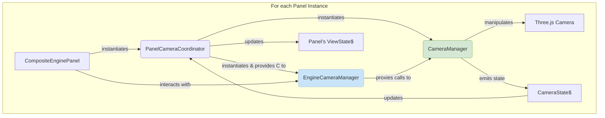

# Panel Camera Management

This directory contains the `EngineCameraManager`, a key component in the panel-specific camera control system. It embodies the principle that each `CompositeEnginePanel` should have its own independent camera management, rather than relying on a global singleton.

## Architecture: Instance-Based Camera Control

The camera architecture is coordinated by the `PanelCameraCoordinator` and exposed to the panel through the `EngineCameraManager`. This system is designed to be instantiated for each `CompositeEnginePanel`, providing isolated control over each 3D view.

- **`PanelCameraCoordinator` (The Coordinator)**:

  - **Location**: `../composite-panel/managers/`
  - **Responsibility**: This is the orchestrator. For each `CompositeEnginePanel`, it creates a new, dedicated instance of the `CameraManager`.
  - **Mechanism**: It links the `CameraManager` instance to the panel's renderer and synchronizes its state (position, focus, FOV) with the panel's own `CompositeEngineState`.

- **`CameraManager` (The Engine)**:

  - **Location**: `../camera-manager/` (Note: This is a conceptual location, as the manager is instantiated in the coordinator)
  - **Responsibility**: This is a powerful, generic class that contains all the core logic for camera manipulation. It handles smooth transitions (using GSAP), focus calculations, state management via RxJS, and direct interaction with the Three.js camera object. It has no knowledge of panels or the UI.

- **`EngineCameraManager` (The API Proxy)**:
  - **Location**: `.` (this directory)
  - **Responsibility**: This class acts as a clean, simplified API proxy or "facade" between the `CompositeEnginePanel` and the more complex `CameraManager`.
  - **Mechanism**: It is instantiated by the `PanelCameraCoordinator` and holds a reference to the `CameraManager`. It exposes straightforward methods like `focusOnObject()`, `setFov()`, and `resetCameraView()` that the `CompositeEnginePanel` or its toolbar can easily call without needing to know about the underlying implementation details.

### Data Flow

This instance-based approach is critical for allowing multiple, independent engine views in the application, each with its own camera state and user interactions. The `EngineCameraManager` ensures that this powerful system is exposed through a simple and maintainable API.
