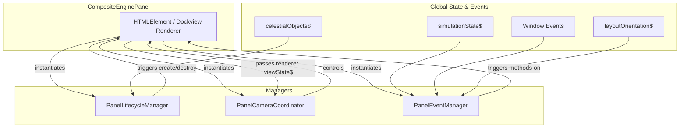

# Panel Managers

This directory contains manager and coordinator classes responsible for handling specific pieces of logic for the `CompositeEnginePanel`. This pattern keeps the main panel component lean and focused on orchestration and DOM management, while delegating complex tasks to these specialized classes.

## Managers

### `PanelLifecycleManager`

- **Responsibility**: Manages the core lifecycle of the panel's renderer and UI.
- **Mechanism**: It subscribes to the global `celestialObjects$` state stream. When celestial objects are added to the simulation, it triggers the creation of the `ModularSpaceRenderer` and its associated UI elements (like the toolbar). When the last object is removed, it tears down the renderer and UI to conserve resources, showing a placeholder instead.

### `PanelCameraCoordinator`

- **Responsibility**: Orchestrates the setup and state synchronization of all camera-related components.
- **Mechanism**: It creates and inits the main `CameraManager` (which handles the Three.js camera's position, target, and controls) and the `EngineCameraManager` (which provides panel-specific camera actions). It ensures that the panel's internal view state is kept in sync with the camera's state (e.g., position, FOV, focused object) and vice-versa.

### `PanelEventManager`

- **Responsibility**: Manages all other event subscriptions for the panel.
- **Mechanism**: It consolidates subscriptions to various streams like `simulationState$`, `layoutOrientation$`, and global `window` events (e.g., `SYSTEM_GENERATION_START`). This keeps the main panel's subscription logic clean and centralized.

## Flow Diagram

