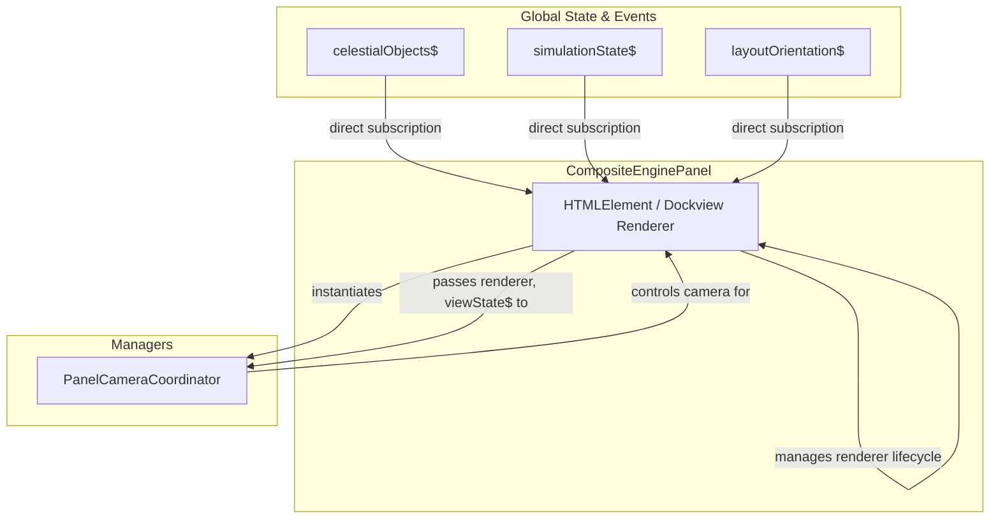

# Panel Managers

This directory contains manager and coordinator classes responsible for handling specific pieces of logic for the `CompositeEnginePanel`. This pattern keeps the main panel component lean and focused on orchestration and DOM management, while delegating complex tasks to these specialized classes. This aligns with the **Orchestrator Panel** pattern described in the parent directory's `README.md`.

## Managers

### `PanelCameraCoordinator`

- **Responsibility**: Orchestrates the setup and state synchronization of all camera-related components.
- **Mechanism**:
  - Creates and initializes the renderer-level `CameraManager` (which handles the Three.js camera's position, target, and controls) with initial state from core-state.
  - **Subscribes to core-state camera changes** and automatically syncs FOV changes to the renderer. Core-state is the single source of truth for camera FOV.
  - Ensures that the panel's internal view state is kept in sync with the camera's state (e.g., position, FOV, focused object) and vice-versa.
- **State Synchronization Pattern**:
  - UI components should **only update core-state** (via `StateAccessor.getCameraManager(panelId)`).
  - The coordinator automatically syncs core-state FOV changes to the renderer CameraManager.
  - This eliminates the need for UI to update both core-state and renderer directly, preventing synchronization issues.

## Flow Diagram

This diagram shows how the `CompositeEnginePanel` instantiates the managers and how they subscribe to different event sources to do their work.

```mermaid
graph TD
    subgraph CompositeEnginePanel
        direction LR
        A[HTMLElement / Dockview Renderer]
    end

    subgraph Managers
        direction TB
        C[PanelCameraCoordinator]
    end

    subgraph "Global State & Events"
        direction RL
        E[celestialObjects$]
        F[simulationState$]
        H[layoutOrientation$]
    end

    A -- "instantiates" --> C;

    E -- "direct subscription" --> A;
    F -- "direct subscription" --> A;
    H -- "direct subscription" --> A;
    A -- "manages renderer lifecycle" --> A;

    A -- "passes renderer, viewState$ to" --> C;
    C -- "controls camera for" --> A;
```
