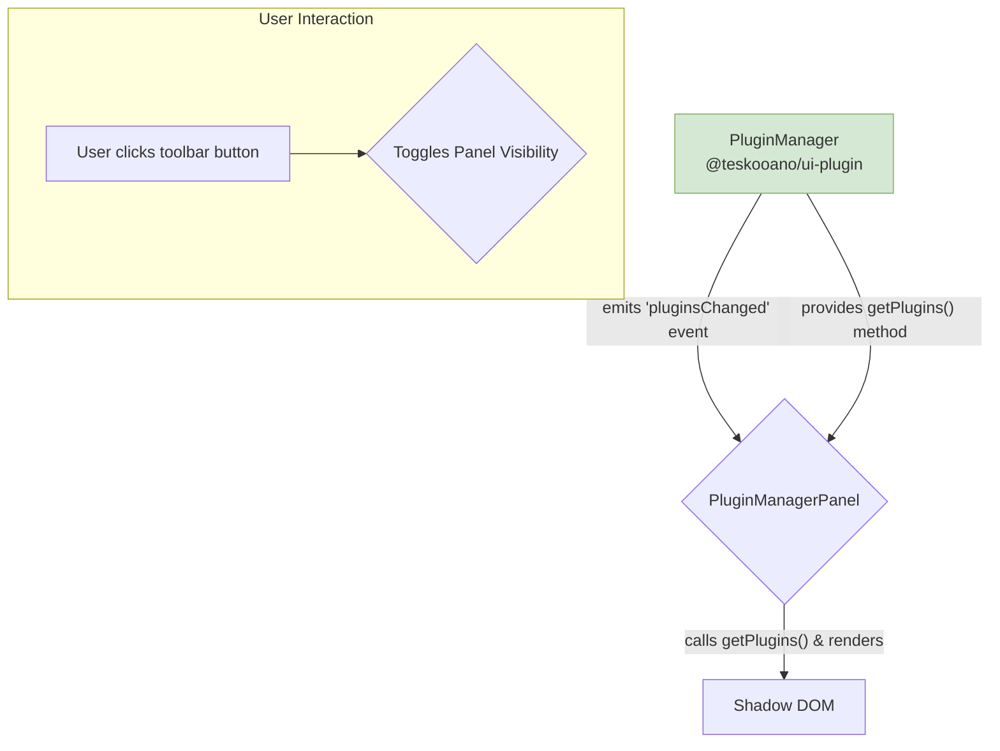

# Plugin Manager Plugin

This plugin provides a `PluginManagerPanel`, a UI component for developers and administrators to view all plugins currently registered and running within the Teskooano application.

## Architecture & Purpose

The `plugin-manager` is a simple UI plugin whose primary purpose is to provide a "read-only" view of the state of the central `pluginManager` from the `@teskooano/ui-plugin` package.

### Architectural Pattern: Simple View Component

This plugin follows a very straightforward **Simple View Component** pattern. It does not have a dedicated controller or complex internal logic.

- **`PluginManagerPanel.ts` (The View)**: This custom element (`<teskooano-plugin-manager-panel>`) is the core of the plugin.

  - It directly imports and interacts with the singleton `pluginManager`.
  - On connection to the DOM (`connectedCallback`), it subscribes to an event stream from the `pluginManager` to listen for any changes (e.g., plugins being loaded, unloaded, or reloaded via HMR).
  - When it receives an update, it calls its internal `renderPluginList()` method to re-fetch the complete list of plugins and re-render the view.
  - In `disconnectedCallback`, it cleans up its subscription to prevent memory leaks.

- **`index.ts` (Plugin Definition)**: This file registers the `<teskooano-plugin-manager-panel>` as a dockable panel and creates a `ToolbarRegistration` to make it accessible via a toggle button in the main application toolbar.

### Data Flow

The data flow is unidirectional and simple:

This architecture is intentionally minimal, as the panel's role is purely for introspection and debugging, not for complex state manipulation.
