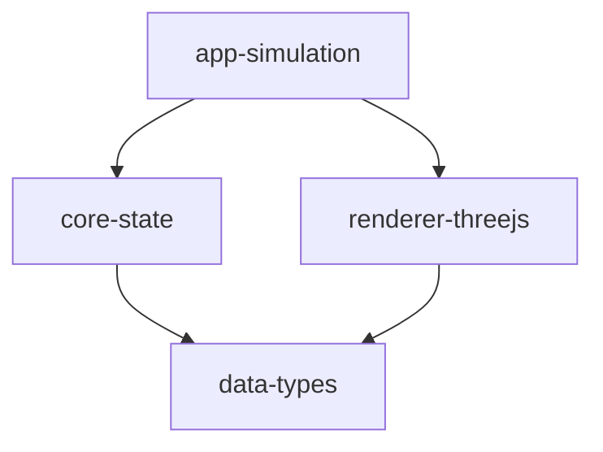

# Open Space Documentation

## Overview

Open Space is a modular space simulation game built with TypeScript and Three.js. The project is organized into several packages that handle different aspects of the game's functionality.

## Package Structure

### Core Packages

- [@teskooano/data-types](./packages/data-types.md) - Core type definitions and interfaces
- [@teskooano/core-state](./packages/core-state.md) - State management using nanostores
- [@teskooano/renderer-threejs](./packages/renderer-threejs.md) - Three.js-based rendering system

### Application Packages

- [@teskooano/app-simulation](./packages/app-simulation.md) - Main simulation orchestrator

## Development

### Prerequisites

- Node.js 22.13.0 or higher
- npm 11.0.0 or higher

### Setup

1. Clone the repository
2. Install dependencies:
   ```bash
   npm install
   ```

### Running Tests

```bash
npm test
```

### Building

```bash
npm run build
```

## Architecture



## Contributing

1. Create a feature branch
2. Write tests for new functionality
3. Implement the feature
4. Submit a pull request

## License

MIT
