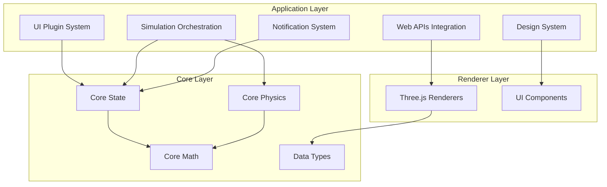
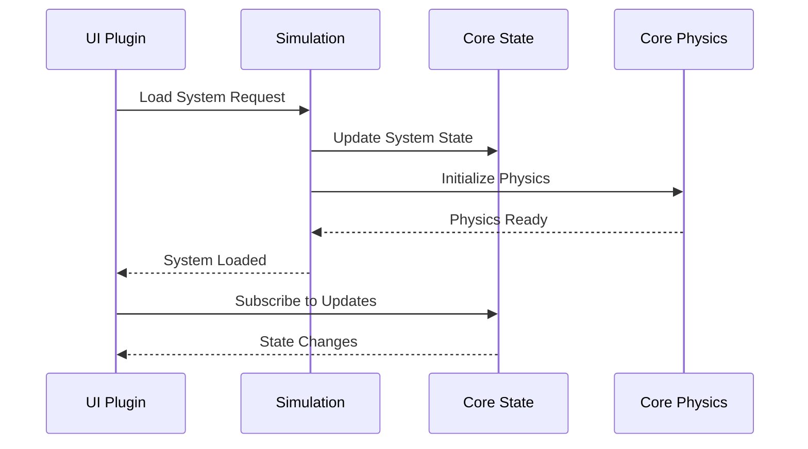
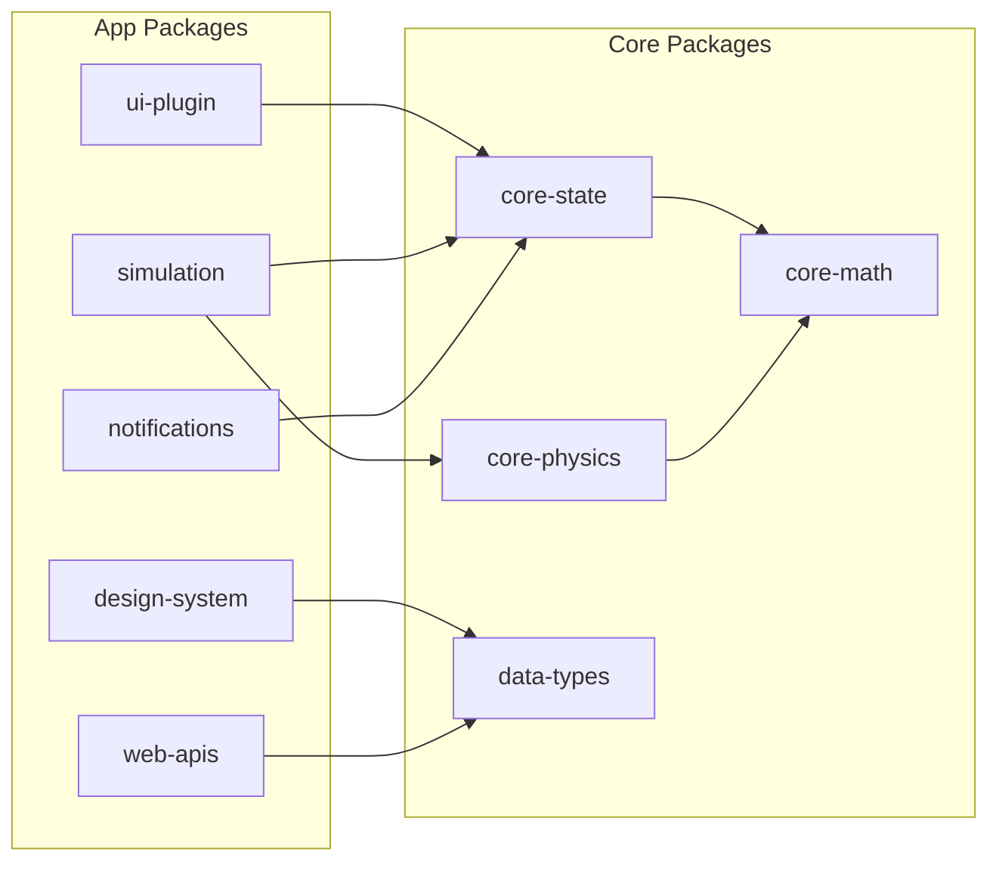

# AGENTS.md

A comprehensive guide for AI coding agents working on the Teskooano Application Layer packages.

## Package Overview

The **`/packages/app/`** directory contains the application-layer packages that provide high-level functionality and infrastructure for the Teskooano engine. These packages bridge the gap between the core engine components and the user interface, providing essential services for plugin management, simulation orchestration, notifications, styling, and browser API integration.

### Purpose

- **Application Infrastructure**: High-level services and infrastructure for Teskooano applications
- **Plugin System**: Comprehensive plugin architecture with dynamic loading and HMR support
- **Simulation Orchestration**: Central management of physics simulation and celestial systems
- **User Experience**: Notification system, design system, and browser API integration
- **Development Experience**: Modern tooling, reactive patterns, and comprehensive TypeScript support

## Package Architecture

### Directory Structure

```
packages/app/
├── design-system/              # Shared CSS styles and design tokens
│   ├── AGENTS.md              # Design system agent guide
│   ├── src/
│   │   ├── tokens.css         # Design tokens and CSS custom properties
│   │   ├── base/              # Foundational styles (reset, typography, forms)
│   │   ├── components/        # Component-specific styles (buttons, misc)
│   │   ├── layout/            # Layout and responsive styles
│   │   └── themes/            # Third-party library theme overrides
│   └── package.json
├── notifications/              # Centralized notification system
│   ├── AGENTS.md              # Notifications agent guide
│   ├── src/
│   │   ├── NotificationManager.ts  # Core notification management singleton
│   │   └── types.ts           # Notification type definitions
│   └── package.json
├── simulation/                 # Core simulation orchestration
│   ├── AGENTS.md              # Simulation agent guide
│   ├── src/
│   │   ├── SimulationOrchestrator.ts  # Central simulation management
│   │   ├── HierarchyManager.ts       # Dynamic hierarchy management
│   │   ├── LagrangeProcessor.ts      # Lagrange point processing
│   │   └── systems/           # System initializers (solar, red-dwarf, etc.)
│   └── package.json
├── ui-plugin/                  # Plugin system infrastructure
│   ├── AGENTS.md              # UI plugin agent guide
│   ├── src/
│   │   ├── pluginManager.ts   # Main PluginManager singleton
│   │   ├── vite-plugin.ts     # Vite integration for build-time loading
│   │   ├── factories/         # Plugin factory functions
│   │   ├── managers/          # Specialized managers (loader, registration, executor, HMR)
│   │   └── patterns/          # Reactive patterns (state, event-bus, events)
│   └── package.json
├── web-apis/                   # Browser Web API wrappers
│   ├── AGENTS.md              # Web APIs agent guide
│   ├── src/
│   │   ├── animation/         # Animation API wrappers
│   │   ├── battery/           # Battery Status API
│   │   ├── clipboard/         # Clipboard API
│   │   ├── device-orientation/ # Device Orientation API
│   │   ├── fullscreen/        # Fullscreen API
│   │   ├── gamepad/           # Gamepad API
│   │   ├── observers/         # Observer APIs (Resize, Intersection, etc.)
│   │   ├── storage/           # Storage APIs (localStorage, sessionStorage)
│   │   └── [other APIs]/      # Additional Web API wrappers
│   └── package.json
└── AGENTS.md                   # This master guide
```

### Core Design Principles

#### 1. Layered Architecture

The application layer sits between core engine components and user interface:

```typescript
// Application layer bridges core and UI
Core Engine (physics, math, state)
    ↓
Application Layer (simulation, plugins, notifications, styling)
    ↓
User Interface (components, panels, interactions)
```

#### 2. Reactive Patterns

All packages use RxJS for reactive state management and event handling:

```typescript
// Consistent reactive patterns across all app packages
export const state$ = new BehaviorSubject<State>(initialState);
export const events$ = new Subject<Event>();
export const notifications$ = new Observable<Notification>();
```

#### 3. Singleton Management

Critical services are implemented as singletons with proper lifecycle management:

```typescript
// Singleton pattern for core services
class ServiceManager {
  private static instance: ServiceManager;

  public static getInstance(): ServiceManager {
    if (!ServiceManager.instance) {
      ServiceManager.instance = new ServiceManager();
    }
    return ServiceManager.instance;
  }
}
```

#### 4. Plugin Architecture

Extensible plugin system with dynamic loading and HMR support:

```typescript
// Plugin registration and execution
export interface TeskooanoPlugin {
  id: string;
  name: string;
  version: string;
  functions: Record<string, PluginFunction>;
  components?: ComponentConfig[];
}
```

## Key Components

### 1. UI Plugin System (`@teskooano/ui-plugin`)

Comprehensive plugin infrastructure with dynamic loading and reactive patterns:

```typescript
// Core PluginManager singleton
export class PluginManager {
  private static instance: PluginManager;

  // Reactive state
  public readonly pluginsChanged$ = new BehaviorSubject<PluginRegistry>(
    new Map(),
  );
  public readonly functionsChanged$ = new BehaviorSubject<FunctionRegistry>(
    new Map(),
  );

  // Core API
  public registerPlugin(plugin: TeskooanoPlugin): void;
  public execute<T = any>(
    functionId: string,
    args?: any,
  ): Promise<T> | T | undefined;
  public getPlugin(pluginId: string): TeskooanoPlugin | undefined;
}
```

**Features:**

- **Dynamic Loading**: Build-time integration with Vite for efficient plugin loading
- **Reactive State**: RxJS-based state management for plugin registry and functions
- **Event System**: Centralized event bus for plugin communication
- **HMR Support**: Hot Module Replacement for development workflow
- **Type Safety**: Full TypeScript support with comprehensive type definitions

### 2. Simulation Orchestration (`@teskooano/app-simulation`)

Central management of physics simulation and celestial systems:

```typescript
// SimulationOrchestrator singleton
export class SimulationOrchestrator {
  private static instance: SimulationOrchestrator;

  // Core managers
  private hierarchyManager: HierarchyManager;
  private lagrangeProcessor: LagrangeProcessor;

  // Reactive state
  public readonly simulationState$ = new BehaviorSubject<SimulationState>(
    initialState,
  );
  public readonly onOrbitUpdate$ = new Subject<OrbitUpdateEvent>();
  public readonly onDestructionOccurred$ = new Subject<DestructionEvent>();

  // Core API
  public startLoop(): Promise<void>;
  public stopLoop(): void;
  public setTimeScale(scale: number): void;
  public resetSystem(skipStateClear?: boolean): void;
}
```

**Features:**

- **Physics Integration**: Bridges `@teskooano/core-physics` with state management
- **Dynamic Hierarchy**: Real-time parent-child relationship management
- **Lagrange Points**: Advanced celestial mechanics calculations
- **System Initialization**: Predefined celestial system loaders
- **Event Broadcasting**: Observable streams for simulation events

### 3. Notification System (`@teskooano/notifications`)

Centralized notification management with reactive patterns:

```typescript
// NotificationManager singleton
export class NotificationManager {
  private static instance: NotificationManager;

  // Reactive state
  public readonly notifications$ = new BehaviorSubject<Notification[]>([]);

  // Core API
  public addNotification(options: NotificationOptions): Notification;
  public updateNotification(
    notificationId: string,
    updates: Partial<NotificationOptions>,
  ): void;
  public removeNotification(notificationId: string): void;
  public markAsRead(notificationId: string): void;
  public markAllAsRead(): void;
  public clearAll(): void;
}
```

**Features:**

- **Auto-Dismissal**: Configurable automatic notification dismissal
- **Severity Levels**: Info, warning, error, and success notification types
- **Metadata Support**: Rich notification data with timestamps and actions
- **Memory Management**: Automatic cleanup of expired notifications
- **Reactive Updates**: Real-time notification state changes

### 4. Design System (`@teskooano/design-system`)

Comprehensive styling system with design tokens and theming:

```typescript
// Design token system
export const designTokens = {
  colors: {
    primary: "var(--color-primary)",
    secondary: "var(--color-secondary)",
    // ... comprehensive color palette
  },
  typography: {
    fontFamily: "var(--font-family-base)",
    fontSize: "var(--font-size-base)",
    // ... typography scale
  },
  spacing: {
    xs: "var(--spacing-xs)",
    sm: "var(--spacing-sm)",
    // ... spacing scale
  },
};
```

**Features:**

- **Design Tokens**: CSS custom properties for consistent theming
- **Modular Architecture**: Organized by base, components, layout, and themes
- **Responsive Design**: Mobile-first responsive breakpoints
- **Third-Party Integration**: Theme overrides for libraries like Dockview
- **Component Styles**: Pre-built styles for common UI components

### 5. Web APIs Integration (`@teskooano/web-apis`)

Comprehensive browser Web API wrappers with reactive patterns:

```typescript
// Observer APIs with dual interface
export function observeResize(
  element: Element,
  callback: SimpleResizeObserverCallback,
  options?: ResizeObserverOptions,
): () => void;

export function observeResize$(
  element: Element,
  options?: ResizeObserverOptions,
): Observable<ResizeObserverEntry[]>;

// Storage APIs with automatic JSON handling
export const safeLocalStorage = new LocalStorageWrapper();
export const safeSessionStorage = new SessionStorageWrapper();

// Device APIs with permission handling
export async function requestDeviceOrientationPermission(): Promise<boolean>;
export const deviceOrientation$ = createOrientationObservable().pipe(
  shareReplay({ bufferSize: 1, refCount: true }),
);
```

**Features:**

- **Consistent Interfaces**: Helper functions, observables, and reactive stores
- **Browser Compatibility**: Graceful fallbacks for unsupported APIs
- **Permission Management**: Proper handling of iOS 13+ permission requirements
- **Error Handling**: Comprehensive error handling with meaningful messages
- **Performance Optimization**: Efficient resource management and cleanup

## Integration Patterns

### 1. Plugin-Simulation Integration

Plugins can interact with the simulation system through the orchestrator:

```typescript
// Plugin accessing simulation state
import { simulationOrchestrator } from "@teskooano/app-simulation";

export const plugin = {
  id: "celestial-info",
  functions: {
    "celestial-info:getCurrentSystem": async (context) => {
      await simulationOrchestrator.startLoop();
      // Access state via core-state if needed
      // const state = StateAccessor.getSimulationState();
      return state.currentSystem;
    },
  },
};
```

### 2. Notification Integration

All packages can use the centralized notification system:

```typescript
// Using notifications from any package
import { notificationManager } from "@teskooano/notifications";

notificationManager.addNotification({
  id: "system-loaded",
  title: "System Loaded",
  message: "Celestial system has been successfully loaded",
  severity: "success",
  autoDismiss: true,
  duration: 3000,
});
```

### 3. Design System Integration

Consistent styling across all application components:

```typescript
// Using design tokens in components
import "@teskooano/design-system/styles.css";

// CSS custom properties are automatically available
const buttonStyle = {
  backgroundColor: "var(--color-primary)",
  padding: "var(--spacing-sm) var(--spacing-md)",
  borderRadius: "var(--border-radius-base)",
  fontFamily: "var(--font-family-base)",
};
```

### 4. Web APIs Integration

Browser APIs integrated throughout the application:

```typescript
// Using Web APIs in plugins
import { StorageAPI, AnimationAPI } from "@teskooano/web-apis";

// Store plugin settings
StorageAPI.safeLocalStorage.setItem("plugin-settings", { theme: "dark" });

// Use animation frames for smooth updates
const animLoop = AnimationAPI.createAnimationLoop((timestamp) => {
  // Update plugin UI
});
```

## Usage Examples

### 1. Plugin Development

Creating a new plugin with full integration:

```typescript
import { TeskooanoPlugin } from "@teskooano/ui-plugin";
import { NotificationManager } from "@teskooano/notifications";
import { SimulationOrchestrator } from "@teskooano/app-simulation";
import { StorageAPI } from "@teskooano/web-apis";

export const plugin: TeskooanoPlugin = {
  id: "celestial-hierarchy",
  name: "Celestial Hierarchy",
  version: "1.0.0",
  functions: {
    "celestial-hierarchy:loadSystem": async (context) => {
      try {
        const orchestrator = SimulationOrchestrator.getInstance();
        await orchestrator.loadSystem("solar-system");

        const notificationManager = NotificationManager.getInstance();
        notificationManager.addNotification({
          id: "system-loaded",
          title: "System Loaded",
          message: "Solar system has been loaded successfully",
          severity: "success",
        });

        // Store user preference
        StorageAPI.safeLocalStorage.setItem(
          "last-loaded-system",
          "solar-system",
        );

        return { success: true };
      } catch (error) {
        const notificationManager = NotificationManager.getInstance();
        notificationManager.addNotification({
          id: "system-load-error",
          title: "Load Error",
          message: "Failed to load celestial system",
          severity: "error",
        });
        throw error;
      }
    },
  },
  components: [
    {
      name: "celestial-hierarchy-panel",
      path: "./src/components/CelestialHierarchyPanel.ts",
    },
  ],
};
```

### 2. Simulation Management

Managing simulation state and events:

```typescript
import { SimulationOrchestrator } from "@teskooano/app-simulation";
import { NotificationManager } from "@teskooano/notifications";

// Initialize simulation
const orchestrator = SimulationOrchestrator.getInstance();
const notificationManager = NotificationManager.getInstance();

// Subscribe to simulation events
orchestrator.onOrbitUpdate$.subscribe((event) => {
  console.log("Orbit updated:", event.celestialObjectId);
});

orchestrator.onDestructionOccurred$.subscribe((event) => {
  notificationManager.addNotification({
    id: `destruction-${event.celestialObjectId}`,
    title: "Celestial Object Destroyed",
    message: `${event.celestialObjectName} has been destroyed`,
    severity: "warning",
  });
});

// Start simulation
orchestrator.startSimulation();
orchestrator.setTimeScale(1.0);
```

### 3. Responsive Design Integration

Using the design system for responsive layouts:

```typescript
import "@teskooano/design-system/styles.css";

// CSS classes automatically available
const panelHTML = `
  <div class="composite-panel">
    <header class="panel-header">
      <h2 class="panel-title">Celestial Information</h2>
    </header>
    <div class="panel-content">
      <div class="info-grid">
        <div class="info-item">
          <label class="info-label">Name:</label>
          <span class="info-value">Earth</span>
        </div>
      </div>
    </div>
  </div>
`;

// Responsive behavior handled by CSS
// @media (max-width: 768px) { .composite-panel { ... } }
```

### 4. Browser API Integration

Using Web APIs for enhanced user experience:

```typescript
import {
  DeviceOrientationAPI,
  FullscreenAPI,
  StorageAPI,
  AnimationAPI,
} from "@teskooano/web-apis";

// Device orientation for mobile controls
async function enableMobileControls() {
  const permission =
    await DeviceOrientationAPI.requestDeviceOrientationPermission();
  if (permission) {
    DeviceOrientationAPI.deviceOrientation$.subscribe((orientation) => {
      // Use orientation data for camera controls
      updateCameraFromOrientation(orientation);
    });
  }
}

// Fullscreen mode for immersive experience
async function toggleImmersiveMode() {
  if (FullscreenAPI.isFullscreenActive()) {
    await FullscreenAPI.exitFullscreen();
  } else {
    await FullscreenAPI.requestFullscreen(document.documentElement);
  }
}

// Persistent user preferences
const userPreferences = StorageAPI.safeLocalStorage.getItem<UserPreferences>(
  "user-preferences",
) || {
  theme: "dark",
  timeScale: 1.0,
  showOrbits: true,
};

// Smooth animations
const animLoop = AnimationAPI.createAnimationLoop((timestamp) => {
  updateUI(timestamp);
});
```

## Performance Guidelines

### 1. Plugin Performance

- **Lazy Loading**: Load plugins only when needed
- **Resource Cleanup**: Properly dispose of plugin resources
- **Memory Management**: Monitor plugin memory usage
- **Efficient Updates**: Use reactive patterns for UI updates

```typescript
// Good: Lazy plugin loading
const loadPlugin = async (pluginId: string) => {
  const plugin = await import(`./plugins/${pluginId}`);
  pluginManager.registerPlugin(plugin.default);
};

// Good: Resource cleanup
class PluginComponent {
  private subscriptions: Subscription[] = [];

  ngOnInit() {
    this.subscriptions.push(
      state$.subscribe(updateUI),
      events$.subscribe(handleEvent),
    );
  }

  ngOnDestroy() {
    this.subscriptions.forEach((sub) => sub.unsubscribe());
  }
}
```

### 2. Simulation Performance

- **Adaptive Time Stepping**: Adjust simulation speed based on performance
- **Hierarchy Optimization**: Efficient parent-child relationship management
- **Event Batching**: Batch simulation events to prevent excessive updates
- **Memory Pooling**: Reuse objects to reduce garbage collection

```typescript
// Good: Adaptive time stepping
const updateSimulation = (deltaTime: number) => {
  const performanceFactor = getPerformanceFactor();
  const adjustedDeltaTime = deltaTime * performanceFactor;

  physicsEngine.update(adjustedDeltaTime);
};

// Good: Event batching
const batchEvents = debounce((events: Event[]) => {
  events.forEach((event) => eventBus.emit(event));
}, 16); // ~60fps
```

### 3. Notification Performance

- **Auto-Dismissal**: Automatically remove expired notifications
- **Memory Limits**: Limit number of active notifications
- **Efficient Updates**: Use immutable updates for notification state
- **Debounced Operations**: Debounce rapid notification operations

```typescript
// Good: Memory-limited notifications
const MAX_NOTIFICATIONS = 50;

const addNotification = (notification: Notification) => {
  const current = notifications$.value;
  const updated = [...current, notification];

  if (updated.length > MAX_NOTIFICATIONS) {
    updated.splice(0, updated.length - MAX_NOTIFICATIONS);
  }

  notifications$.next(updated);
};
```

### 4. Design System Performance

- **CSS Custom Properties**: Use CSS variables for efficient theming
- **Minimal Reflows**: Avoid layout-triggering style changes
- **Efficient Selectors**: Use efficient CSS selectors
- **Critical CSS**: Load critical styles first

```css
/* Good: Efficient CSS custom properties */
:root {
  --color-primary: #007acc;
  --spacing-base: 1rem;
}

.button {
  background-color: var(--color-primary);
  padding: var(--spacing-base);
  /* No layout-triggering properties */
}
```

## Testing Strategy

### 1. Unit Testing

Test individual components and services:

```typescript
// Example: NotificationManager tests
import { describe, it, expect, beforeEach } from "vitest";
import { NotificationManager } from "../NotificationManager";

describe("NotificationManager", () => {
  let manager: NotificationManager;

  beforeEach(() => {
    manager = NotificationManager.getInstance();
    manager.clearAllNotifications();
  });

  it("should add notification", () => {
    const notification = manager.addNotification({
      id: "test",
      title: "Test",
      message: "Test message",
      severity: "info",
    });

    expect(notification.id).toBe("test");
    expect(manager.notifications$.value).toHaveLength(1);
  });
});
```

### 2. Integration Testing

Test package interactions:

```typescript
// Example: Plugin-Simulation integration test
import { describe, it, expect } from "vitest";
import { PluginManager } from "@teskooano/ui-plugin";
import { SimulationOrchestrator } from "@teskooano/app-simulation";

describe("Plugin-Simulation Integration", () => {
  it("should load system through plugin", async () => {
    const pluginManager = PluginManager.getInstance();
    const orchestrator = SimulationOrchestrator.getInstance();

    // Register test plugin
    pluginManager.registerPlugin(testPlugin);

    // Execute plugin function
    const result = await pluginManager.executeFunction(
      "test:loadSystem",
      mockContext,
    );

    expect(result.success).toBe(true);
    expect(orchestrator.simulationState$.value.currentSystem).toBe(
      "solar-system",
    );
  });
});
```

### 3. End-to-End Testing

Test complete user workflows:

```typescript
// Example: E2E test with Playwright
import { test, expect } from "@playwright/test";

test("complete simulation workflow", async ({ page }) => {
  await page.goto("/");

  // Load system
  await page.click('[data-testid="load-solar-system"]');
  await expect(page.locator(".notification-success")).toBeVisible();

  // Start simulation
  await page.click('[data-testid="start-simulation"]');
  await expect(page.locator(".simulation-running")).toBeVisible();

  // Adjust time scale
  await page.fill('[data-testid="time-scale"]', "2.0");
  await expect(page.locator(".time-scale-value")).toHaveText("2.0x");
});
```

## Troubleshooting Guide

### 1. Plugin Issues

#### Plugin Not Loading

```typescript
// ❌ Problem: Plugin not loading
pluginManager.registerPlugin(plugin); // No effect

// ✅ Solution: Check plugin structure
const validPlugin: TeskooanoPlugin = {
  id: "unique-id",
  name: "Plugin Name",
  version: "1.0.0",
  functions: {
    "function-id": async (context) => {
      /* implementation */
    },
  },
};
```

#### Plugin Function Execution Failing

```typescript
// ❌ Problem: Function execution error
await pluginManager.executeFunction("invalid-id", context); // Error

// ✅ Solution: Check function registration
const plugin = {
  functions: {
    "valid-function-id": async (context) => {
      // Proper implementation
    },
  },
};
```

### 2. Simulation Issues

#### Simulation Not Starting

```typescript
// ❌ Problem: Simulation not starting
orchestrator.startSimulation(); // No effect

// ✅ Solution: Check dependencies
const orchestrator = SimulationOrchestrator.getInstance();
await orchestrator.setDependencies({
  physicsEngine: mockPhysicsEngine,
  stateManager: mockStateManager,
});
orchestrator.startSimulation();
```

#### Hierarchy Not Updating

```typescript
// ❌ Problem: Hierarchy not updating
hierarchyManager.updateHierarchy(); // No changes

// ✅ Solution: Check state synchronization
hierarchyManager.syncWithPhysicsState(physicsState);
hierarchyManager.updateHierarchy();
```

### 3. Notification Issues

#### Notifications Not Appearing

```typescript
// ❌ Problem: Notifications not showing
notificationManager.addNotification(notification); // Not visible

// ✅ Solution: Check notification structure
const notification = {
  id: "unique-id",
  title: "Title",
  message: "Message",
  severity: "info" as const,
  autoDismiss: true,
  duration: 3000,
};
```

#### Memory Leaks from Notifications

```typescript
// ❌ Problem: Memory leak from notifications
// Notifications accumulating without cleanup

// ✅ Solution: Proper cleanup
const notificationManager = NotificationManager.getInstance();
notificationManager.clearAllNotifications();

// Or use auto-dismissal
notificationManager.addNotification({
  ...notification,
  autoDismiss: true,
  duration: 5000,
});
```

### 4. Design System Issues

#### Styles Not Applying

```css
/* ❌ Problem: Styles not applying */
.custom-button {
  background-color: red; /* Not working */
}

/* ✅ Solution: Use design tokens */
.custom-button {
  background-color: var(--color-primary);
  padding: var(--spacing-sm) var(--spacing-md);
}
```

#### Responsive Issues

```css
/* ❌ Problem: Not responsive */
.panel {
  width: 300px; /* Fixed width */
}

/* ✅ Solution: Use responsive classes */
.panel {
  width: 100%;
  max-width: 300px;
}

@media (max-width: 768px) {
  .panel {
    max-width: 100%;
  }
}
```

## Dependencies and Integration Points

### 1. Internal Dependencies

```json
{
  "dependencies": {
    "@teskooano/core-state": "workspace:*",
    "@teskooano/core-physics": "workspace:*",
    "@teskooano/core-math": "workspace:*",
    "@teskooano/data-types": "workspace:*",
    "rxjs": "7.8.2"
  }
}
```

### 2. External Dependencies

```json
{
  "dependencies": {
    "dockview-core": "^1.9.0",
    "three": "^0.158.0"
  },
  "devDependencies": {
    "typescript": "5.9.2",
    "vitest": "3.2.4",
    "playwright": "^1.40.0"
  }
}
```

### 3. Integration with Core Packages

- **State Management**: Uses `@teskooano/core-state` for reactive state
- **Physics Engine**: Integrates with `@teskooano/core-physics` for simulation
- **Math Library**: Uses `@teskooano/core-math` for calculations
- **Data Types**: Uses `@teskooano/data-types` for type definitions

### 4. Integration with Renderer Packages

- **Three.js Integration**: Works with `@teskooano/renderer-threejs-*` packages
- **UI Components**: Integrates with `@teskooano/ui-plugin` for component management
- **Design System**: Uses `@teskooano/design-system` for consistent styling

## Contributing Guidelines

### 1. Package Development

- **Follow Patterns**: Use established patterns from existing packages
- **Reactive Patterns**: Implement RxJS-based reactive state management
- **Type Safety**: Provide full TypeScript support with proper interfaces
- **Documentation**: Include comprehensive JSDoc comments and usage examples

### 2. Code Style Standards

- **TypeScript**: Use strict TypeScript with explicit types
- **Singleton Pattern**: Use singleton pattern for core services
- **Error Handling**: Implement comprehensive error handling
- **Performance**: Consider performance implications of all changes

### 3. Testing Requirements

- **Unit Tests**: Test individual components and services
- **Integration Tests**: Test package interactions
- **E2E Tests**: Test complete user workflows
- **Coverage**: Maintain high test coverage for critical functionality

## Architecture Documentation

### 1. System Overview



### 2. Data Flow



### 3. Package Dependencies



## Scientific References

### 1. Plugin Architecture

- **Plugin Systems**: Design patterns for extensible software architectures
- **Dynamic Loading**: Runtime module loading and dependency resolution
- **Hot Module Replacement**: Development-time module replacement techniques
- **Event-Driven Architecture**: Event-based communication patterns

### 2. Simulation Systems

- **N-Body Simulation**: Computational methods for gravitational simulations
- **Celestial Mechanics**: Orbital dynamics and Lagrange point calculations
- **Hierarchical Systems**: Parent-child relationship management in simulations
- **Real-Time Systems**: Performance optimization for real-time applications

### 3. Reactive Programming

- **RxJS Patterns**: Observable-based reactive programming
- **State Management**: Centralized state management with reactive updates
- **Event Sourcing**: Event-driven state management patterns
- **Memory Management**: Efficient memory usage in reactive systems

### 4. User Experience

- **Notification Systems**: Design patterns for user notifications
- **Design Systems**: Systematic approach to UI design and development
- **Responsive Design**: Mobile-first responsive design principles
- **Accessibility**: Web accessibility guidelines and best practices

---

**Remember**: The application layer packages are the bridge between the core engine and user interface. They provide essential services for plugin management, simulation orchestration, user feedback, styling, and browser integration. Always consider the reactive patterns, performance implications, and user experience when working with these packages.
