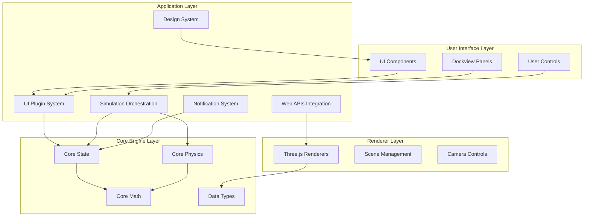
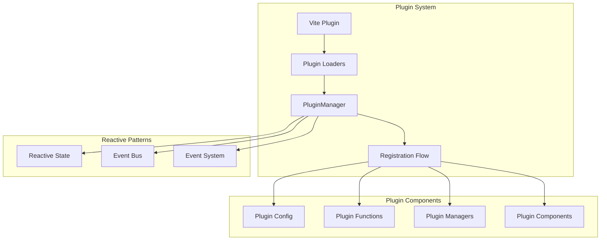
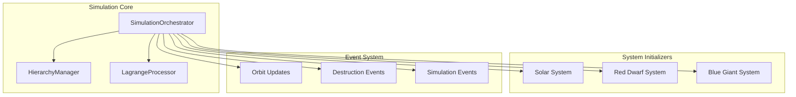
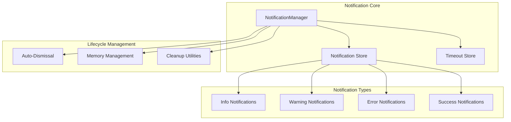
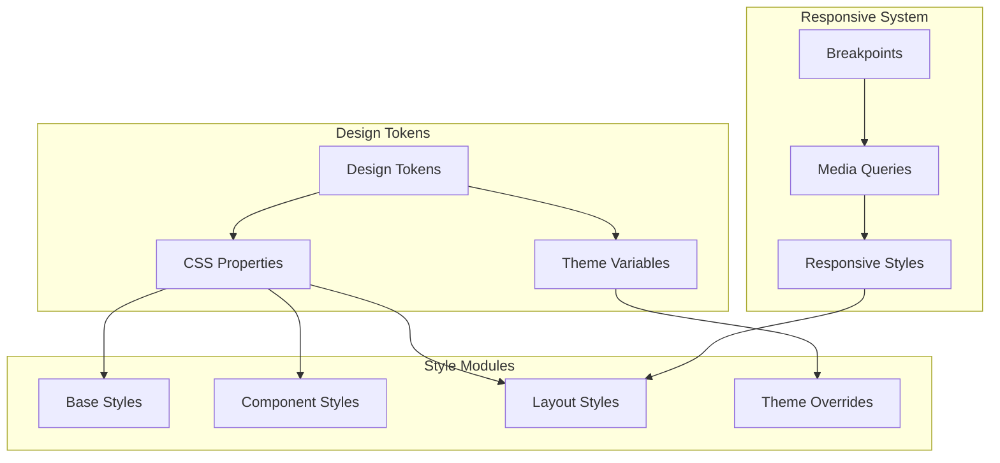
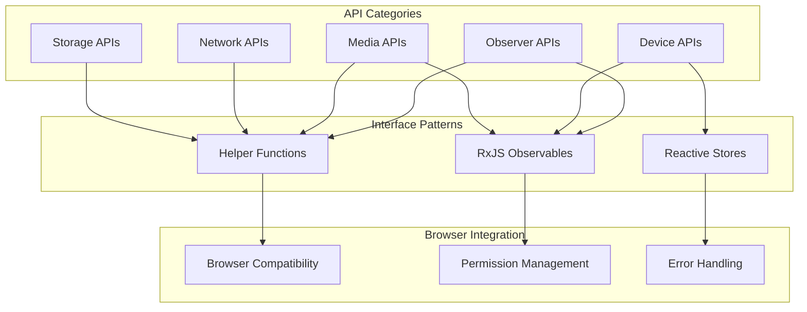
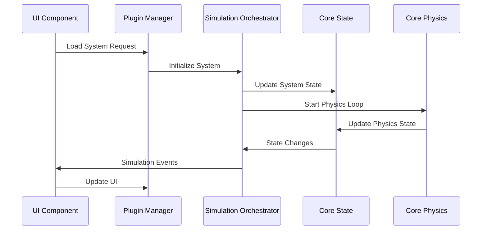
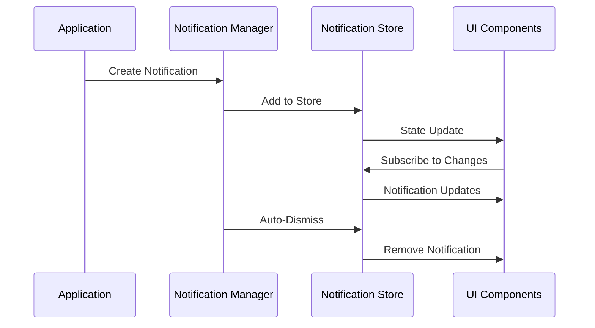
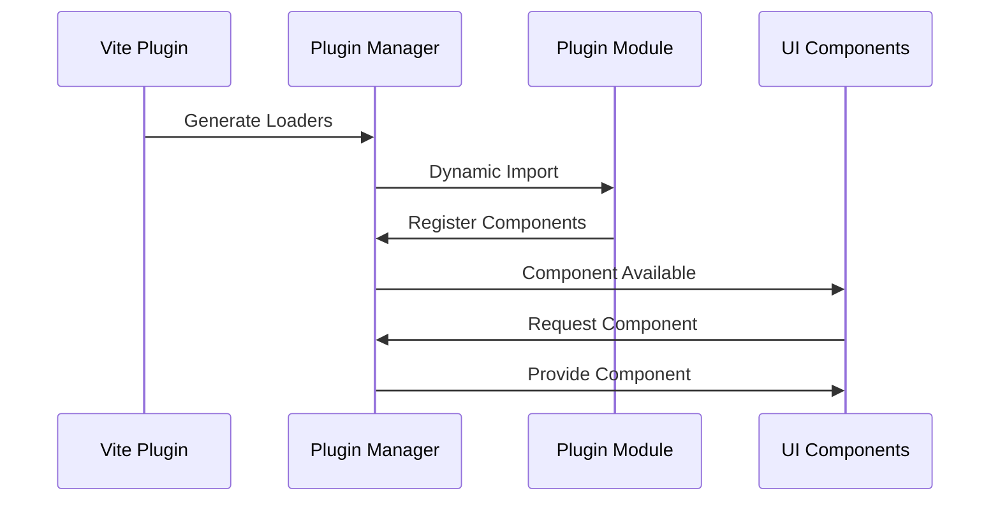

# Architecture: Teskooano Application Layer (`/packages/app/`)

## Overview

The **`/packages/app/`** directory contains the application-layer packages that provide high-level functionality and infrastructure for the Teskooano engine. These packages serve as the bridge between the core engine components and the user interface, implementing essential services for plugin management, simulation orchestration, notifications, styling, and browser API integration.

## System Architecture

### Layered Design

The application layer follows a clear layered architecture that separates concerns and provides clean interfaces:



### Core Design Principles

#### 1. Reactive Architecture

All application layer packages use RxJS for reactive state management and event handling:

```typescript
// Consistent reactive patterns across all app packages
export const state$ = new BehaviorSubject<State>(initialState);
export const events$ = new Subject<Event>();
export const notifications$ = new Observable<Notification>();
```

#### 2. Singleton Management

Critical services are implemented as singletons with proper lifecycle management:

```typescript
// Singleton pattern for core services
class ServiceManager {
  private static instance: ServiceManager;

  public static getInstance(): ServiceManager {
    if (!ServiceManager.instance) {
      ServiceManager.instance = new ServiceManager();
    }
    return ServiceManager.instance;
  }
}
```

#### 3. Dependency Injection

Services receive their dependencies through constructor injection or setter methods:

```typescript
// Dependency injection pattern
class ServiceManager {
  private dependencies: ServiceDependencies | null = null;

  public setDependencies(deps: ServiceDependencies): void {
    this.dependencies = deps;
  }
}
```

#### 4. Event-Driven Communication

Packages communicate through well-defined event streams and observables:

```typescript
// Event-driven communication
export const eventBus = new Subject<SystemEvent>();
export const stateChanges$ = new BehaviorSubject<StateChange>(initialState);
```

## Package Architecture

### 1. UI Plugin System (`@teskooano/ui-plugin`)

**Purpose**: Provides a comprehensive plugin infrastructure for dynamic UI component loading and management.

**Architecture**:



**Key Components**:

- **PluginManager**: Singleton class managing plugin lifecycle
- **Vite Plugin**: Build-time integration for dynamic loading
- **Registration Flow**: Asynchronous plugin loading and registration
- **Reactive Patterns**: State management and event communication

**Data Flow**:

1. Vite plugin generates virtual module with plugin loaders
2. PluginManager loads plugins using dynamic imports
3. Plugins register components, functions, and managers
4. Reactive state updates notify UI components
5. Event bus enables plugin communication

### 2. Simulation Orchestration (`@teskooano/app-simulation`)

**Purpose**: Central management of physics simulation and celestial systems.

**Architecture**:



**Key Components**:

- **SimulationOrchestrator**: Central simulation management singleton
- **HierarchyManager**: Dynamic parent-child relationship management
- **LagrangeProcessor**: Advanced celestial mechanics calculations
- **System Initializers**: Predefined celestial system loaders

**Data Flow**:

1. System initializer loads celestial objects into state
2. SimulationOrchestrator starts physics loop
3. HierarchyManager updates parent-child relationships
4. LagrangeProcessor calculates Lagrange points
5. Events broadcast simulation updates

### 3. Notification System (`@teskooano/notifications`)

**Purpose**: Centralized notification management with reactive patterns.

**Architecture**:



**Key Components**:

- **NotificationManager**: Singleton managing notification lifecycle
- **Notification Store**: Reactive store for active notifications
- **Timeout Store**: Management of auto-dismissal timers
- **Lifecycle Management**: Automatic cleanup and memory management

**Data Flow**:

1. Application creates notification with options
2. NotificationManager adds to reactive store
3. Auto-dismissal timer starts if configured
4. UI components subscribe to notification updates
5. Notifications automatically cleaned up on dismissal

### 4. Design System (`@teskooano/design-system`)

**Purpose**: Comprehensive styling system with design tokens and theming.

**Architecture**:



**Key Components**:

- **Design Tokens**: CSS custom properties for consistent theming
- **Style Modules**: Organized by base, components, layout, and themes
- **Responsive System**: Mobile-first responsive design
- **Theme Integration**: Third-party library theme overrides

**Data Flow**:

1. Design tokens define CSS custom properties
2. Style modules consume tokens for consistent styling
3. Responsive system applies breakpoint-specific styles
4. Theme overrides customize third-party components
5. Main styles.css imports all modules in correct order

### 5. Web APIs Integration (`@teskooano/web-apis`)

**Purpose**: Comprehensive browser Web API wrappers with reactive patterns.

**Architecture**:



**Key Components**:

- **API Categories**: Organized by browser API functionality
- **Interface Patterns**: Consistent helper functions, observables, and stores
- **Browser Integration**: Compatibility, permissions, and error handling

**Data Flow**:

1. API wrapper checks browser support
2. Permission requests handled for restricted APIs
3. Reactive patterns provide consistent interfaces
4. Error handling provides graceful fallbacks
5. Resource cleanup prevents memory leaks

## Integration Patterns

### 1. Cross-Package Communication

**Event-Driven Architecture**:

```typescript
// Centralized event bus for cross-package communication
export const systemEventBus = new Subject<SystemEvent>();

// Packages emit events
systemEventBus.next({
  type: "SIMULATION_STARTED",
  payload: { systemType: "solar-system" },
});

// Packages subscribe to events
systemEventBus.subscribe((event) => {
  switch (event.type) {
    case "SIMULATION_STARTED":
      // Handle simulation start
      break;
  }
});
```

**State Synchronization**:

```typescript
// Shared state observables
export const globalState$ = new BehaviorSubject<GlobalState>(initialState);

// Packages update shared state
globalState$.next({
  ...globalState$.value,
  simulation: { running: true, timeScale: 1.0 },
});

// Packages subscribe to state changes
globalState$.subscribe((state) => {
  // React to state changes
});
```

### 2. Dependency Management

**Service Locator Pattern**:

```typescript
// Central service registry
class ServiceRegistry {
  private services = new Map<string, any>();

  register<T>(name: string, service: T): void {
    this.services.set(name, service);
  }

  get<T>(name: string): T {
    return this.services.get(name);
  }
}

// Services register themselves
const registry = new ServiceRegistry();
registry.register("notificationManager", NotificationManager.getInstance());
registry.register(
  "simulationOrchestrator",
  SimulationOrchestrator.getInstance(),
);
```

**Dependency Injection**:

```typescript
// Services receive dependencies through injection
class PluginManager {
  private dependencies: PluginDependencies | null = null;

  setDependencies(deps: PluginDependencies): void {
    this.dependencies = deps;
  }

  private getDependency<T>(name: keyof PluginDependencies): T {
    if (!this.dependencies) {
      throw new Error("Dependencies not set");
    }
    return this.dependencies[name] as T;
  }
}
```

### 3. Lifecycle Management

**Initialization Sequence**:

```typescript
// Application initialization order
async function initializeApplication() {
  // 1. Initialize core services
  const notificationManager = NotificationManager.getInstance();
  const simulationOrchestrator = SimulationOrchestrator.getInstance();

  // 2. Set up dependencies
  const pluginManager = PluginManager.getInstance();
  pluginManager.setDependencies({
    notificationManager,
    simulationOrchestrator,
    // ... other dependencies
  });

  // 3. Load plugins
  await pluginManager.loadAndRegisterPlugins([
    "celestial-info",
    "simulation-controls",
  ]);

  // 4. Initialize simulation
  await simulationOrchestrator.initialize();

  // 5. Start application
  startApplication();
}
```

**Cleanup Sequence**:

```typescript
// Application cleanup order
async function cleanupApplication() {
  // 1. Stop simulation
  const simulationOrchestrator = SimulationOrchestrator.getInstance();
  simulationOrchestrator.stopSimulation();

  // 2. Clean up plugins
  const pluginManager = PluginManager.getInstance();
  await pluginManager.cleanup();

  // 3. Clear notifications
  const notificationManager = NotificationManager.getInstance();
  notificationManager.clearAllNotifications();

  // 4. Dispose of services
  simulationOrchestrator.dispose();
  notificationManager.dispose();
}
```

## Data Flow Architecture

### 1. Simulation Data Flow



### 2. Notification Data Flow



### 3. Plugin Data Flow



## Performance Considerations

### 1. Memory Management

**Reactive Subscription Management**:

```typescript
// Proper subscription cleanup
class ComponentManager {
  private subscriptions: Subscription[] = [];

  initialize() {
    this.subscriptions.push(
      state$.subscribe(updateUI),
      events$.subscribe(handleEvent),
    );
  }

  dispose() {
    this.subscriptions.forEach((sub) => sub.unsubscribe());
    this.subscriptions = [];
  }
}
```

**Resource Pooling**:

```typescript
// Object pooling for performance
class ObjectPool<T> {
  private pool: T[] = [];
  private createFn: () => T;

  constructor(createFn: () => T) {
    this.createFn = createFn;
  }

  acquire(): T {
    return this.pool.pop() || this.createFn();
  }

  release(obj: T): void {
    this.pool.push(obj);
  }
}
```

### 2. Lazy Loading

**Plugin Lazy Loading**:

```typescript
// Load plugins only when needed
class PluginManager {
  private loadedPlugins = new Set<string>();

  async loadPlugin(pluginId: string): Promise<void> {
    if (this.loadedPlugins.has(pluginId)) {
      return;
    }

    const plugin = await this.pluginLoaders[pluginId]();
    this.registerPlugin(plugin.default);
    this.loadedPlugins.add(pluginId);
  }
}
```

**Component Lazy Loading**:

```typescript
// Lazy load UI components
const LazyComponent = lazy(() => import('./HeavyComponent'));

function App() {
  return (
    <Suspense fallback={<LoadingSpinner />}>
      <LazyComponent />
    </Suspense>
  );
}
```

### 3. Event Optimization

**Event Batching**:

```typescript
// Batch events to prevent excessive updates
const batchedEvents$ = events$.pipe(
  bufferTime(16), // ~60fps
  filter((events) => events.length > 0),
  map((events) => processBatchedEvents(events)),
);
```

**Debounced Operations**:

```typescript
// Debounce expensive operations
const debouncedUpdate = debounce((data: UpdateData) => {
  performExpensiveUpdate(data);
}, 300);
```

## Security Considerations

### 1. Plugin Security

**Sandboxed Execution**:

```typescript
// Execute plugin functions in controlled environment
class PluginExecutor {
  async executeFunction<T>(
    functionId: string,
    context: PluginExecutionContext,
  ): Promise<T> {
    try {
      // Validate function access
      this.validateFunctionAccess(functionId, context);

      // Execute in controlled context
      const result = await this.safeExecute(functionId, context);

      return result;
    } catch (error) {
      this.handleExecutionError(error, functionId);
      throw error;
    }
  }
}
```

**Permission System**:

```typescript
// Plugin permission system
interface PluginPermissions {
  canAccessState: boolean;
  canModifyState: boolean;
  canExecuteFunctions: boolean;
  canCreateNotifications: boolean;
}

class PluginSecurityManager {
  validatePermissions(
    pluginId: string,
    action: string,
    permissions: PluginPermissions,
  ): boolean {
    // Validate plugin permissions
    return this.checkPermission(pluginId, action, permissions);
  }
}
```

### 2. Data Validation

**Input Sanitization**:

```typescript
// Sanitize plugin inputs
class InputSanitizer {
  sanitizePluginInput(input: any): any {
    // Remove potentially dangerous properties
    const sanitized = { ...input };
    delete sanitized.__proto__;
    delete sanitized.constructor;

    return sanitized;
  }
}
```

**Type Validation**:

```typescript
// Validate plugin data types
class TypeValidator {
  validatePluginData(data: any, schema: JSONSchema): boolean {
    try {
      validate(data, schema);
      return true;
    } catch (error) {
      console.error("Plugin data validation failed:", error);
      return false;
    }
  }
}
```

## Testing Architecture

### 1. Unit Testing

**Service Testing**:

```typescript
// Test individual services
describe("NotificationManager", () => {
  let manager: NotificationManager;

  beforeEach(() => {
    manager = NotificationManager.getInstance();
    manager.clearAllNotifications();
  });

  it("should add notification", () => {
    const notification = manager.addNotification({
      id: "test",
      title: "Test",
      message: "Test message",
      severity: "info",
    });

    expect(notification.id).toBe("test");
    expect(manager.notifications$.value).toHaveLength(1);
  });
});
```

### 2. Integration Testing

**Cross-Package Testing**:

```typescript
// Test package interactions
describe("Plugin-Simulation Integration", () => {
  it("should load system through plugin", async () => {
    const pluginManager = PluginManager.getInstance();
    const orchestrator = SimulationOrchestrator.getInstance();

    // Register test plugin
    pluginManager.registerPlugin(testPlugin);

    // Execute plugin function
    const result = await pluginManager.executeFunction(
      "test:loadSystem",
      mockContext,
    );

    expect(result.success).toBe(true);
    expect(orchestrator.simulationState$.value.currentSystem).toBe(
      "solar-system",
    );
  });
});
```

### 3. End-to-End Testing

**Complete Workflow Testing**:

```typescript
// Test complete user workflows
test("complete simulation workflow", async ({ page }) => {
  await page.goto("/");

  // Load system
  await page.click('[data-testid="load-solar-system"]');
  await expect(page.locator(".notification-success")).toBeVisible();

  // Start simulation
  await page.click('[data-testid="start-simulation"]');
  await expect(page.locator(".simulation-running")).toBeVisible();

  // Adjust time scale
  await page.fill('[data-testid="time-scale"]', "2.0");
  await expect(page.locator(".time-scale-value")).toHaveText("2.0x");
});
```

## Deployment Architecture

### 1. Build Process

**Vite Integration**:

```typescript
// vite.config.ts
export default defineConfig({
  plugins: [
    teskooanoUiPlugin({
      pluginRegistryPaths: [path.resolve(__dirname, "src/plugins/registry.ts")],
    }),
  ],
});
```

**Module Federation**:

```typescript
// Module federation for plugin loading
const ModuleFederationPlugin = require("@module-federation/webpack");

module.exports = {
  plugins: [
    new ModuleFederationPlugin({
      name: "teskooano_app",
      remotes: {
        plugins: "plugins@http://localhost:3001/remoteEntry.js",
      },
    }),
  ],
};
```

### 2. Runtime Configuration

**Environment Configuration**:

```typescript
// Runtime configuration
interface AppConfig {
  plugins: {
    enabled: string[];
    disabled: string[];
  };
  simulation: {
    defaultTimeScale: number;
    maxTimeScale: number;
  };
  notifications: {
    maxNotifications: number;
    defaultDuration: number;
  };
}

const config: AppConfig = {
  plugins: {
    enabled: ["celestial-info", "simulation-controls"],
    disabled: ["experimental-features"],
  },
  simulation: {
    defaultTimeScale: 1.0,
    maxTimeScale: 1000.0,
  },
  notifications: {
    maxNotifications: 50,
    defaultDuration: 5000,
  },
};
```

## Future Architecture Considerations

### 1. Micro-Frontend Architecture

**Plugin as Micro-Frontends**:

```typescript
// Each plugin as independent micro-frontend
interface MicroFrontendPlugin {
  name: string;
  entry: string;
  container: string;
  activeRule: string;
  props: Record<string, any>;
}
```

### 2. Service Worker Integration

**Offline Plugin Support**:

```typescript
// Service worker for offline plugin functionality
class PluginServiceWorker {
  async cachePlugin(pluginId: string): Promise<void> {
    const plugin = await this.loadPlugin(pluginId);
    await this.cachePluginAssets(plugin);
  }

  async serveCachedPlugin(pluginId: string): Promise<Plugin> {
    return await this.getCachedPlugin(pluginId);
  }
}
```

### 3. WebAssembly Integration

**Performance-Critical Plugins**:

```typescript
// WebAssembly for performance-critical plugin functions
interface WASMPlugin {
  wasmModule: WebAssembly.Module;
  functions: Record<string, WebAssembly.Function>;
}

class WASMPluginExecutor {
  async executeWASMFunction(
    plugin: WASMPlugin,
    functionName: string,
    args: any[],
  ): Promise<any> {
    const wasmFunction = plugin.functions[functionName];
    return wasmFunction(...args);
  }
}
```

---

This architecture document provides a comprehensive overview of the Teskooano Application Layer, detailing the design principles, package architectures, integration patterns, and future considerations that guide the development of this critical layer in the Teskooano ecosystem.
