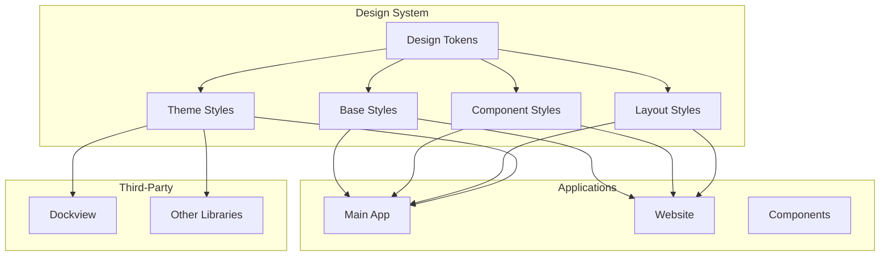
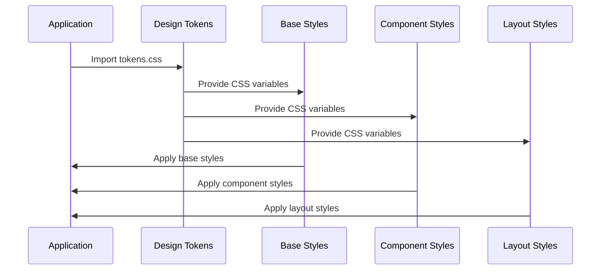

# AGENTS.md

A comprehensive guide for AI coding agents working on the Teskooano Design System package.

## Package Overview

The **`@teskooano/design-system`** package provides shared CSS styles and design tokens for the Teskooano ecosystem. It serves as the single source of truth for styling across all Teskooano applications, ensuring consistency, reusability, and maintainability through a modular architecture.

### Purpose

- **Consistency**: Single source of truth for styling across Teskooano applications
- **Reusability**: Common styles and variables (CSS Custom Properties) to avoid duplication
- **Maintainability**: Centralized style updates and changes in a modular structure
- **Design Tokens**: Comprehensive design system with colors, typography, spacing, and layout
- **Theme Support**: Complete theming system including third-party library overrides

## Package Architecture

### Directory Structure

```
packages/app/design-system/
├── src/
│   ├── index.ts                    # Main package exports
│   ├── styles.css                  # Main entry point importing all modules
│   ├── tokens.css                  # Design tokens and CSS custom properties
│   ├── base/                       # Foundational styles
│   │   ├── base.css               # Reset, box-sizing, and global styles
│   │   ├── forms.css              # Form element styles
│   │   ├── lists.css              # List element styles
│   │   └── typography.css         # Typography styles
│   ├── components/                 # Component-specific styles
│   │   ├── buttons.css            # Button component styles
│   │   └── misc.css               # Miscellaneous component styles
│   ├── layout/                     # Layout and responsive styles
│   │   ├── app.css                # Application shell styles
│   │   ├── composite-panel.css    # Complex layout styles
│   │   └── responsive.css         # Responsive media queries
│   └── themes/                     # Third-party theme overrides
│       └── dockview.css           # Dockview library theme
├── package.json
├── moon.yml
├── tsconfig.json
├── README.md
├── ARCHITECTURE.md
├── CHANGELOG.md
└── TODO.md
```

### Core Components

#### 1. Design Tokens System

Comprehensive CSS custom properties for consistent design:

```css
:root {
  /* Colors */
  --color-background: #12121e;
  --color-surface-1: #1a1a2e;
  --color-surface-2: #2a2a3e;
  --color-surface-3: #3a3a4e;
  --color-text-primary: #e0e0fc;
  --color-text-secondary: #a0a0cc;
  --color-primary: #6c63ff;
  --color-primary-hover: #5a52e0;

  /* Typography */
  --font-family-base: Inter, system-ui, Avenir, Helvetica, Arial, sans-serif;
  --font-family-mono: "Courier New", Courier, monospace;
  --font-size-base: var(--font-size-2);
  --font-weight-normal: 400;
  --font-weight-medium: 500;
  --font-weight-bold: 700;

  /* Spacing */
  --space-unit: 0.25rem;
  --space-1: var(--space-unit);
  --space-2: calc(var(--space-unit) * 2);
  --space-4: calc(var(--space-unit) * 4);
  --spacing-xs: var(--space-1);
  --spacing-sm: var(--space-2);
  --spacing-md: var(--space-4);

  /* Layout */
  --toolbar-height: 3.125rem;
  --container-padding: var(--spacing-md);
  --max-width: 1200px;
}
```

**Features:**

- **Color System**: Comprehensive color palette with semantic naming
- **Typography Scale**: Fluid typography using `clamp()` for responsive design
- **Spacing System**: Linear scale based on 4px unit for consistent spacing
- **Layout Constants**: Standardized layout dimensions and constraints
- **Theme Variables**: Complete Dockview theme integration

#### 2. Base Styles System

Foundational styles for HTML elements:

```css
/* Reset and Box Sizing */
*,
*::before,
*::after {
  box-sizing: border-box;
  margin: 0;
  padding: 0;
}

/* Typography */
h1,
h2,
h3,
h4,
h5,
h6 {
  font-family: var(--font-family-heading);
  font-weight: var(--font-weight-bold);
  line-height: var(--line-height-heading);
  color: var(--color-text-primary);
}

/* Forms */
input,
textarea,
select {
  display: block;
  width: 100%;
  padding: var(--space-2) var(--space-3);
  background-color: var(--color-surface-1);
  border: var(--border-width-thin) solid var(--color-border-subtle);
  border-radius: var(--radius-md);
  color: var(--color-text-primary);
}
```

**Features:**

- **Modern Reset**: Comprehensive CSS reset with box-sizing
- **Typography Hierarchy**: Consistent heading and text styles
- **Form Styling**: Complete form element styling with focus states
- **List Styling**: Consistent list element appearance
- **Global Styles**: Root and body element styling

#### 3. Component Styles System

Reusable component styles:

```css
/* Button Base */
button {
  display: inline-flex;
  align-items: center;
  justify-content: center;
  gap: var(--spacing-sm);
  padding: var(--space-2) var(--space-4);
  font-family: var(--font-family-base);
  font-weight: var(--font-weight-medium);
  border: var(--border-width-thin) solid transparent;
  border-radius: var(--radius-md);
  transition: all var(--transition-duration-fast) var(--transition-timing-base);
  cursor: pointer;
}

/* Button Variants */
.button-primary {
  background-color: var(--color-primary);
  color: var(--color-text-on-primary);
  border-color: var(--color-primary);
}

.button-outline {
  background-color: transparent;
  color: var(--color-primary);
  border-color: var(--color-primary);
}

.button-ghost {
  background-color: transparent;
  color: var(--color-text-secondary);
  border-color: transparent;
}
```

**Features:**

- **Button System**: Complete button styling with variants and sizes
- **Interactive States**: Hover, focus, active, and disabled states
- **Component Variants**: Multiple styling options for each component
- **Size Variants**: Small, medium, and large size options
- **Accessibility**: Focus-visible and keyboard navigation support

#### 4. Layout System

Application layout and responsive design:

```css
/* Application Shell */
#app {
  width: 100%;
  flex: 1;
  display: flex;
  flex-direction: column;
  overflow: hidden;
}

#toolbar {
  height: var(--toolbar-height);
  background-color: var(--color-surface-2);
  border-bottom: var(--border-width-thin) solid var(--color-border-subtle);
  display: flex;
  align-items: center;
  padding: 0 var(--spacing-md);
  gap: var(--spacing-md);
}

/* Composite Panel Layout */
.composite-engine-panel {
  display: flex;
  width: 100%;
  height: 100%;
}

.composite-engine-panel.layout-internal-landscape {
  flex-direction: row;
}

.composite-engine-panel.layout-internal-portrait {
  flex-direction: column;
}
```

**Features:**

- **Application Shell**: Main application layout structure
- **Toolbar System**: Consistent toolbar styling and behavior
- **Composite Panels**: Complex layout system for engine panels
- **Responsive Design**: Mobile-first responsive breakpoints
- **Flexible Layouts**: Adaptive layouts for different screen sizes

#### 5. Theme System

Third-party library theme overrides:

```css
/* Dockview Theme */
.dockview-theme-abyss {
  --dv-background-color: #0f0f1a;
  --dv-group-view-background-color: #1a1a2e;
  --dv-activegroup-visiblepanel-tab-background-color: #4a4a7f;
  --dv-activegroup-visiblepanel-tab-color: #e0e0ff;
}

.dockview-theme-abyss .dv-tab {
  border-top-left-radius: var(--radius-sm);
  border-top-right-radius: var(--radius-sm);
}

.dockview-floating-group {
  border-radius: var(--radius-md);
  background-color: rgba(0, 0, 0, 1);
}
```

**Features:**

- **Dockview Integration**: Complete theme override for Dockview library
- **Consistent Styling**: Third-party components match design system
- **Custom Properties**: Theme variables for easy customization
- **Visual Consistency**: Unified appearance across all UI components

## Usage Examples

### 1. Basic Import and Usage

```typescript
// Import the complete design system
import "@teskooano/design-system/styles.css";

// Or import only the tokens
import "@teskooano/design-system/tokens.css";
```

### 2. Using Design Tokens

```css
/* Custom component using design tokens */
.my-component {
  background-color: var(--color-surface-2);
  color: var(--color-text-primary);
  padding: var(--spacing-md);
  border-radius: var(--radius-md);
  border: var(--border-width-thin) solid var(--color-border-subtle);
  font-family: var(--font-family-base);
  font-size: var(--font-size-base);
}

.my-component:hover {
  background-color: var(--color-surface-3);
  border-color: var(--color-border-strong);
}
```

### 3. Button Component Usage

```html
<!-- Primary button -->
<button class="button-primary">Primary Action</button>

<!-- Outline button -->
<button class="button-outline">Secondary Action</button>

<!-- Ghost button -->
<button class="button-ghost">Tertiary Action</button>

<!-- Small button -->
<button class="button-primary button-sm">Small Button</button>

<!-- Large button -->
<button class="button-primary button-lg">Large Button</button>
```

### 4. Form Styling

```html
<form>
  <label for="email">Email Address</label>
  <input type="email" id="email" placeholder="Enter your email" />

  <label for="message">Message</label>
  <textarea id="message" placeholder="Enter your message"></textarea>

  <label for="category">Category</label>
  <select id="category">
    <option value="">Select a category</option>
    <option value="general">General</option>
    <option value="support">Support</option>
  </select>

  <button type="submit" class="button-primary">Submit</button>
</form>
```

### 5. Layout Usage

```html
<!-- Application shell -->
<div id="app">
  <div id="toolbar">
    
    <button class="button-ghost">Menu</button>
    <button class="button-ghost">Settings</button>
  </div>

  <div class="composite-engine-panel layout-internal-landscape">
    <div class="engine-container">
      <!-- Engine content -->
    </div>
    <div class="ui-container">
      <div class="left-ui-container">
        <!-- Left UI content -->
      </div>
      <div class="right-ui-container">
        <!-- Right UI content -->
      </div>
    </div>
  </div>
</div>
```

### 6. Custom Component Development

```css
/* Custom component following design system patterns */
.custom-panel {
  /* Use design tokens for consistency */
  background-color: var(--color-surface-1);
  border: var(--border-width-thin) solid var(--color-border-subtle);
  border-radius: var(--radius-md);
  padding: var(--spacing-md);
  margin-bottom: var(--spacing-md);

  /* Typography */
  font-family: var(--font-family-base);
  color: var(--color-text-primary);
}

.custom-panel__header {
  font-size: var(--font-size-3);
  font-weight: var(--font-weight-bold);
  margin-bottom: var(--spacing-sm);
  color: var(--color-text-primary);
}

.custom-panel__content {
  font-size: var(--font-size-base);
  line-height: var(--line-height-base);
  color: var(--color-text-secondary);
}

.custom-panel__actions {
  display: flex;
  gap: var(--spacing-sm);
  margin-top: var(--spacing-md);
}
```

## Development Workflow

### 1. Setup and Configuration

```bash
# Install dependencies
npm install @teskooano/design-system

# Build package (no build step needed for CSS-only)
moon run design-system:build

# Run linting (when configured)
moon run design-system:lint
```

### 2. Adding New Design Tokens

```css
/* Add new tokens to src/tokens.css */
:root {
  /* New color tokens */
  --color-accent: #17ead9;
  --color-accent-hover: #12b8ab;
  --color-accent-active: #0d8a7f;

  /* New spacing tokens */
  --space-12: calc(var(--space-unit) * 12);
  --space-16: calc(var(--space-unit) * 16);

  /* New component tokens */
  --card-padding: var(--spacing-lg);
  --card-radius: var(--radius-lg);
}
```

### 3. Creating New Components

```css
/* Create new component file: src/components/cards.css */
.card {
  background-color: var(--color-surface-1);
  border: var(--border-width-thin) solid var(--color-border-subtle);
  border-radius: var(--card-radius);
  padding: var(--card-padding);
  box-shadow: var(--shadow-sm);
}

.card__header {
  font-size: var(--font-size-3);
  font-weight: var(--font-weight-bold);
  margin-bottom: var(--spacing-md);
  color: var(--color-text-primary);
}

.card__body {
  color: var(--color-text-secondary);
  line-height: var(--line-height-base);
}

.card__footer {
  margin-top: var(--spacing-md);
  padding-top: var(--spacing-md);
  border-top: var(--border-width-thin) solid var(--color-border-subtle);
}
```

### 4. Updating Main Stylesheet

```css
/* Update src/styles.css to include new components */
@import "./tokens.css";

/* Base Styles */
@import "./base/base.css";
@import "./base/typography.css";
@import "./base/lists.css";
@import "./base/forms.css";

/* Component Styles */
@import "./components/buttons.css";
@import "./components/misc.css";
@import "./components/cards.css"; /* New component */

/* Layout Styles */
@import "./layout/app.css";
@import "./layout/composite-panel.css";
@import "./layout/responsive.css";

/* Theme Styles */
@import "./themes/dockview.css";
```

## Performance Considerations

### 1. CSS Optimization

- **Modular Architecture**: Import only needed styles to reduce bundle size
- **CSS Custom Properties**: Efficient variable system with minimal overhead
- **Selective Imports**: Import tokens only when full styles not needed
- **Minification**: CSS minification in production builds

### 2. Design Token Efficiency

- **Calculated Values**: Use `calc()` for derived values to reduce redundancy
- **Semantic Naming**: Clear naming reduces need for custom overrides
- **Consistent Scale**: Linear spacing scale reduces cognitive load
- **Theme Variables**: Centralized theming reduces style duplication

### 3. Responsive Design

- **Mobile-First**: Efficient responsive design with progressive enhancement
- **Fluid Typography**: `clamp()` for responsive typography without media queries
- **Flexible Layouts**: CSS Grid and Flexbox for efficient layouts
- **Touch Optimization**: Touch-friendly sizing and spacing

## Testing Strategy

### 1. Visual Regression Testing

```typescript
// Example Playwright visual regression test
import { test, expect } from "@playwright/test";

test("design system components render correctly", async ({ page }) => {
  await page.goto("/design-system-test-page");

  // Test button variants
  await expect(page.locator(".button-primary")).toHaveScreenshot(
    "button-primary.png",
  );
  await expect(page.locator(".button-outline")).toHaveScreenshot(
    "button-outline.png",
  );
  await expect(page.locator(".button-ghost")).toHaveScreenshot(
    "button-ghost.png",
  );

  // Test form elements
  await expect(page.locator("form")).toHaveScreenshot("form-elements.png");

  // Test layout components
  await expect(page.locator(".composite-engine-panel")).toHaveScreenshot(
    "composite-panel.png",
  );
});
```

### 2. Design Token Validation

```typescript
// Test design token consistency
describe("Design Tokens", () => {
  it("should have consistent spacing scale", () => {
    const spacingValues = [
      "var(--space-1)",
      "var(--space-2)",
      "var(--space-4)",
      "var(--space-8)",
    ];

    // Validate spacing scale is consistent
    expect(spacingValues).toMatchSnapshot();
  });

  it("should have accessible color contrast", () => {
    // Test color contrast ratios
    const colorPairs = [
      {
        foreground: "var(--color-text-primary)",
        background: "var(--color-background)",
      },
      {
        foreground: "var(--color-text-on-primary)",
        background: "var(--color-primary)",
      },
    ];

    colorPairs.forEach((pair) => {
      expect(
        calculateContrast(pair.foreground, pair.background),
      ).toBeGreaterThan(4.5);
    });
  });
});
```

### 3. Cross-Browser Testing

```typescript
// Test cross-browser compatibility
describe("Cross-Browser Compatibility", () => {
  ["chromium", "firefox", "webkit"].forEach((browserName) => {
    test(`should render correctly in ${browserName}`, async ({ page }) => {
      await page.goto("/design-system-test-page");
      await expect(page.locator("body")).toHaveScreenshot(
        `design-system-${browserName}.png`,
      );
    });
  });
});
```

## Troubleshooting Guide

### 1. Common Styling Issues

#### Design Tokens Not Working

```css
/* ❌ Problem: Custom properties not being applied */
.my-component {
  background-color: var(--color-surface-2); /* Not working */
}

/* ✅ Solution: Ensure tokens are imported */
@import "@teskooano/design-system/tokens.css";

.my-component {
  background-color: var(--color-surface-2); /* Now working */
}
```

#### Button Styles Not Applied

```html
<!-- ❌ Problem: Button not styled -->
<button>Click me</button>

<!-- ✅ Solution: Import button styles -->
<link rel="stylesheet" href="@teskooano/design-system/styles.css" />
<button class="button-primary">Click me</button>
```

#### Layout Issues

```css
/* ❌ Problem: Layout not working correctly */
.composite-engine-panel {
  display: flex;
  /* Missing layout class */
}

/* ✅ Solution: Add appropriate layout class */
.composite-engine-panel.layout-internal-landscape {
  flex-direction: row;
}
```

### 2. Responsive Design Issues

#### Mobile Layout Problems

```css
/* ❌ Problem: Mobile layout broken */
@media (max-width: 768px) {
  .composite-engine-panel {
    flex-direction: column; /* Overriding layout class */
  }
}

/* ✅ Solution: Use responsive classes */
.composite-engine-panel.layout-internal-portrait {
  flex-direction: column;
}
```

#### Touch Target Issues

```css
/* ❌ Problem: Touch targets too small */
button {
  padding: 2px 4px; /* Too small for touch */
}

/* ✅ Solution: Use design system spacing */
button {
  padding: var(--space-2) var(--space-4); /* 8px 16px */
}
```

### 3. Theme Integration Issues

#### Dockview Styling Problems

```css
/* ❌ Problem: Dockview not themed */
.dockview-theme-abyss {
  /* Missing theme variables */
}

/* ✅ Solution: Ensure theme variables are defined */
.dockview-theme-abyss {
  --dv-background-color: var(--color-background);
  --dv-group-view-background-color: var(--color-surface-1);
}
```

#### Custom Component Theming

```css
/* ❌ Problem: Custom component doesn't match theme */
.custom-component {
  background-color: #ffffff; /* Hard-coded color */
}

/* ✅ Solution: Use design tokens */
.custom-component {
  background-color: var(--color-surface-1);
  color: var(--color-text-primary);
}
```

## Integration Points

### 1. Application Integration

```typescript
// Main application entry point
import "@teskooano/design-system/styles.css";
import { createApp } from "vue";

const app = createApp(App);
app.mount("#app");
```

### 2. Component Library Integration

```typescript
// Custom component using design system
import { defineComponent } from "vue";

export default defineComponent({
  name: "CustomButton",
  template: `
    <button 
      :class="buttonClass" 
      @click="$emit('click')"
    >
      <slot />
    </button>
  `,
  props: {
    variant: {
      type: String,
      default: "primary",
      validator: (value) => ["primary", "outline", "ghost"].includes(value),
    },
    size: {
      type: String,
      default: "medium",
      validator: (value) => ["small", "medium", "large"].includes(value),
    },
  },
  computed: {
    buttonClass() {
      return ["button", `button-${this.variant}`, `button-${this.size}`];
    },
  },
});
```

### 3. Build System Integration

```typescript
// Vite configuration
import { defineConfig } from "vite";

export default defineConfig({
  css: {
    preprocessorOptions: {
      css: {
        additionalData: `@import "@teskooano/design-system/tokens.css";`,
      },
    },
  },
});
```

## Contributing Guidelines

### 1. Design System Standards

- **Token-First**: Always use design tokens instead of hard-coded values
- **Semantic Naming**: Use semantic names for colors and spacing
- **Consistent Scale**: Maintain consistent spacing and typography scales
- **Accessibility**: Ensure all components meet accessibility standards

### 2. CSS Architecture Standards

- **Modular Structure**: Keep styles organized in logical modules
- **Import Order**: Maintain consistent import order in main stylesheet
- **Naming Conventions**: Use BEM or similar naming conventions
- **Documentation**: Document all new tokens and components

### 3. Component Development Standards

- **Reusability**: Design components for reuse across applications
- **Variants**: Provide multiple variants for common use cases
- **States**: Include all interactive states (hover, focus, active, disabled)
- **Responsive**: Ensure components work across all screen sizes

## Architecture Documentation

### 1. System Overview



### 2. Token Flow



## Scientific References

### 1. Design System Theory

- **Design Tokens**: Systematic approach to design decisions
- **Atomic Design**: Component-based design methodology
- **Design Systems**: Comprehensive design system principles
- **Accessibility**: WCAG guidelines and inclusive design

### 2. CSS Architecture

- **CSS Custom Properties**: Modern CSS variable system
- **CSS Modules**: Modular CSS architecture
- **BEM Methodology**: Block Element Modifier naming convention
- **Responsive Design**: Mobile-first responsive design principles

### 3. Performance Optimization

- **CSS Optimization**: Efficient CSS delivery and rendering
- **Critical CSS**: Above-the-fold CSS optimization
- **CSS-in-JS**: Modern CSS-in-JavaScript approaches
- **Bundle Optimization**: CSS bundling and minification strategies

---

**Remember**: The Design System package is the foundation for all Teskooano UI consistency. Always use design tokens, maintain semantic naming, and ensure accessibility. The modular architecture provides flexibility while maintaining consistency across all applications.
