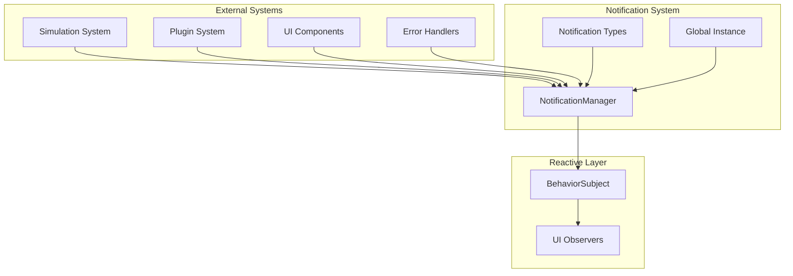
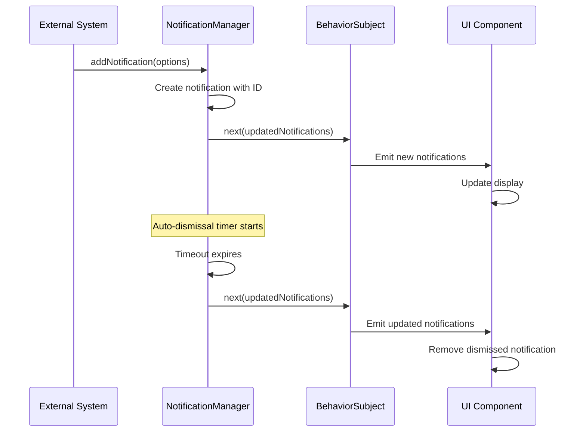

# AGENTS.md

A comprehensive guide for AI coding agents working on the Teskooano Notifications package.

## Package Overview

The **`@teskooano/notifications`** package provides a centralized notification system for the Teskooano engine. It manages the lifecycle of in-engine notifications, providing a reactive API for creating, managing, and observing notifications across the entire application.

### Purpose

- **Centralized Notification Management**: Single source of truth for all application notifications
- **Reactive State Management**: RxJS-based reactive notifications with real-time updates
- **Auto-Dismissal**: Configurable automatic notification dismissal with timeout management
- **Notification Lifecycle**: Complete lifecycle management from creation to disposal
- **Type Safety**: Full TypeScript support with comprehensive type definitions

## Package Architecture

### Directory Structure

```
packages/app/notifications/
├── src/
│   ├── index.ts                    # Main package exports
│   ├── NotificationManager.ts      # Core notification management singleton
│   └── types.ts                    # Type definitions and interfaces
├── package.json
├── moon.yml
├── tsconfig.json
├── ARCHITECTURE.md
└── README.md
```

### Core Components

#### 1. NotificationManager (Singleton)

The central manager for all notification operations:

```typescript
export class NotificationManager {
  /** The reactive stream of all active notifications. */
  public readonly notifications$ = new BehaviorSubject<Notification[]>([]);

  /** A map to keep track of timeouts for auto-dismissing notifications. */
  private timeouts = new Map<string, ReturnType<typeof setTimeout>>();

  // Core API methods
  public addNotification(options: NotificationOptions): Notification;
  public updateNotification(
    notificationId: string,
    updates: Partial<NotificationOptions>,
  ): void;
  public removeNotification(notificationId: string): void;
  public markAsRead(notificationId: string): void;
  public markAllAsRead(): void;
  public clearAll(): void;
  public dispose(): void;
}
```

**Key Responsibilities:**

- **Notification Lifecycle**: Manages creation, updates, and removal of notifications
- **Reactive State**: Provides RxJS BehaviorSubject for real-time notification updates
- **Auto-Dismissal**: Handles automatic notification dismissal with timeout management
- **Memory Management**: Proper cleanup of timeouts and resources
- **State Persistence**: Maintains notification state across the application

#### 2. Notification Type System

Comprehensive type definitions for notification data:

```typescript
export type NotificationLevel = "info" | "success" | "warning" | "error";

export interface Notification {
  /** A unique identifier for the notification. */
  id: string;
  /** The main title or heading of the notification. */
  title: string;
  /** The detailed message content. */
  message: string;
  /** The severity level of the notification. */
  level: NotificationLevel;
  /** The Unix timestamp (in milliseconds) when the notification was created. */
  timestamp: number;
  /** Optional duration in milliseconds before the notification auto-dismisses. */
  duration?: number;
  /** A flag indicating if the user has dismissed or acknowledged the notification. */
  isRead: boolean;
  /** The source module or system that generated the notification. */
  source: string;
}
```

**Features:**

- **Type Safety**: Comprehensive TypeScript interfaces for all notification data
- **Severity Levels**: Four distinct notification levels (info, success, warning, error)
- **Metadata Support**: Timestamps, source tracking, and read status
- **Auto-Dismissal**: Configurable duration for automatic notification removal
- **Unique Identification**: UUID-based notification identification

#### 3. Singleton Instance

Global notification manager instance:

```typescript
/**
 * A singleton instance of the NotificationManager.
 * Use this instance throughout the application to interact with the notification system.
 */
export const notificationManager = new NotificationManager();
```

**Features:**

- **Global Access**: Single instance accessible throughout the application
- **Consistent State**: Shared notification state across all components
- **Easy Integration**: Simple import and use pattern

## Usage Examples

### 1. Basic Notification Creation

```typescript
import { notificationManager } from "@teskooano/notifications";

// Create a simple info notification
const notification = notificationManager.addNotification({
  title: "System Ready",
  message: "The simulation engine has been initialized successfully.",
  level: "info",
  source: "simulation-engine",
});

// Create a warning with auto-dismissal
const warning = notificationManager.addNotification({
  title: "Performance Warning",
  message: "High CPU usage detected. Consider reducing simulation complexity.",
  level: "warning",
  source: "performance-monitor",
  duration: 5000, // Auto-dismiss after 5 seconds
});

// Create an error notification
const error = notificationManager.addNotification({
  title: "Simulation Error",
  message:
    "Failed to load celestial system data. Please check your configuration.",
  level: "error",
  source: "system-loader",
});
```

### 2. Reactive Notification Display

```typescript
import { notificationManager } from "@teskooano/notifications";

// Subscribe to notification changes
notificationManager.notifications$.subscribe((notifications) => {
  // Update UI with current notifications
  updateNotificationPanel(notifications);

  // Log notification count
  console.log(`Active notifications: ${notifications.length}`);
});

// Filter notifications by level
notificationManager.notifications$
  .pipe(
    map((notifications) => notifications.filter((n) => n.level === "error")),
  )
  .subscribe((errorNotifications) => {
    // Handle error notifications specifically
    if (errorNotifications.length > 0) {
      showErrorAlert(errorNotifications);
    }
  });
```

### 3. Notification Management

```typescript
import { notificationManager } from "@teskooano/notifications";

// Update an existing notification
notificationManager.updateNotification(notificationId, {
  message: "Updated message content",
  level: "success",
});

// Mark notification as read
notificationManager.markAsRead(notificationId);

// Mark all notifications as read
notificationManager.markAllAsRead();

// Remove a specific notification
notificationManager.removeNotification(notificationId);

// Clear all notifications
notificationManager.clearAll();
```

### 4. Integration with Other Systems

```typescript
// Simulation system integration
import { simulationOrchestrator } from "@teskooano/app-simulation";
import { notificationManager } from "@teskooano/notifications";

// Listen for simulation events
simulationOrchestrator.onOrbitUpdate.subscribe(() => {
  notificationManager.addNotification({
    title: "Simulation Update",
    message: "Physics simulation has been updated.",
    level: "info",
    source: "simulation-orchestrator",
    duration: 2000,
  });
});

// Plugin system integration
import { pluginManager } from "@teskooano/ui-plugin";

pluginManager.pluginsChanged$.subscribe((plugins) => {
  notificationManager.addNotification({
    title: "Plugins Updated",
    message: `${plugins.length} plugins are now active.`,
    level: "success",
    source: "plugin-manager",
  });
});
```

### 5. Error Handling and Recovery

```typescript
import { notificationManager } from "@teskooano/notifications";

// Error handling with notifications
try {
  await riskyOperation();
} catch (error) {
  const errorNotification = notificationManager.addNotification({
    title: "Operation Failed",
    message: `Failed to complete operation: ${error.message}`,
    level: "error",
    source: "operation-handler",
  });

  // Optionally provide recovery action
  setTimeout(() => {
    notificationManager.updateNotification(errorNotification.id, {
      message: "Attempting to recover...",
      level: "warning",
    });
  }, 2000);
}
```

## Development Workflow

### 1. Setup and Configuration

```bash
# Install dependencies
npm install @teskooano/notifications

# Build package
moon run notifications:build

# Run linting
moon run notifications:lint
```

### 2. Adding New Notification Types

```typescript
// Extend notification levels if needed
export type ExtendedNotificationLevel =
  | "info"
  | "success"
  | "warning"
  | "error"
  | "debug"
  | "trace";

// Create notification factory functions
export function createInfoNotification(
  title: string,
  message: string,
  source: string,
) {
  return notificationManager.addNotification({
    title,
    message,
    level: "info",
    source,
  });
}

export function createErrorNotification(
  title: string,
  message: string,
  source: string,
) {
  return notificationManager.addNotification({
    title,
    message,
    level: "error",
    source,
  });
}
```

### 3. Custom Notification Components

```typescript
// Create custom notification display components
export class NotificationPanel extends HTMLElement {
  private subscription?: Subscription;

  connectedCallback() {
    this.subscription = notificationManager.notifications$.subscribe(
      (notifications) => this.renderNotifications(notifications),
    );
  }

  disconnectedCallback() {
    this.subscription?.unsubscribe();
  }

  private renderNotifications(notifications: Notification[]) {
    this.innerHTML = notifications
      .map((notification) => this.createNotificationElement(notification))
      .join("");
  }

  private createNotificationElement(notification: Notification): string {
    return `
      <div class="notification notification--${notification.level}" data-id="${notification.id}">
        <h3>${notification.title}</h3>
        <p>${notification.message}</p>
        <span class="source">${notification.source}</span>
        <button onclick="notificationManager.removeNotification('${notification.id}')">
          Dismiss
        </button>
      </div>
    `;
  }
}
```

## Performance Considerations

### 1. Memory Management

- **Timeout Cleanup**: Automatic cleanup of notification timeouts to prevent memory leaks
- **Subscription Management**: Proper disposal of RxJS subscriptions
- **Notification Limits**: Consider implementing maximum notification limits for performance
- **Batch Updates**: Efficient state updates with minimal re-renders

### 2. Reactive Performance

- **BehaviorSubject**: Efficient state management with current value caching
- **Selective Updates**: Only update UI when notifications actually change
- **Debouncing**: Consider debouncing rapid notification updates
- **Filtering**: Use RxJS operators for efficient notification filtering

### 3. Auto-Dismissal Optimization

- **Timeout Management**: Efficient timeout tracking and cleanup
- **Batch Dismissal**: Group multiple dismissals for better performance
- **Memory Cleanup**: Automatic cleanup of expired notification data

## Testing Strategy

### 1. Unit Testing

```typescript
import { describe, it, expect, beforeEach } from "vitest";
import { NotificationManager } from "@teskooano/notifications";

describe("NotificationManager", () => {
  let manager: NotificationManager;

  beforeEach(() => {
    manager = new NotificationManager();
  });

  it("should add notifications correctly", () => {
    const notification = manager.addNotification({
      title: "Test",
      message: "Test message",
      level: "info",
      source: "test",
    });

    expect(notification.id).toBeDefined();
    expect(notification.title).toBe("Test");
    expect(notification.level).toBe("info");
  });

  it("should emit notifications via BehaviorSubject", (done) => {
    manager.notifications$.subscribe((notifications) => {
      expect(notifications).toHaveLength(1);
      expect(notifications[0].title).toBe("Test");
      done();
    });

    manager.addNotification({
      title: "Test",
      message: "Test message",
      level: "info",
      source: "test",
    });
  });

  it("should auto-dismiss notifications with duration", (done) => {
    manager.addNotification({
      title: "Auto-dismiss",
      message: "This will auto-dismiss",
      level: "info",
      source: "test",
      duration: 100,
    });

    setTimeout(() => {
      const notifications = manager.notifications$.getValue();
      expect(notifications).toHaveLength(0);
      done();
    }, 150);
  });
});
```

### 2. Integration Testing

```typescript
// Test notification integration with other systems
describe("Notification Integration", () => {
  it("should integrate with simulation system", async () => {
    const notifications: Notification[] = [];

    notificationManager.notifications$.subscribe(notifications.push);

    // Simulate simulation event
    simulationOrchestrator.onOrbitUpdate.next({ positions: {} });

    expect(notifications).toHaveLength(1);
    expect(notifications[0].source).toBe("simulation-orchestrator");
  });
});
```

### 3. Performance Testing

```typescript
// Test notification performance with large numbers
describe("Notification Performance", () => {
  it("should handle many notifications efficiently", () => {
    const startTime = performance.now();

    // Add 1000 notifications
    for (let i = 0; i < 1000; i++) {
      manager.addNotification({
        title: `Notification ${i}`,
        message: `Message ${i}`,
        level: "info",
        source: "performance-test",
      });
    }

    const endTime = performance.now();
    expect(endTime - startTime).toBeLessThan(100); // Should complete in < 100ms
  });
});
```

## Troubleshooting Guide

### 1. Common Notification Issues

#### Notifications Not Appearing

```typescript
// ❌ Problem: Notifications not showing in UI
notificationManager.addNotification({...});
// UI not updating

// ✅ Solution: Check subscription
notificationManager.notifications$.subscribe((notifications) => {
  console.log("Notifications updated:", notifications);
  // Ensure UI is properly subscribed and updating
});
```

#### Memory Leaks

```typescript
// ❌ Problem: Memory leaks from timeouts
// Notifications with duration not cleaning up properly

// ✅ Solution: Ensure proper disposal
class MyComponent {
  private subscription?: Subscription;

  connectedCallback() {
    this.subscription = notificationManager.notifications$.subscribe(/* ... */);
  }

  disconnectedCallback() {
    this.subscription?.unsubscribe(); // Always unsubscribe!
  }
}
```

#### Auto-Dismissal Not Working

```typescript
// ❌ Problem: Notifications with duration not auto-dismissing
const notification = notificationManager.addNotification({
  title: "Test",
  message: "Should auto-dismiss",
  level: "info",
  source: "test",
  duration: 1000,
});
// Notification stays visible

// ✅ Solution: Check timeout management
// Ensure NotificationManager is properly managing timeouts
// Check browser console for errors
```

### 2. State Management Issues

#### Stale Notifications

```typescript
// ❌ Problem: Old notifications persisting
// Notifications from previous sessions still showing

// ✅ Solution: Clear notifications on app start
// In your app initialization
notificationManager.clearAll();
```

#### Duplicate Notifications

```typescript
// ❌ Problem: Duplicate notifications appearing
// Same notification added multiple times

// ✅ Solution: Implement deduplication
function addUniqueNotification(options: NotificationOptions) {
  const existing = notificationManager.notifications$
    .getValue()
    .find((n) => n.title === options.title && n.source === options.source);

  if (!existing) {
    return notificationManager.addNotification(options);
  }

  return existing;
}
```

### 3. Performance Issues

#### Slow Notification Updates

```typescript
// ❌ Problem: UI updates slowly with many notifications
// Performance degradation with notification count

// ✅ Solution: Implement notification limits
class LimitedNotificationManager extends NotificationManager {
  private maxNotifications = 50;

  public addNotification(options: NotificationOptions): Notification {
    const current = this.notifications$.getValue();
    if (current.length >= this.maxNotifications) {
      // Remove oldest notification
      this.removeNotification(current[0].id);
    }

    return super.addNotification(options);
  }
}
```

## Integration Points

### 1. Core State Integration

```typescript
import { notificationManager } from "@teskooano/notifications";
import { simulationStore } from "@teskooano/core-state";

// Integrate with simulation state changes
simulationStore.getSimulationState$().subscribe((state) => {
  if (state.paused) {
    notificationManager.addNotification({
      title: "Simulation Paused",
      message: "The simulation has been paused.",
      level: "info",
      source: "simulation-state",
    });
  }
});
```

### 2. Plugin System Integration

```typescript
import { notificationManager } from "@teskooano/notifications";
import { pluginManager } from "@teskooano/ui-plugin";

// Notify on plugin events
pluginManager.pluginsChanged$.subscribe((plugins) => {
  notificationManager.addNotification({
    title: "Plugin System",
    message: `Loaded ${plugins.length} plugins`,
    level: "success",
    source: "plugin-manager",
  });
});
```

### 3. Error Handling Integration

```typescript
// Global error handler integration
window.addEventListener("error", (event) => {
  notificationManager.addNotification({
    title: "JavaScript Error",
    message: event.error?.message || "An unexpected error occurred",
    level: "error",
    source: "global-error-handler",
  });
});

// Promise rejection handler
window.addEventListener("unhandledrejection", (event) => {
  notificationManager.addNotification({
    title: "Promise Rejection",
    message: event.reason?.message || "An unhandled promise rejection occurred",
    level: "error",
    source: "promise-rejection-handler",
  });
});
```

## Contributing Guidelines

### 1. Notification Development Standards

- **Type Safety**: Always use TypeScript interfaces for notification data
- **Error Handling**: Implement proper error handling for notification operations
- **Memory Management**: Ensure proper cleanup of timeouts and subscriptions
- **Performance**: Consider performance implications of notification operations

### 2. API Design Standards

- **Consistency**: Maintain consistent API patterns across all methods
- **Documentation**: Include comprehensive JSDoc comments for all public methods
- **Validation**: Validate notification data before processing
- **Backward Compatibility**: Maintain backward compatibility for API changes

### 3. Testing Standards

- **Unit Tests**: Write comprehensive unit tests for all functionality
- **Integration Tests**: Test integration with other systems
- **Performance Tests**: Include performance tests for critical operations
- **Edge Cases**: Test edge cases and error conditions

## Architecture Documentation

### 1. System Overview



### 2. Data Flow



## Scientific References

### 1. User Experience Design

- **Notification Design**: Best practices for user notification systems
- **Information Architecture**: Organizing and presenting information effectively
- **User Feedback**: Providing appropriate feedback for user actions
- **Accessibility**: Ensuring notifications are accessible to all users

### 2. Software Architecture

- **Singleton Pattern**: Single instance management for global state
- **Observer Pattern**: Event-driven communication via RxJS
- **State Management**: Centralized state with reactive updates
- **Resource Management**: Automatic cleanup and memory management

### 3. Performance Optimization

- **Memory Management**: Efficient memory usage and cleanup
- **Reactive Programming**: Efficient state updates with minimal overhead
- **Timeout Management**: Proper handling of asynchronous operations
- **Batch Operations**: Grouping operations for better performance

---

**Remember**: The Notifications package is a critical component for user feedback and system communication. Always maintain type safety, ensure proper resource cleanup, and follow established patterns for reliable notification behavior. The reactive architecture provides efficient real-time updates while maintaining performance and memory efficiency.
