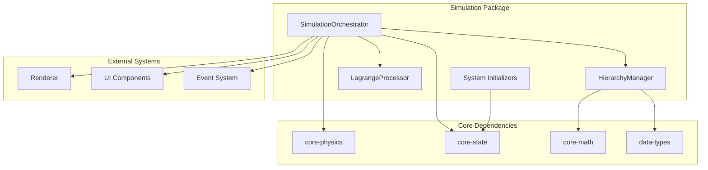
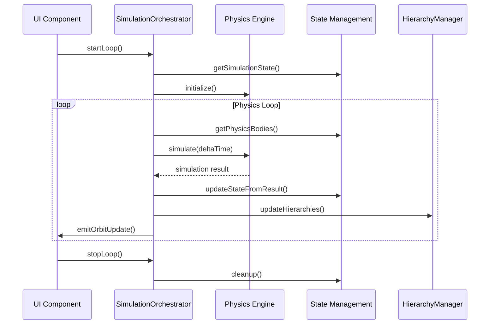

# AGENTS.md

A comprehensive guide for AI coding agents working on the Teskooano Simulation package.

## Package Overview

The **`@teskooano/app-simulation`** package provides the core simulation lifecycle and camera control for the Teskooano engine. It acts as the central orchestrator that integrates the physics engine (`@teskooano/core-physics`) and state management (`@teskooano/core-state`) to simulate celestial body interactions and manage the overall simulation time and state.

### Purpose

- **Simulation Orchestration**: Central management of the physics simulation loop and lifecycle
- **Camera Control**: High-level camera state management and intent-based control
- **State Integration**: Bridges physics calculations with state management
- **Event Broadcasting**: Provides observables for simulation events and updates
- **System Initialization**: Manages loading and initialization of celestial systems

## Package Architecture

### Directory Structure

```
packages/app/simulation/
├── src/
│   ├── index.ts                    # Main package exports
│   ├── SimulationOrchestrator.ts   # Core simulation management singleton
│   ├── HierarchyManager.ts         # Dynamic hierarchy management
│   └── LagrangeProcessor.ts        # Lagrange point processing
├── package.json
├── moon.yml
├── tsconfig.json
├── vitest.config.ts
├── README.md
├── ARCHITECTURE.md
├── CHANGELOG.md
└── TODO.md
```

### Core Components

#### 1. SimulationOrchestrator (Singleton)

The central orchestrator for the entire simulation system:

```typescript
class SimulationOrchestrator {
  private static instance: SimulationOrchestrator;

  // Core managers
  private hierarchyManager: HierarchyManager;
  private coreSimulationManager: SimulationManager;
  private subscriptionManager: StateSubscriptionMixin;

  // Event Subjects
  private readonly _resetTime$ = new Subject<void>();
  private readonly _orbitUpdate$ = new Subject<OrbitUpdatePayload>();

  // Time tracking
  private lastRealTime: number = 0;
  private isRunning: boolean = false;
}
```

**Key Responsibilities:**

- **Simulation Loop Management**: Controls start/stop of the physics simulation
- **Time Management**: Handles simulation time scaling and pausing
- **State Integration**: Bridges physics calculations with state management
- **Event Broadcasting**: Emits simulation events via RxJS observables
- **Resource Management**: Manages subscriptions and cleanup

#### 2. HierarchyManager

Manages dynamic hierarchy of celestial objects:

```typescript
class HierarchyManager {
  private updateIndex = 0;
  private CelestialDistanceService: CelestialDistanceService;
  private flatHierarchyService: FlatHierarchyService;

  // Hierarchy rules
  public updateHierarchies(): void;
  private handleObjectHierarchy(
    obj: CelestialObject,
    physicsState: PhysicsStateReal,
  ): void;
  private handleMoonEscape(
    obj: CelestialObject,
    physicsState: PhysicsStateReal,
  ): void;
  private handleSatelliteEscape(
    obj: CelestialObject,
    physicsState: PhysicsStateReal,
  ): void;
  private handleOrphanedObject(
    obj: CelestialObject,
    physicsState: PhysicsStateReal,
  ): void;
}
```

**Features:**

- **Dynamic Hierarchy Updates**: Processes one object per tick for performance
- **Escape Detection**: Handles moon and satellite escape scenarios
- **Parent Reassignment**: Finds new parents for orphaned objects
- **Cycle Prevention**: Prevents circular dependencies in hierarchy
- **WASM Integration**: Uses centralized spatial partitioning for efficiency

#### 3. LagrangeProcessor

Processes celestial objects at Lagrange points:

```typescript
export function processLagrangeObjects(
  celestialObjects: Map<string, CelestialObject>,
  physicsStates: Map<string, PhysicsStateReal>,
): void;
```

**Features:**

- **Lagrange Point Calculation**: Updates object positions based on Lagrange points
- **Two-Body System Analysis**: Uses primary and secondary objects for calculations
- **Physics State Updates**: Modifies initial physics states for Lagrange objects
- **Error Handling**: Comprehensive validation and error reporting

#### 4. System Initializers

Predefined system initializers are provided by `@teskooano/systems-solar-system` (and other `@teskooano/systems-*` packages).

```typescript
export function initializeSolarSystem(): void;
```

### Simulation Lifecycle

#### 1. Initialization Phase

```typescript
// 1. Load system data
initializeSolarSystem();

// 2. Start simulation loop
await simulationOrchestrator.startLoop();

// 3. Initialize hierarchy
hierarchyManager.initializeHierarchy();
```

#### 2. Physics Loop

```typescript
public createPhysicsCallback(): (deltaTime: number) => void {
  return (deltaTime: number) => {
    if (!this.isRunning || simulationState.paused) return;

    // Calculate scaled time
    const scaledDeltaTime = realTimeDelta * timeScale;

    // Process Lagrange objects
    this.processLagrangeObjects();

    // Prepare simulation parameters
    const simulationParams = this.prepareSimulationParameters(newSimulationTime);

    // Run physics simulation
    const result = this.runPhysicsSimulation(scaledDeltaTime, simulationParams);

    // Update state and emit events
    this.updateStateFromPhysicsResult(result);
    this.updateHierarchies();
    this.emitOrbitUpdate(result);
  };
}
```

#### 3. State Management Integration

```typescript
// Read from state
const allCelestialObjects = physicsSystemAdapter.getCelestialObjectsSnapshot();
const simulationConfig =
  coreSimulationManager.getSimulationState().simulationConfig;

// Update state
physicsSystemAdapter.updateStateFromResult(result);
simulationStore.setSimulationState({ ...currentState, time: newTime });
```

## Usage Examples

### 1. Basic Simulation Control

```typescript
import { simulationOrchestrator } from "@teskooano/app-simulation";
import { initializeSolarSystem } from "@teskooano/systems-solar-system";

// Load initial system
initializeSolarSystem();

// Start simulation loop
await simulationOrchestrator.startLoop();

// Stop simulation
simulationOrchestrator.stopLoop();

// Reset system
simulationOrchestrator.resetSystem();
```

### 2. Event Subscription

```typescript
// Subscribe to orbit updates
simulationOrchestrator.onOrbitUpdate.subscribe((payload) => {
  console.log("Orbit update:", payload.positions);
});

// Subscribe to time resets
simulationOrchestrator.onResetTime.subscribe(() => {
  console.log("Simulation time reset");
});
```

### 3. System Initialization

```typescript
// Solar system
import { initializeSolarSystem } from "@teskooano/systems-solar-system";
initializeSolarSystem();
```

### 4. Hierarchy Management

```typescript
import { HierarchyManager } from "@teskooano/app-simulation";

const hierarchyManager = new HierarchyManager();

// Initialize hierarchy
hierarchyManager.initializeHierarchy();

// Get hierarchy information
const children = hierarchyManager.getChildren("earth");
const parent = hierarchyManager.getParent("moon");
const path = hierarchyManager.getPathToRoot("moon");
const rootObjects = hierarchyManager.getRootObjects();
```

### 5. Lagrange Point Processing

```typescript
import { processLagrangeObjects } from "@teskooano/app-simulation";

// Process Lagrange objects during initialization
const celestialObjectsMap = new Map(Object.entries(allCelestialObjects));
const physicsStatesMap = new Map<string, PhysicsStateReal>();

for (const state of activeBodiesArray) {
  physicsStatesMap.set(state.id, state);
}

processLagrangeObjects(celestialObjectsMap, physicsStatesMap);
```

## Development Workflow

### 1. Setup and Configuration

```bash
# Install dependencies
npm install @teskooano/app-simulation

# Run tests
moon run app-simulation:test

# Build package
moon run app-simulation:build
```

### 2. Adding New System Types

```typescript
// 1. Create system initializer
// systems/my-system/index.ts
export function initializeMySystem(): void {
  // Use actions from @teskooano/core-state
  actions.createSolarSystem();

  // Add custom objects
  celestialManager.addObject({
    id: "my-star",
    name: "My Star",
    type: CelestialType.STAR,
    // ... other properties
  });
}

// 2. Export from main index
export { initializeMySystem } from "./systems/my-system";
```

### 3. Custom Hierarchy Rules

```typescript
// Extend HierarchyManager for custom rules
class CustomHierarchyManager extends HierarchyManager {
  protected handleObjectHierarchy(
    obj: CelestialObject,
    physicsState: PhysicsStateReal,
    allObjects: Record<string, CelestialObject>,
    allPhysicsStates: PhysicsStateReal[],
  ): void {
    // Custom hierarchy logic
    if (obj.type === CelestialType.CUSTOM_TYPE) {
      this.handleCustomType(obj, physicsState, allObjects, allPhysicsStates);
    } else {
      super.handleObjectHierarchy(
        obj,
        physicsState,
        allObjects,
        allPhysicsStates,
      );
    }
  }
}
```

## Performance Considerations

### 1. Simulation Loop Optimization

- **Frame Rate Capping**: Delta time is capped to prevent physics explosions
- **Pause Handling**: Efficient pause state management
- **Time Scaling**: Proper scaling of real time to simulation time
- **Resource Management**: Automatic cleanup of subscriptions and resources

### 2. Hierarchy Management Performance

- **Incremental Updates**: Processes one object per tick to avoid performance spikes
- **WASM Integration**: Uses centralized spatial partitioning for efficient distance calculations
- **Cycle Prevention**: Efficient cycle detection algorithms
- **State Caching**: Leverages pre-filtered active objects for performance

### 3. Memory Management

- **Subscription Cleanup**: Automatic disposal of RxJS subscriptions
- **State Swapping**: Efficient state updates without unnecessary allocations
- **Resource Disposal**: Proper cleanup of managers and services
- **Event Management**: Efficient event emission and subscription handling

## Testing Strategy

### 1. Unit Testing

```typescript
// SimulationOrchestrator tests
describe("SimulationOrchestrator", () => {
  it("should start and stop the simulation loop", async () => {
    await simulationOrchestrator.startLoop();
    expect(simulationOrchestrator.isLoopRunning).toBe(true);

    simulationOrchestrator.stopLoop();
    expect(simulationOrchestrator.isLoopRunning).toBe(false);
  });

  it("should emit orbit update events", async () => {
    const orbitUpdatePromise = new Promise<any>((resolve) => {
      const sub = simulationOrchestrator.onOrbitUpdate.subscribe((payload) => {
        resolve(payload);
        sub.unsubscribe();
      });
    });

    await simulationOrchestrator.startLoop();
    await new Promise((resolve) => setTimeout(resolve, 100));
    simulationOrchestrator.stopLoop();

    await expect(orbitUpdatePromise).resolves.toBeDefined();
  });
});
```

### 2. Integration Testing

```typescript
// System initialization tests
describe("System Initialization", () => {
  it("should initialize solar system correctly", () => {
    initializeSolarSystem();

    const objects = celestial.getObjects();
    expect(Object.keys(objects).length).toBeGreaterThan(0);
    expect(objects["sun"]).toBeDefined();
  });
});
```

### 3. Hierarchy Testing

```typescript
// Hierarchy management tests
describe("HierarchyManager", () => {
  it("should handle moon escape correctly", () => {
    const hierarchyManager = new HierarchyManager();

    // Setup test scenario
    // ... test moon escape logic

    expect(result).toBeDefined();
  });
});
```

## Troubleshooting Guide

### 1. Common Simulation Issues

#### Simulation Not Starting

```typescript
// ❌ Problem: Simulation loop not starting
await simulationOrchestrator.startLoop();
// No physics updates occurring

// ✅ Solution: Check state and dependencies
const simulationState = coreSimulationManager.getSimulationState();
if (simulationState.paused) {
  // Unpause simulation
  simulationStateService.setSimulationState({
    ...simulationState,
    paused: false,
  });
}
```

#### Performance Issues

```typescript
// ❌ Problem: Low frame rate or stuttering
// Simulation loop running but performance is poor

// ✅ Solution: Check time scaling and delta time
const timeScale = simulationState.timeScale;
if (timeScale > 100) {
  // Reduce time scale for better performance
  simulationStateService.setSimulationState({
    ...simulationState,
    timeScale: Math.min(timeScale, 100),
  });
}
```

### 2. Hierarchy Issues

#### Circular Dependencies

```typescript
// ❌ Problem: Circular hierarchy detected
// Objects creating infinite parent-child loops

// ✅ Solution: Check hierarchy validation
const hierarchyState = hierarchyManager.getHierarchyState();
const validationResult = flatHierarchyService.validateHierarchy(hierarchyState);
if (!validationResult.isValid) {
  console.error("Hierarchy validation failed:", validationResult.errors);
}
```

#### Orphaned Objects

```typescript
// ❌ Problem: Objects without parents
// Objects floating without proper hierarchy

// ✅ Solution: Check parent assignment
const orphanedObjects = hierarchyManager.getRootObjects();
if (orphanedObjects.length > expectedRootCount) {
  // Investigate orphaned objects
  console.warn("Unexpected orphaned objects:", orphanedObjects);
}
```

### 3. State Integration Issues

#### State Synchronization

```typescript
// ❌ Problem: State not updating correctly
// Physics calculations not reflected in state

// ✅ Solution: Check adapter configuration
const physicsBodies = physicsSystemAdapter.getPhysicsBodies();
const celestialObjects = physicsSystemAdapter.getCelestialObjectsSnapshot();

if (physicsBodies.length !== Object.keys(celestialObjects).length) {
  console.error("State synchronization mismatch");
}
```

#### Event Not Firing

```typescript
// ❌ Problem: Events not being emitted
// onOrbitUpdate or onResetTime not firing

// ✅ Solution: Check event subscription and emission
const hasSubscribers =
  simulationOrchestrator.onOrbitUpdate.observers.length > 0;
if (!hasSubscribers) {
  console.warn("No subscribers to orbit update events");
}
```

## Integration Points

### 1. Core State Integration

```typescript
import {
  celestialManager,
  physicsSystemAdapter,
  simulationStore,
} from "@teskooano/core-state";

// Read from state
const allObjects = physicsSystemAdapter.getCelestialObjectsSnapshot();
const simulationState = simulationStore.getSimulationState();

// Update state
physicsSystemAdapter.updateStateFromResult(result);
simulationStore.setSimulationState({ ...currentState, time: newTime });
```

### 2. Physics Engine Integration

```typescript
import { SimulationManager } from "@teskooano/core-physics";

// Initialize physics manager
const coreSimulationManager = new SimulationManager();
await coreSimulationManager.initialize();

// Run physics simulation
const result = coreSimulationManager.simulate({
  bodies: physicsBodies,
  configuration: simulationConfig,
  deltaTime: scaledDeltaTime,
});
```

### 3. Renderer Integration

```typescript
// Events are consumed by renderer
simulationOrchestrator.onOrbitUpdate.subscribe((payload) => {
  // Update renderer with new positions
  renderer.updateObjectPositions(payload.positions);
});
```

## Contributing Guidelines

### 1. Simulation Development Standards

- **Singleton Pattern**: Maintain singleton pattern for SimulationOrchestrator
- **Event-Driven Architecture**: Use RxJS observables for communication
- **State Management**: Always use state adapters for state access
- **Error Handling**: Implement comprehensive error handling and recovery

### 2. System Initializer Standards

- **Data-Driven**: Use actions from `@teskooano/core-state`
- **Modular Design**: Each system type in its own module
- **Validation**: Validate system data before initialization
- **Documentation**: Include JSDoc comments for all functions

### 3. Hierarchy Management Standards

- **Performance**: Process one object per tick for performance
- **Validation**: Prevent circular dependencies and invalid hierarchies
- **WASM Integration**: Use centralized spatial partitioning when available
- **Error Recovery**: Graceful handling of hierarchy errors

## Architecture Documentation

### 1. System Overview



### 2. Data Flow



## Scientific References

### 1. Physics Simulation

- **N-Body Problem**: Gravitational interactions between multiple celestial bodies
- **Lagrange Points**: Stable orbital positions in three-body systems
- **Orbital Mechanics**: Kepler's laws and celestial mechanics
- **Time Integration**: Numerical methods for solving differential equations

### 2. Hierarchy Management

- **Gravitational Dominance**: Mass-based hierarchy determination
- **Escape Velocity**: Critical distances for orbital escape
- **Spatial Partitioning**: Efficient algorithms for distance calculations
- **Cycle Detection**: Graph algorithms for preventing circular dependencies

### 3. System Architecture

- **Singleton Pattern**: Single instance management for global state
- **Observer Pattern**: Event-driven communication via RxJS
- **State Management**: Centralized state with reactive updates
- **Resource Management**: Automatic cleanup and memory management

---

**Remember**: The Simulation package is the heart of the Teskooano engine. It orchestrates physics calculations, manages state, and provides the foundation for all simulation functionality. Always maintain performance, ensure proper state synchronization, and follow the established architectural patterns for reliable simulation behavior.
