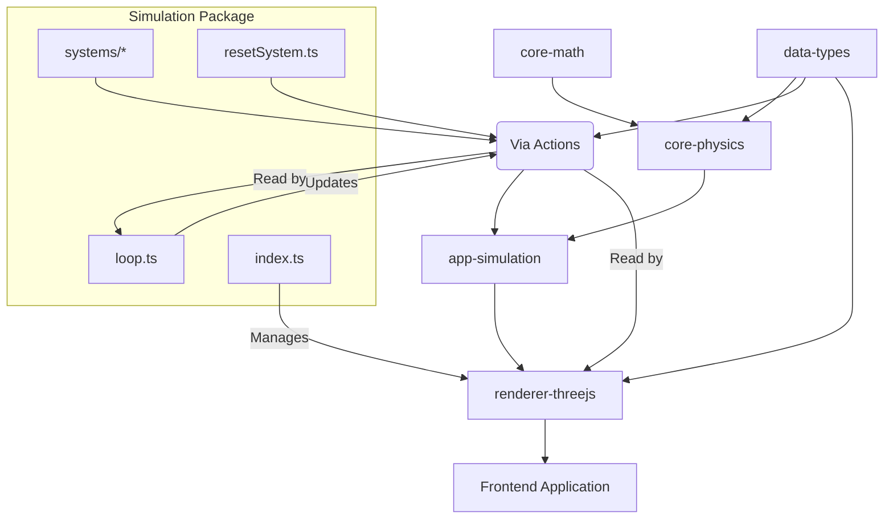

# @teskooano/app-simulation

## What is it?

The `@teskooano/app-simulation` package provides the core simulation loop and setup for the Teskooano engine. It integrates the physics engine (`@teskooano/core-physics`), state management (`@teskooano/core-state`), and the renderer (`@teskooano/renderer-threejs`) to simulate celestial body interactions and manage the overall simulation time and state.

## Where is it?

**Physical Location:** `/packages/app/simulation`

**System Context:** This package acts as the central orchestrator, connecting various core libraries to the frontend rendering.



## When is it used?

- To initialize the main `Simulation` class which sets up the renderer.
- To start/stop the core physics `simulationLoop`.
- Whenever the simulation time needs to be updated or controlled (pause, timescale).
- When loading initial system configurations (e.g., from the `systems` directory).

## How does it work?

The simulation system is based on two main parts:

1.  **`Simulation` Class (`index.ts`)**:

    - Initializes and holds the `ModularSpaceRenderer` instance.
    - Sets up event listeners for things like window resizing to keep the renderer updated.
    - This class _does not_ run the main simulation loop itself but provides the rendering context.

2.  **`simulationLoop` (`loop.ts`)**:
    - This is the core physics update loop, typically run via `requestAnimationFrame` when started with `startSimulationLoop()`.
    - Reads the current state (`celestialObjectsStore`, `simulationState`) from `@teskooano/core-state`.
    - Calculates the time delta, applying the simulation timescale.
    - Filters active celestial bodies.
    - Calls the `updateSimulation` function from `@teskooano/core-physics` to perform N-body calculations, collision detection, and integration.
    - Handles destruction events emitted by the physics engine and passes them to the renderer via `rendererEvents`.
    - Updates the `celestialObjectsStore` with the new physics states and statuses (including handling destroyed/annihilated objects).
    - Calculates and applies object rotations directly to the state.
    - Dispatches an `orbitUpdate` custom event for potential listeners (like orbit trail renderers).

### Time Control

- Simulation time (`simulationState.time`) is advanced within the `simulationLoop`.
- Pausing (`simulationState.paused`) and time scaling (`simulationState.timeScale`) are respected by the loop.
- Time resets are handled via the `CustomEvents.SIMULATION_RESET_TIME` event.

### System Initialization

- Functions like `initializeRedDwarfSystem` (in `systems/`) use `actions` from `@teskooano/core-state` to populate the `celestialObjectsStore` with initial bodies.
- `resetSystem` likely provides a way to clear the state and load a specific system.

## Installation

```bash
# Assuming part of the monorepo, installed via workspace dependency
```

_(Internal package, typically not installed standalone)_

## Usage

### Basic Simulation Setup

```typescript
import Simulation, {
  startSimulationLoop,
  stopSimulationLoop,
} from "@teskooano/app-simulation";
import { initializeRedDwarfSystem } from "@teskooano/app-simulation/systems"; // Example system
import { actions as simulationActions } from "@teskooano/core-state";

// Get container element
const container = document.getElementById("simulation-container");
if (!container) throw new Error("Container not found");

// 1. Initialize the Simulation class (sets up renderer)
const simulation = new Simulation(container);

// 2. Load an initial system into the state
const systemId = initializeRedDwarfSystem();
console.log(`Initialized system: ${systemId}`);

// Optional: Set initial camera focus or position via state actions
// simulationActions.setCameraTarget(systemId);

// 3. Start the physics loop
startSimulationLoop();

// To stop the loop later:
// stopSimulationLoop();

// To pause/resume:
// simulationActions.setPaused(true);
// simulationActions.setPaused(false);

// To change time scale:
// simulationActions.setTimeScale(10); // 10x speed
```

_(Removing outdated toolbar/web component sections as they are not present in the current code structure)_

## API Reference

### Exports from `index.ts`

```typescript
// Main class for renderer setup
class Simulation {
  constructor(container: HTMLElement);
  // Primarily manages the renderer instance
}
export default Simulation;

// Core simulation loop controls
export function startSimulationLoop(): void;
export function stopSimulationLoop(): void;

// Utility to reset simulation state
export function resetSystem(systemInitializer?: () => string): void;

// Placeholder/Example solar system setup
export function initializeSolarSystem(): string; // Likely defined in systems/solar-system
```

### Exports from `loop.ts`

_(Primarily internal loop logic, `startSimulationLoop` and `stopSimulationLoop` are re-exported via `index.ts`)_

### Exports from `systems/*`

_(Example: `systems/redDwarfSystem.ts`)_

```typescript
export function initializeRedDwarfSystem(): string; // Returns the ID of the primary star
```

_(Add other system initializers as needed)_

## Dependencies

- `@teskooano/core-math`
- `@teskooano/core-physics`
- `@teskooano/core-state`
- `@teskooano/data-types`
- `@teskooano/renderer-threejs`
- `three`

---

_Remember to commit often! `git commit -m "docs(simulation): update README for v0.1.0"`_
