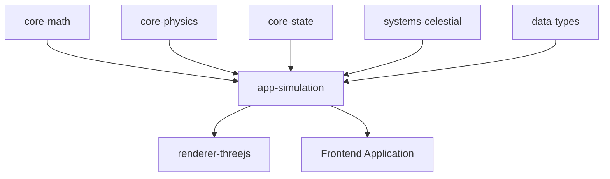

# @teskooano/app-simulation

## What is it?

The `@teskooano/app-simulation` library is the central orchestration engine for the Open Space game. It coordinates the interaction between physics, state management, and rendering to create a cohesive space simulation. This package manages the simulation loop, time progression, and coordinates the updates between all other subsystems.

## Where is it?

**Physical Location:** `/packages/app/simulation`

**System Context:** The simulation package sits at the center of the application, orchestrating all other components:



## When is it used?

The simulation engine is used:

- When initializing the game environment and loading star systems
- During each game tick to update physics, state, and trigger rendering
- For controlling simulation time and speed
- When processing user interactions that affect the simulation
- To synchronize state changes across different subsystems
- For loading and saving simulation state

## How does it work?

The simulation system implements:

### Simulation Loop

- Manages the main game loop with fixed time steps
- Coordinates physics updates, state changes, and rendering
- Handles frame timing and performance optimization

### System Management

- Coordinates the initialization and shutdown of subsystems
- Manages resource allocation and cleanup
- Handles system configuration and scaling

### Time Control

- Provides controls for simulation speed and pausing
- Manages in-game time progression
- Implements time dilation effects

### Event System

- Relays events between subsystems
- Handles user input that affects simulation
- Manages event queuing and processing

### Scene Loading

- Coordinates the loading of star systems
- Handles transitions between different space environments
- Manages system generation and persistence

## Strengths

- Central coordination simplifies interaction between subsystems
- Clean separation between simulation logic and rendering
- Flexible time management for different simulation speeds
- Well-structured initialization and update sequences

## Weaknesses

- Currently limited system generation capabilities
- Lacks advanced loading/saving functionality for complex systems

## Opportunities

- Integration with the upcoming system loader for JSON-based star systems
- Support for the new ship movement and warp travel mechanics
- Enhanced event handling for complex user interactions

## Future Considerations

For upcoming features:

- The system loader will require coordinated loading from JSON files, validation, and initialization
- Ship movement will need simulation support for player-controlled entities with physics
- The UI manager will need hooks into the simulation for status updates and control
- Need to expand the simulation capabilities to handle multiple star systems and transitions between them
- Adding support for saving and loading simulation state for persistent gameplay

## Features

- Physics-based simulation of celestial objects
- Orbital mechanics for realistic planetary motion
- Configurable time scales and simulation controls
- Integration with the Window Manager for UI controls

## Installation

```bash
npm install @teskooano/app-simulation
```

## Usage

### Basic Simulation Setup

```typescript
import Simulation from "@teskooano/app-simulation";

// Get container element
const container = document.getElementById("simulation-container");

// Initialize simulation
const simulation = new Simulation(container);

// Add celestial objects
simulation.addObject({
  id: "sun",
  name: "Sun",
  type: "star",
  position: { x: 0, y: 0, z: 0 },
  mass: 1.989e30,
});
```

### Using Simulation Controls with Window Manager

The simulation package includes integration with the Window Manager toolbar for easy control of the simulation:

```typescript
import { initializeSimulationDemo } from "@teskooano/app-simulation";

// Get container element
const container = document.getElementById("simulation-container");

// Initialize simulation with window manager integration
const { simulation, windowManager, toolbar } =
  initializeSimulationDemo(container);

// The toolbar now contains simulation controls:
// - Play/Pause button
// - Speed Up button
// - Speed Down button
// - Reverse Direction button
```

### Manual Toolbar Integration

If you prefer to set up the toolbar manually:

```typescript
import { registerSimulationControls } from "@teskooano/app-simulation";

// Create toolbar
const toolbar = new Toolbar();
toolbar.init("simulation-container", "top");

// Register simulation controls
registerSimulationControls();
```

### Using Web Components for Simulation Controls

The simulation package now includes a web component for easy integration of simulation controls:

```html
<!-- Add simulation controls to your HTML -->
<simulation-controls></simulation-controls>
```

You can also create the component programmatically:

```typescript
import { SimulationControlsComponent } from "@teskooano/app-simulation";

// The component is automatically registered as a custom element
// You can create it programmatically
const controlsElement = document.createElement("simulation-controls");
document.querySelector("#my-toolbar").appendChild(controlsElement);
```

### Legacy Toolbar Integration

For backward compatibility, you can still use the `registerSimulationControls` function:

```typescript
import { registerSimulationControls } from "@teskooano/app-simulation";

// Create toolbar
const toolbar = new Toolbar();
toolbar.init("simulation-container", "top");

// Register simulation controls
registerSimulationControls();
```

## Simulation Controls

The simulation toolbar provides the following controls:

### Play/Pause

Toggles the simulation between playing and paused states.

### Speed Control

- **Speed Up**: Increases the simulation speed by 1.5x
- **Speed Down**: Decreases the simulation speed by 1.5x

### Direction Control

- **Reverse Direction**: Flips the direction of time flow by negating the time scale

## API Reference

### Simulation Class

```typescript
class Simulation {
  constructor(container: HTMLElement);

  // Add an object to the simulation
  addObject(object: CelestialObject): void;

  // Remove an object from the simulation
  removeObject(objectId: string): void;

  // Stop the simulation
  stop(): void;
}
```

### Web Components

```typescript
// Simulation controls web component
class SimulationControlsComponent extends HTMLElement {
  // Creates a toolbar with simulation controls
  // Automatically connects to the simulation state
}
```

### Utility Functions

```typescript
// Register simulation controls in the toolbar (legacy method)
function registerSimulationControls(): void;
```

## Integration Example

The simulation can be easily integrated with other components of the Open Space project:

```typescript
import Simulation, {
  registerSimulationControls,
} from "@teskooano/app-simulation";
import { createSolarSystem } from "@teskooano/app-simulation";

// Initialize window manager
const windowManager = new WindowManager();
windowManager.init("app-container");

// Initialize toolbar
const toolbar = new Toolbar();
toolbar.init("app-container", "top");

// Register simulation window
registerWindow({
  id: "simulation-view",
  title: "Solar System Simulation",
  position: { x: 100, y: 100 },
  size: { width: 800, height: 600 },
  resizable: true,
  draggable: true,
});

// Initialize simulation
const container = document.getElementById("simulation-view");
const simulation = new Simulation(container);

// Create solar system
createSolarSystem(simulation);

// Register simulation controls
registerSimulationControls();
```

## License

MIT
