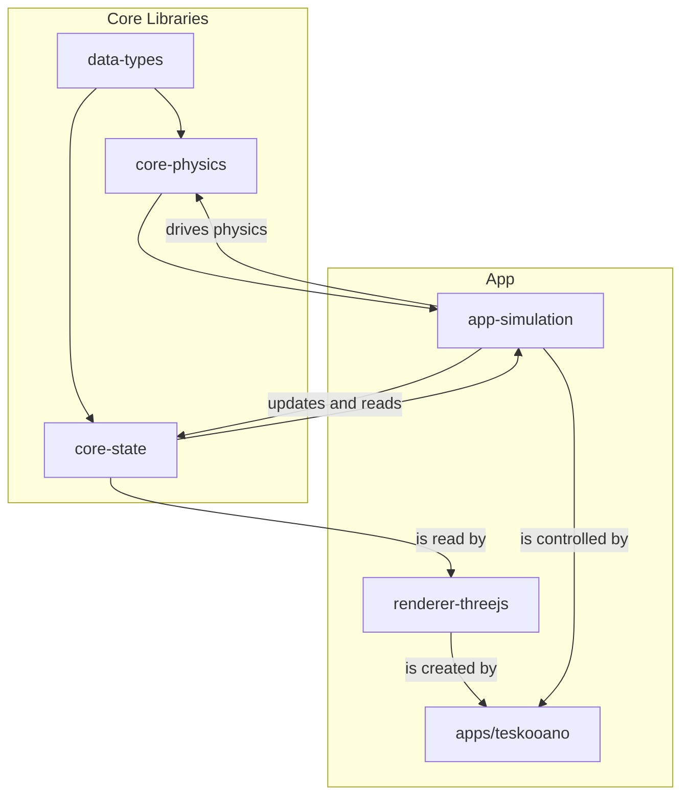

# @teskooano/app-simulation

## What is it?

The `@teskooano/app-simulation` package provides the core simulation lifecycle and camera control for the Teskooano engine. It integrates the physics engine (`@teskooano/core-physics`) and state management (`@teskooano/core-state`) to simulate celestial body interactions and manage the overall simulation time and state.

## Where is it?

**Physical Location:** `/packages/app/simulation`

**System Context:** This package acts as the central engine, managed by the main application, connecting various core libraries to the renderer.



## When is it used?

- To start/stop the core physics loop via the `simulationManager` singleton.
- To control the camera's focus and field of view via the `CameraManager`.
- To reset the simulation state.
- To load initial system configurations (e.g., from the `systems` directory).

## How does it work?

The simulation system is based on two main parts:

1.  **`SimulationManager` (`SimulationManager.ts`)**:

    - A singleton that manages the core physics update loop (`requestAnimationFrame`).
    - The loop is started/stopped reactively by the UI layer (e.g., when a system is loaded or cleared).
    - It reads the current state from `@teskooano/core-state` (via `physicsSystemAdapter`), calls the `updateSimulation` function from `@teskooano/core-physics`, and writes the results back to the state store.
    - It provides observables (`onOrbitUpdate`, `onDestructionOccurred`) for other parts of the application to subscribe to simulation events.

2.  **`CameraManager` (`camera/CameraManager.ts`)**:
    - A class that handles the high-level, semantic state of the camera.
    - It does **not** directly control the `THREE.Camera`; instead, it manages the _intent_ (e.g., "follow Earth," "reset view").
    - It provides a clean API (`followObject`, `setFov`, etc.) and uses a `BehaviorSubject` to broadcast its state.
    - It receives the `ModularSpaceRenderer` from the UI layer and directs the renderer's internal `ControlsManager`.

### Time Control

- Simulation time (`simulationState.time`) is advanced within the `SimulationManager`'s loop.
- Pausing (`simulationState.paused`) and time scaling (`simulationState.timeScale`) are respected by the loop.
- Time resets are handled via the `simulationManager.resetTime()` method.

### System Initialization

- Functions like `initializeSolarSystem` (in `systems/`) use `actions` from `@teskooano/core-state` to populate the `celestialObjectsStore` with initial bodies.
- `simulationManager.resetSystem()` provides a way to clear the state, which is typically called before loading a new system.

## Installation

```bash
# Assuming part of the monorepo, installed via workspace dependency
```

_(Internal package, typically not installed standalone)_

## Usage

### Basic Simulation Control (from a UI component)

```typescript
import { simulationManager } from "@teskooano/app-simulation";
import { initializeSolarSystem } from "@teskooano/app-simulation/systems";

// In a UI component that manages the simulation lifecycle

// 1. Load an initial system into the state
// This function calls actions that will populate the celestialObjects$ store
initializeSolarSystem();

// 2. The UI listens for object creation and starts the loop
// This is typically done in a lifecycle manager that subscribes to celestialObjects$
// and finds that objects now exist.
simulationManager.startLoop();

// To stop the loop later (e.g., when a "Clear System" button is pressed):
simulationManager.stopLoop();

// To pause/resume:
import { actions } from "@teskooano/core-state";
actions.setPaused(true);
actions.setPaused(false);

// To change time scale:
actions.setTimeScale(10); // 10x speed
```

### Camera Control (from a UI component)

```typescript
import type { CameraManager } from "@teskooano/app-simulation";
import type { ModularSpaceRenderer } from "@teskooano/renderer-threejs";

// Assume `cameraManager` is an instance of CameraManager passed to the UI
// Assume `renderer` is the ModularSpaceRenderer instance

// Initialize the camera manager with its dependencies
cameraManager.setDependencies({ renderer });

// Set focus to an object
cameraManager.followObject("earth");

// Clear focus and return to default view
cameraManager.clearFocus(); // or cameraManager.followObject(null);

// Reset camera to its initial state
cameraManager.resetCameraView();
```

## API Reference

### Exports from `index.ts`

```typescript
// The singleton instance for controlling the simulation loop
export const simulationManager: SimulationManager;

// The class for managing the simulation loop and state
export class SimulationManager {
  startLoop(): void;
  stopLoop(): void;
  resetSystem(skipStateClear?: boolean): void;
  // ... plus observable event streams
}

// The class for managing high-level camera state
export class CameraManager {
  setDependencies(options: CameraManagerOptions): void;
  followObject(objectId: string | null): void;
  clearFocus(): void;
  resetCameraView(): void;
  setFov(fov: number): void;
  getCameraState$(): BehaviorSubject<CameraManagerState>;
  // ... and more
}

// Type definitions for camera state and options
export type { CameraManagerState, CameraManagerOptions };

// Constants for camera defaults
export * from "./camera/constants";

// System initializers, e.g.:
export function initializeSolarSystem(): void;
```

### Exports from `systems/*`

_(Example: `systems/solar-system/index.ts`)_

```typescript
export function initializeSolarSystem(): void; // Populates state, returns nothing
```

_(Add other system initializers as needed)_

## Dependencies

- `@teskooano/core-physics`
- `@teskooano/core-state`
- `@teskooano/data-types`
- `rxjs`
- `three`

---

_Remember to commit often! `git commit -m "docs(simulation): update README for v0.2.0"`_
