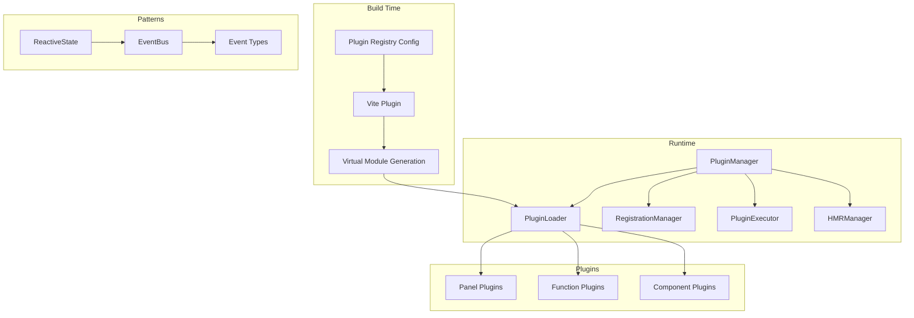
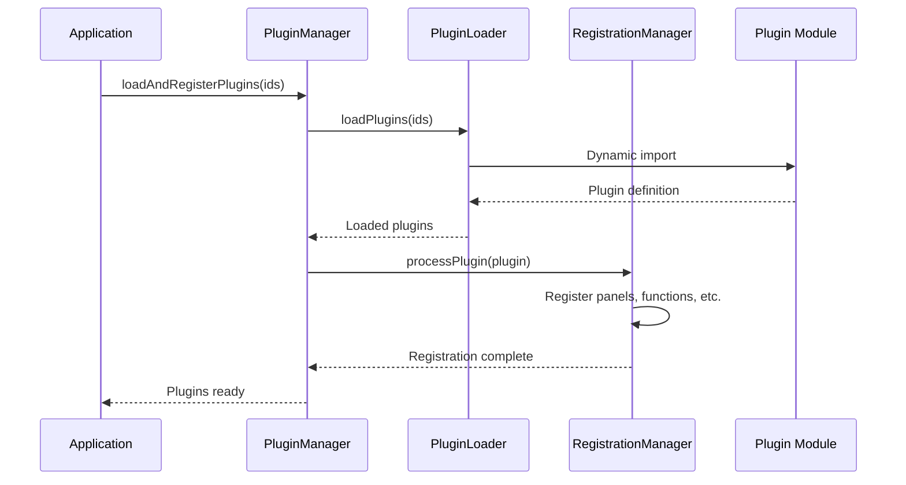

# AGENTS.md

A comprehensive guide for AI coding agents working on the Teskooano UI Plugin System.

## Package Overview

The **`@teskooano/ui-plugin`** package is the core infrastructure for registering and managing UI plugins within the Teskooano application ecosystem. It provides a sophisticated plugin system with dynamic loading, reactive state management, event-driven communication, and comprehensive development tools including Hot Module Replacement (HMR) support.

### Purpose

- **Plugin Infrastructure**: Centralized system for registering and managing UI plugins
- **Dynamic Loading**: Build-time integration with Vite for efficient plugin loading
- **Reactive Patterns**: Modern state management and event-driven communication
- **Development Experience**: HMR support, debugging tools, and comprehensive TypeScript support
- **Modular Architecture**: Clean separation between plugin registration, execution, and lifecycle management

## Package Architecture

### Directory Structure

```
packages/app/ui-plugin/
├── src/
│   ├── types.ts                    # Core type definitions and interfaces
│   ├── pluginManager.ts            # Main PluginManager singleton class
│   ├── vite-plugin.ts              # Vite plugin for build-time integration
│   ├── virtual.d.ts                # Virtual module type definitions
│   ├── index.ts                    # Main package exports
│   ├── factories/
│   │   └── plugin-factory.ts       # Factory functions for common plugin patterns
│   ├── managers/
│   │   ├── plugin-loader.manager.ts    # Plugin loading and dependency resolution
│   │   ├── registration.manager.ts     # Plugin registration and lifecycle
│   │   ├── plugin-executor.manager.ts  # Function execution and context management
│   │   └── hmr.manager.ts              # Hot Module Replacement support
│   └── patterns/
│       ├── index.ts                # Pattern system exports
│       ├── reactive-state.ts       # Reactive state management
│       ├── event-bus.ts            # Centralized event system
│       └── events.ts               # Event type definitions and payloads
├── package.json
├── moon.yml
├── tsconfig.json
├── README.md
├── ARCHITECTURE.md
├── PATTERNS.md
├── EXAMPLE.md
└── CHANGELOG.md
```

### Core Components

#### 1. PluginManager (Singleton)

The central orchestrator for the entire plugin system:

```typescript
class PluginManager implements PluginManagerProxy {
  private static instance: PluginManager;

  // Core registries
  private #registries: PluginRegistries;

  // Manager instances
  private #pluginLoader: PluginLoader;
  private #registrationManager: RegistrationManager;
  private #pluginExecutor: PluginExecutor;
  private #hmrManager: HMRManager;

  // Observables for status tracking
  public readonly pluginStatus$: Observable<PluginRegistrationStatus>;
  public readonly pluginsChanged$: Observable<void>;
}
```

**Key Responsibilities:**

- **Singleton Management**: Single source of truth for plugin state
- **Dependency Injection**: Provides core services to plugins
- **Lifecycle Management**: Handles loading, registration, and cleanup
- **Status Broadcasting**: RxJS observables for plugin status updates
- **HMR Support**: Hot reloading during development

#### 2. Plugin Loading System

Handles dynamic plugin loading with dependency resolution:

```typescript
class PluginLoader {
  public async loadPlugins(
    pluginIds: string[],
    alreadyRegistered: Set<string> = new Set(),
  ): Promise<{
    loadedPlugins: Record<string, TeskooanoPlugin>;
    processingOrder: string[];
  }>;

  private async performTopologicalSort(
    allRequestedIds: Set<string>,
    context: LoadingContext,
  ): Promise<void>;
}
```

**Features:**

- **Topological Sorting**: Resolves plugin dependencies automatically
- **Circular Dependency Detection**: Prevents infinite dependency loops
- **Dynamic Imports**: Uses Vite-generated loaders for efficient loading
- **Error Handling**: Comprehensive error reporting and recovery

#### 3. Registration System

Manages plugin contributions and custom element registration:

```typescript
class RegistrationManager {
  public processPlugin(plugin: TeskooanoPlugin): void {
    this.registerPanels(plugin);
    this.registerFunctions(plugin);
    this.registerToolbarItems(plugin);
    this.registerManagerClasses(plugin);
    this.registerComponents(plugin);
  }
}
```

**Registration Types:**

- **Panels**: DockView panel components with custom elements
- **Functions**: Executable actions with dependency injection
- **Toolbar Items**: Buttons, toggles, and panel triggers
- **Manager Classes**: Service classes with singleton instantiation
- **Components**: Custom elements for reuse across plugins

#### 4. Execution System

Handles plugin function execution with context injection:

```typescript
class PluginExecutor {
  public execute<T = any>(
    functionId: string,
    args?: any,
  ): Promise<T> | T | undefined;

  private createPluginManagerProxy(): PluginManagerProxy;
}
```

**Context Injection:**

- **DockView API**: Panel management and layout control
- **Plugin Manager Proxy**: Limited interface for cross-plugin communication
- **Manager Access**: Access to registered manager instances
- **Function Execution**: Ability to call other plugin functions

#### 5. HMR System

Provides Hot Module Replacement for development:

```typescript
class HMRManager {
  public async reloadPlugin(pluginId: string): Promise<void>;
  public async unloadPlugin(pluginId: string): Promise<void>;

  private setupHMRListeners(): void;
}
```

**HMR Features:**

- **Plugin Reloading**: Automatic reload on file changes
- **Cleanup Support**: Calls plugin `dispose()` methods
- **State Preservation**: Maintains plugin state across reloads
- **Error Recovery**: Graceful handling of reload failures

### Reactive Patterns System

#### 1. Reactive State Management

Vue.js-inspired reactive state with computed properties:

```typescript
class ReactiveState {
  private _data: Record<string, any> = {};
  private _watchers: Map<string, Set<StateWatcher>> = new Map();
  private _computed: Map<string, ComputedProperty> = new Map();

  // Core API
  get(property: string): any;
  set(property: string, value: any): void;
  watch(property: string, callback: StateWatcher): () => void;
  computed(property: string, definition: ComputedDefinition): void;
}
```

**Features:**

- **Automatic Dependency Tracking**: Watchers automatically track dependencies
- **Computed Properties**: Cached derived values with invalidation
- **Efficient Updates**: Batched updates and minimal re-computation
- **Memory Management**: Automatic cleanup and disposal

#### 2. Event Bus System

Centralized event communication with type safety:

```typescript
class EventBus {
  private static instance: EventBus;

  // Event emission and subscription
  emit(eventType: string, payload?: any, options?: Partial<EventConfig>): void;
  on(
    eventType: string,
    listener: EventListener,
    options?: SubscriptionOptions,
  ): () => void;
  onAll(listener: EventListener, options?: SubscriptionOptions): () => void;
  once(
    eventType: string,
    listener: EventListener,
    options?: SubscriptionOptions,
  ): void;
}
```

**Event System Features:**

- **Type-Safe Events**: Comprehensive event type definitions
- **Payload Validation**: Structured payload interfaces
- **Filtering Options**: Source/target filtering and conditional listening
- **Global Listeners**: System-wide event monitoring
- **Debug Support**: Event history and statistics

#### 3. Event Type System

Comprehensive event definitions with payload interfaces:

```typescript
// Event constants
export const Events = {
  // Object events
  OBJECT_SELECTED: "object:selected",
  OBJECT_DESELECTED: "object:deselected",
  OBJECT_FOCUSED: "object:focused",

  // Camera events
  CAMERA_FOCUSED: "camera:focused",
  CAMERA_MOVED: "camera:moved",

  // Simulation events
  SIMULATION_STARTED: "simulation:started",
  SIMULATION_PAUSED: "simulation:paused",

  // System events
  SYSTEM_LOADED: "system:loaded",
  SYSTEM_CLEARED: "system:cleared",

  // And many more...
} as const;

// Payload interfaces
export interface ObjectSelectedPayload extends BaseEventPayload {
  objectId: string;
  object?: CelestialObject;
  previousObjectId?: string;
}
```

### Vite Integration

#### 1. Build-Time Plugin Generation

The Vite plugin generates virtual modules for dynamic loading:

```typescript
export function teskooanoUiPlugin(options: TeskooanoUiPluginOptions): Plugin {
  return {
    name: "vite-plugin-teskooano-ui",

    resolveId(id) {
      if (id === VIRTUAL_MODULE_ID) {
        return RESOLVED_VIRTUAL_MODULE_ID;
      }
    },

    async load(id) {
      if (id === RESOLVED_VIRTUAL_MODULE_ID) {
        return generatePluginLoaders(pluginConfigPaths);
      }
    },

    handleHotUpdate({ file, server }) {
      // HMR support for plugin files
    },
  };
}
```

**Generated Virtual Module:**

```typescript
// virtual:teskooano-loaders
export const pluginLoaders = {
  "core-focus-controls": () => import("/path/to/FocusControl.plugin.ts"),
  "celestial-info": () => import("/path/to/CelestialInfo.plugin.ts"),
  // ... other plugins
};
```

#### 2. Configuration System

Plugin registry configuration for build-time analysis:

```typescript
// Example: apps/teskooano/src/config/pluginRegistry.ts
export const pluginConfig: PluginRegistryConfig = {
  "core-focus-controls": {
    path: "../components/ui-controls/focus/FocusControl.plugin.ts",
  },
  "celestial-info": {
    path: "../plugins/celestial-info/CelestialInfo.plugin.ts",
  },
};
```

### Factory Functions

The package provides factory functions to reduce boilerplate:

#### 1. Panel Plugin Factory

```typescript
export function createPanelPlugin(config: PanelPluginConfig): TeskooanoPlugin {
  // Automatically creates:
  // - Panel configuration
  // - Toolbar button (if target specified)
  // - Component registration
  // - Proper bindings
}
```

#### 2. Component Plugin Factory

```typescript
export function createComponentPlugin(
  config: ComponentPluginConfig,
): TeskooanoPlugin {
  // For reusable UI components without panels
}
```

#### 3. Controller Plugin Factory

```typescript
export function createControllerPlugin(
  config: ControllerPluginConfig,
): TeskooanoPlugin {
  // For service plugins with functions and managers
}
```

#### 4. Interface Plugin Factory

```typescript
export function createInterfacePlugin(
  config: InterfacePluginConfig,
): TeskooanoPlugin {
  // For function plugins with toolbar integration
}
```

## Usage Examples

### 1. Basic Plugin Definition

```typescript
// MyFeature.plugin.ts
import { createPanelPlugin } from "@teskooano/ui-plugin";
import { MyFeaturePanel } from "./MyFeaturePanel";
import MyIcon from "./my-icon.svg?raw";

export const plugin = createPanelPlugin({
  id: "my-feature",
  name: "My Feature",
  description: "A useful feature panel",
  componentName: "my-feature-panel",
  panelClass: MyFeaturePanel,
  defaultTitle: "My Feature",
  iconSvg: MyIcon,
  target: "engine-toolbar",
  order: 100,
});
```

### 2. Reactive State Usage

```typescript
import { ReactiveState, EventBus, Events } from "@teskooano/ui-plugin/patterns";

export class MyComponent extends HTMLElement {
  private state = new ReactiveState({
    selectedObject: null,
    isLoading: false,
  });

  constructor() {
    super();

    // Add computed properties
    this.state.computed("hasSelection", {
      deps: ["selectedObject"],
      compute: (selectedObject) => selectedObject !== null,
    });

    // Watch for changes
    this.state.watch("selectedObject", (newValue) => {
      this.updateUI();
    });

    // Connect to events
    const eventBus = EventBus.getInstance();
    eventBus.on(Events.OBJECT_SELECTED, (event) => {
      this.state.set("selectedObject", event.payload.object);
    });
  }
}
```

### 3. Function Plugin with Context

```typescript
export const plugin: TeskooanoPlugin = {
  id: "data-exporter",
  name: "Data Exporter",
  functions: [
    {
      id: "export:celestial-data",
      execute: async (
        context: PluginExecutionContext,
        options?: ExportOptions,
      ) => {
        const { dockviewApi, getManager } = context;

        // Access manager instances
        const dataManager = getManager("data-manager");

        // Use DockView API
        if (dockviewApi) {
          const panels = dockviewApi.panels;
          // ... export logic
        }

        return { success: true, exportedCount: 42 };
      },
    },
  ],
};
```

### 4. HMR-Enabled Plugin

```typescript
export const plugin: TeskooanoPlugin = {
  id: "hmr-demo",
  name: "HMR Demo",

  initialize: () => {
    console.log("Plugin initialized");
    // Setup listeners, intervals, etc.
  },

  dispose: () => {
    console.log("Plugin being disposed");
    // Cleanup listeners, intervals, etc.
  },
};
```

## Development Workflow

### 1. Setup and Configuration

```bash
# Install dependencies
npm install @teskooano/ui-plugin

# Configure Vite plugin
# vite.config.ts
import { teskooanoUiPlugin } from "@teskooano/ui-plugin/vite.js";

export default defineConfig({
  plugins: [
    teskooanoUiPlugin({
      pluginRegistryPaths: [
        path.resolve(__dirname, "src/config/pluginRegistry.ts")
      ]
    })
  ]
});
```

### 2. Plugin Development

```typescript
// 1. Create plugin definition
export const plugin = createPanelPlugin({...});

// 2. Implement component
export class MyPanel extends HTMLElement {
  // Component implementation
}

// 3. Register in plugin registry
// src/config/pluginRegistry.ts
export const pluginConfig = {
  "my-plugin": {
    path: "../plugins/my-plugin/MyPlugin.plugin.ts"
  }
};
```

### 3. Application Integration

```typescript
// main.ts
import { PluginManager } from "@teskooano/ui-plugin";

async function initializeApp() {
  const pluginManager = PluginManager.getInstance();

  // Set dependencies
  pluginManager.setAppDependencies({
    dockviewApi,
    dockviewController,
  });

  // Load plugins
  await pluginManager.loadAndRegisterPlugins([
    "core-focus-controls",
    "celestial-info",
    "my-plugin",
  ]);
}
```

## Performance Considerations

### 1. Plugin Loading Optimization

- **Lazy Loading**: Plugins are loaded on-demand using dynamic imports
- **Dependency Resolution**: Topological sorting ensures optimal loading order
- **Caching**: Loaded plugins are cached to prevent redundant loading
- **Error Isolation**: Plugin failures don't affect other plugins

### 2. State Management Performance

- **Computed Property Caching**: Expensive calculations are cached until dependencies change
- **Batched Updates**: Multiple state changes are batched for efficiency
- **Memory Management**: Automatic cleanup prevents memory leaks
- **Efficient Watchers**: Minimal overhead for change detection

### 3. Event System Performance

- **Event History Limits**: Configurable limits prevent memory bloat
- **Listener Cleanup**: Automatic cleanup prevents memory leaks
- **Filtered Subscriptions**: Source/target filtering reduces unnecessary notifications
- **Async Support**: Non-blocking event handling for better performance

## Testing Strategy

### 1. Unit Testing

```typescript
// Plugin manager tests
describe("PluginManager", () => {
  it("should load plugins with dependencies", async () => {
    const manager = PluginManager.getInstance();
    await manager.loadAndRegisterPlugins(["plugin-a", "plugin-b"]);

    expect(manager.getPlugins()).toHaveLength(2);
  });
});

// Reactive state tests
describe("ReactiveState", () => {
  it("should update computed properties when dependencies change", () => {
    const state = new ReactiveState({ count: 0, multiplier: 2 });
    state.computed("doubled", {
      deps: ["count", "multiplier"],
      compute: (count, multiplier) => count * multiplier,
    });

    state.set("count", 5);
    expect(state.get("doubled")).toBe(10);
  });
});
```

### 2. Integration Testing

```typescript
// Plugin integration tests
describe("Plugin Integration", () => {
  it("should execute plugin functions with proper context", async () => {
    const manager = PluginManager.getInstance();
    await manager.loadAndRegisterPlugins(["test-plugin"]);

    const result = manager.execute("test:function", { test: "data" });
    expect(result).toEqual({ success: true });
  });
});
```

### 3. HMR Testing

```typescript
// HMR functionality tests
describe("HMR", () => {
  it("should reload plugins without losing state", async () => {
    const manager = PluginManager.getInstance();
    await manager.loadAndRegisterPlugins(["hmr-test"]);

    // Simulate file change
    await manager.reloadPlugin("hmr-test");

    // Verify plugin is still functional
    expect(manager.getPlugins()).toHaveLength(1);
  });
});
```

## Troubleshooting Guide

### 1. Common Plugin Loading Issues

#### Circular Dependencies

```typescript
// ❌ Problem: Circular dependency
export const pluginA: TeskooanoPlugin = {
  id: "plugin-a",
  dependencies: ["plugin-b"],
};

export const pluginB: TeskooanoPlugin = {
  id: "plugin-b",
  dependencies: ["plugin-a"], // Circular!
};

// ✅ Solution: Remove circular dependency or use events
export const pluginA: TeskooanoPlugin = {
  id: "plugin-a",
  // No direct dependency
};

export const pluginB: TeskooanoPlugin = {
  id: "plugin-b",
  // Communicate via events instead
};
```

#### Missing Dependencies

```typescript
// ❌ Problem: Unmet dependency
export const plugin: TeskooanoPlugin = {
  id: "my-plugin",
  dependencies: ["missing-plugin"], // Not loaded!
};

// ✅ Solution: Ensure dependency is loaded first
await pluginManager.loadAndRegisterPlugins([
  "missing-plugin", // Load first
  "my-plugin", // Then dependent plugin
]);
```

### 2. State Management Issues

#### Memory Leaks

```typescript
// ❌ Problem: Not cleaning up watchers
export class MyComponent extends HTMLElement {
  constructor() {
    super();
    this.state.watch("data", this.handleDataChange);
    // Missing cleanup!
  }
}

// ✅ Solution: Proper cleanup
export class MyComponent extends HTMLElement {
  private unsubscribers: Array<() => void> = [];

  constructor() {
    super();
    this.unsubscribers.push(this.state.watch("data", this.handleDataChange));
  }

  disconnectedCallback() {
    this.unsubscribers.forEach((unsubscribe) => unsubscribe());
  }
}
```

#### Computed Property Issues

```typescript
// ❌ Problem: Incorrect dependencies
state.computed("filtered", {
  deps: ["items"], // Missing "filter" dependency!
  compute: (items) => items.filter((item) => item.type === this.filter),
});

// ✅ Solution: Include all dependencies
state.computed("filtered", {
  deps: ["items", "filter"],
  compute: (items, filter) => items.filter((item) => item.type === filter),
});
```

### 3. Event System Issues

#### Event Listener Leaks

```typescript
// ❌ Problem: Not unsubscribing from events
const eventBus = EventBus.getInstance();
eventBus.on(Events.OBJECT_SELECTED, this.handleSelection);
// Missing unsubscribe!

// ✅ Solution: Store unsubscribe function
const unsubscribe = eventBus.on(Events.OBJECT_SELECTED, this.handleSelection);
// Later: unsubscribe();
```

#### Type Safety Issues

```typescript
// ❌ Problem: Untyped event payload
eventBus.on(Events.OBJECT_SELECTED, (event) => {
  console.log(event.payload.name); // No type safety!
});

// ✅ Solution: Use typed payload
eventBus.on(Events.OBJECT_SELECTED, (event) => {
  const payload = event.payload as ObjectSelectedPayload;
  console.log(payload.object?.name); // Type safe!
});
```

## Integration Points

### 1. Core State Integration

```typescript
import { connectObservable } from "@teskooano/ui-plugin/patterns";
import { celestialObjects$ } from "@teskooano/core-state";

// Connect reactive state to core state
const state = new ReactiveState({ objects: [] });
connectObservable(state, "objects", celestialObjects$);
```

### 2. Renderer Integration

```typescript
// Plugin can interact with renderer through events
eventBus.emit(Events.CAMERA_FOCUSED, {
  objectId: "earth",
  animated: true,
  duration: 1000,
});
```

### 3. System Integration

```typescript
// Plugin can trigger system operations
eventBus.emit(Events.SYSTEM_LOADED, {
  objects: systemObjects,
  metadata: { name: "Solar System" },
});
```

## Contributing Guidelines

### 1. Plugin Development Standards

- **Type Safety**: Use TypeScript interfaces for all plugin configurations
- **Error Handling**: Implement proper error handling and recovery
- **Documentation**: Include JSDoc comments for all public APIs
- **Testing**: Write comprehensive tests for plugin functionality

### 2. Pattern System Contributions

- **Consistency**: Follow established patterns for new features
- **Performance**: Consider performance implications of new features
- **Backward Compatibility**: Maintain compatibility with existing plugins
- **Documentation**: Update pattern documentation for new features

### 3. Core System Changes

- **Breaking Changes**: Clearly document and version breaking changes
- **Migration Guides**: Provide migration guides for major changes
- **Testing**: Ensure comprehensive test coverage for core changes
- **Performance**: Monitor performance impact of core changes

## Architecture Documentation

### 1. System Overview



### 2. Data Flow



## Scientific References

### 1. Software Architecture

- **Plugin Architecture**: Microkernel pattern for extensible systems
- **Dependency Injection**: Inversion of control for loose coupling
- **Reactive Programming**: Observer pattern with automatic dependency tracking
- **Event-Driven Architecture**: Publisher-subscriber pattern for decoupled communication

### 2. Performance Optimization

- **Lazy Loading**: On-demand resource loading for better performance
- **Memoization**: Caching computed values to avoid redundant calculations
- **Batched Updates**: Grouping updates to minimize re-renders
- **Memory Management**: Automatic cleanup to prevent memory leaks

### 3. Development Experience

- **Hot Module Replacement**: Live reloading for faster development cycles
- **Type Safety**: Compile-time error detection and IDE support
- **Factory Patterns**: Reduced boilerplate through intelligent defaults
- **Debugging Tools**: Comprehensive debugging and monitoring capabilities

---

**Remember**: The UI Plugin System is the foundation for all Teskooano UI extensions. Always maintain type safety, follow established patterns, and consider the impact on the overall system architecture. The reactive patterns system provides modern development experience while maintaining compatibility with the existing plugin ecosystem.
