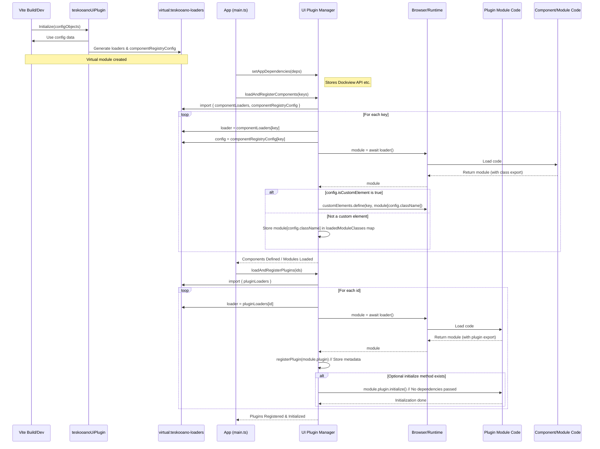

# Architecture: Teskooano UI Plugin System (@teskooano/ui-plugin)

## 1. Goals

The primary goal of this UI Plugin System is to enable a modular and extensible user interface for Teskooano applications. Key objectives include:

- **Build-Time Integration:** Leverages Vite to correctly resolve paths and handle transpilation for dynamically loaded components, modules, and plugins.
- **Configuration-Driven:** Allow UI features (panels, toolbar buttons, etc.) to be enabled, disabled, or swapped primarily through Vite plugin configuration, minimizing direct code changes in the core application for feature toggling.
- **Modularity:** Decouple UI features into self-contained plugin modules.
- **Extensibility:** Provide a clear mechanism for adding new UI features without modifying the plugin system or core application initialization logic (beyond adding to the Vite plugin configuration).
- **Dynamic Loading:** Load code for UI features on demand as defined by the configuration, potentially reducing initial application bundle size and load time.
- **Dependency Management:** Provide a clear way for plugins to access core application services (like Dockview API) without creating tight coupling.

## 2. Core Concepts

- **UI Components/Modules:** Reusable UI building blocks (e.g., `<teskooano-button>`, ModalManager class). Can be custom elements or standard JavaScript/TypeScript classes.
- **Plugins (`TeskooanoPlugin`):** Modules defining metadata for panels, functions, toolbar items, and toolbar widgets.
- **Vite Plugin (`teskooanoUiPlugin`):**
  - Configured in `vite.config.ts` with objects defining components/modules and plugins.
  - Reads the configuration at build/dev time.
  - Generates a _virtual module_ (`virtual:teskooano-loaders`).
  - This virtual module exports:
    - `componentLoaders`: Maps component/module keys to _loader functions_ (e.g., `() => import('/abs/path/to/component.ts')`) containing static import paths Vite can analyze.
    - `pluginLoaders`: Maps plugin IDs to similar _loader functions_.
    - `componentRegistryConfig`: An object containing the configuration metadata passed to the Vite plugin for components/modules (including `className` and `isCustomElement`).
- **Plugin Manager (`pluginManager.ts`):**
  - Imports `componentLoaders`, `pluginLoaders`, and `componentRegistryConfig` from the virtual module.
  - Provides `loadAndRegisterComponents(keys)`: Loads specified modules, defining custom elements if `isCustomElement` is true, otherwise storing the class for retrieval.
  - Provides `loadAndRegisterPlugins(ids)`: Loads specified plugin modules and calls `registerPlugin`.
  - Provides `setAppDependencies(deps)`: Must be called by the application to provide core services (e.g., `dockviewApi`).
  - Provides getter functions (`getPanelConfig`, `getToolbarItemsForTarget`, `getFunctionConfig`, `getToolbarWidgetsForTarget`, `getLoadedModuleClass`) for UI controllers.
  - `getFunctionConfig` wraps the plugin's function to inject dependencies automatically.

## 3. Loading and Registration Flow

1.  **Build/Dev Startup:**

    - The `teskooanoUiPlugin` is initialized in `vite.config.ts` with configuration objects.
    - The plugin generates the `virtual:teskooano-loaders` module containing loader functions and component metadata.

2.  **Application Initialization (`main.ts` or similar):**
    - Imports necessary functions from `@teskooano/ui-plugin`: `loadAndRegisterComponents`, `loadAndRegisterPlugins`, `setAppDependencies`.
    - Imports `componentConfigKeys`, `pluginConfigIds` (arrays of keys/IDs, potentially derived from feature flags or environment variables).
    - Calls `setAppDependencies({ dockviewApi, dockviewController })` **ONCE** to provide core services.
    - Calls `await loadAndRegisterComponents(componentConfigKeys)`: **Phase 1**
      - This function accesses `componentLoaders` and `componentRegistryConfig` from the virtual module.
      - It iterates through keys, calls the corresponding loader function, awaits the import.
      - Based on `componentRegistryConfig[key].isCustomElement`, it either calls `customElements.define` or stores the loaded class internally.
    - Calls `await loadAndRegisterPlugins(pluginConfigIds)`: **Phase 2**
      - This function accesses `pluginLoaders` from the virtual module.
      - It iterates through IDs, calls the loader function, awaits the import, gets the `plugin` export, calls the internal `registerPlugin` helper (which populates metadata registries), and calls the plugin's optional `initialize()` method (without dependencies).

## 4. Consumption Flow

After initialization, UI controllers (e.g., `ToolbarController`, `EngineToolbar`, `DockviewController`) interact with the `PluginManager` to build the dynamic parts of the UI:

1.  **Toolbar Creation:**

    - A toolbar instance (e.g., `EngineToolbar`) is created for a specific target (e.g., `'engine-toolbar'`).
    - It calls `getToolbarItemsForTarget('engine-toolbar')` and potentially `getToolbarWidgetsForTarget('engine-toolbar')` on the `PluginManager`.
    - The `PluginManager` returns arrays of `ToolbarItemConfig` and `ToolbarWidgetConfig` objects registered for that target.
    - The toolbar iterates through the configurations and renders the corresponding buttons (e.g., `<teskooano-button>`) or widgets (using the `componentName` from the widget config, which should correspond to a loaded custom element or require retrieving a class via `getLoadedModuleClass` if it's not a custom element - **TODO**: Clarify widget rendering flow).
    - Click handlers on buttons use the configuration details (e.g., `componentName` for panels, `functionId` for functions) to trigger actions.

2.  **Panel Handling:**

    - When a toolbar button configured to open a panel (`type: 'panel'`) is clicked:
      - The handler retrieves the `componentName` (which must be a defined custom element tag) from the button's configuration.
      - It uses the `DockviewController` (accessing the stored `dockviewApi`) to add a panel using the `componentName`. Dockview uses the already-defined custom element.

3.  **Function Handling:**

    - When a toolbar button configured to execute a function (`type: 'function'`) is clicked:
      - The handler retrieves the `functionId`.
      - It calls `getFunctionConfig(functionId)` on the `PluginManager`.
      - If found, it simply calls the `execute` method returned (e.g., `const func = getFunctionConfig('myFunc'); func.execute(arg1, arg2);`).
      - The wrapper function inside `getFunctionConfig` automatically injects the necessary `PluginExecutionContext` (containing `dockviewApi`, `dockviewController`) before calling the original plugin's function.

4.  **Module Class Retrieval:**
    - If a part of the application needs an instance of a non-custom-element module loaded via `loadAndRegisterComponents` (e.g., a Modal Manager):
      - It calls `getLoadedModuleClass('teskooano-modal-manager')` on the `PluginManager`.
      - If the class is found, it can instantiate it: `const ModalManager = getLoadedModuleClass('teskooano-modal-manager'); const manager = new ModalManager();`.

This architecture ensures that UI controllers remain generic and simply render or invoke based on the configurations provided by the registered plugins, while plugins receive necessary dependencies transparently.

## TODO

- Clarify and document the expected rendering flow for `ToolbarWidgetConfig`. Does the toolbar instantiate components directly, or does it expect the `componentName` to always be a custom element tag?
- Consider error handling strategies for failed component/plugin loading or initialization.
- Evaluate if the dependency injection mechanism needs to be more granular or support different dependency scopes.
