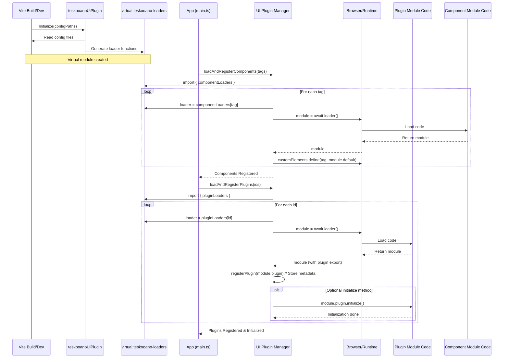

# Architecture: Teskooano UI Plugin System (@teskooano/ui-plugin)

## 1. Goals

The primary goal of this UI Plugin System is to enable a modular and extensible user interface for Teskooano applications. Key objectives include:

- **Build-Time Integration:** Leverages Vite to correctly resolve paths and handle transpilation for dynamically loaded components and plugins.
- **Configuration-Driven:** Allow UI features (panels, toolbar buttons, etc.) to be enabled, disabled, or swapped primarily through configuration files, minimizing direct code changes in the core application for feature toggling.
- **Modularity:** Decouple UI features into self-contained plugin modules.
- **Extensibility:** Provide a clear mechanism for adding new UI features without modifying the plugin system or core application initialization logic (beyond adding to configuration).
- **Dynamic Loading:** Load code for UI features on demand as defined by the configuration, potentially reducing initial application bundle size and load time.
- **Order Guarantee:** Ensure that foundational UI components (e.g., design system elements) are defined and ready before feature plugins that depend on them are loaded and initialized.

## 2. Core Concepts

- **Base Components:** Reusable UI building blocks (e.g., `<teskooano-button>`).
- **Plugins (`TeskooanoPlugin`):** Modules defining metadata for panels, functions, toolbar items.
- **Configuration Objects (`componentRegistry.ts`, `pluginRegistry.ts`):** Map component tags / plugin IDs to their _relative source paths_.
- **Vite Plugin (`teskooanoUiPlugin`):**
  - Reads the config files at build/dev time.
  - Generates a _virtual module_ (`virtual:teskooano-loaders`).
  - This virtual module exports `componentLoaders` and `pluginLoaders` objects.
  - These objects map tags/IDs to _loader functions_ (e.g., `() => import('/abs/path/to/component.ts')`) that contain static import paths Vite can analyze.
- **Plugin Manager (`pluginManager.ts`):**
  - Imports `componentLoaders` and `pluginLoaders` from the virtual module.
  - Provides `loadAndRegisterComponents(tags)` and `loadAndRegisterPlugins(ids)` functions.
  - These functions call the appropriate loader function from the virtual module to perform the dynamic import and then call `customElements.define` or `registerPlugin` respectively.
  - Provides getter functions (`getPanelConfig`, `getToolbarItemsForTarget`, etc.) for UI controllers.

## 3. Loading and Registration Flow

1.  **Build/Dev Startup:**

    - The `teskooanoUiPlugin` is initialized in `vite.config.ts`, provided with absolute paths to the config files.
    - The plugin reads `componentRegistry.ts` and `pluginRegistry.ts`.
    - It generates the `virtual:teskooano-loaders` module containing the loader function maps.

2.  **Application Initialization (`main.ts`):**
    - Imports `loadAndRegisterComponents`, `loadAndRegisterPlugins` from `@teskooano/ui-plugin`.
    - Imports `componentConfig`, `pluginConfig` from local config files.
    - Calls `await loadAndRegisterComponents(Object.keys(componentConfig))`: **Phase 1**
      - This function accesses `componentLoaders` from the virtual module.
      - It iterates through the provided tags, calls the corresponding loader function (`componentLoaders[tag]()`), awaits the import, and calls `customElements.define`.
    - Calls `await loadAndRegisterPlugins(Object.keys(pluginConfig))`: **Phase 2**
      - This function accesses `pluginLoaders` from the virtual module.
      - It iterates through the provided IDs, calls the loader function (`pluginLoaders[id]()`), awaits the import, gets the `plugin` export, calls the internal `registerPlugin` helper (which populates metadata registries), and finally calls the plugin's `initialize()` method.

## 4. Consumption Flow

After initialization, UI controllers (e.g., `ToolbarController`, `EngineToolbar`, `DockviewController`) interact with the `PluginManager` to build the dynamic parts of the UI:

1.  **Toolbar Creation:**

    - A toolbar instance (e.g., `EngineToolbar`) is created for a specific target (e.g., `'engine-toolbar'`).
    - It calls `getToolbarItemsForTarget('engine-toolbar')` on the `PluginManager`.
    - The `PluginManager` returns the array of `ToolbarItemConfig` objects registered for that target.
    - The toolbar iterates through the configurations and renders the corresponding buttons (e.g., `<teskooano-button>`).
    - Click handlers on these buttons use the configuration details (e.g., `componentName` for panels, `functionId` for functions) to trigger actions.

2.  **Panel Handling:**

    - When a toolbar button configured to open a panel (`type: 'panel'`) is clicked:
      - The handler retrieves the `componentName` from the button's configuration.
      - It might optionally call `getPanelConfig(componentName)` if it needs more details (though often the `componentName` is enough for Dockview).
      - It uses the `DockviewController` (or Dockview API directly) to add a panel using the `componentName`. Dockview internally maps this name to the panel class constructor provided during plugin registration (though this mapping is handled by the Dockview setup itself, which needs access to the registered panel classes, potentially via `getPanelConfig`). _Correction:_ Dockview typically needs the component _constructor_ registered with it directly, not just the name. The application's Dockview setup needs to iterate registered `PanelConfig`s from `getPlugins` or similar and register them with the Dockview instance.

3.  **Function Handling:**
    - When a toolbar button configured to execute a function (`type: 'function'`) is clicked:
      - The handler retrieves the `functionId`.
      - It calls `getFunctionConfig(functionId)` on the `PluginManager`.
      - If found, it executes the `execute` method from the retrieved `FunctionConfig`.

This architecture ensures that UI controllers remain generic and simply render or invoke based on the configurations provided by the registered plugins.
