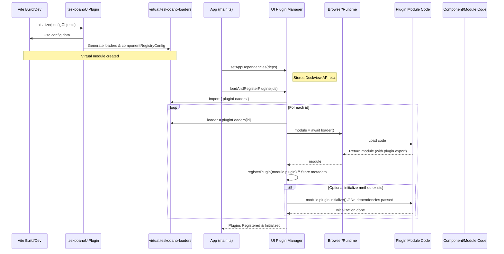
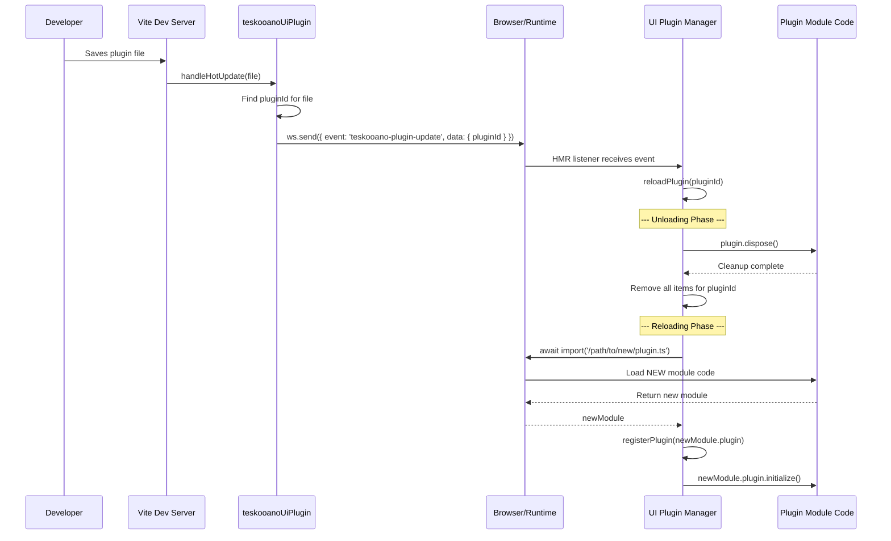

# Architecture: Teskooano UI Plugin System (@teskooano/ui-plugin)

## 1. Goals

The primary goal of this UI Plugin System is to enable a modular and extensible user interface for Teskooano applications. Key objectives include:

- **Build-Time Integration:** Leverages Vite to correctly resolve paths and handle transpilation for dynamically loaded plugin modules.
- **Configuration-Driven:** Allow UI features (panels, toolbar buttons, managers, components) to be enabled/disabled primarily through Vite plugin configuration, minimizing direct code changes in the core application.
- **Modularity:** Decouple UI features into self-contained plugin modules.
- **Extensibility:** Provide a clear mechanism for adding new UI features without modifying the plugin system (beyond adding to the Vite plugin configuration).
- **Dynamic Loading:** Load code for UI features on demand as defined by the configuration.
- **Dependency Management:** Provide a clear way for plugins and instantiated managers to access core application services (like Dockview API) without creating tight coupling.
- **Singleton Management:** Use a singleton `PluginManager` class for a single source of truth.
- **Asynchronous Status:** Provide an RxJS Observable (`pluginStatus$`) to track plugin loading and initialization progress.

## 2. Core Concepts

- **Plugins (`TeskooanoPlugin`):** Modules exporting a configuration object defining metadata for panels, functions, toolbar items/widgets, manager classes, and components associated with that plugin.
- **Vite Plugin (`teskooanoUiPlugin`):**
  - Configured in `vite.config.ts` with an array of _absolute paths_ to plugin registry configuration files (`pluginRegistryPaths`).
  - Reads these configuration files at build/dev time.
  - Generates a _virtual module_ (`virtual:teskooano-loaders`).
  - This virtual module exports `pluginLoaders`: Maps plugin IDs to _loader functions_ (e.g., `() => import('/abs/path/to/plugin.ts')`) containing static import paths Vite can analyze.
- **Plugin Manager (`pluginManager.ts`):**
  - Implemented as a **singleton class** (`PluginManager.getInstance()`).
  - Imports `pluginLoaders` from the virtual module.
  - Provides `setAppDependencies(deps)`: Must be called by the application **ONCE** to provide core services (e.g., `dockviewApi`, `dockviewController`).
  - Provides `loadAndRegisterPlugins(ids)`: Asynchronously loads specified plugin modules using the loaders, calls the internal `registerPlugin` method, which:
    - Stores plugin metadata.
    - Instantiates manager classes defined in the plugin (`managerClasses`).
    - Defines custom elements defined in the plugin (`components` and `panelClass`).
    - Calls the plugin's optional `initialize()` method.
    - Emits status updates via the `pluginStatus$` observable.
  - Provides getter functions (`getPanelConfig`, `getToolbarItemsForTarget`, `getFunctionConfig`, `getToolbarWidgetsForTarget`, `getManagerInstance`) for UI controllers to access registered items.
  - `execute` function (for executing registered plugin functions) automatically injects dependencies.
  - Provides `pluginStatus$: Observable<PluginRegistrationStatus>` to monitor loading.

## 3. Loading and Registration Flow

1.  **Build/Dev Startup:**

    - The `teskooanoUiPlugin` is initialized in `vite.config.ts` with `pluginRegistryPaths`.
    - The plugin reads the specified config files.
    - The plugin generates the `virtual:teskooano-loaders` module containing `pluginLoaders`.

2.  **Application Initialization (`main.ts` or similar):**
    - Get the singleton instance: `const pluginManager = PluginManager.getInstance();`
    - **Set Dependencies:** Call `pluginManager.setAppDependencies({ dockviewApi, dockviewController });` **ONCE**.
    - **(Optional) Subscribe:** `pluginManager.pluginStatus$.subscribe(...)`.
    - **Load Plugins:** Call `await pluginManager.loadAndRegisterPlugins(pluginIdsToLoad);`
      - The manager iterates through the requested IDs.
      - For each ID, it gets the loader function from `virtual:teskooano-loaders`.
      - It calls the loader (`await loader()`) to dynamically import the plugin module.
      - It calls the internal `registerPlugin(pluginModule.plugin)` method.
      - `registerPlugin` processes the metadata:
        - Stores panel, function, toolbar configs.
        - Instantiates classes from `managerClasses`, stores instances, and calls `setDependencies` on them if available and dependencies are set.
        - Defines custom elements using `customElements.define` for `components` and panel `panelClass`.
      - Calls the plugin's optional `initialize()` function.
      - Emits status updates (loading, registering, initializing, completed, error) via `pluginStatus$`.

## 4. Consumption Flow

After initialization, UI controllers (e.g., `ToolbarController`, `EngineToolbar`, `DockviewController`) interact with the `PluginManager` to build the dynamic parts of the UI:

1.  **Toolbar Creation:**

    - A toolbar instance (e.g., `EngineToolbar`) is created for a specific target (e.g., `'engine-toolbar'`).
    - It calls `getToolbarItemsForTarget('engine-toolbar')` and potentially `getToolbarWidgetsForTarget('engine-toolbar')` on the `PluginManager`.
    - The `PluginManager` returns arrays of `ToolbarItemConfig` and `ToolbarWidgetConfig` objects registered for that target.
    - The toolbar iterates through the configurations and renders the corresponding buttons (e.g., `<teskooano-button>`) or widgets (using the `componentName` from the widget config, which should correspond to a loaded custom element or require retrieving a class via `getLoadedModuleClass` if it's not a custom element - **TODO**: Clarify widget rendering flow).
    - Click handlers on buttons use the configuration details (e.g., `componentName` for panels, `functionId` for functions) to trigger actions.

2.  **Panel Handling:**

    - When a toolbar button configured to open a panel (`type: 'panel'`) is clicked:
      - The handler retrieves the `componentName` (which must be a defined custom element tag) from the button's configuration.
      - It uses the `DockviewController` (accessing the stored `dockviewApi`) to add a panel using the `componentName`. Dockview uses the already-defined custom element.

3.  **Function Handling:**

    - When a toolbar button configured to execute a function (`type: 'function'`) is clicked:
      - The handler retrieves the `functionId`.
      - It calls `getFunctionConfig(functionId)` on the `PluginManager`.
      - If found, it simply calls the `execute` method returned (e.g., `const func = getFunctionConfig('myFunc'); func.execute(arg1, arg2);`).
      - The wrapper function inside `getFunctionConfig` automatically injects the necessary `PluginExecutionContext` (containing `dockviewApi`, `dockviewController`) before calling the original plugin's function.

4.  **Module Class Retrieval:**
    - If a part of the application needs an instance of a non-custom-element module loaded via `loadAndRegisterComponents` (e.g., a Modal Manager):
      - It calls `getLoadedModuleClass('teskooano-modal-manager')` on the `PluginManager`.
      - If the class is found, it can instantiate it: `const ModalManager = getLoadedModuleClass('teskooano-modal-manager'); const manager = new ModalManager();`.

This architecture ensures that UI controllers remain generic and simply render or invoke based on the configurations provided by the registered plugins, while plugins receive necessary dependencies transparently.

## 5. HMR (Hot Module Replacement) and Unloading Flow

The system supports HMR for a better development experience.

1.  **File Change:** A developer saves a file belonging to a registered plugin module.
2.  **Vite Server:**
    - The `teskooanoUiPlugin`'s `handleHotUpdate` hook is triggered.
    - It looks up the changed file path in its internal map to find the corresponding `pluginId`.
    - If found, it sends a custom WebSocket message (`teskooano-plugin-update`) to the client with the `pluginId`.
3.  **Browser Client (`PluginManager`):**
    - The `PluginManager` listens for the `teskooano-plugin-update` event.
    - Upon receiving the event, it triggers `reloadPlugin(pluginId)`.
    - This method first calls `unloadPlugin(pluginId)`:
        - It calls the plugin's optional `dispose()` method for cleanup.
        - It removes all panels, functions, toolbar items, and manager instances associated with that plugin from its registries.
    - Then, it calls `loadAndRegisterPlugins([pluginId])` to load the new module version and register it, following the standard initialization flow.

## 6. Consumption Flow

After initialization, UI controllers (e.g., `ToolbarController`, `EngineToolbar`, `DockviewController`) interact with the `PluginManager` to build the dynamic parts of the UI:

1.  **Toolbar Creation:**

    - A toolbar instance (e.g., `EngineToolbar`) is created for a specific target (e.g., `'engine-toolbar'`).
    - It calls `getToolbarItemsForTarget('engine-toolbar')` and potentially `getToolbarWidgetsForTarget('engine-toolbar')` on the `PluginManager`.
    - The `PluginManager` returns arrays of `ToolbarItemConfig` and `ToolbarWidgetConfig` objects registered for that target.
    - The toolbar iterates through the configurations and renders the corresponding buttons (e.g., `<teskooano-button>`) or widgets (using the `componentName` from the widget config, which should correspond to a loaded custom element or require retrieving a class via `getLoadedModuleClass` if it's not a custom element - **TODO**: Clarify widget rendering flow).
    - Click handlers on buttons use the configuration details (e.g., `componentName` for panels, `functionId` for functions) to trigger actions.

2.  **Panel Handling:**

    - When a toolbar button configured to open a panel (`type: 'panel'`) is clicked:
      - The handler retrieves the `componentName` (which must be a defined custom element tag) from the button's configuration.
      - It uses the `DockviewController` (accessing the stored `dockviewApi`) to add a panel using the `componentName`. Dockview uses the already-defined custom element.

3.  **Function Handling:**

    - When a toolbar button configured to execute a function (`type: 'function'`) is clicked:
      - The handler retrieves the `functionId`.
      - It calls `getFunctionConfig(functionId)` on the `PluginManager`.
      - If found, it simply calls the `execute` method returned (e.g., `const func = getFunctionConfig('myFunc'); func.execute(arg1, arg2);`).
      - The wrapper function inside `getFunctionConfig` automatically injects the necessary `PluginExecutionContext` (containing `dockviewApi`, `dockviewController`) before calling the original plugin's function.

4.  **Module Class Retrieval:**
    - If a part of the application needs an instance of a non-custom-element module loaded via `loadAndRegisterComponents` (e.g., a Modal Manager):
      - It calls `getLoadedModuleClass('teskooano-modal-manager')` on the `PluginManager`.
      - If the class is found, it can instantiate it: `const ModalManager = getLoadedModuleClass('teskooano-modal-manager'); const manager = new ModalManager();`.

This architecture ensures that UI controllers remain generic and simply render or invoke based on the configurations provided by the registered plugins, while plugins receive necessary dependencies transparently.

## TODO

- Clarify and document the expected rendering flow for `ToolbarWidgetConfig`. Does the toolbar instantiate components directly, or does it expect the `componentName` to always be a custom element tag?
- Consider error handling strategies for failed plugin loading or initialization (currently emits error status via observable).
- Evaluate if the dependency injection mechanism needs to be more granular or support different dependency scopes.
- Update Mermaid diagram to reflect singleton manager and removal of component loading phase.
