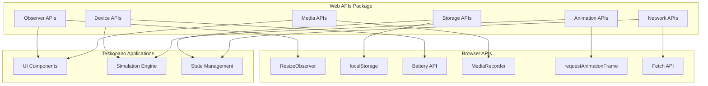
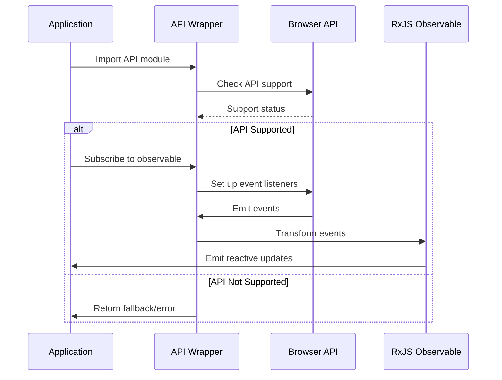
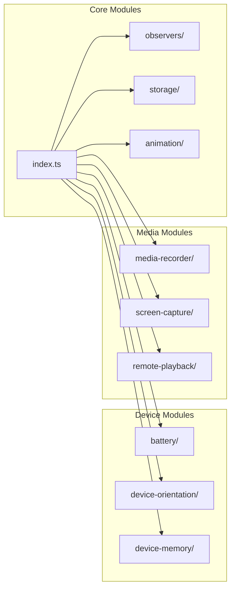

# AGENTS.md

A comprehensive guide for AI coding agents working on the Teskooano Web APIs package.

## Package Overview

The **`@teskooano/web-apis`** package provides utility functions and RxJS Observables built on top of standard browser Web APIs. It serves as a comprehensive wrapper layer that simplifies common browser API interactions, improves performance through reactive patterns, and provides consistent interfaces for interacting with browser features within the Teskooano engine applications.

### Purpose

- **Web API Abstraction**: Consistent, reusable interfaces for browser Web APIs
- **Reactive Patterns**: RxJS-based observables and state management for event-driven APIs
- **Performance Optimization**: Efficient wrappers that reduce boilerplate and improve performance
- **Cross-Browser Compatibility**: Handles browser inconsistencies and provides fallbacks
- **Developer Experience**: Simplified APIs with automatic JSON handling, permission management, and error handling

## Package Architecture

### Directory Structure

```
packages/app/web-apis/
├── src/
│   ├── index.ts                    # Main package exports
│   ├── animation/                  # Animation API wrappers
│   │   └── index.ts               # requestAnimationFrame helpers and observables
│   ├── background-tasks/          # Background Tasks API
│   │   └── index.ts               # requestIdleCallback helpers
│   ├── battery/                   # Battery Status API
│   │   └── index.ts               # Battery state management
│   ├── clipboard/                 # Clipboard API
│   │   └── index.ts               # Text clipboard operations
│   ├── device-memory/             # Device Memory API
│   │   └── index.ts               # Device memory information
│   ├── device-orientation/        # Device Orientation API
│   │   └── index.ts               # Orientation events with permission handling
│   ├── drag-and-drop/             # HTML Drag and Drop API
│   │   └── index.ts               # Drag and drop helpers
│   ├── fullscreen/                # Fullscreen API
│   │   └── index.ts               # Fullscreen state management
│   ├── gamepad/                   # Gamepad API
│   │   └── index.ts               # Gamepad state and events
│   ├── idle-detection/            # Idle Detection API
│   │   └── index.ts               # User idle state monitoring
│   ├── invoker-commands/          # Invoker Commands API
│   │   └── index.ts               # Experimental invoker commands
│   ├── media-recorder/            # MediaRecorder API
│   │   └── index.ts               # Media recording functionality
│   ├── network/                   # Network API
│   │   └── index.ts               # Enhanced fetch wrapper
│   ├── observers/                 # Observer APIs
│   │   ├── index.ts               # Observer module exports
│   │   ├── intersection.ts        # IntersectionObserver
│   │   ├── mutation.ts            # MutationObserver
│   │   ├── performance.ts         # PerformanceObserver
│   │   └── resize.ts              # ResizeObserver
│   ├── popover/                   # Popover API
│   │   ├── index.ts               # Popover utilities
│   │   ├── popover.spec.ts        # Popover tests
│   │   └── popover.ts             # Popover implementation
│   ├── remote-playback/           # Remote Playback API
│   │   └── index.ts               # Remote playback functionality
│   ├── resizeObserver.ts          # Legacy ResizeObserver wrapper
│   ├── screen-capture/            # Screen Capture API
│   │   └── index.ts               # Screen capture functionality
│   ├── storage/                   # Storage APIs
│   │   └── index.ts               # localStorage/sessionStorage wrappers
│   └── workers/                   # Web Workers API
│       └── index.ts               # Worker management helpers
├── package.json
├── moon.yml
├── tsconfig.json
├── vitest.config.ts
├── README.md
├── ARCHITECTURE.md
├── CHANGELOG.md
└── TODO.md
```

### Core Design Principles

#### 1. Modular Architecture

Each Web API is contained within its own directory with a clear separation of concerns:

```typescript
// Each module exports its functionality
export * as AnimationAPI from "./animation";
export * as StorageAPI from "./storage";
export * as GamepadAPI from "./gamepad";
```

#### 2. Consistent Interface Patterns

The package provides three main interface patterns:

**Helper Functions**: Simple wrappers for direct API calls

```typescript
// Example: Fullscreen API helpers
export function requestFullscreen(element: Element): Promise<void>;
export function exitFullscreen(): Promise<void>;
export function toggleFullscreen(element: Element): Promise<void>;
```

**RxJS Observables**: For event-based APIs providing streams of data

```typescript
// Example: Animation frames observable
export const animationFrames$ = new Observable<DOMHighResTimeStamp>(
  (observer) => {
    // Implementation using requestAnimationFrame
  },
);
```

**Reactive Stores**: For stateful APIs where reactive state management makes sense

```typescript
// Example: Battery state store
export const batteryState$ = new BehaviorSubject<BatteryState>(
  initialBatteryState,
);
```

#### 3. Abstraction and Error Handling

Wrappers hide browser API inconsistencies and provide comprehensive error handling:

```typescript
// Example: Storage wrapper with automatic JSON handling
export class BaseStorageWrapper {
  getItem<T>(key: string): T | null {
    try {
      const item = this.storage.getItem(key);
      return item ? (JSON.parse(item) as T) : null;
    } catch (error) {
      console.error(`Error getting item "${key}" from storage:`, error);
      return null;
    }
  }
}
```

## Key Components

### 1. Observer APIs System

Comprehensive observer pattern implementation for browser observer APIs:

```typescript
// ResizeObserver with both callback and observable patterns
export function observeResize(
  element: Element,
  callback: SimpleResizeObserverCallback,
  options?: ResizeObserverOptions,
): () => void;

export function observeResize$(
  element: Element,
  options?: ResizeObserverOptions,
): Observable<ResizeObserverEntry[]>;

// Similar patterns for IntersectionObserver, MutationObserver, PerformanceObserver
```

**Features:**

- **Dual Interface**: Both callback-based and observable-based APIs
- **Automatic Cleanup**: Returns cleanup functions for proper resource management
- **Browser Support**: Graceful fallbacks for unsupported environments
- **Type Safety**: Full TypeScript support with proper event types

### 2. Storage API Wrappers

Enhanced storage APIs with automatic JSON serialization:

```typescript
// Base storage wrapper with JSON handling
abstract class BaseStorageWrapper {
  protected storage: Storage;

  getItem<T>(key: string): T | null;
  setItem<T>(key: string, value: T): void;
  removeItem(key: string): void;
  clear(): void;
}

// Specific implementations
export const safeLocalStorage = new LocalStorageWrapper();
export const safeSessionStorage = new SessionStorageWrapper();
```

**Features:**

- **Automatic JSON**: Seamless serialization/deserialization
- **Type Safety**: Generic type support for stored values
- **Error Handling**: Comprehensive error handling with logging
- **Environment Checks**: Proper browser environment validation

### 3. Animation API System

Advanced animation loop management with reactive patterns:

```typescript
// Animation loop controls
export interface AnimationLoopControls {
  start: () => void;
  stop: () => void;
  isRunning: () => boolean;
}

export function createAnimationLoop(
  callback: AnimationLoopCallback,
): AnimationLoopControls;

// Reactive animation frames
export const animationFrames$ = new Observable<DOMHighResTimeStamp>(
  (observer) => {
    // Implementation using requestAnimationFrame
  },
);
```

**Features:**

- **Controllable Loops**: Start/stop controls with status checking
- **Reactive Frames**: Observable stream of animation frame timestamps
- **Resource Management**: Proper cleanup and memory management
- **Performance**: Efficient requestAnimationFrame usage

### 4. Gamepad API Integration

Comprehensive gamepad state management with reactive updates:

```typescript
// Gamepad state interface
export interface GamepadState {
  gamepads: (Gamepad | null)[];
  isSupported: boolean;
}

// Reactive gamepad state
export const gamepadState$: Observable<GamepadState> =
  new Observable<GamepadState>((subscriber) => {
    // Polling-based state management with connection event handling
  });
```

**Features:**

- **Real-time State**: Continuous polling for button/axis changes
- **Connection Events**: Automatic handling of connect/disconnect events
- **Performance Optimization**: Efficient polling with change detection
- **Browser Support**: Graceful fallbacks for unsupported browsers

### 5. Device APIs with Permission Handling

Advanced device API integration with proper permission management:

```typescript
// Device orientation with iOS 13+ permission handling
export interface DeviceOrientationData {
  alpha: number | null;
  beta: number | null;
  gamma: number | null;
  absolute: boolean;
  isSupported: boolean;
  permissionState: PermissionState | "prompt";
  error?: string;
}

export async function requestDeviceOrientationPermission(): Promise<boolean>;
export const deviceOrientation$ = createOrientationObservable().pipe(
  shareReplay({ bufferSize: 1, refCount: true }),
);
```

**Features:**

- **Permission Management**: Proper handling of iOS 13+ permission requirements
- **Error Handling**: Comprehensive error states and messaging
- **Reactive Updates**: Real-time orientation data streams
- **Cross-Platform**: Handles different browser implementations

### 6. Battery Status Monitoring

Reactive battery state management with automatic updates:

```typescript
// Battery state interface
export interface BatteryState {
  charging: boolean;
  chargingTime: number;
  dischargingTime: number;
  level: number;
  isSupported: boolean;
}

// Reactive battery store
export const batteryState$ = new BehaviorSubject<BatteryState>(
  initialBatteryState,
);
```

**Features:**

- **Automatic Initialization**: Self-initializing battery monitoring
- **Event Handling**: Listens to all battery state change events
- **Cleanup Management**: Proper resource cleanup on application shutdown
- **Error Resilience**: Graceful handling of API failures

## Usage Examples

### 1. Basic Animation Loop

```typescript
import { AnimationAPI } from "@teskooano/web-apis";

// Create controllable animation loop
const animLoop = AnimationAPI.createAnimationLoop((timestamp) => {
  console.log("Frame time:", timestamp);
  if (timestamp > 3000) animLoop.stop();
});

animLoop.start();

// Or use reactive animation frames
const frameSub = AnimationAPI.animationFrames$.subscribe((timestamp) => {
  console.log("Frame time:", timestamp);
});
```

### 2. Storage with JSON Handling

```typescript
import { StorageAPI } from "@teskooano/web-apis";

// Automatic JSON serialization/deserialization
StorageAPI.safeLocalStorage.setItem("settings", { volume: 0.8, theme: "dark" });
const settings = StorageAPI.safeLocalStorage.getItem<{
  volume: number;
  theme: string;
}>("settings");
console.log(settings?.volume); // 0.8

// Session storage with type safety
StorageAPI.safeSessionStorage.setItem("tempData", {
  userId: 123,
  sessionId: "abc",
});
const tempData = StorageAPI.safeSessionStorage.getItem<{
  userId: number;
  sessionId: string;
}>("tempData");
```

### 3. Observer Pattern Usage

```typescript
import { ObserversAPI } from "@teskooano/web-apis";

// ResizeObserver with callback
const elementToWatch = document.getElementById("resizable-panel");
if (elementToWatch) {
  const cleanup = ObserversAPI.observeResize(elementToWatch, (entry) => {
    console.log("Element resized:", entry.contentRect);
  });

  // Later cleanup
  cleanup();
}

// ResizeObserver with observable
const resizeSub = ObserversAPI.observeResize$(elementToWatch).subscribe(
  (entries) => {
    const entry = entries[0];
    console.log("Element resized (via Observable):", entry.contentRect);
  },
);
```

### 4. Device Orientation with Permissions

```typescript
import { DeviceOrientationAPI } from "@teskooano/web-apis";

// Request permission on user interaction (required for iOS 13+)
async function enableOrientation() {
  try {
    const permission =
      await DeviceOrientationAPI.requestDeviceOrientationPermission();
    if (permission) {
      console.log("Device orientation permission granted.");

      // Now safe to subscribe
      DeviceOrientationAPI.deviceOrientation$.subscribe((orientation) => {
        if (orientation.error) {
          console.error("Orientation Error:", orientation.error);
          return;
        }
        console.log(
          `Orientation: alpha=${orientation.alpha?.toFixed(2)}, beta=${orientation.beta?.toFixed(2)}`,
        );
      });
    } else {
      console.warn("Device orientation permission denied.");
    }
  } catch (error) {
    console.error("Failed to request orientation permission:", error);
  }
}

// Call from user interaction
document
  .getElementById("enable-orientation")
  ?.addEventListener("click", enableOrientation);
```

### 5. Gamepad State Monitoring

```typescript
import { GamepadAPI } from "@teskooano/web-apis";

// Monitor gamepad state
const gamepadSub = GamepadAPI.gamepadState$.subscribe((state) => {
  if (state.isSupported && state.gamepads[0]) {
    const gamepad = state.gamepads[0];
    console.log("Gamepad 0 buttons:", gamepad.buttons);
    console.log("Gamepad 0 axes:", gamepad.axes);
  }
});

// Get current state non-reactively
const currentState = GamepadAPI.getCurrentGamepadState();
console.log(
  "Connected gamepads:",
  currentState.gamepads.filter((g) => g !== null).length,
);
```

### 6. Battery Status Monitoring

```typescript
import { BatteryAPI } from "@teskooano/web-apis";

// Monitor battery state
const batterySub = BatteryAPI.batteryState$.subscribe((battery) => {
  if (battery.isSupported) {
    console.log(`Battery: ${(battery.level * 100).toFixed(1)}%`);
    console.log(`Charging: ${battery.charging ? "Yes" : "No"}`);
    if (battery.charging) {
      console.log(`Time to full: ${battery.chargingTime}s`);
    } else {
      console.log(`Time remaining: ${battery.dischargingTime}s`);
    }
  } else {
    console.log("Battery API not supported");
  }
});

// Cleanup when done
// batterySub.unsubscribe();
```

### 7. Fullscreen API Usage

```typescript
import { FullscreenAPI } from "@teskooano/web-apis";

// Fullscreen operations
async function toggleFullscreenMode() {
  try {
    if (FullscreenAPI.isFullscreenActive()) {
      await FullscreenAPI.exitFullscreen();
    } else {
      await FullscreenAPI.requestFullscreen(document.documentElement);
    }
  } catch (error) {
    console.error("Fullscreen operation failed:", error);
  }
}

// Monitor fullscreen state changes
const fullscreenSub = FullscreenAPI.fullscreenChange$.subscribe(
  (isFullscreen) => {
    console.log("Fullscreen state:", isFullscreen ? "Active" : "Inactive");
  },
);
```

### 8. Clipboard Operations

```typescript
import { ClipboardAPI } from "@teskooano/web-apis";

// Clipboard operations
async function copyToClipboard(text: string) {
  try {
    if (ClipboardAPI.isClipboardSupported()) {
      await ClipboardAPI.writeTextToClipboard(text);
      console.log("Text copied to clipboard");
    } else {
      console.warn("Clipboard API not supported");
    }
  } catch (error) {
    console.error("Failed to copy to clipboard:", error);
  }
}

async function readFromClipboard() {
  try {
    const text = await ClipboardAPI.readTextFromClipboard();
    console.log("Clipboard content:", text);
  } catch (error) {
    console.error("Failed to read from clipboard:", error);
  }
}
```

## Performance Guidelines

### 1. Observable Management

- **Share Observables**: Use `share()` and `shareReplay()` to prevent multiple subscriptions
- **Proper Cleanup**: Always unsubscribe from observables to prevent memory leaks
- **RefCount**: Use `refCount: true` for automatic cleanup when no subscribers remain

```typescript
// Good: Shared observable with refCount
export const deviceOrientation$ = createOrientationObservable().pipe(
  shareReplay({ bufferSize: 1, refCount: true }),
);

// Good: Proper cleanup
const subscription = deviceOrientation$.subscribe(handleOrientation);
// Later...
subscription.unsubscribe();
```

### 2. Resource Management

- **Observer Cleanup**: Always call cleanup functions returned by observer helpers
- **Event Listener Cleanup**: Properly remove event listeners to prevent memory leaks
- **Animation Frame Cleanup**: Cancel animation frames when stopping loops

```typescript
// Good: Proper observer cleanup
const cleanup = observeResize(element, callback);
// Later...
cleanup();

// Good: Animation loop cleanup
const animLoop = createAnimationLoop(callback);
animLoop.start();
// Later...
animLoop.stop();
```

### 3. Browser Support Optimization

- **Feature Detection**: Check for API support before using
- **Graceful Fallbacks**: Provide fallbacks for unsupported APIs
- **Error Boundaries**: Wrap API calls in try-catch blocks

```typescript
// Good: Feature detection
if (typeof ResizeObserver !== "undefined") {
  // Use ResizeObserver
} else {
  console.warn("ResizeObserver not supported");
  // Provide fallback or alternative
}
```

### 4. Memory Efficiency

- **Lazy Initialization**: Initialize APIs only when needed
- **State Caching**: Use BehaviorSubject for stateful APIs to cache current values
- **Change Detection**: Use `distinctUntilChanged()` to prevent unnecessary updates

```typescript
// Good: Lazy initialization
let batteryManager: BatteryManager | null = null;

function initializeBatteryMonitor() {
  if (batteryManager) return; // Already initialized
  // Initialize only when needed
}

// Good: Change detection
export const deviceOrientation$ = fromEvent(window, "deviceorientation").pipe(
  distinctUntilChanged(
    (prev, curr) =>
      prev.alpha === curr.alpha &&
      prev.beta === curr.beta &&
      prev.gamma === curr.gamma,
  ),
);
```

## Testing Strategy

### 1. Unit Testing with Vitest

Focus on testing wrapper logic rather than browser APIs:

```typescript
// Example: Storage wrapper tests
import { describe, it, expect, vi } from "vitest";
import { safeLocalStorage } from "../storage";

describe("StorageAPI", () => {
  it("should serialize and deserialize JSON", () => {
    const testData = { name: "test", value: 123 };
    safeLocalStorage.setItem("test", testData);
    const retrieved = safeLocalStorage.getItem<typeof testData>("test");
    expect(retrieved).toEqual(testData);
  });

  it("should handle invalid JSON gracefully", () => {
    // Mock localStorage to return invalid JSON
    vi.spyOn(Storage.prototype, "getItem").mockReturnValue("invalid json");
    const result = safeLocalStorage.getItem("test");
    expect(result).toBeNull();
  });
});
```

### 2. Integration Testing with Playwright

For APIs requiring user interaction:

```typescript
// Example: Fullscreen API tests
import { test, expect } from "@playwright/test";

test("fullscreen API should work", async ({ page }) => {
  await page.goto("/test-page");

  // Test fullscreen request
  await page.click("#fullscreen-button");
  await expect(page.locator("body")).toHaveClass(/fullscreen/);

  // Test fullscreen exit
  await page.click("#exit-fullscreen-button");
  await expect(page.locator("body")).not.toHaveClass(/fullscreen/);
});
```

### 3. Observable Testing

Test reactive patterns and state management:

```typescript
// Example: Battery state tests
import { describe, it, expect, vi } from "vitest";
import { batteryState$ } from "../battery";

describe("BatteryAPI", () => {
  it("should emit battery state changes", (done) => {
    const subscription = batteryState$.subscribe((state) => {
      expect(state).toHaveProperty("level");
      expect(state).toHaveProperty("charging");
      expect(state).toHaveProperty("isSupported");
      subscription.unsubscribe();
      done();
    });
  });
});
```

### 4. Mock Browser APIs

Mock browser APIs for consistent testing:

```typescript
// Example: Mock ResizeObserver
import { vi } from "vitest";

const mockResizeObserver = vi.fn();
mockResizeObserver.mockReturnValue({
  observe: vi.fn(),
  unobserve: vi.fn(),
  disconnect: vi.fn(),
});

Object.defineProperty(window, "ResizeObserver", {
  writable: true,
  configurable: true,
  value: mockResizeObserver,
});
```

## Troubleshooting Guide

### 1. Common Issues

#### Observable Not Emitting

```typescript
// ❌ Problem: Observable not emitting
const orientation$ = deviceOrientation$;
orientation$.subscribe(console.log); // No output

// ✅ Solution: Check permission state
const permission = await requestDeviceOrientationPermission();
if (permission) {
  deviceOrientation$.subscribe(console.log); // Now works
}
```

#### Memory Leaks

```typescript
// ❌ Problem: Memory leak from unsubscribed observables
const sub1 = animationFrames$.subscribe(handleFrame);
const sub2 = gamepadState$.subscribe(handleGamepad);
// Never unsubscribe

// ✅ Solution: Proper cleanup
const subscriptions = [
  animationFrames$.subscribe(handleFrame),
  gamepadState$.subscribe(handleGamepad),
];

// Later cleanup
subscriptions.forEach((sub) => sub.unsubscribe());
```

#### Browser Compatibility Issues

```typescript
// ❌ Problem: API not available
const battery = await navigator.getBattery(); // Error in some browsers

// ✅ Solution: Check support first
if (navigator.getBattery) {
  const battery = await navigator.getBattery();
} else {
  console.warn("Battery API not supported");
}
```

### 2. Permission Issues

#### iOS 13+ Device Orientation

```typescript
// ❌ Problem: Device orientation not working on iOS
deviceOrientation$.subscribe(console.log); // No events

// ✅ Solution: Request permission on user interaction
document.getElementById("button").addEventListener("click", async () => {
  const permission = await requestDeviceOrientationPermission();
  if (permission) {
    deviceOrientation$.subscribe(console.log); // Now works
  }
});
```

#### Idle Detection Permission

```typescript
// ❌ Problem: Idle detection not working
idleState$.subscribe(console.log); // Permission denied

// ✅ Solution: Request permission first
const permission = await requestIdleDetectionPermission();
if (permission === "granted") {
  idleState$.subscribe(console.log); // Now works
}
```

### 3. Performance Issues

#### Excessive Polling

```typescript
// ❌ Problem: Gamepad polling too frequently
gamepadState$.subscribe(handleGamepad); // Polls every frame

// ✅ Solution: Use distinctUntilChanged
gamepadState$
  .pipe(
    distinctUntilChanged(
      (prev, curr) => JSON.stringify(prev) === JSON.stringify(curr),
    ),
  )
  .subscribe(handleGamepad);
```

#### Memory Leaks from Observers

```typescript
// ❌ Problem: ResizeObserver not cleaned up
observeResize(element, callback); // Never cleaned up

// ✅ Solution: Store cleanup function
const cleanup = observeResize(element, callback);
// Later...
cleanup();
```

## Dependencies and Integration Points

### 1. Core Dependencies

```json
{
  "dependencies": {
    "rxjs": "7.8.2"
  },
  "devDependencies": {
    "typescript": "5.9.2",
    "vitest": "3.2.4",
    "@types/web": "0.0.269"
  }
}
```

### 2. Integration with Teskooano Ecosystem

- **State Management**: Integrates with `@teskooano/core-state` for reactive state
- **UI Components**: Used by `@teskooano/ui-plugin` for browser API interactions
- **Simulation**: Provides device APIs for `@teskooano/app-simulation`
- **Design System**: Integrates with `@teskooano/design-system` for responsive behavior

### 3. Browser API Dependencies

- **Standard APIs**: ResizeObserver, IntersectionObserver, MutationObserver, PerformanceObserver
- **Storage APIs**: localStorage, sessionStorage
- **Device APIs**: Battery Status, Device Orientation, Device Memory
- **Media APIs**: MediaRecorder, Screen Capture, Remote Playback
- **Experimental APIs**: Idle Detection, Popover, Invoker Commands

## Contributing Guidelines

### 1. Adding New Web API Wrappers

- **Follow Patterns**: Use established patterns (helper functions, observables, stores)
- **Error Handling**: Include comprehensive error handling and browser support checks
- **Type Safety**: Provide full TypeScript support with proper interfaces
- **Documentation**: Include JSDoc comments and usage examples

### 2. Code Style Standards

- **TypeScript**: Use strict TypeScript with explicit types
- **RxJS**: Follow reactive programming patterns with proper cleanup
- **Error Handling**: Use try-catch blocks and provide meaningful error messages
- **Browser Support**: Check for API availability before use

### 3. Testing Requirements

- **Unit Tests**: Test wrapper logic and error handling
- **Integration Tests**: Test user interaction scenarios with Playwright
- **Mock APIs**: Mock browser APIs for consistent testing
- **Coverage**: Maintain high test coverage for critical functionality

## Architecture Documentation

### 1. System Overview



### 2. Data Flow



### 3. Module Dependencies



## Scientific References

### 1. Web API Standards

- **W3C Web APIs**: Official Web API specifications and standards
- **MDN Web APIs**: Comprehensive documentation and browser compatibility
- **Web Platform Tests**: Test suite for Web API implementations
- **Browser Compatibility**: Cross-browser compatibility and feature detection

### 2. Reactive Programming

- **RxJS Documentation**: Official RxJS documentation and best practices
- **Reactive Programming**: Principles and patterns of reactive programming
- **Observable Patterns**: Design patterns for observable-based architectures
- **Memory Management**: Best practices for reactive memory management

### 3. Performance Optimization

- **Web Performance**: Browser performance optimization techniques
- **Memory Management**: JavaScript memory management and garbage collection
- **Event Handling**: Efficient event handling and listener management
- **Resource Cleanup**: Proper resource cleanup and memory leak prevention

### 4. Browser Compatibility

- **Can I Use**: Browser compatibility database for Web APIs
- **Web API Support**: Browser support matrices and feature detection
- **Polyfill Strategies**: Strategies for providing fallbacks and polyfills
- **Progressive Enhancement**: Progressive enhancement techniques for Web APIs

---

**Remember**: The Web APIs package is the bridge between browser capabilities and the Teskooano engine. Always check browser support, handle permissions properly, and provide graceful fallbacks. The reactive patterns ensure efficient resource usage and proper cleanup across all browser APIs.
