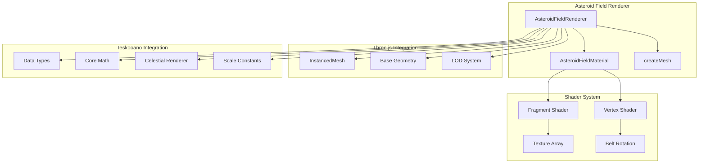
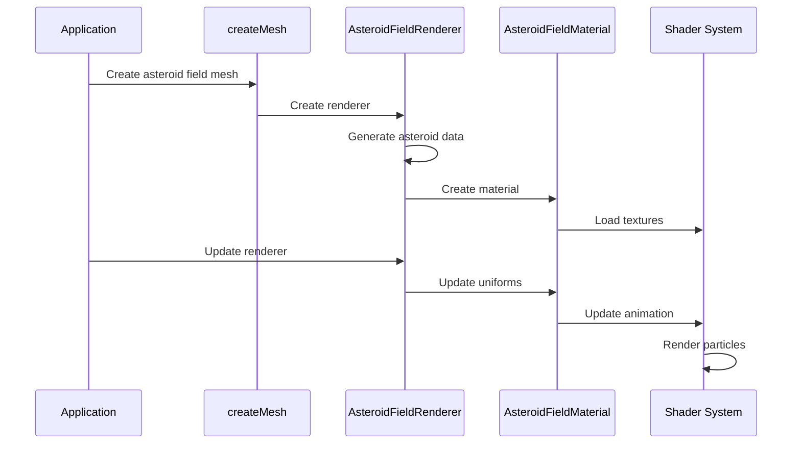
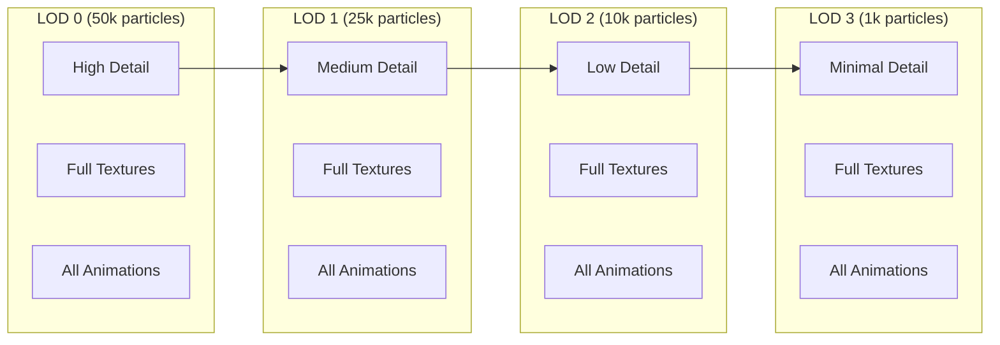

# AGENTS.md

A comprehensive guide for AI coding agents working on the Teskooano Asteroid Field Celestial Renderer package.

## Package Overview

The **`@teskooano/celestials-asteroid-field`** package provides a high-performance, deterministic asteroid field renderer for the Teskooano N-Body simulation. It features realistic asteroid belt visualization using particle systems, procedural textures, and adaptive Level of Detail (LOD) rendering.

### Purpose

- **High-Performance Rendering**: Efficient particle-based rendering with instanced meshes
- **Deterministic Generation**: Seeded randomization ensures consistent asteroid fields
- **Adaptive LOD**: Dynamic particle counts based on viewing distance for optimal performance
- **Realistic Visualization**: Textured particles with individual rotation and belt-wide animation
- **Scalable Architecture**: Support for large asteroid fields with thousands of particles

## Package Architecture

### Directory Structure

```
packages/celestials/asteroid-field/
├── src/
│   ├── index.ts                    # Main package exports
│   ├── material.ts                 # AsteroidFieldMaterial class
│   ├── renderer.ts                 # Main AsteroidFieldRenderer class
│   ├── createMesh.ts               # Factory function for mesh creation
│   ├── renderer.spec.ts            # Unit tests for renderer
│   ├── vite-env.d.ts               # Vite environment type definitions
│   ├── types/
│   │   └── shaders.d.ts            # Shader module type definitions
│   └── shaders/                    # GLSL shader files
│       ├── asteroid.vert           # Vertex shader for particle positioning
│       └── asteroid.frag           # Fragment shader for texture rendering
├── package.json
├── moon.yml
├── tsconfig.json
├── vitest.config.ts
├── README.md
└── AGENTS.md
```

### Core Design Principles

#### 1. Instanced Rendering Architecture

Uses THREE.InstancedMesh for efficient GPU-based particle rendering:

```typescript
// Instanced mesh creation for performance
const instancedMesh = new THREE.InstancedMesh(
  this.baseGeometry, // Shared geometry for all asteroids
  material, // Shared material
  count, // Number of instances
);

// Pre-populate instance matrices and colors
for (let j = 0; j < count; j++) {
  const asteroid = asteroidsToRender[j];

  this._tempPosition.copy(asteroid.position);
  this._tempScale.set(asteroid.size, asteroid.size, asteroid.size);
  this._tempRotation.set(0, asteroid.initialRotation, 0);

  this._tempMatrix.compose(
    this._tempPosition,
    new THREE.Quaternion().setFromEuler(this._tempRotation),
    this._tempScale,
  );
  instancedMesh.setMatrixAt(j, this._tempMatrix);
  instancedMesh.setColorAt(j, asteroid.color);
}
```

#### 2. Multi-Tier LOD System

Adaptive detail levels for optimal performance at different distances:

```typescript
// LOD system with varying particle counts
const distancesSceneUnits = [
  0, // Always visible - 50,000 particles
  1000, // 1,000 scene units - 25,000 particles
  5000, // 5,000 scene units - 10,000 particles
  20000, // 20,000 scene units - 1,000 particles
];

const particleCounts = [50000, 25000, 10000, 1000];

// Create LOD levels with different particle counts
for (let i = 0; i < distancesSceneUnits.length; i++) {
  const distance = distancesSceneUnits[i];
  const count = particleCounts[Math.min(i, particleCounts.length - 1)];

  const asteroidsToRender = this._generateAsteroidData(object, count);
  const instancedMesh = new THREE.InstancedMesh(
    this.baseGeometry,
    material,
    count,
  );

  lodLevels.push({ object: instancedMesh, distance: distance });
}
```

#### 3. Deterministic Seeded Generation

Consistent asteroid field appearance using seeded random generation:

```typescript
// Seeded random generation for consistent appearance
private _generateAsteroidData(
  object: RenderableCelestialObject,
  count: number,
): typeof this.asteroidData {
  if (!this.random) {
    this.random = createSeededRandomSync(object.seed ?? object.id);
  }

  const data: typeof this.asteroidData = [];
  const properties = this._getAsteroidFieldProperties(object);

  const innerRadius = properties.innerRadiusAU * SCALE.RENDER_SCALE_AU;
  const outerRadius = properties.outerRadiusAU * SCALE.RENDER_SCALE_AU;
  const height = properties.heightAU * SCALE.RENDER_SCALE_AU;

  for (let i = 0; i < count; i++) {
    const angle = this.random() * Math.PI * 2;
    const radiusSpread = this.random();
    const radius = innerRadius + (outerRadius - innerRadius) * radiusSpread;

    const x = Math.cos(angle) * radius;
    const z = Math.sin(angle) * radius;
    const y = (this.random() - 0.5) * height;

    // Generate asteroid properties
    const textureIndex = Math.floor(this.random() * 5);
    const initialRotation = this.random() * Math.PI * 2;

    data.push({
      position: new THREE.Vector3(x, y, z),
      color: finalColor,
      size,
      textureIndex,
      initialRotation,
    });
  }

  return data;
}
```

## Key Components

### 1. AsteroidFieldRenderer Class

Main renderer class extending BaseCelestialRenderer:

```typescript
export class AsteroidFieldRenderer extends BaseCelestialRenderer<AsteroidFieldMaterial> {
  private baseGeometry: THREE.BufferGeometry;
  private instancedMeshes: THREE.InstancedMesh[] = [];
  private asteroidData: {
    position: THREE.Vector3;
    color: THREE.Color;
    size: number;
    textureIndex: number;
    initialRotation: number;
  }[] = [];
  private beltRotationSpeed = 0.00005;
  private particleRotationSpeed = 1.5;
  private beltRotationAngle = 0;
  private random: () => number = () => 0;

  constructor(
    object: RenderableCelestialObject,
    options: AsteroidFieldRendererOptions = {},
  ) {
    super(object, {
      ...options,
      disableBillboard: options.disableBillboard ?? true,
    });
    this.baseGeometry = new THREE.SphereGeometry(1, 8, 8);
  }

  // Core methods
  getLODLevels(
    object: RenderableCelestialObject,
    options?: AsteroidFieldRendererOptions,
  ): LODLevel[];
  update(
    object: RenderableCelestialObject,
    time: number,
    timeScale: number,
    lightSources: LightSourcesMap,
    camera: THREE.PerspectiveCamera,
  ): void;
}
```

**Features:**

- **Instanced Rendering**: Uses THREE.InstancedMesh for efficient particle rendering
- **LOD Management**: Multiple detail levels with varying particle counts
- **Animation System**: Belt rotation and individual particle rotation
- **Memory Optimization**: Pre-allocated temporary objects for performance
- **Resource Management**: Proper cleanup of instanced meshes and geometry

### 2. AsteroidFieldMaterial Class

Specialized material for asteroid field rendering:

```typescript
export class AsteroidFieldMaterial extends THREE.ShaderMaterial {
  private asteroidTextures: THREE.Texture[] = [];
  private textureLoader: THREE.TextureLoader;
  private loadedTextureCount = 0;
  private materialReady = false;

  constructor(options: AsteroidFieldMaterialOptions = {}) {
    super({
      uniforms: {
        asteroidTextures: { value: options.asteroidTextures || [] },
        alphaTest: { value: options.alphaTest ?? 0.2 },
        beltRotationAngle: { value: 0.0 },
        time: { value: 0.0 },
        particleRotationSpeed: { value: options.particleRotationSpeed ?? 1.5 },
        renderScale: { value: options.renderScale ?? 1.0 },
      },
      vertexShader: asteroidVertexShader,
      fragmentShader: asteroidFragmentShader,
      transparent: false,
      depthWrite: true,
      blending: THREE.NormalBlending,
      vertexColors: true,
    });
  }

  // Animation methods
  updateBeltRotation(angle: number): void;
  updateTime(time: number): void;
  updateParticleRotationSpeed(speed: number): void;
  updateRenderScale(scale: number): void;
}
```

**Features:**

- **Multi-Texture Support**: 5 different asteroid texture variants
- **Automatic Texture Loading**: Asynchronous texture loading with fallbacks
- **Animation Control**: Methods for updating belt rotation and particle animation
- **Fallback Textures**: Procedural texture generation when external textures fail
- **Resource Management**: Proper texture disposal and cleanup

### 3. Shader System

Optimized GLSL shaders for particle rendering:

#### Vertex Shader (`asteroid.vert`)

```glsl
attribute float size;
attribute float textureIndex;
attribute float initialRotation;

uniform float beltRotationAngle;
uniform float renderScale;
uniform float time;
uniform float particleRotationSpeed;

varying vec3 vColor;
varying float vTextureIndex;
varying float vInitialRotation;
varying vec2 vUv;

void main() {
  // Transform position by instance matrix
  vec4 instancePosition = instanceMatrix * vec4(position, 1.0);

  vColor = instanceColor;
  vTextureIndex = textureIndex;
  vInitialRotation = initialRotation;
  vUv = uv;

  // Apply belt rotation around Y-axis
  float cosAngle = cos(beltRotationAngle);
  float sinAngle = sin(beltRotationAngle);

  vec3 rotatedPosition = vec3(
    instancePosition.x * cosAngle - instancePosition.z * sinAngle,
    instancePosition.y,
    instancePosition.x * sinAngle + instancePosition.z * cosAngle
  );

  vec4 mvPosition = modelViewMatrix * vec4(rotatedPosition, 1.0);
  gl_Position = projectionMatrix * mvPosition;
}
```

#### Fragment Shader (`asteroid.frag`)

```glsl
varying vec3 vColor;
varying float vTextureIndex;
varying float vInitialRotation;
varying vec2 vUv;

uniform sampler2D asteroidTextures[5];
uniform float alphaTest;
uniform float time;
uniform float particleRotationSpeed;

void main() {
  // Apply rotation to texture coordinates
  float angle = vInitialRotation + time * particleRotationSpeed;
  mat2 rotationMatrix = mat2(cos(angle), -sin(angle), sin(angle), cos(angle));

  vec2 center = vec2(0.5, 0.5);
  vec2 uv = vUv - center;
  vec2 rotatedUV = rotationMatrix * uv + center;

  // Sample appropriate texture based on index
  vec4 texColor;
  if (vTextureIndex < 0.5) {
    texColor = texture2D(asteroidTextures[0], rotatedUV);
  } else if (vTextureIndex < 1.5) {
    texColor = texture2D(asteroidTextures[1], rotatedUV);
  } else if (vTextureIndex < 2.5) {
    texColor = texture2D(asteroidTextures[2], rotatedUV);
  } else if (vTextureIndex < 3.5) {
    texColor = texture2D(asteroidTextures[3], rotatedUV);
  } else {
    texColor = texture2D(asteroidTextures[4], rotatedUV);
  }

  // Alpha test for transparency
  if (texColor.a < alphaTest) discard;

  // Apply vertex color modulation
  vec3 finalColor = texColor.rgb * vColor * 1.5;
  gl_FragColor = vec4(finalColor, 1.0);
}
```

**Features:**

- **Instance-Based Rendering**: Efficient handling of thousands of particles
- **Texture Rotation**: Individual asteroid rotation animation
- **Belt Rotation**: Entire field rotation around center
- **Alpha Testing**: Proper transparency handling
- **Color Modulation**: Vertex color variations for realism

### 4. Factory Function

Unified mesh creation interface:

```typescript
export function createMesh(
  object: RenderableCelestialObject,
  options: CreateMeshOptions,
): THREE.Object3D {
  const { celestialRenderers, createLodObject, debug = false } = options;

  // Force fallback if debug mode is enabled
  if (debug) {
    return createFallbackSphere(object);
  }

  let renderer = celestialRenderers.get(object.id) as
    | AsteroidFieldRenderer
    | undefined;

  if (!renderer) {
    try {
      renderer = new AsteroidFieldRenderer(object);
      celestialRenderers.set(object.id, renderer);
    } catch (error) {
      console.error(`Failed to create renderer for ${object.id}:`, error);
      return createFallbackSphere(object);
    }
  }

  const lodLevels = renderer.getLODLevels(object);
  if (lodLevels && lodLevels.length > 0) {
    return createLodObject(object, lodLevels);
  }

  return createFallbackSphere(object);
}
```

**Features:**

- **Unified API**: Consistent interface for mesh creation
- **Renderer Caching**: Efficient reuse of renderer instances
- **Error Handling**: Graceful fallback to simple sphere
- **Debug Support**: Debug mode for development
- **LOD Integration**: Automatic LOD object creation

## Usage Examples

### 1. Basic Asteroid Field Creation

```typescript
import { createMesh } from "@teskooano/celestials-asteroid-field";
import type { RenderableCelestialObject } from "@teskooano/data-types";

// Create asteroid field mesh with automatic LOD
const asteroidField = createMesh(asteroidFieldObject, {
  celestialRenderers: renderersMap,
  createLodObject: lodFactory,
});

// The mesh automatically handles:
// - Instanced particle rendering
// - Multi-tier LOD system
// - Belt and particle animation
// - Texture loading and management
```

### 2. Custom Material Configuration

```typescript
import { AsteroidFieldMaterial } from "@teskooano/celestials-asteroid-field";

// Create custom asteroid field material
const material = new AsteroidFieldMaterial({
  particleRotationSpeed: 2.0,
  renderScale: 1.5,
  alphaTest: 0.3,
});

// Load custom textures
material.loadTexturesFromPaths([
  "space/textures/asteroids/asteroid_1.png",
  "space/textures/asteroids/asteroid_2.png",
  "space/textures/asteroids/asteroid_3.png",
  "space/textures/asteroids/asteroid_4.png",
  "space/textures/asteroids/asteroid_5.png",
]);
```

### 3. Asteroid Field Properties Configuration

```typescript
// Configure asteroid field properties
const asteroidFieldProperties: AsteroidFieldProperties = {
  type: CelestialType.ASTEROID_FIELD,
  innerRadiusAU: 2.1, // Inner boundary (AU)
  outerRadiusAU: 3.3, // Outer boundary (AU)
  heightAU: 0.5, // Vertical thickness (AU)
  count: 50000, // Target particle count
  color: "#b4afac", // Base color (hex)
  composition: ["silicates", "carbonaceous", "metallic"],
  texturePaths: [
    // Optional texture paths
    "space/textures/asteroids/asteroid_1.png",
    "space/textures/asteroids/asteroid_2.png",
    "space/textures/asteroids/asteroid_3.png",
    "space/textures/asteroids/asteroid_4.png",
    "space/textures/asteroids/asteroid_5.png",
  ],
};
```

### 4. Advanced Renderer Configuration

```typescript
import { AsteroidFieldRenderer } from "@teskooano/celestials-asteroid-field";

// Create renderer with custom options
const renderer = new AsteroidFieldRenderer(asteroidFieldObject, {
  beltRotationSpeed: 0.0001, // Faster belt rotation
  renderScale: 2.0, // Larger particles
  disableBillboard: true, // Disable billboard LOD
});

// Get LOD levels
const lodLevels = renderer.getLODLevels(asteroidFieldObject);

// Update renderer
renderer.update(asteroidFieldObject, time, timeScale, lightSources, camera);
```

### 5. Fallback Texture Generation

```typescript
// Material automatically creates fallback textures when external textures fail
const material = new AsteroidFieldMaterial();

// Fallback textures are procedurally generated with:
// - Brown base color (#8B7355)
// - Noise-based surface detail
// - Darker spots for craters
// - 64x64 pixel resolution

// Check if material is ready
if (material.isMaterialReady()) {
  console.log("Material ready with textures");
} else {
  console.log("Material still loading textures");
}
```

## Performance Guidelines

### 1. LOD System Optimization

- **Distance-Based Switching**: LOD switches at 1k, 5k, and 20k scene units
- **Particle Count Reduction**: 50k → 25k → 10k → 1k particles
- **Memory Management**: Proper cleanup of instanced meshes

```typescript
// Efficient LOD management
getLODLevels(object: RenderableCelestialObject, options?: AsteroidFieldRendererOptions): LODLevel[] {
  const distancesSceneUnits = [0, 1000, 5000, 20000];
  const particleCounts = [50000, 25000, 10000, 1000];

  for (let i = 0; i < distancesSceneUnits.length; i++) {
    const distance = distancesSceneUnits[i];
    const count = particleCounts[Math.min(i, particleCounts.length - 1)];

    const asteroidsToRender = this._generateAsteroidData(object, count);
    const instancedMesh = new THREE.InstancedMesh(
      this.baseGeometry,
      material,
      count,
    );

    lodLevels.push({ object: instancedMesh, distance: distance });
  }

  return lodLevels;
}
```

### 2. Instanced Rendering Performance

- **Shared Geometry**: Single base geometry for all instances
- **Batch Updates**: Update all instance matrices in single operation
- **Frustum Culling**: Automatic culling of off-screen particles

```typescript
// Efficient instance matrix updates
this.instancedMeshes.forEach((mesh) => {
  if (!mesh.instanceMatrix) return;

  for (let i = 0; i < this.asteroidData.length; i++) {
    const asteroid = this.asteroidData[i];

    // Apply belt rotation to asteroid position
    this._tempPosition.copy(asteroid.position);
    this._tempPosition.applyAxisAngle(
      new THREE.Vector3(0, 1, 0),
      this.beltRotationAngle,
    );

    // Update instance matrix
    this._tempMatrix.compose(
      this._tempPosition,
      new THREE.Quaternion().setFromEuler(this._tempRotation),
      this._tempScale,
    );
    mesh.setMatrixAt(i, this._tempMatrix);
  }

  mesh.instanceMatrix.needsUpdate = true;
});
```

### 3. Memory Management

- **Pre-allocated Objects**: Reuse temporary vectors and matrices
- **Resource Cleanup**: Proper disposal of textures and geometry
- **Instance Management**: Efficient cleanup of instanced meshes

```typescript
// Pre-allocated objects for performance
private _tempMatrix = new THREE.Matrix4();
private _tempPosition = new THREE.Vector3();
private _tempRotation = new THREE.Euler();
private _tempScale = new THREE.Vector3();

// Proper resource cleanup
dispose(): void {
  super.dispose();

  // Dispose base geometry
  this.baseGeometry.dispose();

  // Dispose instanced meshes
  this.instancedMeshes.forEach((mesh) => {
    if (mesh.parent) {
      mesh.parent.remove(mesh);
    }
  });

  this.instancedMeshes = [];
  this.asteroidData = [];
}
```

### 4. Animation Performance

- **Efficient Updates**: Only update when material is ready
- **Time-based Animation**: Smooth animation based on simulation time
- **Belt Rotation**: Single rotation calculation for entire field

```typescript
// Efficient animation updates
update(object: RenderableCelestialObject, time: number, timeScale: number, lightSources: LightSourcesMap, camera: THREE.PerspectiveCamera): void {
  const material = this.getTypedMaterial(object.id);

  if (material && material.isMaterialReady()) {
    const deltaTime = (time - this.previousSimTime) * timeScale;

    // Update belt rotation
    this.beltRotationAngle += this.beltRotationSpeed * deltaTime;
    this.beltRotationAngle %= 2 * Math.PI;

    // Update cumulative time for particle rotation
    this.cumulativeParticleTime += deltaTime * 0.05;
    this.cumulativeParticleTime %= 2 * Math.PI;

    // Update material uniforms
    material.updateBeltRotation(this.beltRotationAngle);
    material.updateTime(this.cumulativeParticleTime);

    this.previousSimTime = time;
  }
}
```

## Testing Strategy

### 1. Unit Testing

Test individual components and functionality:

```typescript
// Example: Renderer testing
import { describe, it, expect, beforeEach } from "vitest";
import { AsteroidFieldRenderer } from "../renderer";

describe("AsteroidFieldRenderer", () => {
  let renderer: AsteroidFieldRenderer;
  let mockObject: RenderableCelestialObject<AsteroidFieldProperties>;

  beforeEach(() => {
    const asteroidFieldProperties: AsteroidFieldProperties = {
      type: CelestialType.ASTEROID_FIELD,
      innerRadiusAU: 2.1,
      outerRadiusAU: 3.3,
      heightAU: 0.5,
      count: 50000,
      color: "#b4afac",
      composition: ["silicates", "carbonaceous", "metallic"],
    };

    mockObject = createMockAsteroidField(asteroidFieldProperties);
    renderer = new AsteroidFieldRenderer(mockObject);
  });

  it("should create LOD levels with instanced meshes", () => {
    const lodLevels = renderer.getLODLevels(mockObject);

    expect(lodLevels).toBeDefined();
    expect(lodLevels.length).toBeGreaterThan(0);

    const level = lodLevels[0];
    expect(level.object).toBeInstanceOf(THREE.InstancedMesh);
    expect(level.distance).toBe(0);
  });

  it("should handle update calls without errors", () => {
    const mockLightSources = new Map();
    const mockCamera = new THREE.PerspectiveCamera();

    expect(() => {
      renderer.update(mockObject, 1.0, 1.0, mockLightSources, mockCamera);
    }).not.toThrow();
  });
});
```

### 2. Integration Testing

Test asteroid field rendering with other celestial objects:

```typescript
// Example: Integration test
import { describe, it, expect } from "vitest";
import { createMesh } from "../createMesh";

describe("Asteroid Field Integration", () => {
  it("should create asteroid field mesh with LOD", () => {
    const asteroidFieldObject = createMockAsteroidField();
    const renderersMap = new Map();
    const lodFactory = jest.fn();

    const mesh = createMesh(asteroidFieldObject, {
      celestialRenderers: renderersMap,
      createLodObject: lodFactory,
    });

    expect(renderersMap.has(asteroidFieldObject.id)).toBe(true);
    expect(lodFactory).toHaveBeenCalled();
  });
});
```

### 3. Performance Testing

Test rendering performance with large particle counts:

```typescript
// Example: Performance test
import { test, expect } from "vitest";

test("asteroid field performance with large particle count", async () => {
  const startTime = performance.now();

  const renderer = new AsteroidFieldRenderer(largeAsteroidFieldObject);
  const lodLevels = renderer.getLODLevels(largeAsteroidFieldObject);

  const endTime = performance.now();
  const duration = endTime - startTime;

  // Should create LOD levels in reasonable time
  expect(duration).toBeLessThan(1000); // Less than 1 second
  expect(lodLevels.length).toBeGreaterThan(0);
});
```

## Troubleshooting Guide

### 1. Common Issues

#### Texture Loading Failures

```typescript
// ❌ Problem: Textures not loading
material.loadTexturesFromPaths(texturePaths); // No effect

// ✅ Solution: Check texture paths and fallback handling
const material = new AsteroidFieldMaterial();

// Check if material is ready
if (!material.isMaterialReady()) {
  console.log("Material still loading textures");
  // Material will automatically create fallback textures
}

// Verify texture paths are correct
const texturePaths = [
  "space/textures/asteroids/asteroid_1.png", // Must exist
  "space/textures/asteroids/asteroid_2.png",
  // ... etc
];
```

#### LOD Not Switching

```typescript
// ❌ Problem: LOD not switching at expected distances
const lodLevels = renderer.getLODLevels(object);
// LOD levels not created properly

// ✅ Solution: Check LOD level creation
getLODLevels(object: RenderableCelestialObject, options?: AsteroidFieldRendererOptions): LODLevel[] {
  if (!this.baseGeometry) {
    console.warn('Base geometry not created, cannot create LOD levels');
    return [];
  }

  // Ensure base geometry exists before creating LOD levels
  const lodLevels: LODLevel[] = [];

  for (let i = 0; i < distancesSceneUnits.length; i++) {
    const distance = distancesSceneUnits[i];
    const count = particleCounts[Math.min(i, particleCounts.length - 1)];

    const instancedMesh = new THREE.InstancedMesh(
      this.baseGeometry,
      material,
      count,
    );

    lodLevels.push({ object: instancedMesh, distance: distance });
  }

  return lodLevels;
}
```

#### Performance Issues

```typescript
// ❌ Problem: Poor performance with large particle counts
const count = 100000; // Too many particles

// ✅ Solution: Use appropriate particle counts for LOD levels
const particleCounts = [50000, 25000, 10000, 1000]; // Reasonable counts

// Or reduce maximum particle count
const maxParticles = Math.min(count, 50000);
```

### 2. Performance Issues

#### Excessive Particle Counts

```typescript
// ❌ Problem: Too many particles causing performance issues
const count = 100000; // Too many

// ✅ Solution: Use LOD system with appropriate counts
const particleCounts = [50000, 25000, 10000, 1000]; // LOD-based counts
```

#### Memory Leaks

```typescript
// ❌ Problem: Memory leaks from not disposing resources
// Instanced meshes accumulating without cleanup

// ✅ Solution: Proper resource cleanup
dispose(): void {
  super.dispose();

  // Dispose base geometry
  this.baseGeometry.dispose();

  // Dispose instanced meshes
  this.instancedMeshes.forEach((mesh) => {
    if (mesh.parent) {
      mesh.parent.remove(mesh);
    }
  });

  this.instancedMeshes = [];
  this.asteroidData = [];
}
```

### 3. Visual Issues

#### Incorrect Particle Sizing

```typescript
// ❌ Problem: Particles too large or too small
const size = 100.0; // Too large

// ✅ Solution: Use appropriate size scaling
const sizeScaleFactor = Math.min(1.0, beltWidth / 1000);
const size = Math.max(0.1, baseSizeVariation * 0.3 * sizeScaleFactor);
```

#### Poor Texture Quality

```typescript
// ❌ Problem: Low-quality fallback textures
// Fallback textures are 64x64 pixels

// ✅ Solution: Provide high-quality external textures
const texturePaths = [
  "space/textures/asteroids/asteroid_1.png", // 512x512 recommended
  "space/textures/asteroids/asteroid_2.png",
  // ... etc
];
```

## Dependencies and Integration Points

### 1. Core Dependencies

```json
{
  "dependencies": {
    "@teskooano/core-math": "file:../../../core/math",
    "@teskooano/data-types": "file:../../../core/data-types",
    "@teskooano/renderer-threejs-celestial": "file:../../../renderer/threejs-celestial",
    "three": "0.180.0"
  }
}
```

### 2. Integration with Teskooano Ecosystem

- **Data Types**: Uses `RenderableCelestialObject` and `AsteroidFieldProperties`
- **Core Math**: Seeded random number generation for consistent appearance
- **Celestial Renderer**: Extends `BaseCelestialRenderer` for core functionality
- **LOD System**: Uses `LODLevel` and `createLodObject` for performance optimization

### 3. Shader Dependencies

- **Vertex Attributes**: `size`, `textureIndex`, `initialRotation`
- **Uniforms**: `beltRotationAngle`, `renderScale`, `time`, `particleRotationSpeed`
- **Textures**: Array of 5 asteroid texture variants

## Contributing Guidelines

### 1. Shader Development

- **GLSL Standards**: Use proper includes and precision qualifiers
- **Performance**: Optimize for instanced rendering
- **Documentation**: Comment complex shader functions
- **Testing**: Test shaders across different devices

### 2. Material Development

- **Texture Management**: Proper loading and fallback handling
- **Animation Control**: Efficient uniform updates
- **Resource Cleanup**: Proper texture disposal
- **Error Handling**: Graceful fallbacks for failed operations

### 3. Renderer Development

- **LOD Management**: Implement efficient LOD switching
- **Memory Management**: Proper cleanup of instanced meshes
- **Performance**: Optimize for large particle counts
- **Animation**: Smooth belt and particle rotation

## Architecture Documentation

### 1. System Overview



### 2. Data Flow



### 3. LOD System



## Scientific References

### 1. Asteroid Field Physics

- **Toroidal Distribution**: Realistic asteroid belt geometry
- **Size Distribution**: Power-law distribution for asteroid sizes
- **Orbital Mechanics**: Keplerian motion within belt boundaries
- **Collision Dynamics**: Particle interaction and clustering

### 2. Computer Graphics

- **Instanced Rendering**: GPU-efficient particle rendering
- **Level of Detail**: Performance optimization through detail reduction
- **Texture Animation**: Real-time texture coordinate manipulation
- **Shader Programming**: GLSL for particle effects

### 3. Performance Optimization

- **GPU Programming**: Efficient instanced mesh rendering
- **Memory Management**: Resource pooling and cleanup
- **Animation Systems**: Time-based particle animation
- **Rendering Pipeline**: Optimized Three.js integration

### 4. Procedural Generation

- **Seeded Randomization**: Consistent procedural generation
- **Noise Functions**: Natural-looking particle distribution
- **Color Variation**: Realistic asteroid appearance
- **Texture Variation**: Multiple asteroid surface types

---

**Remember**: The asteroid field renderer package provides high-performance, realistic asteroid belt visualization with efficient particle rendering and adaptive LOD systems. Always consider the balance between visual quality and performance, and ensure proper integration with the broader Teskooano ecosystem.
