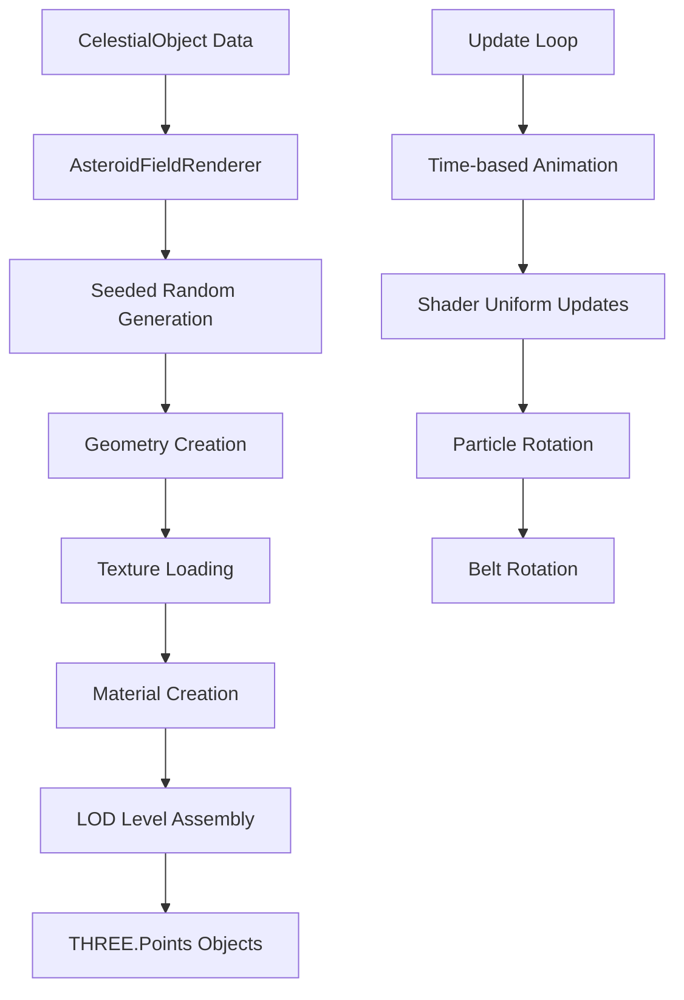

# @teskooano/celestials-asteroid-field

A high-performance, deterministic asteroid field renderer for the Teskooano N-Body simulation. This package provides realistic asteroid belt visualization using particle systems, procedural textures, and adaptive Level of Detail (LOD) rendering.

## Features

- 🎨 **Textured Particles**: Uses 5 different asteroid texture variants for visual variety
- 🎲 **Deterministic Generation**: Seeded randomization ensures consistent asteroid fields
- 📐 **Adaptive LOD**: Dynamic particle counts based on viewing distance
- 🔄 **Animated Rotation**: Individual asteroid rotation and belt-wide rotation
- 🌌 **Realistic Scaling**: Proper size distribution and distance-based visibility
- ⚡ **High Performance**: Optimized shader-based rendering with instanced particles

## Package Structure

```
src/
├── shaders/                     # GLSL shader files
│   ├── asteroid.vert            # Vertex shader for particle positioning
│   └── asteroid.frag            # Fragment shader for texture rendering
├── material.ts                  # AsteroidFieldMaterial class
├── AsteroidFieldRenderer.ts     # Main renderer class
├── createAsteroidFieldMesh.ts   # Factory function for mesh creation
└── index.ts                     # Package exports
```

## Architecture Overview

The asteroid field system is built on a modular, shader-based architecture that extends the base celestial rendering framework.

### Core Components

#### 1. AsteroidFieldMaterial

A specialized material class for asteroid rendering:

```typescript
class AsteroidFieldMaterial extends THREE.ShaderMaterial {
  // Handles shader uniforms, texture loading, and animation updates
}
```

**Key Features:**

- **Automatic Texture Loading**: Asynchronously loads 5 asteroid texture variants
- **Animation Control**: Methods for updating belt rotation, time, and particle speed
- **Configurable Options**: Customizable alpha testing, rotation speed, and render scale
- **Resource Management**: Proper texture disposal and cleanup

#### 2. AsteroidFieldRenderer

The main renderer class that manages the asteroid field geometry and LOD:

```typescript
class AsteroidFieldRenderer extends BaseCelestialRenderer<AsteroidFieldMaterial> {
  // Handles LOD generation, geometry creation, and scene management
}
```

**Key Responsibilities:**

- **LOD Management**: Creates multiple detail levels (50k, 25k, 10k, 1k particles)
- **Geometry Generation**: Creates positioned asteroid particles with seeded randomization
- **Material Integration**: Uses AsteroidFieldMaterial for consistent rendering
- **Scene Updates**: Coordinates material updates with simulation time

#### 3. Shader System

##### Vertex Shader (`asteroid.vert`)

- **Position Calculation**: Applies belt rotation and world transforms
- **Size Scaling**: Distance-based point size calculation
- **Attribute Passing**: Forwards texture indices and rotation data

##### Fragment Shader (`asteroid.frag`)

- **Texture Sampling**: Selects from 5 texture variants per particle
- **Rotation Animation**: Applies time-based texture coordinate rotation
- **Alpha Testing**: Discards transparent pixels for proper compositing
- **Color Modulation**: Applies vertex color variations

#### 4. Geometry Generation

The renderer creates `BufferGeometry` with specific attributes:

| Attribute         | Type           | Purpose                               |
| ----------------- | -------------- | ------------------------------------- |
| `position`        | `Float32Array` | 3D positions in toroidal distribution |
| `color`           | `Float32Array` | Per-particle color variations         |
| `size`            | `Float32Array` | Individual particle sizes             |
| `textureIndex`    | `Float32Array` | Texture variant selection (0-4)       |
| `initialRotation` | `Float32Array` | Random rotation offset per particle   |

### Data Flow



### LOD System

The renderer uses a 4-tier LOD system for optimal performance:

| LOD Level   | Distance | Particle Count | Use Case         |
| ----------- | -------- | -------------- | ---------------- |
| **Level 0** | 0 AU     | 50,000         | Close inspection |
| **Level 1** | 1 AU     | 25,000         | Normal viewing   |
| **Level 2** | 5 AU     | 10,000         | Medium distance  |
| **Level 3** | 20 AU    | 1,000          | Far away         |

## Usage

### Basic Integration

```typescript
import {
  createAsteroidFieldMesh,
  AsteroidFieldMaterial,
  AsteroidFieldRenderer,
} from "@teskooano/celestials-asteroid-field";

// Simple usage via factory function
const asteroidField = createAsteroidFieldMesh(object, {
  celestialRenderers: renderersMap,
  createLodObject: lodFactory,
});

// Advanced usage with custom material configuration
const material = new AsteroidFieldMaterial({
  particleRotationSpeed: 2.0,
  renderScale: 1.5,
  alphaTest: 0.3,
});

// The renderer automatically handles:
// - Multiple LOD level generation
// - Seeded particle placement
// - Texture loading and management
// - Animation state updates
```

### Configuration Options

Asteroid fields are configured through their `AsteroidFieldProperties`:

```typescript
interface AsteroidFieldProperties {
  type: CelestialType.ASTEROID_FIELD;
  innerRadiusAU: number; // Inner boundary (e.g., 2.1 AU)
  outerRadiusAU: number; // Outer boundary (e.g., 3.3 AU)
  heightAU: number; // Vertical thickness (e.g., 0.5 AU)
  count: number; // Target particle count (e.g., 50000)
  color: string; // Base color (hex, e.g., "#b4afac")
  composition: string[]; // Material types for scientific accuracy
}
```

### Example: Solar System Main Belt

```typescript
const mainBelt = {
  id: "asteroid-belt-main",
  name: "Main Asteroid Belt",
  type: CelestialType.ASTEROID_FIELD,
  properties: {
    type: CelestialType.ASTEROID_FIELD,
    innerRadiusAU: 2.1,
    outerRadiusAU: 3.3,
    heightAU: 0.5,
    count: 50000,
    color: "#b4afac",
    composition: ["silicates", "carbonaceous", "metallic"],
  },
};
```

## Technical Details

### Coordinate System

- **Scene Units**: 1 AU = 1000 scene units (`SCALE.RENDER_SCALE_AU`)
- **Positioning**: Toroidal distribution between inner and outer radii
- **Height Variation**: Random Y-offset within ±heightAU/2

### Size Distribution

Asteroid sizes follow a realistic distribution:

```typescript
// Size decreases with distance from belt center
const normalizedDistance =
  (distance - innerRadius) / (outerRadius - innerRadius);
const sizeVariation = (1.0 - normalizedDistance * 0.3) * (0.7 + random() * 0.6);
const finalSize = Math.max(3.0, sizeVariation * 15.0);
```

### Animation System

#### Belt Rotation

- **Speed**: 0.00005 radians/second (configurable)
- **Effect**: Entire belt rotates slowly around its center
- **Implementation**: Applied in vertex shader

#### Individual Rotation

- **Speed**: 1.0-3.0 radians/second per asteroid (seeded)
- **Effect**: Each asteroid spins on its own axis
- **Implementation**: Texture coordinate rotation in fragment shader

### Performance Optimizations

1. **Instanced Rendering**: Uses `THREE.Points` for GPU-efficient particle rendering
2. **Texture Atlasing**: 5 pre-loaded textures shared across all particles
3. **Distance Culling**: Automatic frustum culling via `THREE.BufferGeometry`
4. **LOD Switching**: Automatic particle count reduction at distance
5. **Shader Optimization**: Minimal branching, efficient texture sampling

## Shader Details

### Uniforms

| Uniform                 | Type          | Purpose                   |
| ----------------------- | ------------- | ------------------------- |
| `asteroidTextures[5]`   | `sampler2D[]` | Texture variants          |
| `alphaTest`             | `float`       | Transparency threshold    |
| `beltRotationAngle`     | `float`       | Current belt rotation     |
| `time`                  | `float`       | Animation time            |
| `particleRotationSpeed` | `float`       | Individual rotation speed |
| `renderScale`           | `float`       | Distance scaling factor   |

### Texture Requirements

Asteroid textures should be:

- **Format**: PNG with alpha channel
- **Size**: 512x512 pixels recommended
- **Style**: Realistic asteroid surfaces with transparency
- **Location**: `public/space/textures/asteroids/asteroid_1.png` through `asteroid_5.png`

## Debugging

Enable debug logging to monitor asteroid field generation:

```typescript
// Console output includes:
// - Texture loading progress
// - Particle count and size ranges
// - LOD distance calculations
// - Belt rotation updates
```

## Dependencies

- `@teskooano/data-types`: Core type definitions
- `@teskooano/core-math`: Seeded random number generation
- `@teskooano/renderer-threejs-celestial`: Base rendering framework
- `@teskooano/renderer-threejs-lod`: Level of Detail system
- `three`: 3D rendering engine

## Performance Considerations

### Recommended Limits

- **Maximum Particles**: 50,000 per LOD level
- **Texture Size**: 512x512 pixels per variant
- **Update Frequency**: 60 FPS with time-scaled animation

### Memory Usage

- **Geometry**: ~1.2MB per 10,000 particles
- **Textures**: ~5MB total (5 × 1MB textures)
- **Materials**: Shared instances for efficiency

## Future Enhancements

- **Collision Detection**: Particle interaction with spacecraft
- **Dust Effects**: Sub-particle dust rendering
- **Gravitational Clustering**: Realistic density variations
- **Spectral Composition**: Color-coded asteroid types
- **Dynamic Loading**: Streaming for very large asteroid fields

## Contributing

When modifying the asteroid field system:

1. **Maintain Determinism**: All randomization must use seeded functions
2. **Test LOD Performance**: Verify smooth transitions between detail levels
3. **Validate Scaling**: Ensure proper size relationships across distances
4. **Update Shaders Carefully**: Changes affect all asteroid instances
5. **Document Changes**: Update this README for architectural modifications
