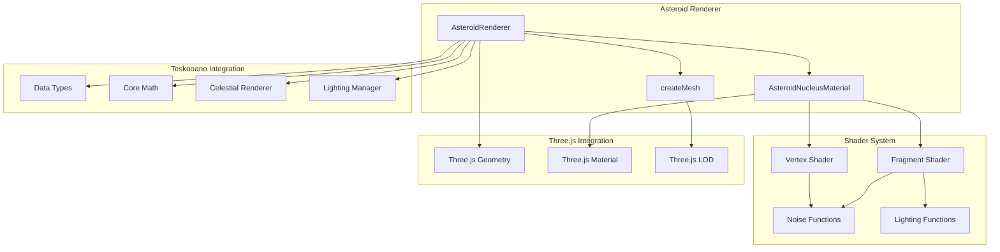
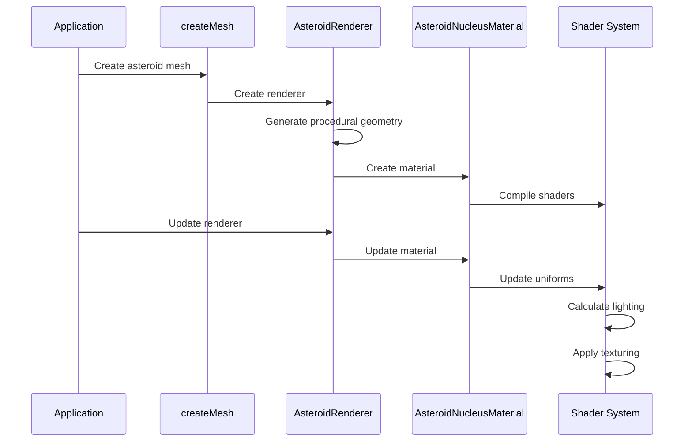
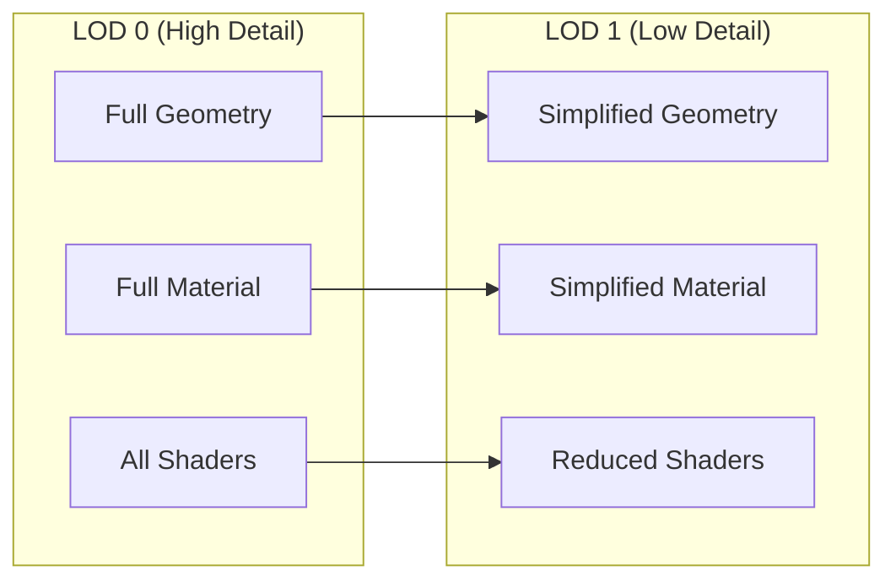

# AGENTS.md

A comprehensive guide for AI coding agents working on the Teskooano Asteroid Celestial Renderer package.

## Package Overview

The **`@teskooano/celestials-asteroid`** package provides a comprehensive asteroid rendering system for the Teskooano N-Body simulation engine. It features procedural geometry generation, advanced surface texturing, realistic lighting effects, and performance optimization through Level of Detail (LOD) systems.

### Purpose

- **Procedural Asteroid Rendering**: Generate unique, realistic asteroid shapes with procedural geometry
- **Advanced Surface Texturing**: Multi-layer texturing with height-based color blending and crater effects
- **Realistic Lighting**: Dynamic ambient lighting with shadow casting support from other celestial bodies
- **Performance Optimization**: LOD system for efficient rendering at different distances
- **Physics Integration**: Realistic rotation and tumbling motion based on actual sidereal rotation periods

## Package Architecture

### Directory Structure

```
packages/celestials/asteroid/
├── src/
│   ├── index.ts                    # Main package exports
│   ├── material.ts                 # AsteroidNucleusMaterial class
│   ├── renderer.ts                 # Main AsteroidRenderer class
│   ├── createMesh.ts               # Factory function for mesh creation
│   ├── vite-env.d.ts               # Vite environment type definitions
│   ├── shaders/                    # GLSL shader files
│   │   ├── nucleus.vertex.glsl     # Vertex shader for world position/normal
│   │   └── nucleus.fragment.glsl   # Fragment shader for surface texturing
│   └── shared/                     # Shared shader utilities
│       ├── lighting.glsl           # Lighting calculation functions
│       ├── noise.glsl              # Noise generation utilities
│       └── simplex/                # Simplex noise implementation
│           └── 3d.glsl             # 3D simplex noise functions
├── package.json
├── moon.yml
├── tsconfig.json
├── README.md
└── AGENTS.md
```

### Core Design Principles

#### 1. Procedural Generation

Asteroids are generated procedurally using noise-based displacement and seeded random generation:

```typescript
// Procedural geometry generation
private createNucleusGeometry(object: RenderableCelestialObject): THREE.BufferGeometry {
  const nucleusGeometry = new THREE.BoxGeometry(1, 1, 1, 32, 32, 32);

  // Add procedural displacement to make it irregular
  const positionAttribute = nucleusGeometry.getAttribute("position");
  const vertex = new THREE.Vector3();
  for (let i = 0; i < positionAttribute.count; i++) {
    vertex.fromBufferAttribute(positionAttribute, i);

    // Spherify the cube
    const normalizedVertex = vertex.clone().normalize();

    // Get noise value for displacement
    const noiseFrequency = 1.0;
    const noisePosition = normalizedVertex.clone().multiplyScalar(noiseFrequency);
    let displacement = this.noise.noise3d(noisePosition.x, noisePosition.y, noisePosition.z);

    // Apply displacement
    const bumpiness = 0.2;
    const finalRadius = object.radius * (1 + displacement * bumpiness);
    const finalPosition = normalizedVertex.multiplyScalar(finalRadius);

    positionAttribute.setXYZ(i, finalPosition.x, finalPosition.y, finalPosition.z);
  }

  nucleusGeometry.computeVertexNormals();
  return nucleusGeometry;
}
```

#### 2. Multi-Layer Surface Texturing

Advanced surface texturing with height-based color blending and crater effects:

```typescript
// Multi-color palette with height-based blending
export interface AsteroidNucleusMaterialOptions {
  colors: THREE.Color[]; // Array of colors for the palette
  heights: number[]; // Height thresholds for each color
  noiseScale?: number; // Scale for base color layering noise
  blendSharpness?: number; // Sharpness of color transitions
  craterScale?: number; // Scale for crater noise
  craterStrength?: number; // Prominence of craters
  simplePeriod?: number; // Base frequency for noise generation
  undulation?: number; // Surface undulation/waviness
  ambientStrength?: number; // Ambient lighting strength
  metallicFactor?: number; // Metallic surface factor
  roughness?: number; // Surface roughness
  specularColor?: THREE.Color; // Specular reflection color
}
```

#### 3. Performance Optimization

LOD system with automatic detail reduction for distant viewing:

```typescript
// LOD system implementation
getLODLevels(object: RenderableCelestialObject, options?: CelestialMeshOptions): LODLevel[] {
  // LOD 0: High detail with nucleus
  const lod0_container = new THREE.Group();
  lod0_container.name = `${object.id}-asteroid-lod0-container`;

  if (this.nucleus) {
    lod0_container.add(this.nucleus);
  }

  // LOD 1: Lower detail with simplified mesh nucleus
  const lod1_container = new THREE.Group();
  lod1_container.name = `${object.id}-asteroid-lod1-container`;

  this.nucleus_lod1 = this.nucleus?.clone(false);
  if (this.nucleus_lod1) {
    lod1_container.add(this.nucleus_lod1);
  }

  return [
    { distance: 0, object: lod0_container },
    { distance: 5 * SCALE.RENDER_SCALE_AU, object: lod1_container }
  ];
}
```

## Key Components

### 1. AsteroidRenderer Class

Main renderer class extending BaseCelestialRenderer:

```typescript
export class AsteroidRenderer extends BaseCelestialRenderer {
  private nucleus?: THREE.Mesh;
  private nucleus_lod1?: THREE.Mesh;
  private clock = new THREE.Clock();
  private noise = new SimplexNoise();
  private random: () => number = () => 0;

  constructor(object: RenderableCelestialObject) {
    super(object);
    this.random = createSeededRandomSync(object.seed ?? object.id);
    this.createNucleus(object);
  }

  // Core methods
  getLODLevels(
    object: RenderableCelestialObject,
    options?: CelestialMeshOptions,
  ): LODLevel[];
  update(
    object: RenderableCelestialObject,
    time: number,
    timeScale: number,
    lightSources: LightSourcesMap,
    camera: THREE.PerspectiveCamera,
    allObjects?: Record<string, RenderableCelestialObject>,
    allMeshes?: Record<string, THREE.Object3D>,
  ): void;
}
```

**Features:**

- **Procedural Geometry**: Noise-displaced cube geometry for irregular asteroid shapes
- **Seeded Random Generation**: Consistent asteroid appearance using object seed
- **LOD Management**: Automatic detail reduction for performance
- **Physics Integration**: Realistic rotation based on sidereal rotation periods
- **Lighting Integration**: Dynamic lighting with shadow casting support

### 2. AsteroidNucleusMaterial Class

Custom shader material for asteroid surface rendering:

```typescript
export class AsteroidNucleusMaterial extends THREE.ShaderMaterial {
  protected currentNumLights: number = 0;
  protected currentNumShadowCasters: number = 0;

  constructor(options: AsteroidNucleusMaterialOptions) {
    super({
      defines: {
        MAX_LIGHTS: MAX_LIGHTS,
        MAX_COLORS: MAX_COLORS,
        MAX_SHADOW_CASTERS: MAX_SHADOW_CASTERS,
        NUM_COLORS: options.colors.length,
      },
      uniforms: {
        uColors: { value: paddedColors },
        uHeights: { value: paddedHeights },
        uNumColors: { value: options.colors.length },
        // ... other uniforms
      },
      vertexShader: nucleusVertexShader,
      fragmentShader: nucleusFragmentShader,
    });
  }

  update(
    time: number,
    timeScale: number,
    lightSources?: Map<string, LightSourceData>,
    camera?: THREE.PerspectiveCamera,
    shadowCasters?: { position: THREE.Vector3; radius: number }[],
  ): void;
}
```

**Features:**

- **Multi-Color Palettes**: Height-based color blending with configurable transitions
- **Dynamic Lighting**: Support for multiple light sources with proper attenuation
- **Shadow Casting**: Integration with shadow casters from other celestial bodies
- **Performance Optimization**: Efficient shader-based calculations
- **Configurable Parameters**: Extensive customization options for visual appearance

### 3. Shader System

Advanced GLSL shaders for realistic asteroid rendering:

#### Vertex Shader (`nucleus.vertex.glsl`)

```glsl
varying vec3 vWorldNormal;
varying vec3 vWorldPosition;
varying vec2 vUv;
varying vec3 vObjectPosition;

void main() {
  vUv = uv;
  vObjectPosition = normalize(position);
  vec4 worldPosition = modelMatrix * vec4(position, 1.0);
  vWorldPosition = worldPosition.xyz;

  // Pass the world-space normal to the fragment shader
  vWorldNormal = normalize(mat3(modelMatrix) * normal);

  gl_Position = projectionMatrix * modelViewMatrix * vec4(position, 1.0);
}
```

#### Fragment Shader (`nucleus.fragment.glsl`)

```glsl
// Multi-layer surface texturing with noise-based effects
void main() {
  // Base color from height map
  vec3 noiseCoord = vObjectPosition * uSimplePeriod;
  noiseCoord += uUndulation * snoise(noiseCoord);

  float baseNoise = asteroidFBM(noiseCoord * uNoiseScale);

  // Height-based color blending
  vec3 finalColor = uColors[0];
  for (int i = 1; i < uNumColors; i++) {
    float blendFactor = smoothstep(uHeights[i-1], uHeights[i], baseNoise);
    finalColor = mix(finalColor, uColors[i], blendFactor * uBlendSharpness);
  }

  // Craters/cracks layer
  vec3 craterCoord = vObjectPosition * uCraterScale;
  float craterNoise = snoise(craterCoord);
  float craters = pow(abs(craterNoise), 15.0);
  finalColor *= (1.0 - craters * uCraterStrength);

  // Calculate lighting and shadows
  float shadowFactor = calculateShadowFactor(vWorldPosition);
  vec3 lighting = calculateLighting(finalColor, vWorldNormal, viewDirection, shadowFactor);

  gl_FragColor = vec4(finalColor * lighting, 1.0);
}
```

**Features:**

- **Procedural Texturing**: Noise-based surface detail generation
- **Multi-Layer Blending**: Height-based color transitions
- **Crater Effects**: Realistic crater and crack generation
- **Dynamic Lighting**: Real-time lighting calculations
- **Shadow Integration**: Support for shadows from other celestial bodies

### 4. Factory Function

Unified mesh creation interface:

```typescript
export function createMesh(
  object: RenderableCelestialObject,
  options: CreateMeshOptions,
): THREE.Object3D {
  const { celestialRenderers, createLodObject, debug = false } = options;

  // Force fallback if debug mode is enabled
  if (debug) {
    return createFallbackSphere(object);
  }

  let renderer = celestialRenderers.get(object.id) as
    | AsteroidRenderer
    | undefined;

  if (!renderer) {
    try {
      renderer = new AsteroidRenderer(object);
      celestialRenderers.set(object.id, renderer);
    } catch (error) {
      console.error(`Failed to create renderer for ${object.id}:`, error);
      return createFallbackSphere(object);
    }
  }

  if (renderer.getLODLevels) {
    const lodLevels = renderer.getLODLevels(object);
    if (lodLevels && lodLevels.length > 0) {
      return createLodObject(object, lodLevels);
    }
  }

  return createFallbackSphere(object);
}
```

**Features:**

- **Unified API**: Consistent interface for mesh creation
- **Renderer Caching**: Efficient reuse of renderer instances
- **Error Handling**: Graceful fallback to simple sphere
- **Debug Support**: Debug mode for development
- **LOD Integration**: Automatic LOD object creation

## Usage Examples

### 1. Basic Asteroid Creation

```typescript
import { createMesh } from "@teskooano/celestials-asteroid";
import type { RenderableCelestialObject } from "@teskooano/data-types";

// Create asteroid mesh with automatic LOD
const asteroidMesh = createMesh(asteroidObject, {
  celestialRenderers: renderersMap,
  createLodObject: lodFactory,
});

// The mesh automatically handles:
// - Procedural geometry generation
// - Multi-layer surface texturing
// - Dynamic lighting and shadows
// - Performance optimization
```

### 2. Custom Material Configuration

```typescript
import { AsteroidNucleusMaterial } from "@teskooano/celestials-asteroid";

// Create custom asteroid material
const material = new AsteroidNucleusMaterial({
  colors: [
    new THREE.Color(0x8b7355), // Dark brown
    new THREE.Color(0xa0522d), // Sienna
    new THREE.Color(0xcd853f), // Peru
    new THREE.Color(0xf4a460), // Sandy brown
  ],
  heights: [0.0, 0.3, 0.6, 1.0],
  noiseScale: 2.0,
  blendSharpness: 1.0,
  craterScale: 12.0,
  craterStrength: 0.5,
  undulation: 0.1,
  ambientStrength: 0.01,
  metallicFactor: 0.0,
  roughness: 0.5,
});
```

### 3. Procedural Color Palette Generation

```typescript
// Generate random color palette for rocky asteroid
private generateColorPalette(): THREE.Color[] {
  const palette: THREE.Color[] = [];
  const numColors = Math.floor(this.random() * 3) + 2; // 2 to 4 colors

  // Base color properties
  const baseHue = this.random() * 0.1 + 0.02; // 0.02 (reddish) to 0.12 (brownish)
  const baseSaturation = this.random() * 0.4; // 0% to 40% saturation
  const baseLightness = this.random() * 0.3 + 0.2; // 20% to 50% lightness

  for (let i = 0; i < numColors; i++) {
    const color = new THREE.Color();
    const h = baseHue + (this.random() - 0.5) * 0.05; // Small hue shift
    const s = baseSaturation + (this.random() - 0.5) * 0.1;
    const l = baseLightness + (this.random() - 0.5) * 0.15;
    color.setHSL(
      THREE.MathUtils.clamp(h, 0, 1),
      THREE.MathUtils.clamp(s, 0, 1),
      THREE.MathUtils.clamp(l, 0, 1)
    );
    palette.push(color);
  }
  return palette;
}
```

### 4. Realistic Rotation Animation

```typescript
// Update asteroid rotation based on physics
private updateNucleusRotation(
  object: RenderableCelestialObject,
  deltaTime: number,
  activityFactor: number,
): void {
  if (this.nucleus && object.orbit.siderealRotationPeriod_s) {
    // Use the actual rotation period from the asteroid object
    const rotationSpeed = (2 * Math.PI) / object.orbit.siderealRotationPeriod_s;

    // Apply rotation to the group with the correct speed
    // Asteroids tumble, so we rotate around multiple axes
    this.nucleus.rotation.y += rotationSpeed * deltaTime;
    this.nucleus.rotation.x += rotationSpeed * 0.25 * deltaTime; // Slight tilt for tumbling effect

    if (this.nucleus_lod1) {
      this.nucleus_lod1.rotation.copy(this.nucleus.rotation);
    }
  }
}
```

### 5. Dynamic Lighting Integration

```typescript
// Update lighting with shadow casting
private updateNucleus(
  object: RenderableCelestialObject,
  attenuatedLightSources: Map<string, any>,
  dynamicAmbientIntensity: number,
  camera: THREE.PerspectiveCamera,
  allObjects?: Record<string, RenderableCelestialObject>,
): void {
  const nucleusMaterial = this.getMaterial(`asteroid-nucleus-${object.id}`) as AsteroidNucleusMaterial | undefined;

  if (nucleusMaterial) {
    // Update dynamic ambient lighting
    if (nucleusMaterial.uniforms.uAmbientStrength) {
      nucleusMaterial.uniforms.uAmbientStrength.value = dynamicAmbientIntensity;
    }

    // Find shadow casters using centralized utility
    const shadowCasters = this.findShadowCasters();
    const shadowCastersForShader = ShadowCasterUtils.toShaderFormat(shadowCasters);

    // Update material with lighting data
    nucleusMaterial.update(
      0, // time - asteroids don't typically need animated time effects
      1, // timeScale
      attenuatedLightSources,
      camera,
      shadowCastersForShader,
    );
  }
}
```

## Performance Guidelines

### 1. LOD System Optimization

- **Distance-Based Switching**: LOD switches at 5 AU render distance
- **Geometry Simplification**: LOD 1 uses cloned geometry for consistency
- **Memory Management**: Proper cleanup of LOD objects

```typescript
// Efficient LOD management
getLODLevels(object: RenderableCelestialObject, options?: CelestialMeshOptions): LODLevel[] {
  // Clone nucleus for LOD 1 (only if it exists)
  this.nucleus_lod1 = this.nucleus?.clone(false); // Clone geometry/material but not children
  if (this.nucleus_lod1) {
    lod1_container.add(this.nucleus_lod1);
  }

  return [
    { distance: 0, object: lod0_container },
    { distance: 5 * SCALE.RENDER_SCALE_AU, object: lod1_container }
  ];
}
```

### 2. Shader Performance

- **Efficient Noise Functions**: Optimized simplex noise implementation
- **Limited Color Palettes**: Maximum of 4 colors to prevent shader complexity
- **Optimized Lighting**: Efficient lighting calculations with proper culling

```glsl
// Efficient noise-based texturing
float asteroidFBM(vec3 p) {
  float f = 0.0;
  mat3 m = mat3(0.00, 0.80, 0.60, -0.80, 0.36, -0.48, -0.60, -0.48, 0.64);
  f += 0.5000 * snoise(p); p = m * p * 2.02;
  f += 0.2500 * snoise(p); p = m * p * 2.03;
  f += 0.1250 * snoise(p); p = m * p * 2.01;
  f += 0.0625 * snoise(p);
  return f / 0.9375;
}
```

### 3. Memory Management

- **Renderer Caching**: Reuse renderer instances for same objects
- **Geometry Reuse**: Clone geometry for LOD levels
- **Material Optimization**: Efficient material parameter updates

```typescript
// Efficient renderer caching
let renderer = celestialRenderers.get(object.id) as
  | AsteroidRenderer
  | undefined;

if (!renderer) {
  try {
    renderer = new AsteroidRenderer(object);
    celestialRenderers.set(object.id, renderer);
  } catch (error) {
    console.error(`Failed to create renderer for ${object.id}:`, error);
    return createFallbackSphere(object);
  }
}
```

### 4. Physics Integration

- **Seeded Random Generation**: Consistent appearance using object seed
- **Realistic Rotation**: Based on actual sidereal rotation periods
- **Activity Factor**: Distance-based activity calculation

```typescript
// Seeded random generation for consistency
constructor(object: RenderableCelestialObject) {
  super(object);
  this.random = createSeededRandomSync(object.seed ?? object.id);
  this.createNucleus(object);
}

// Realistic rotation based on physics
private updateNucleusRotation(object: RenderableCelestialObject, deltaTime: number, activityFactor: number): void {
  if (this.nucleus && object.orbit.siderealRotationPeriod_s) {
    const rotationSpeed = (2 * Math.PI) / object.orbit.siderealRotationPeriod_s;
    this.nucleus.rotation.y += rotationSpeed * deltaTime;
    this.nucleus.rotation.x += rotationSpeed * 0.25 * deltaTime; // Tumbling effect
  }
}
```

## Testing Strategy

### 1. Unit Testing

Test individual components and shader functionality:

```typescript
// Example: Material testing
import { describe, it, expect } from "vitest";
import { AsteroidNucleusMaterial } from "../material";

describe("AsteroidNucleusMaterial", () => {
  it("should create material with valid options", () => {
    const material = new AsteroidNucleusMaterial({
      colors: [new THREE.Color(0x8b7355), new THREE.Color(0xa0522d)],
      heights: [0.0, 1.0],
      noiseScale: 2.0,
      craterScale: 12.0,
    });

    expect(material.uniforms.uNoiseScale.value).toBe(2.0);
    expect(material.uniforms.uCraterScale.value).toBe(12.0);
    expect(material.uniforms.uNumColors.value).toBe(2);
  });

  it("should handle color palette limits", () => {
    const colors = Array(6)
      .fill(0)
      .map(() => new THREE.Color(0x000000));
    const material = new AsteroidNucleusMaterial({
      colors,
      heights: [0.0, 0.2, 0.4, 0.6, 0.8, 1.0],
    });

    expect(material.uniforms.uNumColors.value).toBe(4); // Truncated to MAX_COLORS
  });
});
```

### 2. Integration Testing

Test asteroid rendering with other celestial objects:

```typescript
// Example: Integration test
import { describe, it, expect } from "vitest";
import { createMesh } from "../createMesh";
import { AsteroidRenderer } from "../renderer";

describe("Asteroid Integration", () => {
  it("should create asteroid mesh with LOD", () => {
    const asteroidObject = createMockAsteroid();
    const renderersMap = new Map();
    const lodFactory = jest.fn();

    const mesh = createMesh(asteroidObject, {
      celestialRenderers: renderersMap,
      createLodObject: lodFactory,
    });

    expect(renderersMap.has(asteroidObject.id)).toBe(true);
    expect(lodFactory).toHaveBeenCalled();
  });
});
```

### 3. Visual Testing

Test shader output and visual appearance:

```typescript
// Example: Visual regression test
import { test, expect } from "@playwright/test";

test("asteroid visual appearance", async ({ page }) => {
  await page.goto("/test-asteroid");

  // Test asteroid rendering
  const asteroidElement = page.locator('[data-testid="asteroid-mesh"]');
  await expect(asteroidElement).toBeVisible();

  // Test LOD switching
  await page.evaluate(() => {
    // Move camera to trigger LOD switch
    window.camera.position.set(0, 0, 10 * SCALE.RENDER_SCALE_AU);
  });

  await expect(asteroidElement).toBeVisible(); // Should still be visible with LOD 1
});
```

## Troubleshooting Guide

### 1. Common Issues

#### Shader Compilation Errors

```glsl
// ❌ Problem: Shader compilation fails
// Error: uniform 'uColors' declared but not used

// ✅ Solution: Ensure all uniforms are used in shader
uniform vec3 uColors[MAX_COLORS];
uniform int uNumColors;

void main() {
  vec3 finalColor = uColors[0];
  for (int i = 1; i < uNumColors; i++) {
    // Use all uniforms in shader
  }
}
```

#### LOD Not Switching

```typescript
// ❌ Problem: LOD not switching at expected distance
const lodLevels = renderer.getLODLevels(object);
// LOD levels not created properly

// ✅ Solution: Check LOD level creation
getLODLevels(object: RenderableCelestialObject, options?: CelestialMeshOptions): LODLevel[] {
  if (!this.nucleus) {
    console.warn('Nucleus not created, cannot create LOD levels');
    return [];
  }

  // Ensure nucleus exists before creating LOD levels
  const lod0_container = new THREE.Group();
  lod0_container.add(this.nucleus);

  return [
    { distance: 0, object: lod0_container },
    { distance: 5 * SCALE.RENDER_SCALE_AU, object: lod1_container }
  ];
}
```

#### Material Not Updating

```typescript
// ❌ Problem: Material uniforms not updating
material.uniforms.uTime.value = time; // No effect

// ✅ Solution: Use material update method
if (
  nucleusMaterial &&
  "update" in nucleusMaterial &&
  typeof nucleusMaterial.update === "function"
) {
  nucleusMaterial.update(time, timeScale, lightSources, camera, shadowCasters);
}
```

### 2. Performance Issues

#### Excessive Geometry Complexity

```typescript
// ❌ Problem: Too many vertices in geometry
const nucleusGeometry = new THREE.BoxGeometry(1, 1, 1, 64, 64, 64); // Too complex

// ✅ Solution: Use appropriate geometry complexity
const nucleusGeometry = new THREE.BoxGeometry(1, 1, 1, 32, 32, 32); // Balanced
```

#### Shader Performance Issues

```glsl
// ❌ Problem: Too many noise octaves
float baseNoise = asteroidFBM(noiseCoord * uNoiseScale); // 8 octaves

// ✅ Solution: Limit noise complexity
float asteroidFBM(vec3 p) {
  float f = 0.0;
  mat3 m = mat3(0.00, 0.80, 0.60, -0.80, 0.36, -0.48, -0.60, -0.48, 0.64);
  f += 0.5000 * snoise(p); p = m * p * 2.02;
  f += 0.2500 * snoise(p); p = m * p * 2.03;
  f += 0.1250 * snoise(p); p = m * p * 2.01;
  f += 0.0625 * snoise(p); // 4 octaves max
  return f / 0.9375;
}
```

### 3. Visual Issues

#### Incorrect Lighting

```glsl
// ❌ Problem: Asteroids too bright or too dark
vec3 lighting = vec3(uAmbientStrength * 0.1); // Too dark

// ✅ Solution: Adjust lighting parameters
vec3 lighting = vec3(uAmbientStrength * 0.1); // Much darker ambient
// In material options:
ambientStrength: 0.01, // Very low ambient
```

#### Poor Color Blending

```typescript
// ❌ Problem: Harsh color transitions
blendSharpness: 10.0, // Too sharp

// ✅ Solution: Use appropriate blend sharpness
blendSharpness: 1.0, // Smooth transitions
```

## Dependencies and Integration Points

### 1. Core Dependencies

```json
{
  "dependencies": {
    "@teskooano/core-math": "file:../../core/math",
    "@teskooano/data-types": "file:../../data/types",
    "@teskooano/renderer-threejs-celestial": "file:../../renderer/threejs-celestial",
    "three": "0.180.0",
    "simplex-noise": "4.0.3"
  }
}
```

### 2. Integration with Teskooano Ecosystem

- **Data Types**: Uses `RenderableCelestialObject` and `AsteroidProperties`
- **Core Math**: Seeded random number generation for consistent appearance
- **Celestial Renderer**: Extends `BaseCelestialRenderer` for core functionality
- **Lighting System**: Integrates with `LightingManager` for dynamic lighting
- **LOD System**: Uses `LODLevel` and `createLodObject` for performance optimization

### 3. Shader Dependencies

- **Simplex Noise**: 3D simplex noise implementation for procedural generation
- **Lighting Functions**: Shared lighting calculation utilities
- **Noise Functions**: Fractal Brownian Motion (FBM) for surface detail

## Contributing Guidelines

### 1. Shader Development

- **GLSL Standards**: Use high precision floats and proper includes
- **Performance**: Optimize shader complexity for target hardware
- **Documentation**: Comment complex shader functions and algorithms
- **Testing**: Test shaders across different devices and browsers

### 2. Material Development

- **Parameter Validation**: Validate all material parameters
- **Error Handling**: Provide meaningful error messages for invalid configurations
- **Performance**: Limit uniform arrays to reasonable sizes
- **Compatibility**: Ensure compatibility with Three.js versions

### 3. Renderer Development

- **LOD Management**: Implement efficient LOD switching
- **Memory Management**: Proper cleanup of resources
- **Physics Integration**: Use actual physics data for realistic behavior
- **Error Handling**: Graceful fallbacks for rendering failures

## Architecture Documentation

### 1. System Overview



### 2. Data Flow



### 3. LOD System



## Scientific References

### 1. Procedural Generation

- **Noise Functions**: Simplex noise for natural-looking surface detail
- **Fractal Brownian Motion**: Multi-octave noise for realistic terrain
- **Seeded Random Generation**: Consistent procedural generation

### 2. Computer Graphics

- **Level of Detail**: Performance optimization through geometry simplification
- **Shader Programming**: GLSL for real-time rendering
- **Lighting Models**: Blinn-Phong lighting for realistic surfaces

### 3. Celestial Mechanics

- **Asteroid Properties**: Realistic asteroid appearance and behavior
- **Rotation Periods**: Sidereal rotation for accurate tumbling motion
- **Surface Features**: Crater formation and surface texturing

### 4. Performance Optimization

- **GPU Programming**: Efficient shader-based rendering
- **Memory Management**: Resource pooling and cleanup
- **Rendering Pipeline**: Optimized Three.js integration

---

**Remember**: The asteroid renderer package provides realistic, procedurally generated asteroid rendering with advanced surface texturing and performance optimization. Always consider the balance between visual quality and performance, and ensure proper integration with the broader Teskooano ecosystem.
