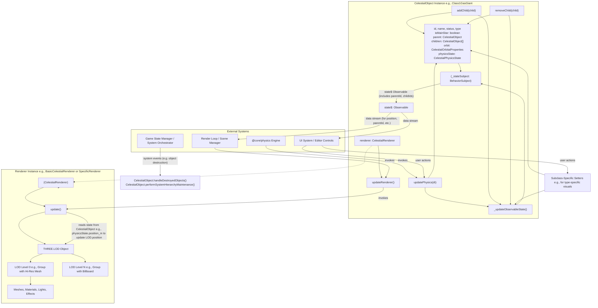

# Celestial Object System Architecture

This document outlines the architecture of the base `CelestialObject` system and how it interacts with extended celestial modules, state management, and rendering within the Teskooano N-Body simulation.

## Core Principles

1.  **Modular Extension**: The base `CelestialObject` provides foundational capabilities. Specific celestial types (e.g., stars, planets, gas giants) are implemented as modules that extend this base, adding their unique characteristics.
2.  **Separation of Concerns**: The base system handles core physics and existence, while specialized modules manage unique visual rendering details (shaders, materials, effects) and type-specific metadata.
3.  **Observable State**: The system leverages RxJS for state management. Each `CelestialObject` instance makes its state observable, allowing various parts of the application (especially the rendering system and UI controls) to react to changes in real-time.
4.  **Renderer Delegation**: While the base `CelestialObject` includes a fallback `BasicCelestialRenderer`, each specialized celestial module is responsible for providing its own renderer tailored to its visual requirements. All renderers implement a common `CelestialRenderer` interface.
5.  **Level of Detail (LOD)**: The rendering system supports LOD for celestial objects to optimize performance. Renderers are expected to manage different visual representations based on distance.

## Base `CelestialObject` Responsibilities

The `CelestialObject` abstract class is the cornerstone of this system. Its primary responsibilities include:

- **Existence & Identity**: Managing the unique ID and name of the celestial body.
- **Hierarchy Management**:
  - Storing a direct reference to its `parent: CelestialObject | undefined`.
  - Maintaining a list of its `children: CelestialObject[]`.
  - Providing `addChild(child: CelestialObject)` and `removeChild(child: CelestialObject)` methods for managing these relationships.
  - Tracking system-level hierarchy with `isMainStar: boolean`.
- **Initial Conditions**: Holding the fundamental orbital parameters (`CelestialOrbitalProperties`) that define its path and initial physical characteristics.
- **Current Physics State**: Maintaining the real-time physics state (`CelestialPhysicsState`), including mass, position, and velocity. This state is updated by the physics engine and through the `updatePhysics()` method implemented by subclasses.
- **Fallback Rendering**: Providing a `BasicCelestialRenderer` as a default. This ensures that any celestial object can be visualized.
  - The `BasicCelestialRenderer` implements a 4-tier LOD system (high, medium, low detail sphere groups, and a billboard).
  - Each LOD level is a `THREE.Group` or a `THREE.Object3D` (for billboards generated by a `Billboard` instance).
  - It utilizes a `Billboard` generator pattern for its furthest LOD. By default, it uses `DefaultBillboard`, which can be configured via `DefaultBillboardOptions` at instantiation or fully replaced.
  - The appearance of the billboard (visuals, light) for a specific celestial object instance is further configurable via `CelestialBillboardConfig` passed in `BasicRendererOptions`.
  - LOD transition distances are configurable via `BasicRendererOptions`.
- **Observable State Management**: Encapsulating an RxJS `BehaviorSubject` to hold its current core properties (`CelestialCoreProperties`) and exposing an `Observable` (`state$`) for other systems to subscribe to. The `_getCurrentState()` method now populates `parentId` from `this.parent?.id` and `childIds` from mapping `this.children`.
- **Renderer Orchestration**: Managing a `renderer` property (of type `CelestialRenderer`). Subclasses are expected to provide their own specific renderer instance to this property, typically in their constructor.
- **Static Hierarchy Utilities**: Providing static methods for system-wide hierarchy operations, which utilize helper functions located in `src/utils/`:
  - `handleDestroyedObjects(destroyedIds: string[], allObjects: Record<string, CelestialObject>, physicsEngine: PhysicsEngineType)`: Manages re-parenting when objects are destroyed.
  - `performSystemHierarchyMaintenance(allObjects: Record<string, CelestialObject>, physicsEngine: PhysicsEngineType)`: Handles tasks like ensuring planets orbit the correct star and reassigning escaped children.

## Class Structure and Relationships

```mermaid
classDiagram
  direction LR

  class CelestialObject {
    +id: string
    +name: string
    +type: CelestialType
    +status: CelestialStatus
    +isMainStar: boolean
    +parent: "CelestialObject | undefined"
    +children: "CelestialObject[]"
    +physicsState: CelestialPhysicsState
    +orbit: CelestialOrbitalProperties
    +renderer: CelestialRenderer
    +state$: "Observable<CelestialCoreProperties>"
    #_stateSubject: "BehaviorSubject<CelestialCoreProperties>"
    +constructor(params: CelestialObjectConstructorParams)
    +addChild(child: CelestialObject)
    +removeChild(child: CelestialObject)
    +updatePhysics(deltaTime: number)*
    +updateRenderer()
    #_updateObservableState()
    +dispose()
    +static handleDestroyedObjects(destroyedIds, allObjects, physicsEngine)
    +static performSystemHierarchyMaintenance(allObjects, physicsEngine)
  }

  class CelestialRenderer {
    "<<Interface>>"
    +lod: THREE.LOD
    +update()*
    +dispose()*
  }
  note for CelestialRenderer "Manages LOD (Level of Detail) via THREE.LOD object."

  class LODLevel {
    "<<Interface>>"
    +object: THREE.Object3D
    +distance: number
    +hysteresis?: number
  }

  class BasicRendererOptions {
    "<<Interface>>"
    +lodDistances?: LODDistances
    +billboardConfig?: CelestialBillboardConfig
    +billboardGenerator?: Billboard
  }

  class LODDistances {
    "<<Interface>>"
    +medium?: number
    +low?: number
    +billboard?: number
  }

  class Billboard {
    "<<Interface>>"
    +createLOD(celestialId, physicalProps, config, baseColor, lodDist, starMaterial?): LODLevel
  }

  class CelestialBillboardConfig {
    "<<Interface>>"
    +visuals?: BillboardVisualOptions
    +light?: BillboardLightParameters
  }

  class BillboardVisualOptions {
    "<<Interface>>"
    +size?: number
    +color?: "THREE.Color | number | string"
    +opacity?: number
    +texture?: THREE.Texture
  }

  class BillboardLightParameters {
    "<<Interface>>"
    +intensity?: number
    +color?: "THREE.Color | number | string"
    +decay?: number
  }

  class DefaultBillboard {
    +constructor(options?: DefaultBillboardOptions)
    +createLOD(celestialId, physicalProps, config, baseColor, lodDist, starMaterial?): LODLevel
  }
  note for DefaultBillboard "Default implementation of Billboard.\nConfigurable via DefaultBillboardOptions."

  class DefaultBillboardOptions {
    "<<Interface>>"
    +defaultSpriteSize?: number
    +defaultOpacity?: number
    +defaultLightIntensity?: number
    "// ... other options"
  }

  class BasicCelestialRenderer {
    +lod: THREE.LOD
    -options: BasicRendererOptions
    -billboardGenerator: Billboard
    +constructor(celestial: CelestialObject, radius: number, color: number, options?: BasicRendererOptions)
    #createLODs(radius: number, color: number)
    #createHighDetailGroupLOD(radius: number, color: number): THREE.Group
    #createMediumDetailGroupLOD(radius: number, color: number): THREE.Group
    #createLowDetailGroupLOD(radius: number, color: number): THREE.Group
    #createBillboardLOD(radius: number, color: number, distance: number): LODLevel
    +update()
    +dispose()
  }
  note for BasicCelestialRenderer "Provides 4 LOD levels.\nHigh/Med/Low are THREE.Groups.\nBillboard LOD is generated by a Billboard instance (DefaultBillboard by default).\nConfigurable via BasicRendererOptions (lodDistances, billboardConfig, billboardGenerator)."

  class SpecificCelestialModule {
    "<<Abstract>>"
    +constructor(params: CelestialObjectConstructorParams)
    +updatePhysics(deltaTime: number)
    +getSpecificMetadata()
  }
  note for SpecificCelestialModule "e.g., Class1GasGiant, StarTypeG"

  class SpecificRenderer {
    "<<Interface Implements CelestialRenderer>>"
    +lod: THREE.LOD
    +constructor(celestial: SpecificCelestialModule, options?: any)
    +update()
    +dispose()
  }
  note for SpecificRenderer "e.g., GasGiantClass1Renderer, StarRenderer.\nManages its own LODs and visual effects."

  CelestialObject <|-- SpecificCelestialModule
  CelestialObject o--> CelestialRenderer : renderer
  CelestialRenderer <|.. BasicCelestialRenderer : implements
  CelestialRenderer <|.. SpecificRenderer : implements
  SpecificCelestialModule ..> SpecificRenderer : "provides own (typically in constructor)"

  BasicCelestialRenderer --> BasicRendererOptions : uses
  BasicRendererOptions --> LODDistances : uses
  BasicRendererOptions --> CelestialBillboardConfig : uses
  BasicRendererOptions ..> Billboard : "uses (optional custom generator)"
  CelestialBillboardConfig --> BillboardVisualOptions : uses
  CelestialBillboardConfig --> BillboardLightParameters : uses
  BasicCelestialRenderer ..> Billboard : "uses (via billboardGenerator property)"
  DefaultBillboard ..|> Billboard : implements
  DefaultBillboard --> DefaultBillboardOptions : "uses (constructor)"

  CelestialRenderer ..> LODLevel : "(implicitly uses via THREE.LOD levels)"
```

_Note: `THREE.Group` is used within each LOD level of `BasicCelestialRenderer` and typically by `SpecificRenderer` as well, but not shown as direct aggregation on the `CelestialRenderer` interface itself anymore._

## Extended Celestial Modules (Factories)

Each distinct type of celestial object (e.g., Class 1 Gas Giant, G-type Star) is implemented as a separate module (often referred to as a factory or a class that acts like one when instantiated). These modules extend `CelestialObject` and are responsible for:

- **Defining Specific Characteristics**: Adding properties unique to that celestial type. This primarily includes:
  - **Shader Uniforms**: Data required by their custom shaders (e.g., atmospheric density, color palettes, texture IDs for procedural generation).
  - **Metadata**: In-engine data that facilitates interaction, special behaviors, or provides additional information not directly used by the physics simulation (e.g., habitable zone information for a star, resource types for a planet).
  - **Type-Specific Properties**: Additional properties that define the specific celestial type (e.g., `spectralClass` for a star that indicates its specific classification like "G2V" for our Sun).
- **Providing a Specialized Renderer**: Each module will typically create and manage its own renderer instance (e.g., `GasGiantClass1Renderer`, `ClassGStarRenderer`) that implements the `CelestialRenderer` interface. This renderer is passed to the `CelestialObject` base during construction (or set by the subclass constructor), overriding the fallback `BasicCelestialRenderer`.
  - The specialized renderer is responsible for setting up its own `THREE.LOD` object.
  - Each level of detail within the LOD can be a `THREE.Group` containing meshes, materials, lights, and effects specific to the celestial type (e.g., atmospheres, coronas, rings, gravitational lensing).
- **Implementing `updatePhysics()`**: Providing concrete logic for how the object interacts with the physics simulation, potentially calling services from the core physics engine.

### Star Type Implementation

Star types are specialized implementations of celestial objects that represent different types of stars based on their spectral classification. For example:

- **Main Sequence Stars**: Implement different spectral classes (O, B, A, F, G, K, M) each with their own physical characteristics:
  - `ClassGCelestial`: Represents G-type main-sequence stars (like our Sun) with a yellow color and surface temperatures around 5,200-6,000 K.
  - Each star type has a `spectralClass` property that specifies its particular classification (e.g., "G2V" for a G-type star like our Sun).

These specialized celestial objects use the core mechanism of the `CelestialObject` abstract class while providing specific implementations tailored to their astronomical characteristics.

## State Management, Interaction, and Data Flow (RxJS)

- The `CelestialObject`'s `state$` observable is the primary means by which its current core properties are communicated (including `parentId` and `childIds`).
- The rendering system subscribes to `state$` for relevant objects. When the state updates (e.g., position changes due to physics), the renderer receives the new state and updates the Three.js scene graph accordingly (primarily by updating the position of its `THREE.LOD` object).
- UI control layers (e.g., panels for editing properties) will also subscribe to `state$` to display current information and can use methods on the `CelestialObject` (or its more specific subclass) to enact changes (e.g., modifying orbital properties, or type-specific parameters that might influence rendering indirectly).
- When such changes are made, the `CelestialObject` (or its subclass) is responsible for updating its internal state and then calling `_updateObservableState()` to notify all subscribers, ensuring the UI and rendering reflect these changes.
- System-level orchestrators (e.g., a Game State Manager) can invoke the static methods on `CelestialObject` (like `handleDestroyedObjects` or `performSystemHierarchyMaintenance`) to manage global hierarchical changes.

## Handling Input State (JSON)

When a celestial object's state is defined via a JSON object (either hand-coded for a scenario or generated programmatically):

- This JSON data will be used to instantiate the appropriate specialized celestial module (e.g., `new Class1GasGiant(jsonData)`).
- The constructor of that module will map the JSON properties to the `CelestialObjectConstructorParams` (and any of its own specific parameters, including renderer options if applicable) and pass them to the `super()` call and its own initialization logic.
- This ensures that the object is correctly initialized with its defined existence, hierarchy, initial conditions, and any type-specific metadata and renderer setup (including LOD configurations) from the outset.

This architecture aims to create a robust, maintainable, and extensible system for managing diverse celestial objects within the Teskooano simulation.
