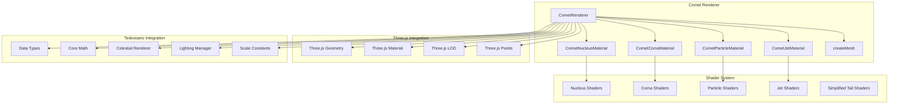
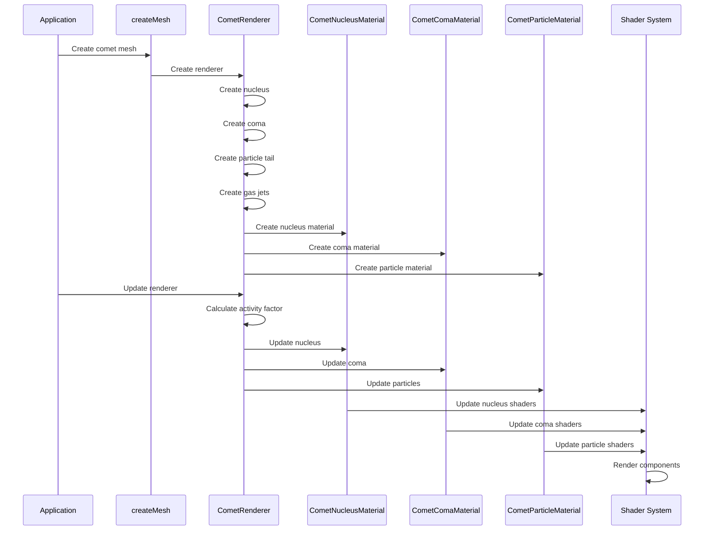
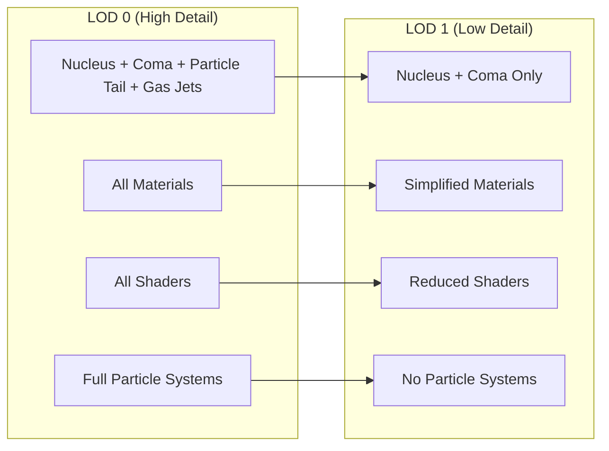

# AGENTS.md

A comprehensive guide for AI coding agents working on the Teskooano Comet Celestial Renderer package.

## Package Overview

The **`@teskooano/celestials-comet`** package provides a comprehensive comet rendering system for the Teskooano N-Body simulation, featuring realistic comet physics and visual effects including nucleus, coma, particle tails, and gas jets.

### Purpose

- **Realistic Comet Rendering**: Procedurally displaced nucleus with noise-based surface detail
- **Dynamic Visual Effects**: Activity-based coma and particle tail systems
- **Physics Integration**: Realistic tail orientation and particle behavior based on solar wind
- **Performance Optimization**: LOD system with simplified rendering for distant viewing
- **Multi-Component Architecture**: Nucleus, coma, particle tails, and gas jets with individual materials

## Package Architecture

### Directory Structure

```
packages/celestials/comet/
├── src/
│   ├── index.ts                    # Main package exports
│   ├── material.ts                 # Material classes for all components
│   ├── renderer.ts                 # Main CometRenderer class
│   ├── createMesh.ts               # Factory function for mesh creation
│   ├── vite-env.d.ts               # Vite environment type definitions
│   ├── shaders/                    # GLSL shader files
│   │   ├── nucleus.vertex.glsl     # Nucleus vertex shader
│   │   ├── nucleus.fragment.glsl   # Nucleus surface with noise and lighting
│   │   ├── coma.vertex.glsl        # Coma vertex shader
│   │   ├── coma.fragment.glsl      # Volumetric gas effect with density noise
│   │   ├── particle.vertex.glsl    # Particle tail vertex shader
│   │   ├── particle.fragment.glsl  # Soft particle rendering
│   │   ├── jet.vertex.glsl         # Gas jet vertex shader
│   │   ├── jet.fragment.glsl       # Cloudy gas jet particles
│   │   ├── simplified-tail.vertex.glsl    # LOD tail vertex shader
│   │   └── simplified-tail.fragment.glsl  # LOD tail with noise shimmer
│   └── shared/                     # Shared shader utilities
│       ├── lighting.glsl           # Lighting calculation functions
│       ├── noise.glsl              # Noise generation utilities
│       └── simplex/                # Simplex noise implementation
│           └── 3d.glsl             # 3D simplex noise functions
├── package.json
├── moon.yml
├── tsconfig.json
├── README.md
└── AGENTS.md
```

### Core Design Principles

#### 1. Multi-Component Rendering

Comets consist of multiple visual components with different materials and behaviors:

```typescript
// Comet components
export class CometRenderer extends BaseCelestialRenderer {
  private nucleus?: THREE.Mesh; // Rocky core with procedural displacement
  private coma?: THREE.Mesh; // Gas cloud that scales with activity
  private particleTail?: THREE.Points; // Physics-based particle system
  private jets: {
    // Multiple gas jets from nucleus surface
    points: THREE.Points;
    geometry: THREE.BufferGeometry;
    attributes: {
      size: Float32Array;
      alpha: Float32Array;
      lifetime: Float32Array;
      velocity: THREE.Vector3[];
    };
    lastParticleIndex: number;
    emissionPoint?: THREE.Vector3;
    emissionNormal?: THREE.Vector3;
    repositionTimer: number;
  }[] = [];
}
```

#### 2. Activity-Based Rendering

Visual effects change based on distance from stars and comet activity:

```typescript
// Activity factor calculation
private calculateActivityFactor(object: RenderableCelestialObject): number {
  const primaryLightSource = this.findClosestLightSource();
  if (!primaryLightSource) return 0;

  const lightPosition = new THREE.Vector3().copy(primaryLightSource.position);
  const cometPosition = this._tempVector1.copy(object.position);
  const distanceToLight = cometPosition.distanceTo(lightPosition);

  const activityDistance = 2 * SCALE.RENDER_SCALE_AU;
  let activityFactor = 1.0 - THREE.MathUtils.smoothstep(distanceToLight, 0, activityDistance);

  // An extinct comet (activity = 0) has no activity, so no coma or tail
  const properties = object.properties as CometProperties;
  if (properties.activity === 0) {
    activityFactor = 0.0;
  }

  return activityFactor;
}
```

#### 3. Physics-Based Particle Systems

Realistic particle behavior based on solar wind and radiation pressure:

```typescript
// Particle tail physics
private updateParticleTailPhysics(
  deltaTime: number,
  activityFactor: number,
  object: RenderableCelestialObject,
): void {
  if (activityFactor <= 0) return;

  const properties = object.properties as CometProperties;
  const primaryLightSource = this.findClosestLightSource();
  if (!primaryLightSource) return;

  const lightPosition = new THREE.Vector3().copy(primaryLightSource.position);
  const cometPosition = this._tempVector1.copy(object.position);
  const tailDirection = this._tempVector2
    .subVectors(cometPosition, lightPosition)
    .normalize();

  this.updateExistingParticles(deltaTime, activityFactor);
  this.emitNewParticles(activityFactor, object, properties, tailDirection);
}
```

## Key Components

### 1. CometRenderer Class

Main renderer class extending BaseCelestialRenderer:

```typescript
export class CometRenderer extends BaseCelestialRenderer {
  private nucleus?: THREE.Mesh;
  private coma?: THREE.Mesh;
  private nucleus_lod1?: THREE.Mesh;
  private coma_lod1?: THREE.Mesh;
  private particleTail?: THREE.Points;
  private particleGeometry?: THREE.BufferGeometry;
  private particlePositions?: Float32Array;
  private particleAttributes?: {
    size: Float32Array;
    alpha: Float32Array;
    lifetime: Float32Array;
    velocity: THREE.Vector3[];
  };
  private jets: Array<{
    points: THREE.Points;
    geometry: THREE.BufferGeometry;
    attributes: {
      size: Float32Array;
      alpha: Float32Array;
      lifetime: Float32Array;
      velocity: THREE.Vector3[];
    };
    lastParticleIndex: number;
    emissionPoint?: THREE.Vector3;
    emissionNormal?: THREE.Vector3;
    repositionTimer: number;
  }> = [];
  private clock = new THREE.Clock();
  private noise = new SimplexNoise();
  private random: () => number = () => 0;

  constructor(object: RenderableCelestialObject) {
    super(object);
    this.random = createSeededRandomSync(object.seed ?? object.id);
    this.createNucleus(object);
    this.createComa(object);
    this.createParticleTail(object);
    this._createJets(object);
  }

  // Core methods
  getLODLevels(
    object: RenderableCelestialObject,
    options?: CelestialMeshOptions,
  ): LODLevel[];
  update(
    object: RenderableCelestialObject,
    time: number,
    timeScale: number,
    lightSources: LightSourcesMap,
    camera: THREE.PerspectiveCamera,
    allObjects?: Record<string, RenderableCelestialObject>,
    allMeshes?: Record<string, THREE.Object3D>,
  ): void;
}
```

**Features:**

- **Multi-Component Architecture**: Nucleus, coma, particle tail, and gas jets
- **Activity-Based Rendering**: Visual effects change based on distance from stars
- **Physics Integration**: Realistic particle behavior and tail orientation
- **LOD Management**: Simplified rendering for distant viewing
- **Dynamic Gas Jets**: Multiple emission points with repositioning

### 2. Material Classes

Specialized materials for each comet component:

#### CometNucleusMaterial

```typescript
export class CometNucleusMaterial extends THREE.ShaderMaterial {
  constructor(options: CometNucleusMaterialOptions) {
    super({
      defines: {
        MAX_LIGHTS: MAX_LIGHTS,
        MAX_COLORS: MAX_COLORS,
        NUM_COLORS: options.colors.length,
      },
      uniforms: {
        uColors: { value: paddedColors },
        uHeights: { value: paddedHeights },
        uNumColors: { value: options.colors.length },
        uNumLights: { value: 0 },
        uLights: { value: LightArrayUtils.createLightSourceArray(MAX_LIGHTS) },
        uNoiseScale: { value: options.noiseScale ?? 2.0 },
        uBlendSharpness: { value: options.blendSharpness ?? 1.0 },
        uCraterScale: { value: options.craterScale ?? 12.0 },
        uCraterStrength: { value: options.craterStrength ?? 0.5 },
        uSimplePeriod: { value: options.simplePeriod ?? 1.0 },
        uUndulation: { value: options.undulation ?? 0.1 },
        uAmbientStrength: { value: options.ambientStrength ?? 0.01 },
        uMetallicFactor: { value: options.metallicFactor ?? 0.0 },
        uRoughness: { value: options.roughness ?? 0.5 },
        uSpecularColor: {
          value: options.specularColor ?? new THREE.Color(0xffffff),
        },
        uCameraPosition: { value: new THREE.Vector3() },
      },
      vertexShader: nucleusVertexShader,
      fragmentShader: nucleusFragmentShader,
      depthWrite: true,
      depthTest: true,
    });
  }
}
```

#### CometComaMaterial

```typescript
export class CometComaMaterial extends THREE.ShaderMaterial {
  constructor(options: { color: THREE.Color; opacity: number }) {
    super({
      defines: { MAX_LIGHTS: MAX_LIGHTS },
      uniforms: {
        uColor: { value: options.color },
        uOpacity: { value: options.opacity },
        uTime: { value: 0.0 },
        uNumLights: { value: 0 },
        uLights: { value: LightArrayUtils.createLightSourceArray(MAX_LIGHTS) },
      },
      vertexShader: comaVertexShader,
      fragmentShader: comaFragmentShader,
      transparent: true,
      blending: THREE.NormalBlending,
      depthWrite: true,
      depthTest: true,
    });
  }
}
```

#### CometParticleMaterial

```typescript
export class CometParticleMaterial extends THREE.ShaderMaterial {
  constructor(options: { color: THREE.Color }) {
    super({
      uniforms: {
        uColor: { value: options.color },
        uLightIntensity: { value: 1.0 },
        uAmbientStrength: { value: 0.01 },
      },
      vertexShader: particleVertexShader,
      fragmentShader: particleFragmentShader,
      transparent: true,
      blending: THREE.AdditiveBlending,
      depthWrite: false,
      depthTest: true,
    });
  }
}
```

### 3. Shader System

Advanced GLSL shaders for realistic comet rendering:

#### Nucleus Shaders

**Vertex Shader (`nucleus.vertex.glsl`)**:

```glsl
varying vec3 vWorldNormal;
varying vec3 vWorldPosition;
varying vec2 vUv;
varying vec3 vObjectPosition;

void main() {
  vUv = uv;
  vObjectPosition = normalize(position);

  vec4 worldPosition = modelMatrix * vec4(position, 1.0);
  vWorldPosition = worldPosition.xyz;

  vWorldNormal = normalize(mat3(modelMatrix) * normal);
  gl_Position = projectionMatrix * modelViewMatrix * vec4(position, 1.0);
}
```

**Fragment Shader (`nucleus.fragment.glsl`)**:

```glsl
// Multi-layer surface texturing with noise-based effects
void main() {
  // Base color from height map
  vec3 noiseCoord = vObjectPosition * uSimplePeriod;
  noiseCoord += uUndulation * snoise(noiseCoord);

  float baseNoise = fbm(noiseCoord * uNoiseScale);

  // Height-based color blending
  vec3 finalColor = uColors[0];
  for (int i = 1; i < uNumColors; i++) {
    float blendFactor = smoothstep(uHeights[i-1], uHeights[i], baseNoise);
    finalColor = mix(finalColor, uColors[i], blendFactor * uBlendSharpness);
  }

  // Craters/cracks layer
  vec3 craterCoord = vObjectPosition * uCraterScale;
  float craterNoise = snoise(craterCoord);
  float craters = pow(abs(craterNoise), 15.0);
  finalColor *= (1.0 - craters * uCraterStrength);

  // Calculate lighting
  vec3 lighting = vec3(uAmbientStrength * 0.1);
  vec3 viewDirection = normalize(uCameraPosition - vWorldPosition);

  for (int i = 0; i < uNumLights; i++) {
    vec3 lightDirection = normalize(uLights[i].position - vWorldPosition);
    float dotProduct = dot(vWorldNormal, lightDirection);

    if (dotProduct > 0.0) {
      float diffuse = max(dotProduct, 0.0);
      lighting += uLights[i].color * diffuse * uLights[i].intensity * 0.4;

      // Specular
      vec3 halfwayDir = normalize(lightDirection + viewDirection);
      float spec = pow(max(dot(vWorldNormal, halfwayDir), 0.0), 32.0);
      lighting += uLights[i].color * spec * uRoughness * uLights[i].intensity;
    }
  }

  gl_FragColor = vec4(finalColor * lighting, 1.0);
}
```

#### Coma Shaders

**Fragment Shader (`coma.fragment.glsl`)**:

```glsl
void main() {
  // Lighting and falloff
  vec3 totalLightDirection = vec3(0.0);
  for (int i = 0; i < uNumLights; i++) {
    totalLightDirection += normalize(uLights[i].position - vWorldPosition) * uLights[i].intensity;
  }
  totalLightDirection = normalize(totalLightDirection);

  float falloff = 1.0 - abs(dot(vNormal, totalLightDirection));
  falloff = pow(falloff, 1.5);

  // Animated particle noise for gas density
  float densityNoise = fbm(vWorldPosition.xy * 0.1 + uTime * 0.05);

  float finalOpacity = uOpacity * falloff * densityNoise;
  if (finalOpacity < 0.01) discard;

  gl_FragColor = vec4(uColor, finalOpacity);
}
```

#### Particle Shaders

**Fragment Shader (`particle.fragment.glsl`)**:

```glsl
void main() {
  float dist = distance(gl_PointCoord, vec2(0.5));
  float strength = 1.0 - smoothstep(0.4, 0.5, dist);
  if (strength < 0.01) discard;

  float finalAlpha = vAlpha * strength;

  // Emissive tail brightness
  vec3 finalColor = uColor * (uAmbientStrength + uLightIntensity);
  finalColor = pow(finalColor, vec3(1.0/2.2)); // Gamma correction

  gl_FragColor = vec4(finalColor, finalAlpha);
}
```

### 4. Factory Function

Unified mesh creation interface:

```typescript
export function createMesh(
  object: RenderableCelestialObject,
  options: CreateMeshOptions,
): THREE.Object3D {
  const { celestialRenderers, createLodObject, debug = false } = options;

  // Force fallback if debug mode is enabled
  if (debug) {
    return createFallbackSphere(object);
  }

  let renderer = celestialRenderers.get(object.id) as CometRenderer | undefined;

  if (!renderer) {
    try {
      renderer = new CometRenderer(object);
      celestialRenderers.set(object.id, renderer);
    } catch (error) {
      console.error(`Failed to create renderer for ${object.id}:`, error);
      return createFallbackSphere(object);
    }
  }

  if (renderer.getLODLevels) {
    const lodLevels = renderer.getLODLevels(object);
    if (lodLevels && lodLevels.length > 0) {
      return createLodObject(object, lodLevels);
    }
  }

  return createFallbackSphere(object);
}
```

## Usage Examples

### 1. Basic Comet Creation

```typescript
import { createMesh } from "@teskooano/celestials-comet";
import type { RenderableCelestialObject } from "@teskooano/data-types";

// Create comet mesh with automatic LOD
const cometMesh = createMesh(cometObject, {
  celestialRenderers: renderersMap,
  createLodObject: lodFactory,
});

// The mesh automatically handles:
// - Multi-component rendering (nucleus, coma, tail, jets)
// - Activity-based visual changes
// - Physics-based particle systems
// - Performance optimization
```

### 2. Comet Properties Configuration

```typescript
// Configure comet properties
const cometProperties: CometProperties = {
  type: CelestialType.COMET,
  activity: 1.0, // Activity level (0 = extinct, 1 = active)
  colors: ["#2c3e50", "#596a7a", "#8c9baa", "#d0d5da"],
  heights: [0.0, 0.4, 0.6, 0.85],
  visuals: {
    noiseScale: 2.0,
    blendSharpness: 1.0,
    craterScale: 12.0,
    craterStrength: 0.5,
    undulation: 0.1,
    ambientStrength: 0.01,
    metallicFactor: 0.0,
    roughness: 0.5,
  },
  visualComaRadius: 1000000, // Coma radius in meters
  visualComaColor: "#DCE6FF", // Coma color
  visualComaOpacity: 0.5, // Coma opacity
  visualMaxTailLength: 50000000, // Maximum tail length in meters
  visualTailColor: "#DCE6FF", // Tail color
};
```

### 3. Advanced Renderer Configuration

```typescript
import { CometRenderer } from "@teskooano/celestials-comet";

// Create renderer with custom options
const renderer = new CometRenderer(cometObject);

// Get LOD levels
const lodLevels = renderer.getLODLevels(cometObject);

// Update renderer
renderer.update(
  cometObject,
  time,
  timeScale,
  lightSources,
  camera,
  allObjects,
  allMeshes,
);
```

### 4. Activity-Based Visual Changes

```typescript
// Comet visual effects change based on distance from stars
private updateComa(
  object: RenderableCelestialObject,
  time: number,
  attenuatedLightSources: Map<string, any> | undefined,
  activityFactor: number,
): void {
  if (this.comaMaterial) {
    // Skip expensive particle physics when comet is not active
    if (activityFactor <= 0) {
      return;
    }

    this.comaMaterial.uniforms.uOpacity.value = activityFactor;
    this.comaMaterial.uniforms.uTime.value = time;

    // Update lighting
    if (attenuatedLightSources) {
      this.comaMaterial.uniforms.uNumLights.value = attenuatedLightSources.size;
      let i = 0;
      for (const lightData of attenuatedLightSources.values()) {
        this.comaMaterial.uniforms.uLights.value[i].position.copy(lightData.position);
        this.comaMaterial.uniforms.uLights.value[i].color.copy(lightData.color);
        this.comaMaterial.uniforms.uLights.value[i].intensity = lightData.intensity ?? 1.0;
        i++;
      }
    }
  }

  if (this.coma) {
    const comaScale = 1.0 + activityFactor * 0.5;
    this.coma.scale.setScalar(comaScale);

    if (this.coma_lod1) {
      this.coma_lod1.scale.setScalar(comaScale);
    }
  }
}
```

### 5. Physics-Based Particle Systems

```typescript
// Realistic particle tail physics
private emitNewParticles(
  activityFactor: number,
  object: RenderableCelestialObject,
  properties: CometProperties,
  tailDirection: THREE.Vector3,
): void {
  const particlesToEmit = Math.floor(activityFactor * 20);

  for (let i = 0; i < particlesToEmit; i++) {
    this.lastParticleIndex = (this.lastParticleIndex + 1) % MAX_PARTICLES;
    const pIndex = this.lastParticleIndex;

    // Start particles at the local origin (nucleus position)
    this.particlePositions![pIndex * 3 + 0] = 0;
    this.particlePositions![pIndex * 3 + 1] = 0;
    this.particlePositions![pIndex * 3 + 2] = 0;

    this.particleAttributes!.lifetime[pIndex] = PARTICLE_LIFETIME * (0.5 + this.random() * 0.5);
    this.particleAttributes!.size[pIndex] = object.radius * (1.0 + this.random() * 2.0) * (1.0 + activityFactor);

    const tailLength = properties.visualMaxTailLength!;
    const speed = (tailLength / PARTICLE_LIFETIME) * 0.5 * (1.0 + activityFactor * 2.0);

    this.particleAttributes!.velocity[pIndex].copy(tailDirection)
      .multiplyScalar(speed * (0.8 + this.random() * 0.4))
      .add(
        this._tempVector3
          .random()
          .subScalar(0.5)
          .multiplyScalar(speed * 0.2), // Add some spread
      );
  }
}
```

## Performance Guidelines

### 1. LOD System Optimization

- **Distance-Based Switching**: LOD switches at 5 AU render distance
- **Component Simplification**: LOD 1 uses cloned geometry for consistency
- **Memory Management**: Proper cleanup of LOD objects

```typescript
// Efficient LOD management
getLODLevels(object: RenderableCelestialObject, options?: CelestialMeshOptions): LODLevel[] {
  // LOD 0: High detail with particle tail
  const lod0_container = new THREE.Group();
  this.nucleusAndComaGroup = new THREE.Group();

  if (this.nucleus) {
    this.nucleusAndComaGroup.add(this.nucleus);
  }
  if (this.coma) {
    this.nucleusAndComaGroup.add(this.coma);
  }

  lod0_container.add(this.nucleusAndComaGroup);

  if (this.particleTail) {
    lod0_container.add(this.particleTail);
  }

  this.jets.forEach((jet) => lod0_container.add(jet.points));

  // LOD 1: Lower detail with simplified mesh tail
  const lod1_container = new THREE.Group();
  this.nucleusAndComaGroup_lod1 = new THREE.Group();

  if (this.nucleus) {
    this.nucleus_lod1 = this.nucleus.clone(false);
    this.nucleusAndComaGroup_lod1.add(this.nucleus_lod1);
  }

  if (this.coma) {
    this.coma_lod1 = this.coma.clone(false);
    this.nucleusAndComaGroup_lod1.add(this.coma_lod1);
  }

  lod1_container.add(this.nucleusAndComaGroup_lod1);

  return [
    { distance: 0, object: lod0_container },
    { distance: 5 * SCALE.RENDER_SCALE_AU, object: lod1_container }
  ];
}
```

### 2. Particle System Performance

- **Particle Lifetime Management**: Automatic cleanup of dead particles
- **Activity-Based Updates**: Skip expensive physics when comet is inactive
- **Efficient Emission**: Controlled particle emission based on activity

```typescript
// Efficient particle updates
private updateExistingParticles(deltaTime: number, activityFactor: number): void {
  for (let i = 0; i < MAX_PARTICLES; i++) {
    if (this.particleAttributes!.lifetime[i] > 0) {
      this.particleAttributes!.lifetime[i] -= deltaTime;

      if (this.particleAttributes!.lifetime[i] <= 0) {
        this.particleAttributes!.lifetime[i] = -1.0; // Kill particle
        this.particlePositions![i * 3 + 0] = 0; // Hide it
        continue;
      }

      const velocity = this.particleAttributes!.velocity[i];
      this.particlePositions![i * 3 + 0] += velocity.x * deltaTime;
      this.particlePositions![i * 3 + 1] += velocity.y * deltaTime;
      this.particlePositions![i * 3 + 2] += velocity.z * deltaTime;

      this.particleAttributes!.alpha[i] = (this.particleAttributes!.lifetime[i] / PARTICLE_LIFETIME) * activityFactor;
    }
  }
}
```

### 3. Memory Management

- **Pre-allocated Objects**: Reuse temporary vectors and matrices
- **Resource Cleanup**: Proper disposal of geometries and materials
- **Particle Management**: Efficient cleanup of particle systems

```typescript
// Pre-allocated objects for performance
private _tempVector1 = new THREE.Vector3();
private _tempVector2 = new THREE.Vector3();
private _tempVector3 = new THREE.Vector3();

// Proper resource cleanup
dispose(): void {
  super.dispose();

  // Dispose geometries
  if (this.particleGeometry) {
    this.particleGeometry.dispose();
  }

  // Dispose jet geometries
  this.jets.forEach((jet) => {
    if (jet.geometry) {
      jet.geometry.dispose();
    }
  });

  // Clear arrays
  this.jets = [];
  this.particlePositions = undefined;
  this.particleAttributes = undefined;
}
```

### 4. Activity-Based Optimization

- **Conditional Updates**: Skip expensive operations when comet is inactive
- **Dynamic Scaling**: Scale effects based on activity factor
- **Efficient Calculations**: Cache activity factor and reuse

```typescript
// Efficient activity-based updates
update(object: RenderableCelestialObject, time: number, timeScale: number, lightSources: LightSourcesMap, camera: THREE.PerspectiveCamera, allObjects?: Record<string, RenderableCelestialObject>, allMeshes?: Record<string, THREE.Object3D>): void {
  super.update(object, time, timeScale, lightSources, camera, allObjects, allMeshes);

  this.camera.copy(camera);
  this.updateLightSources(lightSources);

  const attenuatedLightSources = this.applyLightAttenuation();
  const dynamicAmbientIntensity = this.lightingManager.calculateDynamicAmbientLight();

  this.updateNucleus(object, dynamicAmbientIntensity);
  this.updateParticleTail(object);
  this.updateJets(object);

  const deltaTime = this.clock.getDelta();
  const activityFactor = this.calculateActivityFactor(object);

  this.updateNucleusRotation(object, deltaTime, activityFactor);
  this.updateComa(object, time, this.lightingManager.getLightSources(), activityFactor);
  this.updateParticleTailPhysics(deltaTime, activityFactor, object);
  this.updateJetsPhysics(deltaTime, activityFactor, object);
}
```

## Testing Strategy

### 1. Unit Testing

Test individual components and functionality:

```typescript
// Example: Renderer testing
import { describe, it, expect, beforeEach } from "vitest";
import { CometRenderer } from "../renderer";

describe("CometRenderer", () => {
  let renderer: CometRenderer;
  let mockObject: RenderableCelestialObject<CometProperties>;

  beforeEach(() => {
    const cometProperties: CometProperties = {
      type: CelestialType.COMET,
      activity: 1.0,
      colors: ["#2c3e50", "#596a7a", "#8c9baa", "#d0d5da"],
      heights: [0.0, 0.4, 0.6, 0.85],
      visualComaRadius: 1000000,
      visualComaColor: "#DCE6FF",
      visualComaOpacity: 0.5,
      visualMaxTailLength: 50000000,
      visualTailColor: "#DCE6FF",
    };

    mockObject = createMockComet(cometProperties);
    renderer = new CometRenderer(mockObject);
  });

  it("should create LOD levels with multiple components", () => {
    const lodLevels = renderer.getLODLevels(mockObject);

    expect(lodLevels).toBeDefined();
    expect(lodLevels.length).toBeGreaterThan(0);

    const level = lodLevels[0];
    expect(level.object).toBeInstanceOf(THREE.Group);
    expect(level.distance).toBe(0);
  });

  it("should handle update calls without errors", () => {
    const mockLightSources = new Map();
    const mockCamera = new THREE.PerspectiveCamera();

    expect(() => {
      renderer.update(mockObject, 1.0, 1.0, mockLightSources, mockCamera);
    }).not.toThrow();
  });
});
```

### 2. Integration Testing

Test comet rendering with other celestial objects:

```typescript
// Example: Integration test
import { describe, it, expect } from "vitest";
import { createMesh } from "../createMesh";

describe("Comet Integration", () => {
  it("should create comet mesh with LOD", () => {
    const cometObject = createMockComet();
    const renderersMap = new Map();
    const lodFactory = jest.fn();

    const mesh = createMesh(cometObject, {
      celestialRenderers: renderersMap,
      createLodObject: lodFactory,
    });

    expect(renderersMap.has(cometObject.id)).toBe(true);
    expect(lodFactory).toHaveBeenCalled();
  });
});
```

### 3. Performance Testing

Test rendering performance with particle systems:

```typescript
// Example: Performance test
import { test, expect } from "vitest";

test("comet performance with particle systems", async () => {
  const startTime = performance.now();

  const renderer = new CometRenderer(largeCometObject);
  const lodLevels = renderer.getLODLevels(largeCometObject);

  const endTime = performance.now();
  const duration = endTime - startTime;

  // Should create LOD levels in reasonable time
  expect(duration).toBeLessThan(1000); // Less than 1 second
  expect(lodLevels.length).toBeGreaterThan(0);
});
```

## Troubleshooting Guide

### 1. Common Issues

#### Particle System Not Working

```typescript
// ❌ Problem: Particles not appearing
// Particles not being emitted or updated

// ✅ Solution: Check activity factor and particle system initialization
private updateParticleTailPhysics(
  deltaTime: number,
  activityFactor: number,
  object: RenderableCelestialObject,
): void {
  if (!this.particleTail || !this.particleGeometry || !this.particlePositions || !this.particleAttributes) {
    return;
  }

  // Skip expensive particle physics when comet is not active
  if (activityFactor <= 0) {
    return;
  }

  // Ensure particle system is properly initialized
  this.updateExistingParticles(deltaTime, activityFactor);
  this.emitNewParticles(activityFactor, object, properties, tailDirection);

  this.particleGeometry.attributes.position.needsUpdate = true;
  this.particleGeometry.attributes.size.needsUpdate = true;
  this.particleGeometry.attributes.alpha.needsUpdate = true;
}
```

#### Coma Not Scaling

```typescript
// ❌ Problem: Coma not scaling with activity
// Coma remains same size regardless of distance from star

// ✅ Solution: Check activity factor calculation and coma scaling
private updateComa(
  object: RenderableCelestialObject,
  time: number,
  attenuatedLightSources: Map<string, any> | undefined,
  activityFactor: number,
): void {
  if (this.comaMaterial) {
    // Skip expensive particle physics when comet is not active
    if (activityFactor <= 0) {
      return;
    }

    this.comaMaterial.uniforms.uOpacity.value = activityFactor;
    this.comaMaterial.uniforms.uTime.value = time;
  }

  if (this.coma) {
    const comaScale = 1.0 + activityFactor * 0.5;
    this.coma.scale.setScalar(comaScale);

    if (this.coma_lod1) {
      this.coma_lod1.scale.setScalar(comaScale);
    }
  }
}
```

#### Gas Jets Not Repositioning

```typescript
// ❌ Problem: Gas jets not repositioning on nucleus surface
// Jets remain in same position

// ✅ Solution: Check jet repositioning logic
private handleJetRepositioning(jet: any): void {
  jet.repositionTimer -= this.clock.getDelta();

  if (jet.repositionTimer <= 0) {
    jet.repositionTimer = 3.0 + this.random() * 4.0; // Reposition every 3-7 seconds

    const nucleusGeom = this.nucleus!.geometry;
    const positionAttribute = nucleusGeom.getAttribute("position");
    const normalAttribute = nucleusGeom.getAttribute("normal");
    const randomIndex = Math.floor(this.random() * positionAttribute.count);

    jet.emissionPoint = new THREE.Vector3().fromBufferAttribute(positionAttribute, randomIndex);
    jet.emissionNormal = new THREE.Vector3().fromBufferAttribute(normalAttribute, randomIndex);
  }
}
```

### 2. Performance Issues

#### Excessive Particle Counts

```typescript
// ❌ Problem: Too many particles causing performance issues
const MAX_PARTICLES = 50000; // Too many

// ✅ Solution: Use appropriate particle limits
const MAX_PARTICLES = 12000; // Reasonable limit
const PARTICLE_LIFETIME = 5.0; // seconds
```

#### Memory Leaks

```typescript
// ❌ Problem: Memory leaks from not disposing resources
// Particle systems accumulating without cleanup

// ✅ Solution: Proper resource cleanup
dispose(): void {
  super.dispose();

  // Dispose geometries
  if (this.particleGeometry) {
    this.particleGeometry.dispose();
  }

  // Dispose jet geometries
  this.jets.forEach((jet) => {
    if (jet.geometry) {
      jet.geometry.dispose();
    }
  });

  // Clear arrays
  this.jets = [];
  this.particlePositions = undefined;
  this.particleAttributes = undefined;
}
```

### 3. Visual Issues

#### Incorrect Tail Orientation

```typescript
// ❌ Problem: Tail not pointing away from star
// Tail orientation incorrect

// ✅ Solution: Check tail direction calculation
private updateParticleTailPhysics(
  deltaTime: number,
  activityFactor: number,
  object: RenderableCelestialObject,
): void {
  const primaryLightSource = this.findClosestLightSource();
  if (!primaryLightSource) return;

  const lightPosition = new THREE.Vector3().copy(primaryLightSource.position);
  const cometPosition = this._tempVector1.copy(object.position);
  const tailDirection = this._tempVector2
    .subVectors(cometPosition, lightPosition) // Point away from star
    .normalize();

  // Use tailDirection for particle emission
  this.emitNewParticles(activityFactor, object, properties, tailDirection);
}
```

#### Poor Nucleus Surface Detail

```typescript
// ❌ Problem: Nucleus surface too smooth or too rough
// Surface detail not appropriate

// ✅ Solution: Adjust noise parameters
const nucleusMaterial = new CometNucleusMaterial({
  colors: colors.map((c) => new THREE.Color(c)),
  heights: heights,
  noiseScale: 2.0, // Adjust for surface detail
  blendSharpness: 1.0, // Adjust for color transitions
  craterScale: 12.0, // Adjust for crater size
  craterStrength: 0.5, // Adjust for crater prominence
  undulation: 0.1, // Adjust for surface waviness
});
```

## Dependencies and Integration Points

### 1. Core Dependencies

```json
{
  "dependencies": {
    "@teskooano/core-math": "file:../../core/math",
    "@teskooano/data-types": "file:../../data/types",
    "@teskooano/renderer-threejs-celestial": "file:../../renderer/threejs-celestial",
    "@types/three": "0.180.0",
    "simplex-noise": "4.0.3",
    "three": "0.180.0"
  }
}
```

### 2. Integration with Teskooano Ecosystem

- **Data Types**: Uses `RenderableCelestialObject` and `CometProperties`
- **Core Math**: Seeded random number generation for consistent appearance
- **Celestial Renderer**: Extends `BaseCelestialRenderer` for core functionality
- **Lighting System**: Integrates with `LightingManager` for dynamic lighting
- **LOD System**: Uses `LODLevel` and `createLodObject` for performance optimization

### 3. Shader Dependencies

- **Simplex Noise**: 3D simplex noise implementation for procedural generation
- **Lighting Functions**: Shared lighting calculation utilities
- **Noise Functions**: Fractal Brownian Motion (FBM) for surface detail

## Contributing Guidelines

### 1. Shader Development

- **GLSL Standards**: Use high precision floats and proper includes
- **Performance**: Optimize shader complexity for target hardware
- **Documentation**: Comment complex shader functions and algorithms
- **Testing**: Test shaders across different devices and browsers

### 2. Material Development

- **Parameter Validation**: Validate all material parameters
- **Error Handling**: Provide meaningful error messages for invalid configurations
- **Performance**: Limit uniform arrays to reasonable sizes
- **Compatibility**: Ensure compatibility with Three.js versions

### 3. Renderer Development

- **LOD Management**: Implement efficient LOD switching
- **Memory Management**: Proper cleanup of resources
- **Physics Integration**: Use actual physics data for realistic behavior
- **Error Handling**: Graceful fallbacks for rendering failures

## Architecture Documentation

### 1. System Overview



### 2. Data Flow



### 3. LOD System



## Scientific References

### 1. Comet Physics

- **Nucleus Structure**: Irregular, rocky surface with craters and surface features
- **Coma Formation**: Gas cloud that forms when comet approaches star
- **Tail Dynamics**: Solar wind and radiation pressure create particle tails
- **Gas Jets**: Surface emission points that change over time

### 2. Computer Graphics

- **Multi-Component Rendering**: Complex objects with multiple visual elements
- **Particle Systems**: Physics-based particle behavior and lifetime management
- **Level of Detail**: Performance optimization through component simplification
- **Shader Programming**: GLSL for real-time rendering effects

### 3. Performance Optimization

- **GPU Programming**: Efficient particle system rendering
- **Memory Management**: Resource pooling and cleanup
- **Activity-Based Updates**: Conditional rendering based on comet activity
- **Rendering Pipeline**: Optimized Three.js integration

### 4. Procedural Generation

- **Seeded Randomization**: Consistent procedural generation
- **Noise Functions**: Natural-looking surface detail and gas density
- **Color Variation**: Realistic comet appearance
- **Surface Features**: Crater formation and surface texturing

---

**Remember**: The comet renderer package provides realistic, multi-component comet rendering with activity-based visual effects and physics-based particle systems. Always consider the balance between visual quality and performance, and ensure proper integration with the broader Teskooano ecosystem.
