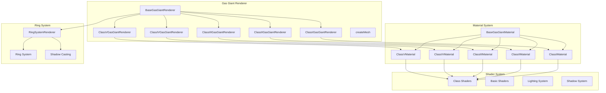
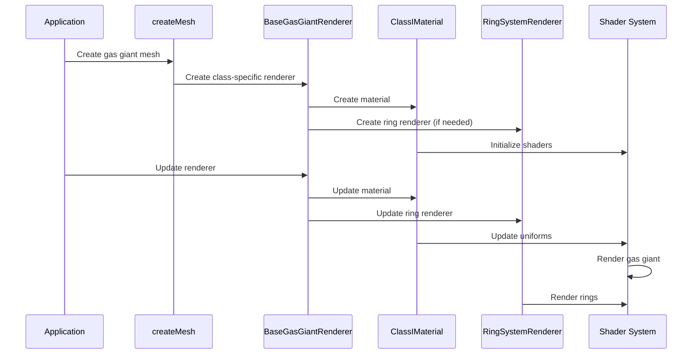

# AGENTS.md

A comprehensive guide for AI coding agents working on the Teskooano Gas Giants Celestial Renderer package.

## Package Overview

The **`@teskooano/celestials-gas-giants`** package provides a sophisticated gas giant planet rendering system for the Teskooano N-Body simulation, featuring five distinct gas giant classes with procedurally generated atmospheric effects, ring systems, and advanced lighting.

### Purpose

- **Multi-Class Gas Giants**: Five distinct classes (I-V) based on atmospheric composition and temperature
- **Procedural Atmospheres**: Advanced noise-based atmospheric effects with realistic cloud patterns
- **Ring System Integration**: Automatic ring system rendering with shadow casting
- **Advanced Lighting**: Dynamic lighting with shadow casting and smooth terminator transitions
- **LOD Optimization**: Multiple detail levels for performance at various distances

## Package Architecture

### Directory Structure

```
packages/celestials/gas-giants/
├── src/
│   ├── index.ts                    # Main package exports
│   ├── createMesh.ts               # Factory function for mesh creation
│   ├── shims-glsl.d.ts             # GLSL module declarations
│   ├── base/                       # Base gas giant classes
│   │   ├── index.ts
│   │   ├── material.ts             # BaseGasGiantMaterial
│   │   └── renderer.ts             # BaseGasGiantRenderer
│   ├── class-i/                    # Class I (Ammonia Clouds - Jupiter-like)
│   │   ├── index.ts
│   │   ├── material.ts             # ClassIMaterial
│   │   └── renderer.ts             # ClassIGasGiantRenderer
│   ├── class-ii/                   # Class II (Water Clouds)
│   │   ├── index.ts
│   │   ├── material.ts             # ClassIIMaterial
│   │   └── renderer.ts             # ClassIIGasGiantRenderer
│   ├── class-iii/                  # Class III (Cloudless/Azure)
│   │   ├── index.ts
│   │   ├── material.ts             # ClassIIIMaterial
│   │   └── renderer.ts             # ClassIIIGasGiantRenderer
│   ├── class-iv/                   # Class IV (Alkali Metals/Dark)
│   │   ├── index.ts
│   │   ├── material.ts             # ClassIVMaterial
│   │   └── renderer.ts             # ClassIVGasGiantRenderer
│   ├── class-v/                    # Class V (Silicate Clouds/Bright)
│   │   ├── index.ts
│   │   ├── material.ts             # ClassVMaterial
│   │   └── renderer.ts             # ClassVGasGiantRenderer
│   └── shaders/                    # GLSL shader files
│       ├── basic.vertex.glsl       # Basic vertex shader
│       ├── basic.fragment.glsl     # Basic fragment shader
│       ├── class-i.vertex.glsl     # Class I vertex shader
│       ├── class-i.fragment.glsl   # Class I fragment shader
│       ├── class-ii.vertex.glsl    # Class II vertex shader
│       ├── class-ii.fragment.glsl  # Class II fragment shader
│       ├── class-iii.vertex.glsl   # Class III vertex shader
│       ├── class-iii.fragment.glsl # Class III fragment shader
│       ├── class-iv.vertex.glsl    # Class IV vertex shader
│       ├── class-iv.fragment.glsl  # Class IV fragment shader
│       ├── class-v.vertex.glsl     # Class V vertex shader
│       └── class-v.fragment.glsl   # Class V fragment shader
├── package.json
├── moon.yml
├── tsconfig.json
└── AGENTS.md
```

### Core Design Principles

#### 1. Class-Based Architecture

Five distinct gas giant classes with unique atmospheric properties:

```typescript
// Gas giant class enumeration
export enum GasGiantClass {
  CLASS_I = "I", // Ammonia clouds (Jupiter-like)
  CLASS_II = "II", // Water clouds
  CLASS_III = "III", // Cloudless/Azure
  CLASS_IV = "IV", // Alkali metals/Dark
  CLASS_V = "V", // Silicate clouds/Bright/Glowing
}
```

#### 2. Dynamic Lighting System

Advanced lighting with shadow casting and smooth transitions:

```typescript
// Dynamic light and shadow caster support
interface CalculatedLight {
  position: THREE.Vector3;
  color: THREE.Color;
  intensity: number;
}

interface CalculatedShadowCaster {
  position: THREE.Vector3;
  radius: number;
}
```

#### 3. Ring System Integration

Automatic ring system rendering with shadow casting:

```typescript
// Ring system integration
protected ringSystemRenderer: RingSystemRenderer | null = null;

// Lazy initialization of ring renderer
if (!this.ringSystemRenderer && properties?.rings && properties.rings.length > 0) {
  this.ringSystemRenderer = new RingSystemRenderer(object, this);
}
```

## Key Components

### 1. BaseGasGiantMaterial Class

Abstract base material with dynamic lighting support:

```typescript
export abstract class BaseGasGiantMaterial extends THREE.ShaderMaterial {
  protected currentNumLights: number = 0;
  protected currentNumShadowCasters: number = 0;

  constructor(parameters?: THREE.ShaderMaterialParameters) {
    super({
      ...parameters,
      depthTest: true,
      depthWrite: true,
    });
  }

  update(
    time: number,
    timeScale: number,
    lights: CalculatedLight[],
    camera: THREE.PerspectiveCamera,
    shadowCasters: CalculatedShadowCaster[],
  ): void {
    // Dynamic light and shadow caster updates
    if (this.uniforms.uNumLights && this.uniforms.uLights) {
      const numLights = lights.length;

      // Resize arrays if needed
      if (numLights !== this.currentNumLights) {
        this.resizeLightArrays(numLights);
        this.currentNumLights = numLights;
      }

      // Update light uniforms
      this.uniforms.uNumLights.value = numLights;
      for (let i = 0; i < numLights; i++) {
        const light = lights[i];
        if (light && this.uniforms.uLights.value[i]) {
          this.uniforms.uLights.value[i].position.copy(light.position);
          this.uniforms.uLights.value[i].color.copy(light.color);
          this.uniforms.uLights.value[i].intensity = light.intensity;
        }
      }
    }

    // Update shadow casters similarly
    if (
      this.uniforms.uNumShadowCasters &&
      this.uniforms.uShadowCasters &&
      shadowCasters
    ) {
      const numShadowCasters = shadowCasters.length;

      if (numShadowCasters !== this.currentNumShadowCasters) {
        this.resizeShadowCasterArrays(numShadowCasters);
        this.currentNumShadowCasters = numShadowCasters;
      }

      this.uniforms.uNumShadowCasters.value = numShadowCasters;
      for (let i = 0; i < numShadowCasters; i++) {
        if (this.uniforms.uShadowCasters.value[i]) {
          this.uniforms.uShadowCasters.value[i].position.copy(
            shadowCasters[i].position,
          );
          this.uniforms.uShadowCasters.value[i].radius =
            shadowCasters[i].radius;
        }
      }
    }
  }
}
```

### 2. BaseGasGiantRenderer Class

Base renderer with LOD system and ring integration:

```typescript
export abstract class BaseGasGiantRenderer<
  TGasGiantMaterial extends BaseGasGiantMaterial = BaseGasGiantMaterial,
> extends BaseCelestialRenderer<TGasGiantMaterial> {
  protected textureLoader: THREE.TextureLoader = new THREE.TextureLoader();
  protected ringSystemRenderer: RingSystemRenderer | null = null;

  constructor(object: RenderableCelestialObject, deps: GasGiantRendererDeps) {
    super(object, { lightingManager: deps.lightingManager });
    deps.celestialRenderers.set(object.id, this);
  }

  public getLODLevels(
    object: RenderableCelestialObject,
    options?: CelestialMeshOptions,
  ): LODLevel[] {
    const planetLODs = this._createPlanetLODs(object, options);
    let finalLODs = planetLODs;

    // Ring system integration
    if (
      !this.ringSystemRenderer &&
      properties?.rings &&
      properties.rings.length > 0
    ) {
      this.ringSystemRenderer = new RingSystemRenderer(object, this);
    }

    if (this.ringSystemRenderer) {
      const ringLODs = this.ringSystemRenderer.getLODLevels(object, {
        ...options,
        parentLODDistances: planetLODs.map((l) => l.distance),
      });

      // Combine planet and ring LODs
      finalLODs = planetLODs.map((planetLOD, index) => {
        const ringLOD = ringLODs[index] || ringLODs[ringLODs.length - 1];
        const combinedGroup = new THREE.Group();
        combinedGroup.name = `${object.id}-lod-${index}-combined`;
        combinedGroup.add(planetLOD.object);
        if (ringLOD?.object) {
          combinedGroup.add(ringLOD.object);
        }
        return {
          object: combinedGroup,
          distance: planetLOD.distance,
        };
      });
    }

    return finalLODs;
  }
}
```

### 3. Class-Specific Materials

Each gas giant class has specialized materials:

#### Class I Material (Jupiter-like)

```typescript
export class ClassIMaterial extends BaseGasGiantMaterial {
  private warpOctaves: number = 5;
  private colorOctaves: number = 3;

  constructor(options: {
    atmosphereColor: THREE.Color;
    cloudColor: THREE.Color;
    seed: string | number;
    stormMap?: THREE.Texture;
  }) {
    const darkColor = options.atmosphereColor.clone().multiplyScalar(0.4);

    super({
      defines: {
        MAX_LIGHTS: MAX_LIGHTS,
        MAX_SHADOW_CASTERS: MAX_SHADOW_CASTERS,
      },
      uniforms: {
        mainColor1: { value: options.atmosphereColor },
        mainColor2: { value: options.cloudColor },
        darkColor: { value: darkColor },
        uSeed: { value: options.seed },
        time: { value: 0 },
        uLights: { value: lights },
        uNumLights: { value: 0 },
        uShadowCasters: { value: shadowCasters },
        uNumShadowCasters: { value: 0 },
        uWarpOctaves: { value: 5 },
        uColorOctaves: { value: 3 },
        stormMap: { value: options.stormMap },
        hasStormMap: { value: !!options.stormMap },
        uDynamicAmbientIntensity: { value: 0.03 },
      },
      vertexShader: classIVertexShader,
      fragmentShader: classIFragmentShader,
    });

    this.currentNumLights = MAX_LIGHTS;
    this.currentNumShadowCasters = MAX_SHADOW_CASTERS;
  }

  updateLOD(lodLevel: number): void {
    const level = Math.max(0, Math.min(lodLevel, lodToOctaveMap.length - 1));
    const newWarpOctaves = lodToOctaveMap[level];
    const newColorOctaves = lodToOctaveMap[Math.max(0, level - 1)];

    if (newWarpOctaves !== this.warpOctaves) {
      this.uniforms.uWarpOctaves.value = newWarpOctaves;
      this.warpOctaves = newWarpOctaves;
    }
    if (newColorOctaves !== this.colorOctaves) {
      this.uniforms.uColorOctaves.value = newColorOctaves;
      this.colorOctaves = newColorOctaves;
    }
  }
}
```

#### Class V Material (Hot Jupiter)

```typescript
export class ClassVMaterial extends BaseGasGiantMaterial {
  constructor(options: {
    baseColor: THREE.Color;
    cloudColor: THREE.Color;
    emissiveColor: THREE.Color;
    emissiveIntensity: number;
    stormMap?: THREE.Texture;
  }) {
    super({
      defines: {
        MAX_LIGHTS: MAX_LIGHTS,
        MAX_SHADOW_CASTERS: MAX_SHADOW_CASTERS,
      },
      uniforms: {
        baseColor: { value: options.baseColor },
        cloudColor: { value: options.cloudColor },
        emissiveColor: { value: options.emissiveColor },
        emissiveIntensity: { value: options.emissiveIntensity },
        time: { value: 0 },
        uLights: { value: lights },
        uNumLights: { value: 0 },
        uShadowCasters: { value: shadowCasters },
        uNumShadowCasters: { value: 0 },
        stormMap: { value: options.stormMap },
        hasStormMap: { value: !!options.stormMap },
        uDynamicAmbientIntensity: { value: 0.08 },
      },
      vertexShader: classVVertexShader,
      fragmentShader: classVFragmentShader,
    });

    this.currentNumLights = MAX_LIGHTS;
    this.currentNumShadowCasters = MAX_SHADOW_CASTERS;
  }
}
```

### 4. Factory Function

Unified mesh creation with class selection:

```typescript
export function createMesh(
  object: RenderableCelestialObject,
  options: CreateMeshOptions,
): THREE.Object3D {
  const {
    celestialRenderers,
    createLodObject,
    lightingManager,
    debug = false,
  } = options;

  if (debug) {
    return createFallbackSphere(object);
  }

  let renderer = celestialRenderers.get(object.id) as
    | BaseGasGiantRenderer
    | undefined;

  if (!renderer) {
    const properties = object.properties as GasGiantProperties;
    const gasGiantClass = properties.classType;
    const rendererDeps = { celestialRenderers, lightingManager };

    let newRenderer: BaseGasGiantRenderer;

    switch (gasGiantClass) {
      case GasGiantClass.CLASS_I:
        newRenderer = new ClassIGasGiantRenderer(object, rendererDeps);
        break;
      case GasGiantClass.CLASS_II:
        newRenderer = new ClassIIGasGiantRenderer(object, rendererDeps);
        break;
      case GasGiantClass.CLASS_III:
        newRenderer = new ClassIIIGasGiantRenderer(object, rendererDeps);
        break;
      case GasGiantClass.CLASS_IV:
        newRenderer = new ClassIVGasGiantRenderer(object, rendererDeps);
        break;
      case GasGiantClass.CLASS_V:
        newRenderer = new ClassVGasGiantRenderer(object, rendererDeps);
        break;
      default:
        console.warn(
          `Unknown gasGiantClass: ${gasGiantClass} for ${object.id}. Using fallback.`,
        );
        return createFallbackSphere(object);
    }

    renderer = newRenderer;
    celestialRenderers.set(object.id, renderer);
  }

  const lodLevels = renderer.getLODLevels(object);
  if (lodLevels && lodLevels.length > 0) {
    const lod = createLodObject(object, lodLevels);

    // Register ring shadow casters if needed
    if (options.lightingManager) {
      renderer.registerRingShadowCasters(options.lightingManager, object);
    }

    return lod;
  }

  return createFallbackSphere(object);
}
```

## Usage Examples

### 1. Basic Gas Giant Creation

```typescript
import { createMesh } from "@teskooano/celestials-gas-giants";
import type { RenderableCelestialObject } from "@teskooano/data-types";

// Create gas giant mesh with automatic class selection
const gasGiantMesh = createMesh(gasGiantObject, {
  celestialRenderers: renderersMap,
  createLodObject: lodFactory,
  lightingManager: lightingManager,
});

// The mesh automatically handles:
// - Class-based atmospheric effects
// - Ring system integration
// - Dynamic lighting and shadows
// - LOD optimization
```

### 2. Gas Giant Properties Configuration

```typescript
// Configure gas giant properties
const gasGiantProperties: GasGiantProperties = {
  type: CelestialType.GAS_GIANT,
  classType: GasGiantClass.CLASS_I, // Jupiter-like
  atmosphereColor: "#f4e4bc", // Cream/yellow
  cloudColor: "#d2b48c", // Tan
  cloudColor: "#ff6b35", // Orange (for Class V)
  emissiveColor: "#ff4400", // Red glow (for Class V)
  emissiveIntensity: 0.15, // Glow intensity (for Class V)
  rings: [
    // Optional ring system
    {
      innerRadius: 1.4,
      outerRadius: 2.0,
      opacity: 0.8,
      color: "#c0a080",
    },
  ],
};
```

### 3. Class-Specific Renderer Usage

```typescript
import { ClassIGasGiantRenderer } from "@teskooano/celestials-gas-giants";

// Create specific class renderer
const renderer = new ClassIGasGiantRenderer(gasGiantObject, {
  celestialRenderers: renderersMap,
  lightingManager: lightingManager,
});

// Get LOD levels
const lodLevels = renderer.getLODLevels(gasGiantObject);

// Update renderer
renderer.update(
  gasGiantObject,
  time,
  timeScale,
  lightSources,
  camera,
  allObjects,
);
```

## Performance Guidelines

### 1. LOD System Optimization

- **Distance-Based Switching**: LOD switches at 800x and 2000x radius distances
- **Geometry Reduction**: Lower detail spheres for medium LOD
- **Billboard LOD**: 2D billboards for extreme distances

### 2. Dynamic Lighting Performance

- **Array Resizing**: Efficient light and shadow caster array management
- **Batch Updates**: Update all uniforms in single operation
- **Conditional Updates**: Skip expensive operations when possible

### 3. Ring System Integration

- **Lazy Initialization**: Rings created only when needed
- **Shadow Casting**: Automatic shadow caster registration
- **LOD Synchronization**: Ring LOD matches planet LOD

## Testing Strategy

### 1. Unit Testing

Test individual components and functionality:

```typescript
import { describe, it, expect, beforeEach } from "vitest";
import { ClassIGasGiantRenderer } from "../class-i/renderer";

describe("ClassIGasGiantRenderer", () => {
  let renderer: ClassIGasGiantRenderer;
  let mockObject: RenderableCelestialObject<GasGiantProperties>;

  beforeEach(() => {
    const gasGiantProperties: GasGiantProperties = {
      type: CelestialType.GAS_GIANT,
      classType: GasGiantClass.CLASS_I,
      atmosphereColor: "#f4e4bc",
      cloudColor: "#d2b48c",
    };

    mockObject = createMockGasGiant(gasGiantProperties);
    renderer = new ClassIGasGiantRenderer(mockObject, {
      celestialRenderers: new Map(),
      lightingManager: mockLightingManager,
    });
  });

  it("should create LOD levels with ring integration", () => {
    const lodLevels = renderer.getLODLevels(mockObject);

    expect(lodLevels).toBeDefined();
    expect(lodLevels.length).toBeGreaterThan(0);

    const level = lodLevels[0];
    expect(level.object).toBeInstanceOf(THREE.Group);
    expect(level.distance).toBe(0);
  });
});
```

### 2. Integration Testing

Test gas giant rendering with other celestial objects:

```typescript
import { describe, it, expect } from "vitest";
import { createMesh } from "../createMesh";

describe("Gas Giant Integration", () => {
  it("should create gas giant mesh with class selection", () => {
    const gasGiantObject = createMockGasGiant();
    const renderersMap = new Map();
    const lodFactory = jest.fn();

    const mesh = createMesh(gasGiantObject, {
      celestialRenderers: renderersMap,
      createLodObject: lodFactory,
      lightingManager: mockLightingManager,
    });

    expect(renderersMap.has(gasGiantObject.id)).toBe(true);
    expect(lodFactory).toHaveBeenCalled();
  });
});
```

## Troubleshooting Guide

### 1. Common Issues

#### Incorrect Class Selection

```typescript
// ❌ Problem: Wrong gas giant class selected
const properties: GasGiantProperties = {
  classType: "UNKNOWN", // Invalid class
};

// ✅ Solution: Use proper enum values
const properties: GasGiantProperties = {
  classType: GasGiantClass.CLASS_I, // Valid class
};
```

#### Ring System Not Appearing

```typescript
// ❌ Problem: Rings not rendering
const properties: GasGiantProperties = {
  rings: undefined, // No rings defined
};

// ✅ Solution: Define ring properties
const properties: GasGiantProperties = {
  rings: [
    {
      innerRadius: 1.4,
      outerRadius: 2.0,
      opacity: 0.8,
      color: "#c0a080",
    },
  ],
};
```

#### Performance Issues

```typescript
// ❌ Problem: Too many lights causing performance issues
const MAX_LIGHTS = 50; // Too many

// ✅ Solution: Use reasonable limits
const MAX_LIGHTS = 4; // Reasonable limit
```

### 2. Shader Issues

#### Uniform Array Size Mismatch

```typescript
// ❌ Problem: Light array size mismatch
this.uniforms.uLights.value = new Array(10); // Wrong size

// ✅ Solution: Use dynamic resizing
if (numLights !== this.currentNumLights) {
  this.resizeLightArrays(numLights);
  this.currentNumLights = numLights;
}
```

#### Missing Shader Dependencies

```glsl
// ❌ Problem: Missing shader includes
precision highp float;
// Missing #include <common>

// ✅ Solution: Include required headers
precision highp float;
#include <common>
#include <logdepthbuf_pars_fragment>
```

## Dependencies and Integration Points

### 1. Core Dependencies

```json
{
  "dependencies": {
    "@teskooano/data-types": "file:../../data/types",
    "@teskooano/renderer-threejs-celestial": "file:../../renderer/threejs-celestial",
    "@teskooano/celestials-rings": "file:../rings",
    "@types/three": "0.180.0",
    "three": "0.180.0"
  }
}
```

### 2. Integration with Teskooano Ecosystem

- **Data Types**: Uses `RenderableCelestialObject` and `GasGiantProperties`
- **Celestial Renderer**: Extends `BaseCelestialRenderer` for core functionality
- **Ring System**: Integrates with `RingSystemRenderer` for ring rendering
- **Lighting System**: Integrates with `LightingManager` for dynamic lighting
- **LOD System**: Uses `LODLevel` and `createLodObject` for performance optimization

## Contributing Guidelines

### 1. Shader Development

- **GLSL Standards**: Use high precision floats and proper includes
- **Performance**: Optimize shader complexity for target hardware
- **Documentation**: Comment complex shader functions and algorithms
- **Testing**: Test shaders across different devices and browsers

### 2. Material Development

- **Parameter Validation**: Validate all material parameters
- **Error Handling**: Provide meaningful error messages for invalid configurations
- **Performance**: Limit uniform arrays to reasonable sizes
- **Compatibility**: Ensure compatibility with Three.js versions

### 3. Renderer Development

- **LOD Management**: Implement efficient LOD switching
- **Memory Management**: Proper cleanup of resources
- **Ring Integration**: Proper ring system integration and cleanup
- **Error Handling**: Graceful fallbacks for rendering failures

## Architecture Documentation

### 1. System Overview



### 2. Data Flow



## Scientific References

### 1. Gas Giant Classification

- **Class I**: Ammonia clouds, Jupiter-like atmospheres
- **Class II**: Water clouds, cooler gas giants
- **Class III**: Cloudless atmospheres, clear skies
- **Class IV**: Alkali metal absorption, dark atmospheres
- **Class V**: Silicate clouds, hot Jupiters with thermal emission

### 2. Atmospheric Modeling

- **Procedural Generation**: Noise-based atmospheric patterns
- **Cloud Formation**: Realistic cloud layer modeling
- **Thermal Emission**: Heat glow for hot gas giants
- **Atmospheric Scattering**: Light interaction with gas layers

### 3. Ring Systems

- **Ring Dynamics**: Realistic ring particle behavior
- **Shadow Casting**: Ring shadows on planet surfaces
- **LOD Management**: Performance optimization for ring rendering

### 4. Computer Graphics

- **Shader Programming**: GLSL for atmospheric effects
- **Level of Detail**: Performance optimization through detail reduction
- **Dynamic Lighting**: Real-time light and shadow calculations

---

**Remember**: The gas giants package provides realistic, class-based gas giant rendering with advanced atmospheric effects, ring systems, and dynamic lighting. Always consider the balance between visual quality and performance, and ensure proper integration with the broader Teskooano ecosystem.
