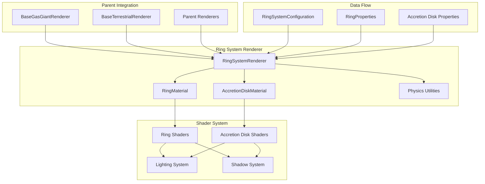
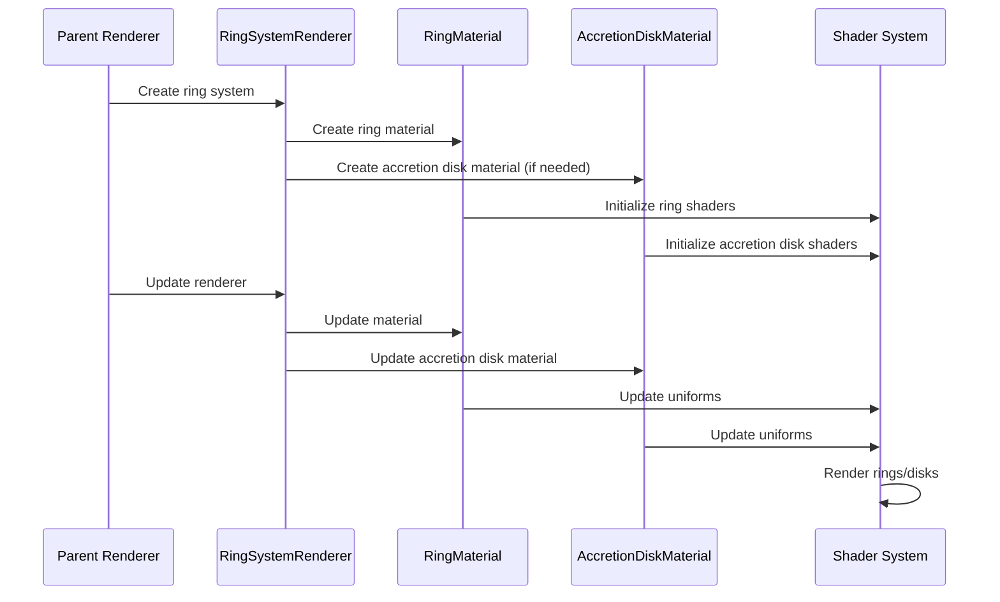

# AGENTS.md

A comprehensive guide for AI coding agents working on the Teskooano Ring System Celestial Renderer package.

## Package Overview

The **`@teskooano/celestials-rings`** package provides a sophisticated planetary ring system rendering system for the Teskooano N-Body simulation, featuring enhanced axial inclination controls, accretion disk support, and advanced lighting with shadow casting.

### Purpose

- **Enhanced Ring Systems**: Support for complex multi-ring systems with individual ring properties
- **Axial Inclination Control**: Individual rings can have their own tilt and inherit parent body tilt
- **Accretion Disk Support**: Specialized rendering for accretion disks around compact objects
- **Advanced Lighting**: Dynamic lighting with shadow casting and realistic ring illumination
- **LOD Optimization**: Multiple detail levels for performance at various distances
- **Physics-Based Properties**: Keplerian rotation rates and realistic accretion disk physics

## Package Architecture

### Directory Structure

```
packages/celestials/rings/
├── src/
│   ├── index.ts                    # Main package exports
│   ├── renderer.ts                 # RingSystemRenderer class
│   ├── material.ts                 # RingMaterial and AccretionDiskMaterial
│   ├── utils.ts                    # Physics utilities and calculations
│   ├── shims-glsl.d.ts             # GLSL module declarations
│   └── shaders/                    # GLSL shader files
│       ├── ring.vertex.glsl        # Ring vertex shader
│       ├── ring.fragment.glsl      # Ring fragment shader
│       └── accretion-disk.fragment.glsl # Accretion disk fragment shader
├── package.json
├── moon.yml
├── tsconfig.json
├── README.md
├── ARCHITECTURE.md
└── AGENTS.md
```

### Core Design Principles

#### 1. Composable Architecture

The ring renderer is designed as a self-contained, reusable module that can be composed with other renderers:

```typescript
// Ring system integration with parent renderers
export class RingSystemRenderer extends BaseCelestialRenderer<RingMaterial> {
  private parentRenderer?: BaseCelestialRenderer;

  constructor(
    object: RenderableCelestialObject,
    parentRenderer?: BaseCelestialRenderer,
  ) {
    super(object);
    this.parentRenderer = parentRenderer;
  }
}
```

#### 2. Enhanced Axial Inclination System

Advanced tilt and orientation controls for realistic ring systems:

```typescript
// Enhanced ring properties with axial inclination controls
interface RingProperties {
  // Basic properties
  innerRadius: number;
  outerRadius: number;
  density: number;
  opacity: number;
  color: string;
  rotationRate: number;

  // Enhanced Axial Inclination Control
  axialInclination?: number; // Ring system axial inclination (radians)
  ringTilt?: number; // Individual ring tilt (radians)
  inheritParentTilt?: boolean; // Whether to inherit parent's axial tilt

  // Accretion Disk Properties
  isAccretionDisk?: boolean;
  temperature?: number;
  accretionRate?: number;
  emissionType?: "thermal" | "synchrotron" | "mixed";
  isRelativistic?: boolean;
  innerEdgeRadius?: number;
}
```

#### 3. Dual Material System

Separate materials for standard rings and accretion disks:

```typescript
// Standard ring material
export class RingMaterial extends ShaderMaterial {
  constructor(
    ringColor: Color = new Color(0xeeddaa),
    options: {
      opacity?: number;
      detailLevel?: "high" | "medium" | "low" | "very-low";
      rotationRate?: number;
      axialInclination?: number;
      ringTilt?: number;
      inheritParentTilt?: boolean;
      segmentDensity?: number;
      segmentWidth?: number;
      particleDetail?: number;
      densityVariation?: number;
    } = {},
  ) {
    // Material configuration with enhanced controls
  }
}

// Accretion disk material with physics-based properties
export class AccretionDiskMaterial extends ShaderMaterial {
  constructor(
    diskColor: Color = new Color(0xffffff),
    options: {
      temperature?: number;
      accretionRate?: number;
      emissionType?: "thermal" | "synchrotron" | "mixed";
      isRelativistic?: boolean;
      innerEdgeRadius?: number;
    } = {},
  ) {
    // Physics-based accretion disk configuration
  }
}
```

## Key Components

### 1. RingSystemRenderer Class

Main renderer class that handles ring system visualization:

```typescript
export class RingSystemRenderer extends BaseCelestialRenderer<RingMaterial> {
  private ringMaterials: Map<string, RingMaterial | AccretionDiskMaterial> =
    new Map();
  private parentRenderer?: BaseCelestialRenderer;
  private ringMeshes: Map<string, THREE.Object3D[]> = new Map();
  private ringSystemConfig?: RingSystemConfiguration;

  /**
   * Gets ring data from either the new ringSystem configuration or legacy rings property
   */
  private getRingData(
    object: RenderableCelestialObject,
  ): RingSystemConfiguration | null {
    const properties = object.properties as any;

    // Check for new ring system configuration first
    if (properties?.ringSystem) {
      return properties.ringSystem as RingSystemConfiguration;
    }

    // Fall back to legacy rings property
    if (properties?.rings && properties.rings.length > 0) {
      return {
        rings: properties.rings,
        inheritParentTilt: true,
        unifiedRendering: true,
      };
    }

    return null;
  }

  /**
   * Creates and returns LOD levels for the ring system
   */
  getLODLevels(
    object: RenderableCelestialObject,
    options?: CelestialMeshOptions & { parentLODDistances?: number[] },
  ): LODLevel[] {
    const ringData = this.getRingData(object);

    if (!ringData?.rings || ringData.rings.length === 0) {
      const emptyGroup = new THREE.Group();
      emptyGroup.name = `${object.id}-no-rings-empty`;
      return [{ object: emptyGroup, distance: 0 }];
    }

    // Create LOD levels with different detail
    const highDetailGroup = this._createRingGroup(object, {
      ...options,
      detailLevel: "high",
      segments:
        options?.segments ??
        GeometryUtilities.getOptimizedRingSegments("high", 64),
    });

    const mediumDetailGroup = this._createRingGroup(object, {
      ...options,
      detailLevel: "medium",
      segments: options?.segments
        ? Math.floor(options.segments / 2)
        : GeometryUtilities.getOptimizedRingSegments("medium", 32),
    });

    const lowDetailGroup = this._createRingGroup(object, {
      ...options,
      detailLevel: "low",
      segments: options?.segments
        ? Math.floor(options.segments / 4)
        : GeometryUtilities.getOptimizedRingSegments("low", 16),
    });

    // Calculate LOD distances based on object radius
    const objectRadius = object.radius ?? 1;
    const baseDistance = objectRadius * 10;

    return [
      { object: highDetailGroup, distance: 0 },
      { object: mediumDetailGroup, distance: baseDistance },
      { object: lowDetailGroup, distance: baseDistance * 3 },
    ];
  }
}
```

### 2. Ring Material System

Advanced material system with enhanced controls:

```typescript
export class RingMaterial extends ShaderMaterial {
  protected currentNumLights: number = 0;
  protected currentNumShadowCasters: number = 0;

  constructor(
    ringColor: Color = new Color(0xeeddaa),
    options: {
      opacity?: number;
      detailLevel?: "high" | "medium" | "low" | "very-low";
      rotationRate?: number;
      axialInclination?: number;
      ringTilt?: number;
      inheritParentTilt?: boolean;
      segmentDensity?: number;
      segmentWidth?: number;
      particleDetail?: number;
      densityVariation?: number;
    } = {},
  ) {
    const MAX_LIGHTS = 4;
    const MAX_SHADOW_CASTERS = 4;

    super({
      defines: {
        MAX_LIGHTS: MAX_LIGHTS,
        MAX_SHADOW_CASTERS: MAX_SHADOW_CASTERS,
      },
      uniforms: {
        color: { value: ringColor },
        opacity: { value: options.opacity ?? 0.8 },
        time: { value: 0 },
        rotationAngle: { value: 0.0 },
        rotationRate: { value: options.rotationRate ?? 0.01 },
        uParentPosition: { value: new Vector3(0, 0, 0) },
        uParentRadius: { value: 1.0 },
        uNumLights: { value: 0 },
        uLightSources: {
          value: LightArrayUtils.createLightSourceArray(MAX_LIGHTS),
        },
        uNumShadowCasters: { value: 0 },
        uShadowCasters: {
          value: LightArrayUtils.createShadowCasterArray(MAX_SHADOW_CASTERS),
        },
        uDynamicAmbientIntensity: { value: 0.01 },

        // Enhanced Axial Inclination Controls
        uAxialInclination: { value: options.axialInclination ?? 0.0 },
        uRingTilt: { value: options.ringTilt ?? 0.0 },
        uInheritParentTilt: { value: options.inheritParentTilt ?? true },
        uParentAxialTilt: { value: new Vector3(0, 1, 0) },
        uPrecessionAngle: { value: 0.0 },
        uPrecessionRate: { value: 0.0 },

        // Ring Segmentation Controls
        uSegmentDensity: { value: options.segmentDensity ?? 50.0 },
        uSegmentWidth: { value: options.segmentWidth ?? 0.8 },
        uParticleDetail: { value: options.particleDetail ?? 0.3 },
        uDensityVariation: { value: options.densityVariation ?? 0.4 },
      },
      vertexShader: ringVertexShader,
      fragmentShader: ringFragmentShader,
      transparent: true,
      side: DoubleSide,
      depthWrite: false,
    });

    this.currentNumLights = MAX_LIGHTS;
    this.currentNumShadowCasters = MAX_SHADOW_CASTERS;
  }

  update(
    time: number,
    parentPosition: Vector3,
    parentRadius: number,
    lightSources?: LightSourcesMap,
    shadowCasters?: { position: Vector3; radius: number }[],
    parentAxialTilt?: Vector3,
    precessionRate?: number,
  ) {
    this.uniforms.time.value = time;

    // Update rotation angle based on time and rotation rate
    const rotationRate = this.uniforms.rotationRate.value;
    this.uniforms.rotationAngle.value = (time * rotationRate) % (Math.PI * 2);

    // Update precession angle if provided
    if (precessionRate !== undefined) {
      this.uniforms.uPrecessionRate.value = precessionRate;
      this.uniforms.uPrecessionAngle.value =
        (time * precessionRate) % (Math.PI * 2);
    }

    this.uniforms.uParentPosition.value.copy(parentPosition);
    this.uniforms.uParentRadius.value = parentRadius;

    // Update parent axial tilt if provided
    if (parentAxialTilt) {
      this.uniforms.uParentAxialTilt.value.copy(parentAxialTilt);
    }

    // Update light sources
    const numLights = lightSources?.size ?? 0;
    if (numLights !== this.currentNumLights) {
      this.resizeLightArrays(numLights);
    }

    this.uniforms.uNumLights.value = numLights;
    if (lightSources) {
      let i = 0;
      for (const light of lightSources.values()) {
        const uniformLight = this.uniforms.uLightSources.value[i];
        uniformLight.position.copy(light.position);
        uniformLight.color.copy(light.color);
        uniformLight.intensity = light.intensity;
        i++;
      }
    }

    // Update shadow casters
    const numShadowCasters = shadowCasters?.length ?? 0;
    if (numShadowCasters !== this.currentNumShadowCasters) {
      this.resizeShadowCasterArrays(numShadowCasters);
    }

    this.uniforms.uNumShadowCasters.value = numShadowCasters;
    if (shadowCasters) {
      for (let i = 0; i < numShadowCasters; i++) {
        const uniformCaster = this.uniforms.uShadowCasters.value[i];
        uniformCaster.position.copy(shadowCasters[i].position);
        uniformCaster.radius = shadowCasters[i].radius;
      }
    }
  }
}
```

### 3. Accretion Disk Material

Specialized material for accretion disks around compact objects:

```typescript
export class AccretionDiskMaterial extends ShaderMaterial {
  constructor(
    diskColor: Color = new Color(0xffffff),
    options: {
      opacity?: number;
      detailLevel?: "high" | "medium" | "low" | "very-low";
      rotationRate?: number;
      temperature?: number;
      accretionRate?: number;
      emissionType?: "thermal" | "synchrotron" | "mixed";
      isRelativistic?: boolean;
      innerEdgeRadius?: number;
      axialInclination?: number;
      ringTilt?: number;
      inheritParentTilt?: boolean;
    } = {},
  ) {
    const MAX_LIGHTS = 4;
    const MAX_SHADOW_CASTERS = 4;

    super({
      defines: {
        MAX_LIGHTS: MAX_LIGHTS,
        MAX_SHADOW_CASTERS: MAX_SHADOW_CASTERS,
      },
      uniforms: {
        color: { value: diskColor },
        opacity: { value: options.opacity ?? 0.9 },
        time: { value: 0 },
        rotationAngle: { value: 0.0 },
        rotationRate: { value: options.rotationRate ?? 0.02 },
        uParentPosition: { value: new Vector3(0, 0, 0) },
        uParentRadius: { value: 1.0 },
        uNumLights: { value: 0 },
        uLightSources: {
          value: LightArrayUtils.createLightSourceArray(MAX_LIGHTS),
        },
        uNumShadowCasters: { value: 0 },
        uShadowCasters: {
          value: LightArrayUtils.createShadowCasterArray(MAX_SHADOW_CASTERS),
        },
        uDynamicAmbientIntensity: { value: 0.01 },

        // Accretion Disk Specific Uniforms
        uIsAccretionDisk: { value: true },
        uTemperature: { value: options.temperature ?? 10000.0 },
        uAccretionRate: { value: options.accretionRate ?? 1e-8 },
        uEmissionType: {
          value:
            options.emissionType === "synchrotron"
              ? 1
              : options.emissionType === "mixed"
                ? 2
                : 0,
        },
        uIsRelativistic: { value: options.isRelativistic ?? false },
        uInnerEdgeRadius: { value: options.innerEdgeRadius ?? 3.0 },

        // Enhanced Axial Inclination Controls
        uAxialInclination: { value: options.axialInclination ?? 0.0 },
        uRingTilt: { value: options.ringTilt ?? 0.0 },
        uInheritParentTilt: { value: options.inheritParentTilt ?? true },
        uParentAxialTilt: { value: new Vector3(0, 1, 0) },
        uPrecessionAngle: { value: 0.0 },
        uPrecessionRate: { value: 0.0 },
      },
      vertexShader: ringVertexShader,
      fragmentShader: accretionDiskFragmentShader,
      transparent: true,
      side: DoubleSide,
      depthWrite: false,
    });

    this.currentNumLights = MAX_LIGHTS;
    this.currentNumShadowCasters = MAX_SHADOW_CASTERS;
  }
}
```

### 4. Physics Utilities

Physics-based calculations for realistic ring behavior:

```typescript
// Kepler's Third Law: orbital period is proportional to semi-major axis^(3/2)
export function calculateKeplerianRotationRate(
  innerRadius: number,
  outerRadius: number,
): number {
  // Use average radius as semi-major axis
  const avgRadius = (innerRadius + outerRadius) / 2;

  // Faster rotation for inner rings, slower for outer rings
  const scaleFactor = 0.02;

  // Apply Kepler's law: rotation rate ∝ 1/sqrt(radius^3)
  return scaleFactor / Math.sqrt(avgRadius * avgRadius * avgRadius);
}

/**
 * Calculate the Schwarzschild radius (event horizon) for a black hole
 */
export function calculateSchwarzschildRadius(mass_kg: number): number {
  return (
    (2 * GRAVITATIONAL_CONSTANT * mass_kg) / (SPEED_OF_LIGHT * SPEED_OF_LIGHT)
  );
}

/**
 * Calculate the innermost stable circular orbit (ISCO) for a black hole
 */
export function calculateISCO(
  mass_kg: number,
  spinParameter: number = 0,
): number {
  const R_g =
    (GRAVITATIONAL_CONSTANT * mass_kg) / (SPEED_OF_LIGHT * SPEED_OF_LIGHT);

  if (spinParameter === 0) {
    // Non-rotating black hole (Schwarzschild)
    return 6 * R_g;
  } else {
    // Rotating black hole (Kerr) - simplified approximation
    const a = spinParameter * R_g;
    const Z1 =
      1 +
      Math.pow(1 - a * a, 1 / 3) *
        (Math.pow(1 + a, 1 / 3) + Math.pow(1 - a, 1 / 3));
    const Z2 = Math.sqrt(3 * a * a + Z1 * Z1);
    return R_g * (3 + Z2 - Math.sqrt((3 - Z1) * (3 + Z1 + 2 * Z2)));
  }
}

/**
 * Generate realistic accretion disk properties for a black hole
 */
export function generateAccretionDiskProperties(
  blackHoleMass_kg: number,
  accretionRate_MsunPerYear: number = 1e-8,
  spinParameter: number = 0.8,
): {
  innerRadius: number;
  outerRadius: number;
  color: string;
  opacity: number;
  rotationRate: number;
  temperature: number;
  accretionRate: number;
  emissionType: number;
  isRelativistic: boolean;
  innerEdgeRadius: number;
} {
  // Calculate Schwarzschild radius
  const schwarzschildRadius =
    (2 * GRAVITATIONAL_CONSTANT * blackHoleMass_kg) /
    (SPEED_OF_LIGHT * SPEED_OF_LIGHT);

  // Calculate innermost stable circular orbit (ISCO)
  let iscoRadius: number;
  if (spinParameter > 0) {
    // Kerr black hole - ISCO depends on spin
    const a = spinParameter;
    const z1 =
      1 +
      Math.pow(1 - a * a, 1 / 3) *
        (Math.pow(1 + a, 1 / 3) + Math.pow(1 - a, 1 / 3));
    const z2 = Math.sqrt(3 * a * a + z1 * z1);
    iscoRadius =
      schwarzschildRadius * (3 + z2 - Math.sqrt((3 - z1) * (3 + z1 + 2 * z2)));
  } else {
    // Schwarzschild black hole - ISCO at 3 Schwarzschild radii
    iscoRadius = 3 * schwarzschildRadius;
  }

  // Calculate realistic disk temperature
  const innerTemperature = calculateAccretionDiskTemperature(
    blackHoleMass_kg,
    accretionRate_MsunPerYear,
    iscoRadius,
  );

  // Outer radius (typically 100-1000 times inner radius)
  const outerRadius = iscoRadius * (100 + Math.random() * 900);

  // Determine color based on temperature
  let color: string;
  if (innerTemperature > 100000) {
    color = "#87CEEB"; // Blue-white for very hot disks
  } else if (innerTemperature > 50000) {
    color = "#FFD700"; // Yellow-white for hot disks
  } else if (innerTemperature > 20000) {
    color = "#FF6B35"; // Orange for warm disks
  } else if (innerTemperature > 10000) {
    color = "#FF4500"; // Red-orange for cooler disks
  } else {
    color = "#8B0000"; // Dark red for cool disks
  }

  // Calculate rotation rate (Keplerian orbital frequency at ISCO)
  const orbitalPeriod =
    2 *
    Math.PI *
    Math.sqrt(
      Math.pow(iscoRadius, 3) / (GRAVITATIONAL_CONSTANT * blackHoleMass_kg),
    );
  const rotationRate = 1 / orbitalPeriod;

  return {
    innerRadius: iscoRadius,
    outerRadius: outerRadius,
    color: color,
    opacity: 0.8 + Math.random() * 0.2,
    rotationRate: rotationRate,
    temperature: innerTemperature,
    accretionRate: accretionRate_MsunPerYear,
    emissionType: 0, // Thermal emission
    isRelativistic: true,
    innerEdgeRadius: iscoRadius / schwarzschildRadius,
  };
}
```

## Usage Examples

### 1. Basic Ring System Creation

```typescript
import { RingSystemRenderer } from "@teskooano/celestials-rings";
import type { RenderableCelestialObject } from "@teskooano/data-types";

// Create ring system renderer
const ringRenderer = new RingSystemRenderer(planetObject, parentRenderer);

// Get LOD levels
const lodLevels = ringRenderer.getLODLevels(planetObject);

// Update renderer
ringRenderer.update(
  planetObject,
  time,
  timeScale,
  lightSources,
  camera,
  allObjects,
);
```

### 2. Ring System Configuration

```typescript
// Configure ring system properties
const ringSystemConfig: RingSystemConfiguration = {
  rings: [
    {
      innerRadius: 1.2,
      outerRadius: 1.8,
      density: 0.8,
      opacity: 0.7,
      color: "#eeddaa",
      rotationRate: 0.01,
      texture: "ring_texture",
      composition: ["ice", "rock"],
      type: RockyType.ICE,
      axialInclination: 0.1, // 5.7 degrees
      ringTilt: 0.02, // 1.1 degrees
      inheritParentTilt: true,
    },
  ],
  systemAxialInclination: 0.05, // 2.9 degrees
  inheritParentTilt: true,
  precessionRate: 0.0001, // Slow precession
};
```

### 3. Saturn-like Ring System

```typescript
const saturnRings: RingSystemConfiguration = {
  rings: [
    // D Ring (innermost)
    {
      innerRadius: 1.11,
      outerRadius: 1.235,
      density: 0.3,
      opacity: 0.4,
      color: "#d4af37",
      rotationRate: 0.015,
      texture: "saturn_d_ring",
      composition: ["ice", "dust"],
      type: RockyType.ICE,
      inheritParentTilt: true,
    },
    // C Ring (Crepe Ring)
    {
      innerRadius: 1.235,
      outerRadius: 1.525,
      density: 0.6,
      opacity: 0.5,
      color: "#b8860b",
      rotationRate: 0.012,
      texture: "saturn_c_ring",
      composition: ["ice", "rock"],
      type: RockyType.ICE,
      inheritParentTilt: true,
    },
    // B Ring (brightest)
    {
      innerRadius: 1.525,
      outerRadius: 1.95,
      density: 0.9,
      opacity: 0.8,
      color: "#ffd700",
      rotationRate: 0.01,
      texture: "saturn_b_ring",
      composition: ["ice", "water"],
      type: RockyType.ICE,
      inheritParentTilt: true,
    },
    // A Ring (outermost)
    {
      innerRadius: 2.025,
      outerRadius: 2.27,
      density: 0.7,
      opacity: 0.6,
      color: "#f0e68c",
      rotationRate: 0.008,
      texture: "saturn_a_ring",
      composition: ["ice", "rock"],
      type: RockyType.ICE,
      inheritParentTilt: true,
    },
  ],
  systemAxialInclination: 0.466, // 26.7 degrees (Saturn's actual tilt)
  inheritParentTilt: true,
  precessionRate: 0.00005, // Very slow precession
};
```

### 4. Accretion Disk Configuration

```typescript
const accretionDisk: RingSystemConfiguration = {
  rings: [
    {
      innerRadius: 3.0,
      outerRadius: 50.0,
      density: 1.0,
      opacity: 0.9,
      color: "#ffffff",
      rotationRate: 0.02,
      texture: "accretion_disk",
      composition: ["plasma", "gas"],
      type: RockyType.GAS,
      isAccretionDisk: true,
      temperature: 10000, // 10,000 K
      accretionRate: 1e-8, // 10^-8 solar masses/year
      emissionType: "thermal",
      isRelativistic: true,
      innerEdgeRadius: 3.0, // 3 gravitational radii
      inheritParentTilt: false, // Accretion disks have their own orientation
    },
  ],
  systemAxialInclination: 0.3, // 17.2 degrees
  inheritParentTilt: false,
  precessionRate: 0.001, // Faster precession for accretion disks
};
```

### 5. Integration with Parent Renderers

```typescript
// In a gas giant or terrestrial renderer
export class BaseGasGiantRenderer extends BaseCelestialRenderer {
  protected ringSystemRenderer: RingSystemRenderer | null = null;

  public getLODLevels(
    object: RenderableCelestialObject,
    options?: CelestialMeshOptions,
  ): LODLevel[] {
    const planetLODs = this._createPlanetLODs(object, options);
    let finalLODs = planetLODs;

    // Ring system integration
    if (
      !this.ringSystemRenderer &&
      properties?.rings &&
      properties.rings.length > 0
    ) {
      this.ringSystemRenderer = new RingSystemRenderer(object, this);
    }

    if (this.ringSystemRenderer) {
      const ringLODs = this.ringSystemRenderer.getLODLevels(object, {
        ...options,
        parentLODDistances: planetLODs.map((l) => l.distance),
      });

      // Combine planet and ring LODs
      finalLODs = planetLODs.map((planetLOD, index) => {
        const ringLOD = ringLODs[index] || ringLODs[ringLODs.length - 1];
        const combinedGroup = new THREE.Group();
        combinedGroup.name = `${object.id}-lod-${index}-combined`;
        combinedGroup.add(planetLOD.object);
        if (ringLOD?.object) {
          combinedGroup.add(ringLOD.object);
        }
        return {
          object: combinedGroup,
          distance: planetLOD.distance,
        };
      });
    }

    return finalLODs;
  }

  update(
    object: RenderableCelestialObject,
    time: number,
    timeScale: number,
    lightSources: LightSourcesMap,
    camera: THREE.PerspectiveCamera,
    allObjects?: Record<string, RenderableCelestialObject>,
  ): void {
    super.update(object, time, timeScale, lightSources, camera);

    // Update ring system if present
    if (this.ringSystemRenderer) {
      this.ringSystemRenderer.update(
        object,
        time,
        timeScale,
        lightSources,
        camera,
        allObjects,
      );
    }
  }

  dispose(): void {
    // Dispose ring system if present
    if (this.ringSystemRenderer) {
      this.ringSystemRenderer.dispose();
    }

    super.dispose();
  }
}
```

## Performance Guidelines

### 1. LOD System Optimization

- **Distance-Based Switching**: LOD switches at 10x, 30x, and 100x radius distances
- **Geometry Reduction**: Lower detail rings with fewer segments
- **Empty Groups**: Rings become invisible at extreme distances

### 2. Dynamic Lighting Performance

- **Array Resizing**: Efficient light and shadow caster array management
- **Batch Updates**: Update all uniforms in single operation
- **Conditional Updates**: Skip expensive operations when possible

### 3. Ring System Integration

- **Lazy Initialization**: Rings created only when needed
- **Shadow Casting**: Automatic shadow caster registration
- **LOD Synchronization**: Ring LOD matches parent LOD

## Testing Strategy

### 1. Unit Testing

Test individual components and functionality:

```typescript
import { describe, it, expect, beforeEach } from "vitest";
import { RingSystemRenderer } from "../renderer";

describe("RingSystemRenderer", () => {
  let renderer: RingSystemRenderer;
  let mockObject: RenderableCelestialObject<RingSystemConfiguration>;

  beforeEach(() => {
    const ringSystemConfig: RingSystemConfiguration = {
      rings: [
        {
          innerRadius: 1.2,
          outerRadius: 1.8,
          density: 0.8,
          opacity: 0.7,
          color: "#eeddaa",
          rotationRate: 0.01,
          texture: "ring_texture",
          composition: ["ice", "rock"],
          type: RockyType.ICE,
        },
      ],
      inheritParentTilt: true,
    };

    mockObject = createMockRingObject(ringSystemConfig);
    renderer = new RingSystemRenderer(mockObject);
  });

  it("should create LOD levels with ring integration", () => {
    const lodLevels = renderer.getLODLevels(mockObject);

    expect(lodLevels).toBeDefined();
    expect(lodLevels.length).toBeGreaterThan(0);

    const level = lodLevels[0];
    expect(level.object).toBeInstanceOf(THREE.Group);
    expect(level.distance).toBe(0);
  });

  it("should handle accretion disk creation", () => {
    const accretionConfig: RingSystemConfiguration = {
      rings: [
        {
          innerRadius: 3.0,
          outerRadius: 50.0,
          density: 1.0,
          opacity: 0.9,
          color: "#ffffff",
          rotationRate: 0.02,
          texture: "accretion_disk",
          composition: ["plasma", "gas"],
          type: RockyType.GAS,
          isAccretionDisk: true,
          temperature: 10000,
          accretionRate: 1e-8,
          emissionType: "thermal",
          isRelativistic: true,
          innerEdgeRadius: 3.0,
        },
      ],
      inheritParentTilt: false,
    };

    const accretionObject = createMockRingObject(accretionConfig);
    const accretionRenderer = new RingSystemRenderer(accretionObject);
    const lodLevels = accretionRenderer.getLODLevels(accretionObject);

    expect(lodLevels).toBeDefined();
    expect(lodLevels.length).toBeGreaterThan(0);
  });
});
```

### 2. Integration Testing

Test ring system rendering with parent renderers:

```typescript
import { describe, it, expect } from "vitest";
import { RingSystemRenderer } from "../renderer";

describe("Ring System Integration", () => {
  it("should integrate with parent renderers", () => {
    const planetObject = createMockPlanet();
    const parentRenderer = createMockParentRenderer();
    const ringRenderer = new RingSystemRenderer(planetObject, parentRenderer);

    expect(ringRenderer).toBeDefined();
    expect(ringRenderer.parentRenderer).toBe(parentRenderer);
  });

  it("should handle legacy rings property", () => {
    const legacyObject = createMockLegacyRingObject();
    const ringRenderer = new RingSystemRenderer(legacyObject);
    const lodLevels = ringRenderer.getLODLevels(legacyObject);

    expect(lodLevels).toBeDefined();
    expect(lodLevels.length).toBeGreaterThan(0);
  });
});
```

## Troubleshooting Guide

### 1. Common Issues

#### Ring System Not Appearing

```typescript
// ❌ Problem: Rings not rendering
const properties: PlanetProperties = {
  rings: undefined, // No rings defined
};

// ✅ Solution: Define ring properties
const properties: PlanetProperties = {
  ringSystem: {
    rings: [
      {
        innerRadius: 1.4,
        outerRadius: 2.0,
        opacity: 0.8,
        color: "#c0a080",
      },
    ],
  },
};
```

#### Incorrect Axial Inclination

```typescript
// ❌ Problem: Rings not inheriting parent tilt
const ringProps: RingProperties = {
  inheritParentTilt: false, // Disabled inheritance
};

// ✅ Solution: Enable parent tilt inheritance
const ringProps: RingProperties = {
  inheritParentTilt: true, // Enable inheritance
  axialInclination: 0.1, // Additional system tilt
  ringTilt: 0.02, // Individual ring tilt
};
```

#### Performance Issues

```typescript
// ❌ Problem: Too many ring segments causing performance issues
const segments = 256; // Too many

// ✅ Solution: Use appropriate segment counts
const segments = GeometryUtilities.getOptimizedRingSegments("high", 64); // Reasonable limit
```

### 2. Shader Issues

#### Uniform Array Size Mismatch

```typescript
// ❌ Problem: Light array size mismatch
this.uniforms.uLightSources.value = new Array(10); // Wrong size

// ✅ Solution: Use dynamic resizing
if (numLights !== this.currentNumLights) {
  this.resizeLightArrays(numLights);
  this.currentNumLights = numLights;
}
```

#### Missing Shader Dependencies

```glsl
// ❌ Problem: Missing shader includes
precision highp float;
// Missing #include <common>

// ✅ Solution: Include required headers
precision highp float;
#include <common>
#include <logdepthbuf_pars_fragment>
```

## Dependencies and Integration Points

### 1. Core Dependencies

```json
{
  "dependencies": {
    "@teskooano/core-debug": "file:../../core/debug",
    "@teskooano/data-types": "file:../../data/types",
    "@teskooano/renderer-threejs-celestial": "file:../../renderer/threejs-celestial",
    "@types/three": "0.180.0",
    "three": "0.180.0"
  }
}
```

### 2. Integration with Teskooano Ecosystem

- **Data Types**: Uses `RenderableCelestialObject` and `RingSystemConfiguration`
- **Celestial Renderer**: Extends `BaseCelestialRenderer` for core functionality
- **Lighting System**: Integrates with `LightingManager` for dynamic lighting
- **LOD System**: Uses `LODLevel` and `GeometryUtilities` for performance optimization
- **Physics Integration**: Uses physics constants from `@teskooano/data-values`

## Contributing Guidelines

### 1. Shader Development

- **GLSL Standards**: Use high precision floats and proper includes
- **Performance**: Optimize shader complexity for target hardware
- **Documentation**: Comment complex shader functions and algorithms
- **Testing**: Test shaders across different devices and browsers

### 2. Material Development

- **Parameter Validation**: Validate all material parameters
- **Error Handling**: Provide meaningful error messages for invalid configurations
- **Performance**: Limit uniform arrays to reasonable sizes
- **Compatibility**: Ensure compatibility with Three.js versions

### 3. Renderer Development

- **LOD Management**: Implement efficient LOD switching
- **Memory Management**: Proper cleanup of resources
- **Parent Integration**: Proper integration with parent renderers
- **Error Handling**: Graceful fallbacks for rendering failures

## Architecture Documentation

### 1. System Overview



### 2. Data Flow



## Scientific References

### 1. Ring System Physics

- **Keplerian Motion**: Ring particles follow Keplerian orbital mechanics
- **Axial Inclination**: Ring systems can have complex tilt relationships with parent bodies
- **Precession**: Ring systems can precess over time due to gravitational perturbations
- **Ring Dynamics**: Realistic ring particle behavior and interactions

### 2. Accretion Disk Physics

- **Schwarzschild Radius**: Event horizon calculation for black holes
- **ISCO**: Innermost stable circular orbit for different black hole types
- **Temperature Profiles**: Realistic temperature distribution in accretion disks
- **Relativistic Effects**: Doppler and gravitational redshift effects

### 3. Computer Graphics

- **Shader Programming**: GLSL for ring and accretion disk effects
- **Level of Detail**: Performance optimization through detail reduction
- **Dynamic Lighting**: Real-time light and shadow calculations
- **Procedural Generation**: Noise-based ring texture generation

---

**Remember**: The rings package provides realistic, physics-based ring system rendering with enhanced axial inclination controls, accretion disk support, and advanced lighting. Always consider the balance between visual quality and performance, and ensure proper integration with parent renderers in the broader Teskooano ecosystem.
