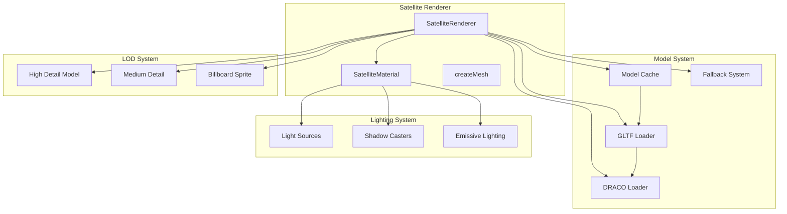
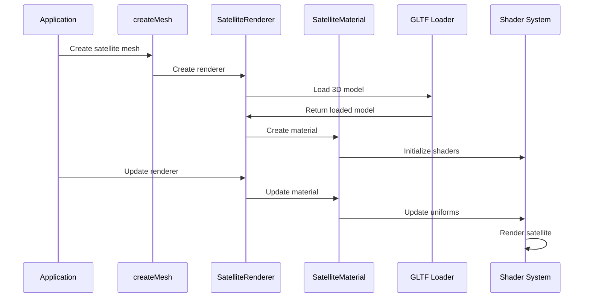

# AGENTS.md

A comprehensive guide for AI coding agents working on the Teskooano Satellite Celestial Renderer package.

## Package Overview

The **`@teskooano/celestials-satellite`** package provides a sophisticated satellite and spacecraft rendering system for the Teskooano N-Body simulation, featuring 3D model loading, intelligent scaling, advanced lighting, and performance-optimized LOD systems.

### Purpose

- **3D Model Rendering**: Support for GLB/GLTF model loading with automatic caching
- **Intelligent Scaling**: Automatic scaling based on real-world satellite dimensions and mission types
- **Advanced Lighting**: Custom shader material with PBR lighting calculations and shadow casting
- **LOD Optimization**: Three-level LOD system optimized for close-up viewing
- **Performance Features**: Efficient model caching, material reuse, and fallback support
- **Spacecraft Simulation**: Realistic rendering of artificial satellites and spacecraft

## Package Architecture

### Directory Structure

```
packages/celestials/satellite/
├── src/
│   ├── index.ts                    # Main package exports
│   ├── createMesh.ts               # Factory function for mesh creation
│   ├── renderer.ts                 # SatelliteRenderer class
│   ├── material.ts                 # SatelliteMaterial class
│   ├── material.spec.ts            # Material unit tests
│   ├── renderer.spec.ts            # Renderer unit tests
│   ├── vite-env.d.ts               # Vite environment declarations
│   └── shaders/                    # GLSL shader files
│       ├── index.d.ts              # Shader module declarations
│       ├── satellite.vertex.glsl   # Satellite vertex shader
│       └── satellite.fragment.glsl # Satellite fragment shader
├── package.json
├── moon.yml
├── tsconfig.json
├── vitest.config.ts
├── README.md
└── AGENTS.md
```

### Core Design Principles

#### 1. 3D Model Integration

The satellite renderer is designed to work with real 3D models while providing intelligent fallbacks:

```typescript
// 3D model loading with caching and fallback support
export class SatelliteRenderer extends BaseCelestialRenderer {
  private static modelCache = new Map<string, THREE.Group>();
  private static loadingPromises = new Map<string, Promise<THREE.Group>>();

  private satelliteGroup?: THREE.Group;
  private model?: THREE.Group;
  private billboard?: THREE.Sprite;
  private fallbackMesh?: THREE.Mesh;
}
```

#### 2. Intelligent Scaling System

Automatic scaling based on real-world satellite dimensions and mission types:

```typescript
// Intelligent scaling based on satellite size and mission type
private calculateSatelliteScale(
  object: RenderableCelestialObject,
  properties: SatelliteProperties,
): number {
  const realSizeM = object.realRadius_m * 2; // Convert radius to diameter
  const sceneUnits = realSizeM * METERS_TO_SCENE_UNITS;
  const modelScale = properties.modelScale ?? 1.0;

  return sceneUnits * modelScale;
}
```

#### 3. Advanced Lighting Material

Custom shader material with PBR lighting and shadow casting:

```typescript
// Advanced lighting material with PBR support
export class SatelliteMaterial extends THREE.ShaderMaterial {
  constructor(options: SatelliteMaterialOptions = {}) {
    super({
      uniforms: {
        baseColor: { value: baseColor },
        metalness: { value: metalness },
        roughness: { value: roughness },
        maxEmissiveIntensity: { value: maxEmissiveIntensity },
        uDynamicAmbientIntensity: { value: 1.0 },
        uEmissiveIntensity: { value: 0.0 },
        uEmissiveColor: { value: new THREE.Color(0x111111) },
        // Dynamic lighting and shadow arrays
        uNumLights: { value: 0 },
        uLightSources: {
          value: LightArrayUtils.createLightSourceArray(MAX_LIGHTS),
        },
        uNumShadowCasters: { value: 0 },
        uShadowCasters: {
          value: LightArrayUtils.createShadowCasterArray(MAX_SHADOW_CASTERS),
        },
        // Texture uniforms
        map: { value: diffuseMap },
        normalMap: { value: normalMap },
        roughnessMap: { value: roughnessMap },
        metalnessMap: { value: metalnessMap },
        // Environment map uniforms
        envMap: { value: finalEnvMap },
        hasEnvMap: { value: !!finalEnvMap },
        envMapIntensity: { value: envMapIntensity },
      },
      vertexShader: satelliteVertexShader,
      fragmentShader: satelliteFragmentShader,
    });
  }
}
```

## Key Components

### 1. SatelliteRenderer Class

Main renderer class that handles 3D model loading and display:

```typescript
export class SatelliteRenderer extends BaseCelestialRenderer {
  private static modelCache = new Map<string, THREE.Group>();
  private static loadingPromises = new Map<string, Promise<THREE.Group>>();
  private satelliteGroup?: THREE.Group;
  private model?: THREE.Group;
  private billboard?: THREE.Sprite;
  private fallbackMesh?: THREE.Mesh;
  private material?: SatelliteMaterial;
  private loader: GLTFLoader;
  private dracoLoader: DRACOLoader;

  constructor(object: RenderableCelestialObject) {
    super(object);
    this.dracoLoader = new DRACOLoader();
    this.dracoLoader.setDecoderPath(
      "https://www.gstatic.com/draco/v1/decoders/",
    );
    this.dracoLoader.setDecoderConfig({ type: "js" });
    this.loader = new GLTFLoader();
    this.loader.setDRACOLoader(this.dracoLoader);
  }

  getLODLevels(
    object: RenderableCelestialObject,
    options?: CelestialMeshOptions,
  ): LODLevel[] {
    // If we already have LOD levels cached, return them
    if (this._cachedLODLevels) {
      return this._cachedLODLevels;
    }

    const properties = object.properties as SatelliteProperties;
    if (!properties?.modelPath) {
      console.warn(
        `[SatelliteRenderer] No modelPath provided for ${object.id}`,
      );
      this._cachedLODLevels = this.createFallbackLOD(object);
      return this._cachedLODLevels;
    }

    // Create the main group that will hold either the model or fallback
    if (!this.satelliteGroup) {
      this.satelliteGroup = new THREE.Group();
      this.satelliteGroup.name = `satellite-group-${object.id}`;
      this.createFallbackMesh(object);
      this.satelliteGroup.add(this.fallbackMesh!);
    }

    // Start loading the model if not already loaded/loading
    this.loadModel(object, properties.modelPath);

    // Create billboard for distant viewing if not created yet
    if (!this.billboard) {
      this.createBillboard(object);
    }

    // Create LOD levels
    const levels: LODLevel[] = [{ distance: 0, object: this.satelliteGroup }];

    if (this.billboard) {
      levels.push({
        distance: 5000, // Switch to billboard at 5km distance
        object: this.billboard,
      });
    }

    this._cachedLODLevels = levels;
    return levels;
  }
}
```

### 2. SatelliteMaterial Class

Advanced shader-based material with PBR lighting calculations:

```typescript
export class SatelliteMaterial extends THREE.ShaderMaterial {
  private maxEmissiveIntensity: number;
  private currentNumLights: number = 0;
  private currentNumShadowCasters: number = 0;

  constructor(options: SatelliteMaterialOptions = {}) {
    const baseColor = options.color ?? new THREE.Color(0xdddddd);
    const metalness = options.metalness ?? 0.7;
    const roughness = options.roughness ?? 0.3;
    const maxEmissiveIntensity = options.maxEmissiveIntensity ?? 0.6;

    // Extract textures from original material if available
    let diffuseMap: THREE.Texture | null = null;
    let normalMap: THREE.Texture | null = null;
    let roughnessMap: THREE.Texture | null = null;
    let metalnessMap: THREE.Texture | null = null;

    if (options.originalMaterial) {
      if (options.originalMaterial instanceof THREE.MeshStandardMaterial) {
        diffuseMap = options.originalMaterial.map;
        normalMap = options.originalMaterial.normalMap;
        roughnessMap = options.originalMaterial.roughnessMap;
        metalnessMap = options.originalMaterial.metalnessMap;
      }
    }

    super({
      uniforms: {
        baseColor: { value: baseColor },
        metalness: { value: metalness },
        roughness: { value: roughness },
        maxEmissiveIntensity: { value: maxEmissiveIntensity },
        uDynamicAmbientIntensity: { value: 1.0 },
        uEmissiveIntensity: { value: 0.0 },
        uEmissiveColor: { value: new THREE.Color(0x111111) },
        // Dynamic lighting and shadow arrays
        uNumLights: { value: 0 },
        uLightSources: {
          value: LightArrayUtils.createLightSourceArray(MAX_LIGHTS),
        },
        uNumShadowCasters: { value: 0 },
        uShadowCasters: {
          value: LightArrayUtils.createShadowCasterArray(MAX_SHADOW_CASTERS),
        },
        // Texture uniforms
        map: { value: diffuseMap },
        normalMap: { value: normalMap },
        roughnessMap: { value: roughnessMap },
        metalnessMap: { value: metalnessMap },
        hasMap: { value: !!diffuseMap },
        hasNormalMap: { value: !!normalMap },
        hasRoughnessMap: { value: !!roughnessMap },
        hasMetalnessMap: { value: !!metalnessMap },
        // Environment map uniforms
        envMap: { value: options.envMap },
        hasEnvMap: { value: !!options.envMap },
        envMapIntensity: { value: options.envMapIntensity ?? 1.0 },
      },
      vertexShader: satelliteVertexShader,
      fragmentShader: satelliteFragmentShader,
      side: THREE.FrontSide,
      transparent: false,
      depthWrite: true,
      depthTest: true,
    });
  }

  update(
    satellitePosition: THREE.Vector3,
    lightSources: LightSourcesMap,
    shadowCasters?: { position: THREE.Vector3; radius: number }[],
  ): void {
    const numLights = Math.min(lightSources.size, MAX_LIGHTS);

    // Resize light arrays if needed
    if (numLights !== this.currentNumLights) {
      this.resizeLightArrays(numLights);
    }

    this.uniforms.uNumLights.value = numLights;

    // Update light uniforms
    let i = 0;
    for (const lightData of lightSources.values()) {
      if (i >= MAX_LIGHTS) break;
      this.uniforms.uLightSources.value[i].position.copy(lightData.position);
      this.uniforms.uLightSources.value[i].color.copy(lightData.color);
      this.uniforms.uLightSources.value[i].intensity =
        lightData.intensity ?? 1.0;
      i++;
    }

    // Update shadow casters
    const numShadowCasters = shadowCasters?.length ?? 0;
    if (numShadowCasters !== this.currentNumShadowCasters) {
      this.resizeShadowCasterArrays(numShadowCasters);
    }

    this.uniforms.uNumShadowCasters.value = numShadowCasters;
    if (shadowCasters) {
      for (let i = 0; i < numShadowCasters; i++) {
        const uniformCaster = this.uniforms.uShadowCasters.value[i];
        uniformCaster.position.copy(shadowCasters[i].position);
        uniformCaster.radius = shadowCasters[i].radius;
      }
    }

    // Calculate emissive intensity based on lighting conditions
    let emissiveIntensity = 0.0;
    let overallShadowFactor = 1.0;

    if (shadowCasters && shadowCasters.length > 0 && lightSources.size > 0) {
      const primaryLight = Array.from(lightSources.values())[0];
      const lightDirection = primaryLight.position
        .clone()
        .sub(satellitePosition)
        .normalize();

      for (const shadowCaster of shadowCasters) {
        const oc = satellitePosition.clone().sub(shadowCaster.position);
        const b = oc.dot(lightDirection);
        const c = oc.dot(oc) - shadowCaster.radius * shadowCaster.radius;
        const discriminant = b * b - c;

        if (discriminant > 0.0) {
          const t = -b - Math.sqrt(discriminant);
          if (t > 0.001) {
            const penumbra = shadowCaster.radius * 0.3;
            const penumbraSq = penumbra * penumbra;
            const shadowIntensity =
              1.0 - Math.min(1.0, discriminant / penumbraSq);
            overallShadowFactor = Math.min(
              overallShadowFactor,
              shadowIntensity * 0.5,
            );
          }
        }
      }
    }

    // Calculate emissive intensity based on shadow conditions
    if (overallShadowFactor < 0.3) {
      emissiveIntensity =
        this.maxEmissiveIntensity * (1.0 - overallShadowFactor) * 1.5;
    } else if (overallShadowFactor < 0.7) {
      emissiveIntensity =
        this.maxEmissiveIntensity * (1.0 - overallShadowFactor) * 0.8;
    } else {
      emissiveIntensity = this.maxEmissiveIntensity * 0.05;
    }

    this.uniforms.uEmissiveIntensity.value = emissiveIntensity;
  }
}
```

### 3. Factory Function

Unified mesh creation with error handling and fallback support:

```typescript
export function createMesh(
  object: RenderableCelestialObject,
  options: CreateMeshOptions,
): THREE.Object3D {
  const { celestialRenderers, createLodObject, debug = false } = options;

  if (debug) {
    console.debug(`[Satellite:createMesh] Creating mesh for ${object.id}`);
    return createFallbackSphere(object);
  }

  let renderer = celestialRenderers.get(object.id) as
    | SatelliteRenderer
    | undefined;

  if (!renderer) {
    try {
      renderer = new SatelliteRenderer(object);
      celestialRenderers.set(object.id, renderer);
    } catch (error) {
      console.error(
        `[Satellite:createMesh] Failed to create renderer for ${object.id}:`,
        error,
      );
      return createFallbackSphere(object);
    }
  }

  if (renderer.getLODLevels) {
    const lodLevels = renderer.getLODLevels(object);
    if (lodLevels && lodLevels.length > 0) {
      const lod = createLodObject(object, lodLevels);
      return lod;
    }
  }

  return createFallbackSphere(object);
}
```

### 4. Intelligent Scaling System

Automatic scaling based on satellite size and mission type:

```typescript
/**
 * Calculates the appropriate scale for a satellite based on its real-world size
 * and the scene's scale (1000 units = 1 AU, RENDER_SCALE_AU = 1000)
 */
private calculateSatelliteScale(
  object: RenderableCelestialObject,
  properties: SatelliteProperties,
): number {
  // Get the real-world size of the satellite in meters
  const realSizeM = object.realRadius_m * 2; // Convert radius to diameter

  // Convert to scene units (where 1 AU = 1000 units)
  const sceneUnits = realSizeM * METERS_TO_SCENE_UNITS;

  // Apply any custom model scale from properties
  const modelScale = properties.modelScale ?? 1.0;

  return sceneUnits * modelScale;
}
```

## Usage Examples

### 1. Basic Satellite Creation

```typescript
import { createMesh } from "@teskooano/celestials-satellite";
import type { RenderableCelestialObject } from "@teskooano/data-types";

// Create satellite mesh
const satellite: RenderableCelestialObject = {
  id: "iss",
  name: "International Space Station",
  type: CelestialType.SATELLITE,
  realRadius_m: 54.5, // ISS is ~109m diameter
  properties: {
    type: CelestialType.SATELLITE,
    modelPath: "models/satellite/iss.glb",
    missionType: "scientific",
    operationalStatus: "active",
  },
};

const mesh = createMesh(satellite, {
  celestialRenderers: renderersMap,
  createLodObject: lodFactory,
  lightingManager: lightingManager,
});
```

### 2. Satellite Properties Configuration

```typescript
// Configure satellite properties
const satelliteProperties: SatelliteProperties = {
  type: CelestialType.SATELLITE,
  modelPath: "models/satellite/hubble.glb",
  modelScale: 1.0, // Custom scale multiplier
  missionType: "scientific",
  operationalStatus: "active",
  materialProperties: {
    metalness: 0.8,
    roughness: 0.2,
    envMapIntensity: 1.5,
  },
};
```

### 3. Different Satellite Types

```typescript
// International Space Station (Large)
const issProperties: SatelliteProperties = {
  type: CelestialType.SATELLITE,
  modelPath: "models/satellite/iss.glb",
  missionType: "scientific",
  operationalStatus: "active",
};

// Hubble Space Telescope (Medium)
const hubbleProperties: SatelliteProperties = {
  type: CelestialType.SATELLITE,
  modelPath: "models/satellite/hubble.glb",
  missionType: "scientific",
  operationalStatus: "active",
};

// CubeSat (Small)
const cubesatProperties: SatelliteProperties = {
  type: CelestialType.SATELLITE,
  modelPath: "models/satellite/cubesat.glb",
  missionType: "scientific",
  operationalStatus: "active",
  modelScale: 2.0, // Scale up for visibility
};
```

### 4. Custom Material Properties

```typescript
// Satellite with custom material properties
const customSatellite: SatelliteProperties = {
  type: CelestialType.SATELLITE,
  modelPath: "models/satellite/custom.glb",
  missionType: "communications",
  operationalStatus: "active",
  materialProperties: {
    metalness: 0.9, // Very metallic
    roughness: 0.1, // Very smooth
    envMapIntensity: 2.0, // Strong reflections
  },
};
```

### 5. Integration with Parent Systems

```typescript
// In a celestial object manager
export class CelestialObjectManager {
  private satelliteRenderers = new Map<string, SatelliteRenderer>();

  createSatellite(object: RenderableCelestialObject): THREE.Object3D {
    const renderer = new SatelliteRenderer(object);
    this.satelliteRenderers.set(object.id, renderer);

    const lodLevels = renderer.getLODLevels(object);
    const lod = this.createLodObject(object, lodLevels);

    return lod;
  }

  updateSatellites(
    time: number,
    timeScale: number,
    lightSources: LightSourcesMap,
    camera: THREE.PerspectiveCamera,
  ): void {
    for (const [id, renderer] of this.satelliteRenderers) {
      const object = this.getObject(id);
      if (object) {
        renderer.update(object, time, timeScale, lightSources, camera);
      }
    }
  }
}
```

## Performance Guidelines

### 1. LOD System Optimization

- **Distance-Based Switching**: LOD switches at 5km scene units
- **Model Caching**: Static model cache prevents redundant loading
- **Billboard LOD**: 2D sprites for distant viewing
- **Fallback Support**: Graceful fallback to spheres for loading failures

### 2. Model Loading Performance

- **Async Loading**: Non-blocking model loading with promises
- **Cache Management**: Static cache for loaded models
- **DRACO Compression**: Automatic DRACO decompression support
- **Progress Tracking**: Optional loading progress handling

### 3. Lighting Performance

- **Dynamic Arrays**: Efficient light and shadow caster array management
- **Shadow Calculations**: Optimized shadow casting with penumbra
- **Emissive Lighting**: Dynamic emissive intensity based on shadow conditions
- **Rogue Object Handling**: Special lighting for satellites without parents

## Testing Strategy

### 1. Unit Testing

Test individual components and functionality:

```typescript
import { describe, it, expect, beforeEach } from "vitest";
import { SatelliteMaterial } from "../material";

describe("SatelliteMaterial", () => {
  let material: SatelliteMaterial;

  beforeEach(() => {
    material = new SatelliteMaterial({
      color: new THREE.Color(0xdddddd),
      metalness: 0.7,
      roughness: 0.3,
      maxEmissiveIntensity: 0.8,
    });
  });

  it("should create a shader material with correct uniforms", () => {
    expect(material).toBeInstanceOf(THREE.ShaderMaterial);
    expect(material.uniforms.baseColor).toBeDefined();
    expect(material.uniforms.metalness).toBeDefined();
    expect(material.uniforms.roughness).toBeDefined();
    expect(material.uniforms.uLights).toBeDefined();
    expect(material.uniforms.uNumLights).toBeDefined();
  });

  it("should update lighting data correctly", () => {
    const lightSources = new Map();
    lightSources.set("star1", {
      position: new THREE.Vector3(1000, 0, 0),
      color: new THREE.Color(1, 1, 1),
      intensity: 1.0,
    });

    const satellitePosition = new THREE.Vector3(0, 0, 0);
    material.update(satellitePosition, lightSources);

    expect(material.uniforms.uNumLights.value).toBe(1);
    expect(material.uniforms.uLights.value[0].position.x).toBe(1000);
  });
});
```

### 2. Renderer Testing

Test satellite renderer functionality:

```typescript
import { describe, it, expect, beforeEach } from "vitest";
import { SatelliteRenderer } from "../renderer";

describe("SatelliteRenderer", () => {
  let renderer: SatelliteRenderer;
  let mockObject: RenderableCelestialObject<SatelliteProperties>;

  beforeEach(() => {
    mockObject = createMockSatelliteObject({
      modelPath: "test.glb",
      missionType: "scientific",
    });
    renderer = new SatelliteRenderer(mockObject);
  });

  it("should create LOD levels with correct distances", () => {
    const levels = renderer.getLODLevels(mockObject);

    expect(levels).toHaveLength(2); // High detail and billboard
    expect(levels[0].distance).toBe(0);
    expect(levels[1].distance).toBe(5000); // Billboard at 5km
  });

  it("should scale large satellites appropriately", () => {
    const issObject = createMockSatelliteObject({
      realRadius_m: 54.5, // ISS size
      modelPath: "models/satellite/iss.glb",
    });

    const scale = (renderer as any).calculateSatelliteScale(
      issObject,
      issObject.properties,
    );
    expect(scale).toBeGreaterThan(0);
  });
});
```

## Troubleshooting Guide

### 1. Common Issues

#### Model Not Loading

```typescript
// ❌ Problem: Model fails to load
const properties: SatelliteProperties = {
  modelPath: "invalid/path/model.glb", // Invalid path
};

// ✅ Solution: Use correct model path and provide fallback
const properties: SatelliteProperties = {
  modelPath: "models/satellite/satellite.glb", // Correct path
  // Fallback will be used automatically if loading fails
};
```

#### Incorrect Scaling

```typescript
// ❌ Problem: Satellite too small or too large
const properties: SatelliteProperties = {
  modelScale: 100.0, // Too large
};

// ✅ Solution: Use appropriate scaling
const properties: SatelliteProperties = {
  modelScale: 1.0, // Default scaling
  // Or use custom scaling for visibility
  modelScale: 2.0, // 2x larger for small satellites
};
```

#### Performance Issues

```typescript
// ❌ Problem: Too many high-detail models causing performance issues
// Multiple satellites with complex models

// ✅ Solution: Use LOD system and model caching
// LOD system automatically switches to billboards at distance
// Model cache prevents redundant loading
```

### 2. Shader Issues

#### Uniform Array Size Mismatch

```typescript
// ❌ Problem: Light array size mismatch
this.uniforms.uLightSources.value = new Array(10); // Wrong size

// ✅ Solution: Use dynamic resizing
if (numLights !== this.currentNumLights) {
  this.resizeLightArrays(numLights);
  this.currentNumLights = numLights;
}
```

#### Missing Texture Support

```typescript
// ❌ Problem: Textures not loading from original material
const originalMaterial = new THREE.MeshBasicMaterial();

// ✅ Solution: Pass original material to preserve textures
const satelliteMaterial = new SatelliteMaterial({
  originalMaterial: originalMaterial, // Preserves textures
});
```

## Dependencies and Integration Points

### 1. Core Dependencies

```json
{
  "dependencies": {
    "@teskooano/data-types": "file:../../data/types",
    "@teskooano/renderer-threejs-celestial": "file:../../renderer/threejs-celestial",
    "@teskooano/renderer-threejs-lighting": "file:../../renderer/threejs-lighting",
    "@types/three": "0.180.0",
    "three": "0.180.0"
  }
}
```

### 2. Integration with Teskooano Ecosystem

- **Data Types**: Uses `RenderableCelestialObject` and `SatelliteProperties`
- **Celestial Renderer**: Extends `BaseCelestialRenderer` for core functionality
- **Lighting System**: Integrates with `LightingManager` for dynamic lighting
- **LOD System**: Uses `LODLevel` and `createLodObject` for performance optimization
- **Model Loading**: Uses Three.js GLTFLoader with DRACO compression support

## Contributing Guidelines

### 1. Model Development

- **Format Support**: Use GLB/GLTF formats for best performance
- **Model Location**: Place models in `public/models/` directory
- **Scaling**: Models should be properly scaled and centered
- **Materials**: Include materials and textures in the model

### 2. Shader Development

- **GLSL Standards**: Use high precision floats and proper includes
- **Performance**: Optimize shader complexity for target hardware
- **PBR Support**: Implement proper PBR lighting calculations
- **Shadow Casting**: Include shadow casting calculations

### 3. Renderer Development

- **LOD Management**: Implement efficient LOD switching
- **Memory Management**: Proper cleanup of resources
- **Error Handling**: Graceful fallbacks for loading failures
- **Caching**: Implement efficient model caching

## Architecture Documentation

### 1. System Overview



### 2. Data Flow



## Scientific References

### 1. Satellite Physics

- **Orbital Mechanics**: Satellites follow Keplerian orbital mechanics
- **Scaling**: Real-world dimensions converted to scene units
- **Mission Types**: Different satellite types have different properties
- **Operational Status**: Active/inactive status affects rendering

### 2. 3D Model Integration

- **GLB/GLTF Format**: Industry standard for 3D models
- **DRACO Compression**: Efficient geometry compression
- **PBR Materials**: Physically based rendering materials
- **Texture Mapping**: UV mapping for realistic surfaces

### 3. Computer Graphics

- **Shader Programming**: GLSL for advanced lighting effects
- **Level of Detail**: Performance optimization through detail reduction
- **Dynamic Lighting**: Real-time light and shadow calculations
- **Model Caching**: Efficient memory management for 3D models

---

**Remember**: The satellite package provides realistic 3D model rendering for artificial satellites and spacecraft with intelligent scaling, advanced lighting, and performance optimization. Always consider the balance between visual quality and performance, and ensure proper integration with the broader Teskooano ecosystem.
