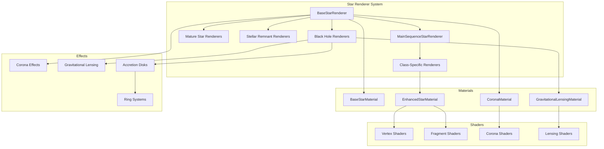
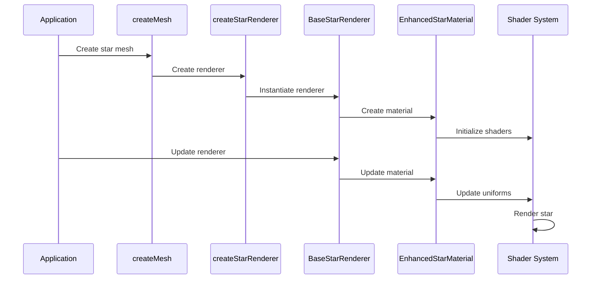

# AGENTS.md

A comprehensive guide for AI coding agents working on the Teskooano Star Celestial Renderer package.

## Package Overview

The **`@teskooano/celestials-stars`** package provides a sophisticated star rendering system for the Teskooano N-Body simulation, featuring hierarchical stellar evolution support, spectral class accuracy, advanced visual effects, and performance-optimized LOD systems.

### Purpose

- **Stellar Evolution Support**: Complete lifecycle from protostars to stellar remnants
- **Spectral Class Accuracy**: Precise O, B, A, F, G, K, M classification with physical properties
- **Advanced Visual Effects**: Enhanced shaders, corona effects, and gravitational lensing
- **LOD Optimization**: Multiple detail levels for performance at various distances
- **Physics-Based Properties**: Real-world stellar data and color calculations
- **Exotic Object Support**: Black holes, neutron stars, white dwarfs with special effects

## Package Architecture

### Directory Structure

```
packages/celestials/stars/
├── src/
│   ├── index.ts                           # Main package exports
│   ├── createMesh.ts                      # Factory function for mesh creation
│   ├── base/                              # Base star classes and materials
│   │   └── base-star.ts                   # BaseStarRenderer and materials
│   ├── main-sequence/                     # Main sequence star renderers
│   │   ├── main-sequence-star.ts          # MainSequenceStarRenderer base
│   │   ├── class-o.ts                     # O-class star renderer
│   │   ├── class-b.ts                     # B-class star renderer
│   │   ├── class-a.ts                     # A-class star renderer
│   │   ├── class-f.ts                     # F-class star renderer
│   │   ├── class-g.ts                     # G-class star renderer
│   │   ├── class-k.ts                     # K-class star renderer
│   │   ├── class-m.ts                     # M-class star renderer
│   │   └── main-sequence-star.spec.ts     # Unit tests
│   ├── mature-stars/                      # Post-main sequence evolution
│   │   ├── index.ts                       # Mature stars exports
│   │   ├── subgiant/                      # Subgiant star renderer
│   │   ├── red-giant/                     # Red giant star renderer
│   │   ├── horizontal-branch/             # Horizontal branch renderer
│   │   ├── asymptotic-giant-branch/       # AGB star renderer
│   │   ├── post-agb/                      # Post-AGB star renderer
│   │   └── supergiant/                    # Supergiant star renderers
│   │       ├── supergiant.ts              # Supergiant renderer
│   │       ├── hypergiant.ts              # Hypergiant renderer
│   │       └── wolf-rayet.ts              # Wolf-Rayet star renderer
│   ├── remnants/                          # Stellar remnants
│   │   ├── neutron-star.ts                # Neutron star renderer
│   │   └── white-dwarf.ts                 # White dwarf renderer
│   ├── black-holes/                       # Black hole renderers
│   │   ├── schwarzschild-black-hole.ts    # Non-rotating black hole
│   │   ├── kerr-black-hole.ts             # Rotating black hole
│   │   ├── gravitational-lensing.ts       # Gravitational lensing effects
│   │   ├── blur-horizontal.glsl           # Horizontal blur shader
│   │   └── blur-vertical.glsl             # Vertical blur shader
│   ├── materials/                         # Star materials
│   │   └── enhanced-star.material.ts      # Enhanced star material
│   ├── shaders/                           # GLSL shader files
│   │   ├── enhanced-star.vertex.glsl      # Enhanced star vertex shader
│   │   ├── enhanced-star.fragment.glsl    # Enhanced star fragment shader
│   │   ├── corona.vertex.glsl             # Corona vertex shader
│   │   └── corona.fragment.glsl           # Corona fragment shader
│   ├── vite-env.d.ts                      # Vite environment declarations
│   └── ARCHITECTURE.md                    # Detailed architecture documentation
├── package.json
├── moon.yml
├── tsconfig.json
├── vitest.config.ts
├── README.md
└── AGENTS.md
```

### Core Design Principles

#### 1. Hierarchical Stellar Evolution

The star renderer system models the complete stellar lifecycle:

```typescript
// Stellar evolution hierarchy
export abstract class BaseStarRenderer<
  TStarMaterial extends BaseStarMaterial = BaseStarMaterial,
> extends BaseCelestialRenderer<TStarMaterial> {
  // Abstract methods for subclasses to implement
  protected abstract createMaterial(
    object: RenderableCelestialObject,
  ): TStarMaterial;
  protected abstract getCustomLODs(
    object: RenderableCelestialObject,
    options?: CelestialMeshOptions,
  ): LODLevel[];
  protected abstract getBillboardLODDistance(
    object: RenderableCelestialObject,
  ): number;
}
```

#### 2. Spectral Class Accuracy

Precise spectral classification with real-world physical properties:

```typescript
// G-class spectral data with physical properties
const G_CLASS_DATA: Record<number, GClassSpectralData> = {
  2: {
    // G2V (our Sun)
    mass: 1.0, // Solar masses
    radius: 1.012, // Solar radii
    luminosity: 1.02, // Solar luminosities
    temperature: 5770, // Effective temperature in K
    colorIndex: 0.65, // B-V color index
  },
  // ... other subclasses
};

// Color calculation from B-V color index
function colorIndexToRGB(bv: number): THREE.Color {
  const clampedBV = Math.max(0.55, Math.min(0.85, bv));
  // Empirical conversion from B-V to RGB based on stellar photometry
  // ...
}
```

#### 3. Enhanced Visual Effects

Advanced shader-based materials with plasma effects:

```typescript
// Enhanced star material with plasma effects
export class EnhancedStarMaterial extends THREE.ShaderMaterial {
  constructor(
    object: RenderableCelestialObject,
    color: THREE.Color = new THREE.Color(0xffff00),
    options: {
      noiseScale?: number;
      noiseIntensity?: number;
      plasmaTurbulence?: number;
      lightingIntensity?: number;
    } = {},
  ) {
    super({
      uniforms: {
        uTime: { value: 0.0 },
        uStarColor: { value: color },
        uHotColor: { value: color.clone().multiplyScalar(1.4) },
        uSurfaceColor: { value: color },
        uCoolColor: { value: color.clone().multiplyScalar(0.3) },
        uNoiseScale: { value: options.noiseScale ?? 1.0 },
        uNoiseIntensity: { value: options.noiseIntensity ?? 0.2 },
        uPlasmaTurbulence: { value: options.plasmaTurbulence ?? 0.1 },
        uLightingIntensity: { value: options.lightingIntensity ?? 1.0 },
      },
      vertexShader: enhancedStarVertexShader,
      fragmentShader: enhancedStarFragmentShader,
    });
  }
}
```

## Key Components

### 1. BaseStarRenderer Class

Abstract base class for all star renderers:

```typescript
export abstract class BaseStarRenderer<
  TStarMaterial extends BaseStarMaterial = BaseStarMaterial,
> extends BaseCelestialRenderer<TStarMaterial> {
  protected coronaMaterials: Map<string, CoronaMaterial[]> = new Map();
  protected starLightingManager?: LightingManager;

  constructor(
    object: RenderableCelestialObject,
    options: BaseCelestialRendererOptions = {},
  ) {
    super(object, options);
    this.starLightingManager = options?.lightingManager;
  }

  /**
   * Assembles and returns all LOD levels for the star
   */
  getLODLevels(
    object: RenderableCelestialObject,
    options?: CelestialMeshOptions,
  ): LODLevel[] {
    const customLODs = this.getCustomLODs(object, options);
    const billboardDistance = this.getBillboardLODDistance(object);
    const starColor = this.getStarColor(object);

    const billboardLOD = this.billboardManager.createBillboardLOD(object, {
      distance: billboardDistance,
      size: 0.05,
      color: starColor,
      albedo: 1.0, // Stars are emissive
    });

    return [...customLODs, billboardLOD].sort(
      (a, b) => a.distance - b.distance,
    );
  }

  /**
   * Creates a group containing the corona meshes for a star
   */
  protected _createCoronaGroup(object: RenderableCelestialObject): THREE.Group {
    const coronaGroup = new THREE.Group();
    coronaGroup.name = `${object.id}-corona-group`;
    this._addCoronaToGroup(object, coronaGroup);
    return coronaGroup;
  }
}
```

### 2. MainSequenceStarRenderer Class

Base class for main sequence stars with corona effects:

```typescript
export class MainSequenceStarRenderer<
  TMainSequenceMaterial extends MainSequenceStarMaterial =
    MainSequenceStarMaterial,
> extends BaseStarRenderer<TMainSequenceMaterial> {
  private materialCache: Map<string, TMainSequenceMaterial> = new Map();

  protected getCustomLODs(
    object: RenderableCelestialObject<StarProperties>,
    options?: CelestialMeshOptions,
  ): LODLevel[] {
    const levels: LODLevel[] = [];

    // High detail level (LOD 0) - Star body with corona
    const highDetailGroup = new THREE.Group();
    highDetailGroup.name = `${object.id}-main-sequence-high`;

    // Create star body
    const starBody = this._createStarBody(object);
    highDetailGroup.add(starBody);

    // Add corona effect
    this._addCoronaToGroup(object, highDetailGroup);

    levels.push({ object: highDetailGroup, distance: 0 });

    // Medium detail level (LOD 1) - Star body only
    const mediumDetailGroup = new THREE.Group();
    mediumDetailGroup.name = `${object.id}-main-sequence-medium`;
    mediumDetailGroup.add(starBody.clone());
    levels.push({ object: mediumDetailGroup, distance: 1000 });

    return levels;
  }

  protected getBillboardLODDistance(
    object: RenderableCelestialObject<StarProperties>,
  ): number {
    return object.radius * 10000;
  }
}
```

### 3. Spectral Class Renderers

Specialized renderers for each spectral class:

```typescript
// G-class star renderer with spectral accuracy
export class ClassGStarRenderer extends MainSequenceStarRenderer<ClassGStarMaterial> {
  protected createMaterial(
    object: RenderableCelestialObject,
  ): ClassGStarMaterial {
    return new ClassGStarMaterial(object);
  }

  protected getStarColor(star: RenderableCelestialObject): THREE.Color {
    const starProps = star.properties as StarProperties;

    // Extract spectral subclass (e.g., "G2V" -> 2)
    let subclass = 2; // Default to G2V
    if (starProps.spectralClass) {
      const match = starProps.spectralClass.match(/G(\d)V?/);
      if (match) {
        subclass = parseInt(match[1], 10);
      }
    }

    const spectralData = G_CLASS_DATA[subclass] || G_CLASS_DATA[2];
    return colorIndexToRGB(spectralData.colorIndex);
  }
}
```

### 4. Exotic Object Renderers

Specialized renderers for stellar remnants and black holes:

```typescript
// Kerr black hole renderer with accretion disk and ergosphere
export class KerrBlackHoleRenderer extends BaseStarRenderer<SchwarzschildBlackHoleMaterial> {
  private eventHorizonMaterial: SchwarzschildBlackHoleMaterial | null = null;
  private ergosphereMaterial: ErgosphereMaterial | null = null;
  private ringSystemRenderer: RingSystemRenderer | null = null;
  private lensingHelpers: Map<string, GravitationalLensingHelper> = new Map();

  protected getCustomLODs(
    object: RenderableCelestialObject,
    options?: CelestialMeshOptions,
  ): LODLevel[] {
    const levels: LODLevel[] = [];

    // High detail level - Full black hole with accretion disk
    const highDetailGroup = new THREE.Group();
    highDetailGroup.name = `${object.id}-kerr-high`;

    // Create event horizon
    const eventHorizon = this._createEventHorizon(object);
    highDetailGroup.add(eventHorizon);

    // Create ergosphere (rotating space-time region)
    const ergosphere = this._createErgosphere(object);
    highDetailGroup.add(ergosphere);

    // Create accretion disk using rings system
    if (object.mass) {
      const accretionDiskProps = generateAccretionDiskProperties(
        object.mass,
        1e-8, // Default accretion rate
        0.8, // Spin parameter
      );

      this.ringSystemRenderer = new RingSystemRenderer(
        ringSystemObject as any,
        this,
      );
      const ringLODLevels = this.ringSystemRenderer.getLODLevels(
        ringSystemObject as any,
        options,
      );

      if (ringLODLevels.length > 0) {
        const highDetailRing = ringLODLevels[0].object;
        highDetailGroup.add(highDetailRing);
      }
    }

    levels.push({ object: highDetailGroup, distance: 0 });
    return levels;
  }
}
```

### 5. Gravitational Lensing System

Advanced visual effects for massive objects:

```typescript
// Gravitational lensing helper for black holes and neutron stars
export class GravitationalLensingHelper {
  private material: GravitationalLensingMaterial;
  private mesh: THREE.Mesh;
  private renderTarget: THREE.WebGLRenderTarget;
  private backgroundTarget: THREE.WebGLRenderTarget;
  private blurTargetH: THREE.WebGLRenderTarget;
  private blurTargetV: THREE.WebGLRenderTarget;

  constructor(
    renderer: THREE.WebGLRenderer,
    scene: THREE.Scene,
    camera: THREE.PerspectiveCamera,
    object: THREE.Object3D,
    options: {
      intensity?: number;
      radius?: number;
      distortionScale?: number;
      lensSphereScale?: number;
    } = {},
  ) {
    // Create render targets for background capture and blur effects
    this.backgroundTarget = new THREE.WebGLRenderTarget(width, height, {
      minFilter: THREE.LinearFilter,
      magFilter: THREE.LinearFilter,
      format: THREE.RGBAFormat,
    });

    // Create lensing material with distortion shader
    this.material = new GravitationalLensingMaterial({
      intensity: options.intensity,
      radius: options.radius,
      distortionScale: options.distortionScale,
    });

    // Create lensing sphere mesh
    const scale = options.lensSphereScale ?? 5.0;
    const sphereRadius = maxDimension * scale;
    const geometry = new THREE.SphereGeometry(sphereRadius, segments, segments);
    this.mesh = new THREE.Mesh(geometry, this.material);
    this.mesh.name = "gravitational-lensing";
    this.mesh.renderOrder = 1000;

    object.add(this.mesh);
  }

  /**
   * Update the lensing effect - call this before rendering the scene
   */
  update(
    renderer: THREE.WebGLRenderer,
    scene: THREE.Scene,
    camera: THREE.PerspectiveCamera,
  ): void {
    // 1. Hide the lensing mesh
    this.mesh.visible = false;

    // 2. Render filtered scene to background target
    const filteredScene = new THREE.Scene();
    // ... filter scene to exclude UI elements

    renderer.setRenderTarget(this.backgroundTarget);
    renderer.render(filteredScene, camera);
    renderer.setRenderTarget(null);

    // 3. Apply horizontal and vertical blur passes
    // ... blur processing

    // 4. Show lensing mesh for final render
    this.mesh.visible = true;

    // 5. Update lensing material with blurred background
    const elapsedTime = Date.now() / 1000 - this.startTime;
    this.material.update(elapsedTime, this.blurTargetV);
  }
}
```

## Usage Examples

### 1. Basic Star Creation

```typescript
import { createMesh } from "@teskooano/celestials-stars";
import type { RenderableCelestialObject } from "@teskooano/data-types";

// Create G-class star (like our Sun)
const sun: RenderableCelestialObject = {
  id: "sun",
  name: "Sun",
  type: CelestialType.STAR,
  realRadius_m: 696340000, // Solar radius in meters
  properties: {
    type: CelestialType.STAR,
    spectralClass: "G2V",
    stellarType: StellarType.MAIN_SEQUENCE,
    color: [1.0, 0.94, 0.72], // Solar color
    temperature: 5770,
    luminosity: 1.0,
  },
};

const mesh = createMesh(sun, {
  celestialRenderers: renderersMap,
  createLodObject: lodFactory,
  lightingManager: lightingManager,
});
```

### 2. Different Spectral Classes

```typescript
// O-class star (very hot, blue)
const oStar: RenderableCelestialObject = {
  id: "o-star",
  name: "O5V Star",
  type: CelestialType.STAR,
  realRadius_m: 12 * 696340000, // 12 solar radii
  properties: {
    type: CelestialType.STAR,
    spectralClass: "O5V",
    stellarType: StellarType.MAIN_SEQUENCE,
    color: [0.7, 0.8, 1.0], // Blue-white
    temperature: 40000,
    luminosity: 1000000,
  },
};

// M-class star (cool, red)
const mStar: RenderableCelestialObject = {
  id: "m-star",
  name: "M5V Star",
  type: CelestialType.STAR,
  realRadius_m: 0.3 * 696340000, // 0.3 solar radii
  properties: {
    type: CelestialType.STAR,
    spectralClass: "M5V",
    stellarType: StellarType.MAIN_SEQUENCE,
    color: [1.0, 0.6, 0.4], // Red-orange
    temperature: 3200,
    luminosity: 0.01,
  },
};
```

### 3. Stellar Evolution Stages

```typescript
// Red giant star
const redGiant: RenderableCelestialObject = {
  id: "red-giant",
  name: "Red Giant",
  type: CelestialType.STAR,
  realRadius_m: 100 * 696340000, // 100 solar radii
  properties: {
    type: CelestialType.STAR,
    stellarType: StellarType.RED_GIANT,
    color: [1.0, 0.4, 0.2], // Red-orange
    temperature: 3500,
    luminosity: 1000,
  },
};

// White dwarf
const whiteDwarf: RenderableCelestialObject = {
  id: "white-dwarf",
  name: "White Dwarf",
  type: CelestialType.STAR,
  realRadius_m: 0.01 * 696340000, // 0.01 solar radii
  properties: {
    type: CelestialType.STAR,
    stellarType: StellarType.WHITE_DWARF,
    whiteDwarfSubtype: WhiteDwarfSubtype.DA,
    color: [1.0, 1.0, 1.0], // White
    temperature: 10000,
    luminosity: 0.1,
  },
};
```

### 4. Black Holes with Accretion Disks

```typescript
// Kerr black hole with accretion disk
const kerrBlackHole: RenderableCelestialObject = {
  id: "kerr-black-hole",
  name: "Kerr Black Hole",
  type: CelestialType.STAR,
  realRadius_m: 30000, // Schwarzschild radius
  mass: 10 * 1.989e30, // 10 solar masses
  properties: {
    type: CelestialType.STAR,
    stellarType: StellarType.BLACK_HOLE,
    blackHoleSubtype: BlackHoleSubtype.KERR,
    color: [0.0, 0.0, 0.0], // Black
    temperature: 0,
    luminosity: 0,
  },
};

// Schwarzschild black hole (non-rotating)
const schwarzschildBlackHole: RenderableCelestialObject = {
  id: "schwarzschild-black-hole",
  name: "Schwarzschild Black Hole",
  type: CelestialType.STAR,
  realRadius_m: 30000, // Schwarzschild radius
  mass: 5 * 1.989e30, // 5 solar masses
  properties: {
    type: CelestialType.STAR,
    stellarType: StellarType.BLACK_HOLE,
    blackHoleSubtype: BlackHoleSubtype.SCHWARZSCHILD,
    color: [0.0, 0.0, 0.0], // Black
    temperature: 0,
    luminosity: 0,
  },
};
```

### 5. Integration with Parent Systems

```typescript
// In a celestial object manager
export class CelestialObjectManager {
  private starRenderers = new Map<string, BaseStarRenderer>();

  createStar(object: RenderableCelestialObject): THREE.Object3D {
    const renderer = createStarRenderer(object, lightingManager);
    this.starRenderers.set(object.id, renderer);

    const lodLevels = renderer.getLODLevels(object);
    const lod = this.createLodObject(object, lodLevels);

    return lod;
  }

  updateStars(
    time: number,
    timeScale: number,
    lightSources: LightSourcesMap,
    camera: THREE.PerspectiveCamera,
  ): void {
    for (const [id, renderer] of this.starRenderers) {
      const object = this.getObject(id);
      if (object) {
        renderer.update(object, time, timeScale, lightSources, camera);
      }
    }
  }
}
```

## Performance Guidelines

### 1. LOD System Optimization

- **Distance-Based Switching**: LOD switches at appropriate distances for each star type
- **Corona Management**: Corona effects only at high detail levels
- **Billboard LOD**: 2D sprites for distant viewing
- **Material Caching**: Efficient material reuse across similar stars

### 2. Shader Performance

- **Optimized Shaders**: Efficient GLSL shaders with minimal complexity
- **Uniform Management**: Dynamic uniform updates only when needed
- **Texture Usage**: Minimal texture usage for better performance
- **Blending Modes**: Appropriate blending for different effects

### 3. Exotic Object Performance

- **Gravitational Lensing**: Expensive effect, use sparingly
- **Accretion Disks**: Complex ring systems, optimize LOD switching
- **Corona Effects**: Multiple layers, manage complexity
- **Render Targets**: Efficient background capture and blur processing

## Testing Strategy

### 1. Unit Testing

Test individual components and functionality:

```typescript
import { describe, it, expect, beforeEach } from "vitest";
import { ClassGStarRenderer } from "../main-sequence/class-g";

describe("ClassGStarRenderer", () => {
  let renderer: ClassGStarRenderer;
  let mockObject: RenderableCelestialObject<StarProperties>;

  beforeEach(() => {
    mockObject = createMockStarObject({
      spectralClass: "G2V",
      stellarType: StellarType.MAIN_SEQUENCE,
    });
    renderer = new ClassGStarRenderer(mockObject);
  });

  it("should create LOD levels with correct distances", () => {
    const levels = renderer.getLODLevels(mockObject);

    expect(levels).toHaveLength(3); // High detail, medium detail, billboard
    expect(levels[0].distance).toBe(0);
    expect(levels[1].distance).toBe(1000);
    expect(levels[2].distance).toBeGreaterThan(1000);
  });

  it("should calculate correct star color for G2V", () => {
    const color = renderer.getStarColor(mockObject);
    expect(color.r).toBeCloseTo(1.0, 2);
    expect(color.g).toBeCloseTo(0.94, 2);
    expect(color.b).toBeCloseTo(0.72, 2);
  });
});
```

### 2. Material Testing

Test star material functionality:

```typescript
import { describe, it, expect, beforeEach } from "vitest";
import { EnhancedStarMaterial } from "../materials/enhanced-star.material";

describe("EnhancedStarMaterial", () => {
  let material: EnhancedStarMaterial;
  let mockObject: RenderableCelestialObject;

  beforeEach(() => {
    mockObject = createMockStarObject({
      spectralClass: "G2V",
    });
    material = new EnhancedStarMaterial(
      mockObject,
      new THREE.Color(1, 0.94, 0.72),
    );
  });

  it("should create a shader material with correct uniforms", () => {
    expect(material).toBeInstanceOf(THREE.ShaderMaterial);
    expect(material.uniforms.uStarColor).toBeDefined();
    expect(material.uniforms.uHotColor).toBeDefined();
    expect(material.uniforms.uSurfaceColor).toBeDefined();
    expect(material.uniforms.uCoolColor).toBeDefined();
    expect(material.uniforms.uTime).toBeDefined();
  });

  it("should update time uniform correctly", () => {
    const initialTime = material.uniforms.uTime.value;
    material.update(1000, 1.0, new Map(), mockCamera);
    expect(material.uniforms.uTime.value).not.toBe(initialTime);
  });
});
```

## Troubleshooting Guide

### 1. Common Issues

#### Incorrect Star Colors

```typescript
// ❌ Problem: Star appears wrong color
const starProps: StarProperties = {
  spectralClass: "G2V",
  color: [1, 0, 0], // Wrong color
};

// ✅ Solution: Use correct spectral colors
const starProps: StarProperties = {
  spectralClass: "G2V",
  color: [1.0, 0.94, 0.72], // Correct solar color
};
```

#### Performance Issues

```typescript
// ❌ Problem: Too many corona effects causing performance issues
// Multiple stars with complex corona effects

// ✅ Solution: Use LOD system and optimize corona complexity
// LOD system automatically switches to simpler effects at distance
// Corona effects only at high detail levels
```

#### Shader Compilation Errors

```typescript
// ❌ Problem: Shader compilation fails
// Missing uniforms or incorrect shader syntax

// ✅ Solution: Check shader syntax and uniform definitions
// Ensure all required uniforms are provided
// Use proper GLSL syntax and includes
```

### 2. Exotic Object Issues

#### Gravitational Lensing Not Working

```typescript
// ❌ Problem: Gravitational lensing effect not visible
// Missing render target setup or incorrect update calls

// ✅ Solution: Ensure proper setup and update sequence
const lensingHelper = new GravitationalLensingHelper(
  renderer,
  scene,
  camera,
  object,
);
// Call update before each render frame
lensingHelper.update(renderer, scene, camera);
```

#### Accretion Disk Not Rendering

```typescript
// ❌ Problem: Accretion disk not visible on black hole
// Missing ring system renderer or incorrect properties

// ✅ Solution: Ensure proper accretion disk setup
const accretionDiskProps = generateAccretionDiskProperties(
  object.mass,
  1e-8, // Accretion rate
  0.8, // Spin parameter
);
// Create ring system renderer with correct properties
```

## Dependencies and Integration Points

### 1. Core Dependencies

```json
{
  "dependencies": {
    "@teskooano/data-types": "file:../../../core/data-types",
    "@teskooano/renderer-threejs-celestial": "file:../../../renderer/threejs-celestial",
    "@teskooano/renderer-threejs-lighting": "file:../../../renderer/threejs-lighting",
    "@teskooano/celestials-rings": "file:../rings",
    "three": "0.180.0"
  }
}
```

### 2. Integration with Teskooano Ecosystem

- **Data Types**: Uses `RenderableCelestialObject` and `StarProperties`
- **Celestial Renderer**: Extends `BaseCelestialRenderer` for core functionality
- **Lighting System**: Integrates with `LightingManager` for dynamic lighting
- **LOD System**: Uses `LODLevel` and `createLodObject` for performance optimization
- **Ring System**: Uses `RingSystemRenderer` for accretion disks
- **Shader System**: Uses external GLSL shaders for advanced effects

## Contributing Guidelines

### 1. Spectral Class Development

- **Data Accuracy**: Use real-world stellar data for spectral properties
- **Color Calculations**: Implement accurate B-V to RGB conversions
- **Physical Properties**: Include mass, radius, luminosity, temperature
- **Subclass Support**: Support all spectral subclasses (0-9)

### 2. Shader Development

- **GLSL Standards**: Use high precision floats and proper includes
- **Performance**: Optimize shader complexity for target hardware
- **Visual Effects**: Implement realistic plasma and corona effects
- **Uniform Management**: Efficient uniform updates and caching

### 3. Renderer Development

- **LOD Management**: Implement efficient LOD switching
- **Memory Management**: Proper cleanup of resources
- **Error Handling**: Graceful fallbacks for rendering failures
- **Caching**: Implement efficient material and geometry caching

## Architecture Documentation

### 1. System Overview



### 2. Data Flow



## Scientific References

### 1. Stellar Physics

- **Spectral Classification**: OBAFGKM classification system
- **Stellar Evolution**: Main sequence to remnant evolution
- **Color Index**: B-V color index to RGB conversion
- **Physical Properties**: Mass, radius, luminosity, temperature relationships

### 2. Visual Effects

- **Plasma Physics**: Stellar plasma behavior and turbulence
- **Corona Effects**: Stellar corona and atmospheric effects
- **Gravitational Lensing**: General relativity effects around massive objects
- **Accretion Disks**: Matter accretion around compact objects

### 3. Computer Graphics

- **Shader Programming**: GLSL for advanced visual effects
- **Level of Detail**: Performance optimization through detail reduction
- **Render Targets**: Efficient background capture and processing
- **Blending Modes**: Appropriate blending for different effects

---

**Remember**: The stars package provides realistic star rendering with accurate spectral classification, advanced visual effects, and performance optimization. Always consider the balance between visual quality and performance, and ensure proper integration with the broader Teskooano ecosystem.
