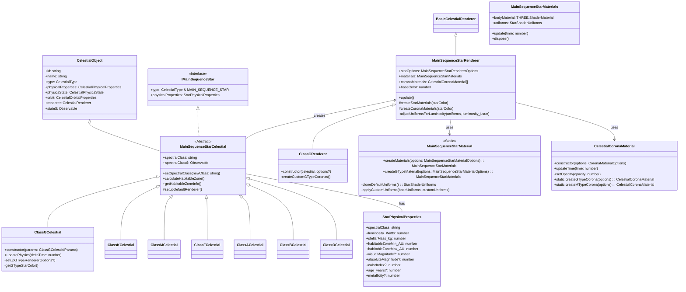

# Main Sequence Star System Architecture

This document outlines the architecture of the Main Sequence Star system, which extends the base `CelestialObject` system to provide specialized implementations for main sequence stars of different spectral types.

## Core Principles

1. **Hierarchical Extension**: The Main Sequence Star module extends the `CelestialObject` base with specialized implementations for specific spectral classes (O, B, A, F, G, K, M).
2. **Physical Accuracy**: The module implements accurate astrophysical properties for each spectral class based on scientific data.
3. **Visual Realism**: Provides specialized renderers with custom shaders for realistic stellar appearance, including surface dynamics and corona effects.
4. **Observable Metadata**: Adds star-specific observable properties like spectral class that UI components can subscribe to.
5. **Habitable Zone Calculations**: Implements algorithms to determine habitable zones based on stellar properties.
6. **Separation of Concerns**: Material creation and shader management are separated from rendering logic for improved maintainability.

## Architecture Overview

The Main Sequence Star module is structured as a hierarchy:



## Main Components

### `MainSequenceStarCelestial` (Abstract Base Class)

The abstract base class that extends `CelestialObject` and implements `IMainSequenceStar`. It provides:

- **Core Star Properties**: Maintains star-specific physical properties.
- **Spectral Class Tracking**: Manages the spectral classification (e.g., "G2V") and provides an observable stream of changes.
- **Habitable Zone Calculation**: Methods to determine and retrieve habitable zone information.
- **Default Renderer Setup**: Creates a `MainSequenceStarRenderer` if no specific renderer is provided.

### Spectral Type Implementations (e.g., `ClassGCelestial`)

Concrete implementations for each spectral class of main sequence stars:

- **Class G**: Sun-like yellow stars (5,200-6,000K)
- **Class K**: Orange stars (3,700-5,200K)
- **Class M**: Red dwarfs (2,400-3,700K)
- **Class F**: Yellow-white stars (6,000-7,500K)
- **Class A**: White stars (7,500-10,000K)
- **Class B**: Blue-white stars (10,000-30,000K)
- **Class O**: Blue stars (30,000-50,000K)

Each implementation:

- Provides spectral-class specific default physical properties
- May implement specialized physics behavior
- Uses shared rendering infrastructure with specialized parameters
- Creates appropriate class-specific renderer
- Determines appropriate colors based on the specific spectral subclass

### `StarPhysicalProperties`

Extends the base `CelestialPhysicalProperties` with star-specific attributes:

- **Spectral Classification**: The spectral class of the star (e.g., "G2V").
- **Luminosity**: Star's energy output in watts.
- **Stellar Mass**: Mass in kilograms.
- **Habitable Zone**: Inner and outer boundaries in Astronomical Units (AU).
- **Visual Properties**: Magnitude, color index, etc.
- **Evolutionary Properties**: Age, metallicity, etc.

### `MainSequenceStarMaterial` (Static Factory)

A static factory class for creating and managing star materials:

- **Material Creation**: Centralized creation of shader materials for star surfaces
- **Uniform Management**: Handles default and custom shader uniforms
- **Spectral-Type Specialization**: Specialized methods for different star types (e.g., `createGTypeMaterial`)
- **Deep Cloning**: Ensures proper handling of complex types like THREE.Color
- **Lifecycle Management**: Provides methods for updating and disposing materials

### `CelestialCoronaMaterial` (Material Class)

A specialized material class for rendering star coronas:

- **Corona Rendering**: Handles the transparent outer glow of stars
- **Opacity Control**: Methods to adjust corona visibility
- **Spectral-Type Factories**: Static methods to create corona materials tuned for specific star types
- **Time Animation**: Manages time-based animation for dynamic corona effects

### `MainSequenceStarMaterials` (Interface)

Defines the structure of materials created by the factory:

- **Materials**: References to the body material
- **Uniforms**: Direct access to the shader uniforms
- **Lifecycle Methods**: Methods for updating time-based animations and disposing resources

### `MainSequenceStarRenderer`

A specialized renderer that extends `BasicCelestialRenderer` with:

- **Material Management**: Uses the `MainSequenceStarMaterial` factory to create appropriate materials
- **Corona Management**: Creates and manages `CelestialCoronaMaterial` instances for star coronas
- **LOD Management**: Provides appropriate representations at different distances
- **Conceptual Options**: Manages non-material renderer properties like corona distances and LOD distances
- **Luminosity Adjustments**: Modifies material properties based on star luminosity

### Spectral Type Renderers (e.g., `ClassGRenderer`)

Specialized renderers for specific spectral types:

- **Custom Materials**: Creates materials optimized for the specific star type
- **Custom Coronas**: Creates corona materials with settings appropriate for the star type
- **Default Options**: Provides sensible defaults for the star type

## Rendering System

### Material Creation Process

The rendering system uses a factory approach for material creation:

1. **Factory Creation**: The `MainSequenceStarMaterial` static class centralizes material creation logic
2. **Material Request**: The renderer or celestial object requests materials with appropriate options
3. **Uniform Initialization**: The factory creates and initializes all required shader uniforms
4. **Shader Assignment**: The factory assigns appropriate shaders to the materials
5. **Lifecycle Methods**: The returned `MainSequenceStarMaterials` object provides methods for updating and disposing

### Corona Creation Process

The corona rendering uses a dedicated material class:

1. **Corona Material**: The `CelestialCoronaMaterial` class is instantiated with appropriate options
2. **Spectral Optimization**: Static factory methods create coronas optimized for specific spectral types
3. **Multiple Layers**: Multiple corona materials may be created with different scales and opacities
4. **Animation**: Corona materials are updated with time values for dynamic animation

### Shader Implementation

The rendering system uses three primary shaders:

1. **Vertex Shader**: Handles the basic geometry transformations.
2. **Fragment Shader**: Implements the star's surface appearance with:
   - Granulation patterns
   - Surface temperature variations
   - Glow effects
   - Limb darkening
3. **Corona Shader**: Renders the stellar atmosphere with:
   - Transparency gradients
   - Emission effects
   - Animated fluctuations

### Shader Uniforms

The `StarShaderUniforms` interface defines all parameters passed to shaders:

- **Time**: For animation of surface dynamics.
- **Surface Properties**: Color, temperature variation, noise parameters.
- **Corona Properties**: Color, intensity, exponents, opacity.

## Data Flow and State Management

1. **Initialization Flow**:

   - A concrete star class (e.g., `ClassGCelestial`) is instantiated with parameters.
   - Default values specific to the spectral class are applied to properties.
   - The star class creates an appropriate renderer with spectral-specific parameters.
   - The renderer uses the `MainSequenceStarMaterial` factory to create materials.
   - The renderer creates `CelestialCoronaMaterial` instances for the corona layers.
   - The renderer initializes its LOD levels with the created materials.

2. **Physics Update Flow**:

   - The `updatePhysics` method is called with the time delta.
   - Any star-specific physics are calculated.
   - The observable state is updated.

3. **Rendering Update Flow**:

   - The renderer's `update` method is called during the render loop.
   - The materials' `update` method is called to update time for animations.
   - Corona materials are updated with the current time.
   - LOD levels are updated based on camera distance.

4. **Observable State**:
   - Core state changes are emitted through the inherited `state$` observable.
   - Spectral class changes are emitted through the `spectralClass$` observable.

## Integration with Core Celestial System

The Main Sequence Star module integrates with the core `CelestialObject` system by:

1. **Type Specification**: Using the `CelestialTypes.MAIN_SEQUENCE_STAR` to identify stars.
2. **Interface Implementation**: Implementing the `IMainSequenceStar` interface to ensure compatibility.
3. **Property Extension**: Extending core physical properties with star-specific attributes.
4. **Renderer Customization**: Providing custom renderers that extend the core rendering system.
5. **Observable Extension**: Adding star-specific observables while maintaining the core state observable.

## Usage Examples

```typescript
// Create a G-type star (like our Sun)
const sol = new ClassGCelestial({
  id: "sol",
  name: "Sol",
  physicalProperties: {
    spectralClass: "G2V",
    radius: 6.957e8, // meters
    mass: 1.989e30, // kg
    luminosity_Watts: 3.828e26,
    stellarMass_kg: 1.989e30,
    temperature_k: 5778,
    habitableZoneMin_AU: 0.75,
    habitableZoneMax_AU: 1.8,
  },
});

// Add the star to the scene
scene.add(sol.renderer.object3D);

// Subscribe to state changes
sol.state$.subscribe((state) => {
  console.log("Star state updated:", state);
});

// Subscribe to spectral class changes
sol.spectralClass$.subscribe((spectralClass) => {
  console.log("Spectral class changed:", spectralClass);
});

// Get habitable zone information
const habitableZone = sol.getHabitableZoneInfo();
console.log("Habitable zone:", habitableZone);
```

## Future Enhancements

1. **Additional Spectral Types**: Add implementations for the remaining spectral types (O, B, A, F, K, M).
2. **Star Flares**: Add the ability to simulate stellar flares with appropriate visual effects.
3. **Star Spots**: Add the ability to simulate star spots (like sunspots) with appropriate visual effects.
4. **Stellar Evolution**: Add support for stars to evolve over time, changing their properties.
5. **Binary Star Systems**: Add support for binary star systems with appropriate orbital mechanics.
6. **Star Formation**: Add support for star formation from nebulae.
