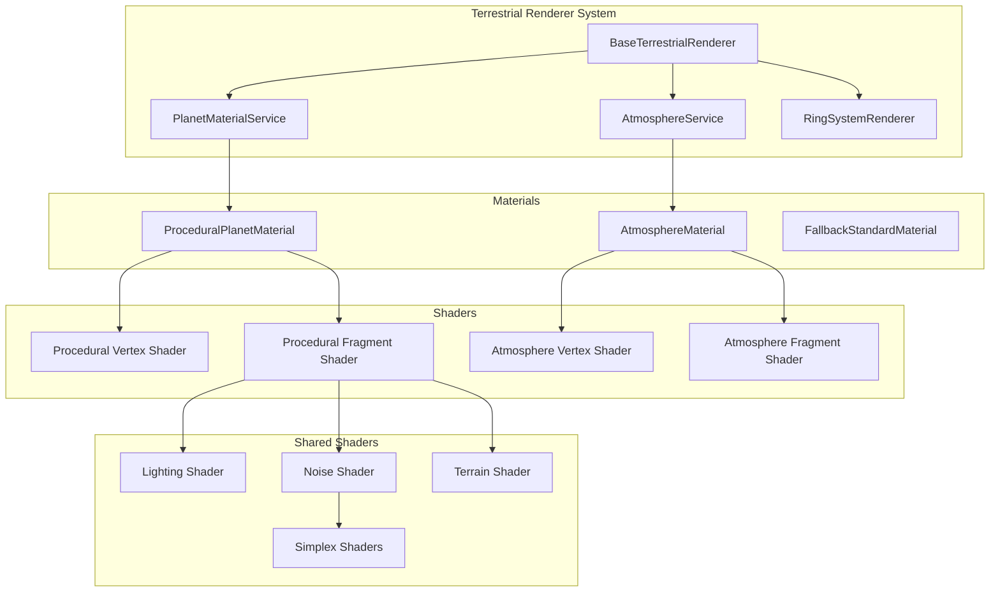
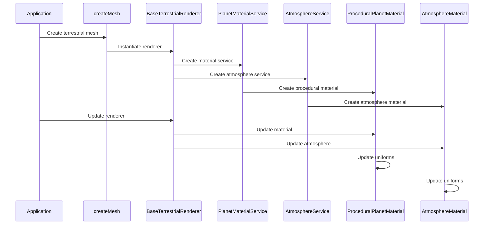

# AGENTS.md

A comprehensive guide for AI coding agents working on the Teskooano Terrestrial Celestial Renderer package.

## Package Overview

The **`@teskooano/celestials-terrestrial`** package provides a sophisticated terrestrial planet and moon rendering system for the Teskooano N-Body simulation, featuring procedural surface generation, atmospheric effects, ring system support, and performance-optimized LOD systems.

### Purpose

- **Procedural Surface Generation**: Advanced GLSL shader-based terrain generation with noise functions
- **Atmospheric Effects**: Realistic atmospheric scattering with multiple light source support
- **Ring System Integration**: Seamless integration with planetary ring systems
- **LOD Optimization**: Three-level LOD system for performance at various distances
- **Physics-Based Properties**: Real-world planetary data and realistic surface materials
- **Service-Oriented Architecture**: Modular design with specialized service classes

## Package Architecture

### Directory Structure

```
packages/celestials/terrestrial/
├── src/
│   ├── index.ts                           # Main package exports
│   ├── createMesh.ts                      # Factory function for mesh creation
│   ├── renderer.ts                        # BaseTerrestrialRenderer class
│   ├── materials/                         # Shader materials
│   │   ├── atmosphere.material.ts         # Atmospheric scattering material
│   │   ├── procedural-planet.material.ts  # Procedural surface material
│   │   └── README.md                      # Materials documentation
│   ├── shaders/                           # GLSL shader files
│   │   ├── atmosphere.vertex.glsl         # Atmosphere vertex shader
│   │   ├── atmosphere.fragment.glsl       # Atmosphere fragment shader
│   │   ├── procedural.vertex.glsl         # Procedural vertex shader
│   │   └── procedural.fragment.glsl       # Procedural fragment shader
│   ├── shared/                            # Shared shader utilities
│   │   ├── lighting.glsl                  # Lighting calculations
│   │   ├── noise.glsl                     # Noise functions
│   │   ├── terrain.glsl                   # Terrain generation
│   │   └── simplex/                       # Simplex noise implementations
│   │       ├── 2d.glsl                    # 2D Simplex noise
│   │       ├── 3d.glsl                    # 3D Simplex noise
│   │       └── 4d.glsl                    # 4D Simplex noise
│   ├── types/                             # TypeScript type definitions
│   │   └── procedural.ts                  # Procedural material uniforms
│   ├── utils/                             # Service classes
│   │   ├── atmosphere-utils.ts            # Atmosphere service
│   │   └── planet-material-utils.ts       # Planet material service
│   ├── shims-glsl.d.ts                    # GLSL module declarations
│   └── ARCHITECTURE.md                    # Detailed architecture documentation
├── package.json
├── moon.yml
├── tsconfig.json
├── vitest.config.ts
└── AGENTS.md
```

### Core Design Principles

#### 1. Service-Oriented Architecture

The terrestrial renderer uses a service-oriented design pattern:

```typescript
// Service-oriented orchestration
export class BaseTerrestrialRenderer extends BaseCelestialRenderer {
  protected materialService: PlanetMaterialService;
  protected atmosphereService: AtmosphereService;

  constructor(
    object: RenderableCelestialObject,
    deps: TerrestrialRendererDeps,
  ) {
    super(object);
    this.materialService = new PlanetMaterialService();
    this.atmosphereService = new AtmosphereService();
  }
}
```

#### 2. Procedural Surface Generation

Advanced GLSL shader-based terrain generation:

```typescript
// Procedural surface properties
export interface ProceduralSurfaceProperties {
  // Noise parameters
  persistence: number;
  lacunarity: number;
  octaves: number;
  simplePeriod: number;
  undulation: number;

  // Terrain generation
  terrainType: number;
  terrainAmplitude: number;
  terrainSharpness: number;
  terrainOffset: number;

  // Color palette
  color1: string;
  color2: string;
  color3: string;
  color4: string;
  color5: string;

  // Height thresholds
  height1: number;
  height2: number;
  height3: number;
  height4: number;
  height5: number;
}
```

#### 3. Atmospheric Scattering

Realistic atmospheric effects with multiple light sources:

```typescript
// Atmospheric material with scattering
export class AtmosphereMaterial extends THREE.ShaderMaterial {
  constructor(
    atmosphereProps: PlanetAtmosphereProperties & {
      aberrationIntensity?: number;
      opacity?: number;
    },
    options: {
      planetRadius?: number;
      parentId?: string;
    } = {},
  ) {
    super({
      uniforms: {
        glowColor: { value: new THREE.Color(glowColor) },
        intensity: { value: intensity },
        power: { value: power },
        atmosphereThickness: { value: thickness },
        planetRadius: { value: planetRadius },
        aberrationIntensity: { value: aberrationIntensity },
        opacity: { value: opacity },
        // Multi-light support
        uNumLights: { value: 0 },
        uLightPositions: {
          value: Array(MAX_LIGHTS)
            .fill(0)
            .map(() => new THREE.Vector3()),
        },
        uLightColors: {
          value: Array(MAX_LIGHTS)
            .fill(0)
            .map(() => new THREE.Color(1, 1, 1)),
        },
        uLightIntensities: { value: Array(MAX_LIGHTS).fill(1.0) },
      },
      vertexShader: atmosphereVertexShaderSource,
      fragmentShader: atmosphereFragmentShaderSource,
      transparent: true,
      side: THREE.DoubleSide,
      depthWrite: false,
    });
  }
}
```

## Key Components

### 1. BaseTerrestrialRenderer Class

Main orchestrator for terrestrial planet rendering:

```typescript
export class BaseTerrestrialRenderer<
  TTerrestrialMaterial extends
    ProceduralPlanetMaterial = ProceduralPlanetMaterial,
> extends BaseCelestialRenderer<TTerrestrialMaterial> {
  protected atmosphereMaterials: Map<string, AtmosphereMaterial> = new Map();
  protected ringSystemRenderer?: RingSystemRenderer;
  protected materialService: PlanetMaterialService;
  protected atmosphereService: AtmosphereService;

  constructor(
    object: RenderableCelestialObject,
    deps: TerrestrialRendererDeps,
  ) {
    super(object);
    this.materialService = new PlanetMaterialService();
    this.atmosphereService = new AtmosphereService();
  }

  /**
   * Creates LOD levels for the terrestrial object
   */
  getLODLevels(
    object: RenderableCelestialObject,
    options?: CelestialMeshOptions,
  ): LODLevel[] {
    const planetLevels = this._createPlanetLODs(object, options);
    const planetProps = object.properties as PlanetProperties;

    // Lazy initialization of ring system
    if (
      !this.ringSystemRenderer &&
      planetProps?.rings &&
      planetProps.rings.length > 0
    ) {
      this.ringSystemRenderer = new RingSystemRenderer(object, this);
    }

    if (
      this.ringSystemRenderer &&
      planetProps?.rings &&
      planetProps.rings.length > 0
    ) {
      const ringLODs = this.ringSystemRenderer.getLODLevels(object, options);
      return this._combinePlanetAndRingLODs(planetLevels, ringLODs);
    }

    return planetLevels;
  }
}
```

### 2. ProceduralPlanetMaterial Class

Advanced shader material for procedural surface generation:

```typescript
export class ProceduralPlanetMaterial extends THREE.ShaderMaterial {
  declare uniforms: ProceduralPlanetUniforms;
  protected currentNumLights: number = 0;
  protected currentNumShadowCasters: number = 0;

  constructor(surfaceProps: ProceduralSurfaceProperties) {
    const MAX_LIGHTS = 4;
    const MAX_SHADOW_CASTERS = 4;

    const uniforms = {
      // Lighting
      uNumLights: { value: 0 },
      uLights: { value: LightArrayUtils.createLightSourceArray(MAX_LIGHTS) },
      uAmbientLightColor: { value: new THREE.Color(0xffffff) },
      uAmbientLightIntensity: {
        value: surfaceProps.ambientLightIntensity ?? 0.03,
      },
      uCameraPosition: { value: new THREE.Vector3() },

      // Shadow casting
      uNumShadowCasters: { value: 0 },
      uShadowCasters: {
        value: LightArrayUtils.createShadowCasterArray(MAX_SHADOW_CASTERS),
      },

      // Noise parameters
      persistence: { value: surfaceProps.persistence ?? 0.5 },
      lacunarity: { value: surfaceProps.lacunarity ?? 2.0 },
      uSimplePeriod: { value: surfaceProps.simplePeriod ?? 4.0 },
      uOctaves: { value: surfaceProps.octaves ?? 6 },
      uUndulation: { value: surfaceProps.undulation ?? 0.1 },

      // Color palette
      uColor1: { value: parseColor(surfaceProps.color1, "#5179B5") },
      uColor2: { value: parseColor(surfaceProps.color2, "#4C9341") },
      uColor3: { value: parseColor(surfaceProps.color3, "#836F27") },
      uColor4: { value: parseColor(surfaceProps.color4, "#A0A0A0") },
      uColor5: { value: parseColor(surfaceProps.color5, "#FFFFFF") },

      // Height thresholds
      uHeight1: { value: surfaceProps.height1 ?? 0.0 },
      uHeight2: { value: surfaceProps.height2 ?? 0.2 },
      uHeight3: { value: surfaceProps.height3 ?? 0.4 },
      uHeight4: { value: surfaceProps.height4 ?? 0.6 },
      uHeight5: { value: surfaceProps.height5 ?? 0.8 },

      // Material properties
      uBumpScale: { value: surfaceProps.bumpScale ?? 1 },
      uRoughness: { value: surfaceProps.roughness ?? 0.5 },
      uShininess: { value: surfaceProps.shininess ?? 16.0 },
      uSpecularStrength: { value: surfaceProps.specularStrength ?? 0.3 },

      // Terrain generation
      uTerrainType: { value: surfaceProps.terrainType ?? 2 },
      uTerrainAmplitude: { value: surfaceProps.terrainAmplitude ?? 1.0 },
      uTerrainSharpness: { value: surfaceProps.terrainSharpness ?? 1.0 },
      uTerrainOffset: { value: surfaceProps.terrainOffset ?? 0.0 },

      uTime: { value: 0.0 },
    };

    super({
      defines: {
        MAX_LIGHTS: MAX_LIGHTS,
        MAX_SHADOW_CASTERS: MAX_SHADOW_CASTERS,
      },
      uniforms: uniforms as any,
      vertexShader: proceduralVertexShaderSource,
      fragmentShader: proceduralFragmentShaderSource,
      precision: "highp",
      depthTest: true,
      depthWrite: true,
      transparent: false,
    });
  }
}
```

### 3. PlanetMaterialService Class

Service for creating and managing planet materials:

```typescript
export class PlanetMaterialService {
  /**
   * Creates a procedural planet material based on object properties
   */
  createMaterial(object: RenderableCelestialObject): ProceduralPlanetMaterial {
    const specificSurfaceProps = (object.properties as PlanetProperties)
      ?.surface as ProceduralSurfaceProperties | undefined;
    const planetProps = object.properties as PlanetProperties | undefined;
    const classType = planetProps?.classType;

    // Get default palette based on planet type
    let simplePalette = this.getDefaultPalette(classType);

    const finalProps: ProceduralSurfaceProperties = {
      // Procedural properties
      persistence: specificSurfaceProps?.persistence ?? 0.55,
      lacunarity: specificSurfaceProps?.lacunarity ?? 2.0,
      octaves: specificSurfaceProps?.octaves ?? 8,
      simplePeriod: specificSurfaceProps?.simplePeriod ?? 16.0,
      undulation: specificSurfaceProps?.undulation ?? 0.1,
      bumpScale: specificSurfaceProps?.bumpScale ?? 3,

      // Color ramp properties
      color1: specificSurfaceProps?.color1 ?? simplePalette.color1,
      color2: specificSurfaceProps?.color2 ?? simplePalette.color2,
      color3: specificSurfaceProps?.color3 ?? simplePalette.color3,
      color4: specificSurfaceProps?.color4 ?? simplePalette.color4,
      color5: specificSurfaceProps?.color5 ?? simplePalette.color6,

      // Height controls
      height1: specificSurfaceProps?.height1 ?? 0.1,
      height2: specificSurfaceProps?.height2 ?? 0.2,
      height3: specificSurfaceProps?.height3 ?? 0.4,
      height4: specificSurfaceProps?.height4 ?? 0.6,
      height5: specificSurfaceProps?.height5 ?? 0.8,

      // Material properties
      shininess: specificSurfaceProps?.shininess ?? 100,
      specularStrength: specificSurfaceProps?.specularStrength ?? 0.3,
      roughness: specificSurfaceProps?.roughness ?? 0.5,
      ambientLightIntensity:
        specificSurfaceProps?.ambientLightIntensity ?? 0.05,

      // Terrain generation
      terrainAmplitude: specificSurfaceProps?.terrainAmplitude ?? 1.0,
      terrainSharpness: specificSurfaceProps?.terrainSharpness ?? 1.0,
      terrainOffset: specificSurfaceProps?.terrainOffset ?? 0.0,
      terrainType: specificSurfaceProps?.terrainType ?? 2,
    };

    const material = new ProceduralPlanetMaterial(finalProps);
    material.needsUpdate = true;
    return material;
  }

  /**
   * Gets a representative base color for the planet
   */
  getBaseColor(object: RenderableCelestialObject): THREE.Color {
    const planetProps = object.properties as PlanetProperties | undefined;
    const classType = planetProps?.classType;
    const specificSurfaceProps = planetProps?.surface as
      | ProceduralSurfaceProperties
      | undefined;

    // Prioritize color1 if defined in properties
    if (specificSurfaceProps?.color4) {
      return new THREE.Color(specificSurfaceProps.color4);
    }

    // Fallback based on planet type
    return this.getDefaultColorForType(classType);
  }
}
```

### 4. AtmosphereService Class

Service for creating atmospheric effects:

```typescript
export class AtmosphereService {
  /**
   * Creates an atmosphere mesh and its material for a celestial object
   */
  createAtmosphereMesh(
    object: RenderableCelestialObject,
    segments: number = GeometryUtilities.getOptimizedAtmosphereSegments(
      "high",
      64,
    ),
    baseRadiusInput?: number,
  ): AtmosphereMeshResult | null {
    const props = object.properties as PlanetProperties | undefined;
    const atmosphereProps = props?.atmosphere;
    if (!atmosphereProps || !object.id) return null;

    const baseRadius =
      baseRadiusInput ?? object.realRadius_m ?? object.radius ?? 1;
    const atmosphereRadius = baseRadius * 1.05; // Atmosphere slightly larger than planet
    const atmosphereGeometry = new THREE.SphereGeometry(
      atmosphereRadius,
      segments,
      segments,
    );

    let atmosphereColor = new THREE.Color(
      atmosphereProps.glowColor || "#FFFFFF",
    );
    // Adjust default color based on planet type if color isn't explicitly set
    if (!atmosphereProps.glowColor) {
      if (props?.classType === PlanetType.LAVA) {
        atmosphereColor = new THREE.Color("#FF6644"); // Orangey-red for lava atmosphere
      } else {
        atmosphereColor = new THREE.Color("#88AAFF"); // Bluish for typical atmosphere
      }
    }

    const atmosphereMaterial = new AtmosphereMaterial(atmosphereProps, {
      planetRadius: baseRadius,
      parentId: object.id,
    });

    const atmosphereMesh = new THREE.Mesh(
      atmosphereGeometry,
      atmosphereMaterial,
    );
    atmosphereMesh.name = `${object.id}-atmosphere`;
    atmosphereMesh.renderOrder = 2; // Render atmosphere after clouds

    return { mesh: atmosphereMesh, material: atmosphereMaterial };
  }
}
```

## Usage Examples

### 1. Basic Terrestrial Planet Creation

```typescript
import { createMesh } from "@teskooano/celestials-terrestrial";
import type { RenderableCelestialObject } from "@teskooano/data-types";

// Create Earth-like terrestrial planet
const earth: RenderableCelestialObject = {
  id: "earth",
  name: "Earth",
  type: CelestialType.PLANET,
  realRadius_m: 6371000, // Earth radius in meters
  properties: {
    type: CelestialType.PLANET,
    classType: PlanetType.TERRESTRIAL,
    surface: {
      color1: "#003366", // Deep ocean blue
      color2: "#4C9341", // Forest green
      color3: "#836F27", // Mountain brown
      color4: "#A0A0A0", // Rock gray
      color5: "#FFFFFF", // Snow white
      terrainType: 2,
      terrainAmplitude: 1.0,
      terrainSharpness: 1.0,
      octaves: 8,
      persistence: 0.55,
      lacunarity: 2.0,
    },
    atmosphere: {
      glowColor: "#88AAFF",
      intensity: 1.0,
      power: 2.0,
      thickness: 0.1,
    },
  },
};

const mesh = createMesh(earth, {
  celestialRenderers: renderersMap,
  createLodObject: lodFactory,
  lightingManager: lightingManager,
});
```

### 2. Different Planet Types

```typescript
// Lava planet
const lavaPlanet: RenderableCelestialObject = {
  id: "lava-planet",
  name: "Lava Planet",
  type: CelestialType.PLANET,
  realRadius_m: 5000000,
  properties: {
    type: CelestialType.PLANET,
    classType: PlanetType.LAVA,
    surface: {
      color1: "#3B0B00", // Dark red
      color2: "#801800", // Red-brown
      color3: "#D44000", // Orange-red
      color4: "#FF6B00", // Bright orange
      color5: "#FFA500", // Gold
      terrainType: 2,
      terrainAmplitude: 1.5,
      terrainSharpness: 1.2,
    },
    atmosphere: {
      glowColor: "#FF6644",
      intensity: 1.2,
      power: 1.8,
      thickness: 0.15,
    },
  },
};

// Ice planet
const icePlanet: RenderableCelestialObject = {
  id: "ice-planet",
  name: "Ice Planet",
  type: CelestialType.PLANET,
  realRadius_m: 4000000,
  properties: {
    type: CelestialType.PLANET,
    classType: PlanetType.ICE,
    surface: {
      color1: "#A0D2DB", // Light blue
      color2: "#C0ECF1", // Cyan
      color3: "#E1FEFF", // Light cyan
      color4: "#FFFFFF", // White
      color5: "#F0FFFF", // Off-white
      terrainType: 1,
      terrainAmplitude: 0.8,
      terrainSharpness: 0.9,
    },
    atmosphere: {
      glowColor: "#E1FEFF",
      intensity: 0.8,
      power: 2.2,
      thickness: 0.08,
    },
  },
};
```

### 3. Planet with Rings

```typescript
// Gas giant with rings
const saturn: RenderableCelestialObject = {
  id: "saturn",
  name: "Saturn",
  type: CelestialType.PLANET,
  realRadius_m: 58232000, // Saturn radius in meters
  properties: {
    type: CelestialType.PLANET,
    classType: PlanetType.GAS_GIANT,
    surface: {
      color1: "#FAD5A5", // Light yellow
      color2: "#F4A460", // Sandy brown
      color3: "#DEB887", // Burlywood
      color4: "#D2B48C", // Tan
      color5: "#F5DEB3", // Wheat
      terrainType: 1,
      terrainAmplitude: 0.5,
      terrainSharpness: 0.8,
    },
    atmosphere: {
      glowColor: "#FAD5A5",
      intensity: 1.0,
      power: 2.0,
      thickness: 0.12,
    },
    rings: [
      {
        innerRadius: 74500000, // Inner ring radius in meters
        outerRadius: 140220000, // Outer ring radius in meters
        thickness: 1000, // Ring thickness in meters
        color: "#C0C0C0", // Silver
        opacity: 0.8,
        inclination: 0.0,
        axialTilt: 0.0,
      },
    ],
  },
};
```

### 4. Moon with Atmosphere

```typescript
// Titan-like moon with atmosphere
const titan: RenderableCelestialObject = {
  id: "titan",
  name: "Titan",
  type: CelestialType.MOON,
  realRadius_m: 2575000, // Titan radius in meters
  properties: {
    type: CelestialType.MOON,
    classType: PlanetType.TERRESTRIAL,
    surface: {
      color1: "#8B4513", // Saddle brown
      color2: "#A0522D", // Sienna
      color3: "#CD853F", // Peru
      color4: "#DEB887", // Burlywood
      color5: "#F5DEB3", // Wheat
      terrainType: 2,
      terrainAmplitude: 0.8,
      terrainSharpness: 1.1,
    },
    atmosphere: {
      glowColor: "#FFE4B5", // Moccasin
      intensity: 1.5,
      power: 1.5,
      thickness: 0.2,
      opacity: 0.7,
    },
  },
};
```

### 5. Integration with Parent Systems

```typescript
// In a celestial object manager
export class CelestialObjectManager {
  private terrestrialRenderers = new Map<string, BaseTerrestrialRenderer>();

  createTerrestrialObject(object: RenderableCelestialObject): THREE.Object3D {
    const renderer = new BaseTerrestrialRenderer(object, {
      renderers: this.terrestrialRenderers,
    });
    this.terrestrialRenderers.set(object.id, renderer);

    const lodLevels = renderer.getLODLevels(object);
    const lod = this.createLodObject(object, lodLevels);

    return lod;
  }

  updateTerrestrialObjects(
    time: number,
    timeScale: number,
    lightSources: LightSourcesMap,
    camera: THREE.PerspectiveCamera,
  ): void {
    for (const [id, renderer] of this.terrestrialRenderers) {
      const object = this.getObject(id);
      if (object) {
        renderer.update(object, time, timeScale, lightSources, camera);
      }
    }
  }
}
```

## Performance Guidelines

### 1. LOD System Optimization

- **Distance-Based Switching**: LOD switches at appropriate distances for each object type
- **Atmosphere Management**: Atmosphere effects only at high detail levels
- **Ring System Integration**: Efficient ring rendering with proper LOD synchronization
- **Material Caching**: Efficient material reuse across similar objects

### 2. Shader Performance

- **Optimized Shaders**: Efficient GLSL shaders with minimal complexity
- **Uniform Management**: Dynamic uniform updates only when needed
- **Noise Functions**: Optimized Simplex noise implementations
- **Lighting Calculations**: Efficient multi-light source handling

### 3. Procedural Generation Performance

- **Noise Optimization**: Efficient FBM and terrain generation
- **Color Blending**: Optimized height-based color mixing
- **Shadow Casting**: Efficient shadow calculation for ring systems
- **Memory Management**: Proper cleanup of materials and textures

## Testing Strategy

### 1. Unit Testing

Test individual components and functionality:

```typescript
import { describe, it, expect, beforeEach } from "vitest";
import { BaseTerrestrialRenderer } from "../renderer";
import { PlanetMaterialService } from "../utils/planet-material-utils";

describe("BaseTerrestrialRenderer", () => {
  let renderer: BaseTerrestrialRenderer;
  let mockObject: RenderableCelestialObject<PlanetProperties>;

  beforeEach(() => {
    mockObject = createMockTerrestrialObject({
      classType: PlanetType.TERRESTRIAL,
      surface: {
        color1: "#003366",
        color2: "#4C9341",
        color3: "#836F27",
        color4: "#A0A0A0",
        color5: "#FFFFFF",
      },
    });
    renderer = new BaseTerrestrialRenderer(mockObject, {
      renderers: new Map(),
    });
  });

  it("should create LOD levels with correct distances", () => {
    const levels = renderer.getLODLevels(mockObject);

    expect(levels).toHaveLength(3); // High detail, medium detail, billboard
    expect(levels[0].distance).toBe(0);
    expect(levels[1].distance).toBeGreaterThan(0);
    expect(levels[2].distance).toBeGreaterThan(levels[1].distance);
  });

  it("should create atmosphere mesh when atmosphere properties exist", () => {
    const atmosphereResult =
      renderer.atmosphereService.createAtmosphereMesh(mockObject);
    expect(atmosphereResult).not.toBeNull();
    expect(atmosphereResult?.mesh).toBeInstanceOf(THREE.Mesh);
    expect(atmosphereResult?.material).toBeInstanceOf(AtmosphereMaterial);
  });
});
```

### 2. Material Testing

Test material functionality:

```typescript
import { describe, it, expect, beforeEach } from "vitest";
import { ProceduralPlanetMaterial } from "../materials/procedural-planet.material";

describe("ProceduralPlanetMaterial", () => {
  let material: ProceduralPlanetMaterial;
  let surfaceProps: ProceduralSurfaceProperties;

  beforeEach(() => {
    surfaceProps = {
      color1: "#003366",
      color2: "#4C9341",
      color3: "#836F27",
      color4: "#A0A0A0",
      color5: "#FFFFFF",
      terrainType: 2,
      terrainAmplitude: 1.0,
      terrainSharpness: 1.0,
      octaves: 8,
      persistence: 0.55,
      lacunarity: 2.0,
    };
    material = new ProceduralPlanetMaterial(surfaceProps);
  });

  it("should create a shader material with correct uniforms", () => {
    expect(material).toBeInstanceOf(THREE.ShaderMaterial);
    expect(material.uniforms.uColor1).toBeDefined();
    expect(material.uniforms.uColor2).toBeDefined();
    expect(material.uniforms.uColor3).toBeDefined();
    expect(material.uniforms.uColor4).toBeDefined();
    expect(material.uniforms.uColor5).toBeDefined();
    expect(material.uniforms.uTime).toBeDefined();
  });

  it("should update time uniform correctly", () => {
    const initialTime = material.uniforms.uTime.value;
    material.update(1000, 1.0, new Map(), mockCamera);
    expect(material.uniforms.uTime.value).not.toBe(initialTime);
  });
});
```

## Troubleshooting Guide

### 1. Common Issues

#### Incorrect Surface Colors

```typescript
// ❌ Problem: Planet appears wrong color
const planetProps: PlanetProperties = {
  classType: PlanetType.TERRESTRIAL,
  surface: {
    color1: "#FF0000", // Wrong color
  },
};

// ✅ Solution: Use appropriate color palette
const planetProps: PlanetProperties = {
  classType: PlanetType.TERRESTRIAL,
  surface: {
    color1: "#003366", // Deep ocean blue
    color2: "#4C9341", // Forest green
    color3: "#836F27", // Mountain brown
    color4: "#A0A0A0", // Rock gray
    color5: "#FFFFFF", // Snow white
  },
};
```

#### Performance Issues

```typescript
// ❌ Problem: Too many procedural effects causing performance issues
// High octave counts and complex terrain generation

// ✅ Solution: Optimize procedural parameters
const surfaceProps: ProceduralSurfaceProperties = {
  octaves: 6, // Reduce from 8
  terrainAmplitude: 0.8, // Reduce complexity
  terrainSharpness: 0.9, // Smoother features
  bumpScale: 2, // Reduce bump detail
};
```

#### Shader Compilation Errors

```typescript
// ❌ Problem: Shader compilation fails
// Missing uniforms or incorrect shader syntax

// ✅ Solution: Check shader syntax and uniform definitions
// Ensure all required uniforms are provided
// Use proper GLSL syntax and includes
// Check for missing shared shader files
```

### 2. Atmospheric Issues

#### Atmosphere Not Visible

```typescript
// ❌ Problem: Atmosphere effect not visible
// Missing atmosphere properties or incorrect opacity

// ✅ Solution: Ensure proper atmosphere setup
const atmosphereProps: PlanetAtmosphereProperties = {
  glowColor: "#88AAFF",
  intensity: 1.0,
  power: 2.0,
  thickness: 0.1,
  opacity: 1.0, // Ensure opacity is set
};
```

#### Atmospheric Scattering Issues

```typescript
// ❌ Problem: Atmospheric scattering looks wrong
// Incorrect light source setup or scattering parameters

// ✅ Solution: Check light source configuration
// Ensure multiple light sources are properly configured
// Verify scattering parameters (intensity, power, thickness)
// Check atmospheric material uniforms
```

## Dependencies and Integration Points

### 1. Core Dependencies

```json
{
  "dependencies": {
    "@teskooano/data-types": "file:../../data/types",
    "@teskooano/renderer-threejs-celestial": "file:../../renderer/threejs-celestial",
    "@teskooano/celestials-rings": "file:../rings",
    "three": "0.180.0"
  }
}
```

### 2. Integration with Teskooano Ecosystem

- **Data Types**: Uses `RenderableCelestialObject` and `PlanetProperties`
- **Celestial Renderer**: Extends `BaseCelestialRenderer` for core functionality
- **Lighting System**: Integrates with `LightingManager` for dynamic lighting
- **LOD System**: Uses `LODLevel` and `createLodObject` for performance optimization
- **Ring System**: Uses `RingSystemRenderer` for planetary rings
- **Shader System**: Uses external GLSL shaders for advanced effects

## Contributing Guidelines

### 1. Procedural Generation Development

- **Noise Functions**: Use optimized Simplex noise implementations
- **Terrain Generation**: Implement efficient terrain algorithms
- **Color Palettes**: Create realistic color schemes for different planet types
- **Performance**: Optimize shader complexity for target hardware

### 2. Shader Development

- **GLSL Standards**: Use high precision floats and proper includes
- **Performance**: Optimize shader complexity for target hardware
- **Visual Effects**: Implement realistic atmospheric and surface effects
- **Uniform Management**: Efficient uniform updates and caching

### 3. Service Development

- **Separation of Concerns**: Keep services focused on single responsibilities
- **Error Handling**: Implement graceful fallbacks for service failures
- **Caching**: Implement efficient material and geometry caching
- **Testing**: Write comprehensive tests for service functionality

## Architecture Documentation

### 1. System Overview



### 2. Data Flow



## Scientific References

### 1. Planetary Science

- **Terrestrial Planets**: Rocky planets with solid surfaces
- **Atmospheric Scattering**: Rayleigh and Mie scattering in planetary atmospheres
- **Surface Materials**: Geological composition and color properties
- **Ring Systems**: Planetary ring formation and dynamics

### 2. Computer Graphics

- **Procedural Generation**: Noise-based terrain and surface generation
- **Atmospheric Rendering**: Volumetric scattering and atmospheric effects
- **Shader Programming**: GLSL for advanced visual effects
- **Level of Detail**: Performance optimization through detail reduction

### 3. Physics

- **Light Scattering**: Physical models for atmospheric scattering
- **Surface Reflection**: Material properties and lighting models
- **Shadow Casting**: Geometric shadow calculations for ring systems
- **Noise Functions**: Mathematical noise for procedural generation

---

**Remember**: The terrestrial package provides realistic planet and moon rendering with procedural surface generation, atmospheric effects, and ring system integration. Always consider the balance between visual quality and performance, and ensure proper integration with the broader Teskooano ecosystem.
